  <a href="https://visulima.com">
    
    <h1 align="center">Visulima</h1>
  </a>

  
  
  

---

    

        
            Daniel Bannert's open source work is supported by the community on <a href="https://github.com/sponsors/prisis">GitHub Sponsors</a>
        
    

---

## Getting Started

Visit <a aria-label="visulima learn" href="https://visulima.com/learn"> https://visulima.com/learn </a> to get started with Visulima.

## Documentation

Visit [https://visulima.com/docs](https://visulima.com/docs) to view the full documentation.

## Community

The Visulima community can be found on [GitHub Discussions](https://github.com/visulima/visulima/discussions), where you can ask questions, voice ideas, and share your projects.

To chat with other community members you can join the [Visulima Discord](https://chat.visulima.com).

Our [Code of Conduct](https://github.com/visulima/visulima/blob/main/.github/CODE_OF_CONDUCT.md) applies to all Visulima community channels.

## Contributing

Please see our [contributing.md](https://github.com/visulima/visulima/blob/main/.github/CONTRIBUTING.md).

### Good First Issues

We have a list of [good first issues](https://github.com/visulima/visulima/labels/good%20first%20issue) that contain bugs that have a relatively limited scope. This is a great place to get started, gain experience, and get familiar with our contribution process.
