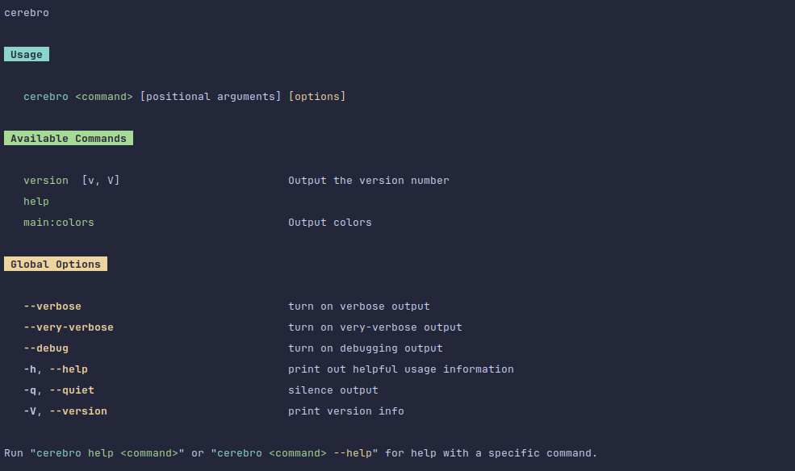

<div align="center">
  <h3>Visulima Cerebro</h3>
  <p>
  Cerebro is a delightful toolkit for building cross-runtime command-line interfaces (CLIs) for Node.js, Deno, and Bun, built on top of

[@visulima/boxen](https://github.com/visulima/visulima/tree/main/packages/boxen),
[@visulima/colorize](https://github.com/visulima/visulima/tree/main/packages/colorize),
[@visulima/command-line-args](https://github.com/visulima/visulima/tree/main/packages/command-line-args),
[@visulima/tabular](https://github.com/visulima/visulima/tree/main/packages/tabular) and
[fastest-levenshtein](https://github.com/ka-weihe/fastest-levenshtein)

<br />

I would recommend reading this [guide](https://clig.dev/) on how to make user-friendly command-line tools.

  </p>
</div>

<br />

<div align="center">

[](https://www.typescriptlang.org/) [](https://www.npmjs.com/package/@visulima/cerebro/v/latest) [](LICENSE.md)

</div>

---

<div align="center">
    <p>
        <sup>
            Daniel Bannert's open source work is supported by the community on <a href="https://github.com/sponsors/prisis">GitHub Sponsors</a>
        </sup>
    </p>
</div>

---

## Install

```sh
npm install @visulima/cerebro
```

```sh
yarn add @visulima/cerebro
```

```sh
pnpm add @visulima/cerebro
```

## Usage

```ts
import { Cerebro } from "@visulima/cerebro";

// Create a CLI runtime
const cli = new Cerebro("my-cli");

// Add commands with options and arguments
cli.addCommand({
    name: "build",
    description: "Build the project",
    options: [
        {
            name: "output",
            alias: "o",
            type: String,
            description: "Output directory",
            defaultValue: "dist",
        },
        {
            name: "production",
            alias: "p",
            type: Boolean,
            description: "Build for production",
        },
        {
            name: "watch",
            alias: "w",
            type: Boolean,
            description: "Watch for changes",
        },
    ],
    argument: {
        name: "target",
        description: "Build target (optional)",
        type: String,
    },
    execute: ({ options, argument, logger, env }) => {
        const target = argument[0] || "all";
        const outputDir = options.output;

        logger.info(`Building target: ${target}`);
        logger.info(`Output directory: ${outputDir}`);

        if (options.production) {
            logger.info("Production build enabled");
        }

        if (options.watch) {
            logger.info("Watch mode enabled");
        }

        if (env.NODE_ENV) {
            logger.info(`Environment: ${env.NODE_ENV}`);
        }
    },
});

// Add another command with environment variables
cli.addCommand({
    name: "deploy",
    description: "Deploy the application",
    env: [
        {
            name: "DEPLOY_ENV",
            description: "Deployment environment",
            type: String,
            defaultValue: "staging",
        },
        {
            name: "API_KEY",
            description: "API key for deployment",
            type: String,
        },
    ],
    execute: ({ env, logger }) => {
        logger.info(`Deploying to ${env.DEPLOY_ENV}`);
        if (env.API_KEY) {
            logger.info("Using provided API key");
        }
    },
});

await cli.run();
```

Now you can run your CLI with `node index.js` (or `deno run index.js`, `bun index.js`). Here are some example usages:

```bash
# Show help
node index.js --help

# Build with default options
node index.js build

# Build specific target with custom output
node index.js build --output ./build client

# Production build with watch mode
node index.js build --production --watch

# Deploy (uses environment variables)
node index.js deploy
```

You should see help output and command execution based on the options provided:



## Toolbox API

When your command's `execute` function is called, it receives a toolbox object with various utilities and context. Here's what you can access:

### Core Properties

- **`logger`**: Logger instance for output (debug, info, warn, error)
- **`options`**: Parsed command-line options (camelCase keys)
- **`argument`**: Array of positional arguments
- **`env`**: Environment variables (camelCase keys)
- **`runtime`**: Reference to the CLI instance
- **`argv`**: Original command-line arguments array

### Example Usage

```ts
cli.addCommand({
    name: "example",
    description: "Example command showing toolbox usage",
    options: [
        { name: "verbose", alias: "v", type: Boolean, description: "Verbose output" },
        { name: "count", alias: "c", type: Number, description: "Count value", defaultValue: 1 },
    ],
    argument: {
        name: "input",
        description: "Input file",
        type: String,
    },
    env: [{ name: "DEBUG", type: Boolean, description: "Debug mode" }],
    execute: ({ logger, options, argument, env, runtime, argv }) => {
        // Use logger for output
        logger.info("Command started");

        // Access parsed options
        if (options.verbose) {
            logger.debug(`Count: ${options.count}`);
        }

        // Access positional arguments
        if (argument.length > 0) {
            logger.info(`Processing file: ${argument[0]}`);
        }

        // Access environment variables
        if (env.debug) {
            logger.debug("Debug mode enabled");
        }

        // Access CLI instance
        logger.info(`CLI name: ${runtime.cliName}`);

        // Access original argv
        logger.debug(`Full command: ${argv.join(" ")}`);
    },
});
```

## Built-in Commands

Cerebro comes with several built-in commands that are automatically available:

### Help Command

The help command is automatically added to your CLI and provides usage information for all commands.

```bash
my-cli help
my-cli help <command>
```

### Version Command

Display version information for your CLI.

```ts
import { Cerebro } from "@visulima/cerebro";
import versionCommand from "@visulima/cerebro/command/version";

const cli = new Cerebro("my-cli", {
    packageName: "my-cli",
    packageVersion: "1.0.0",
});

cli.addCommand(versionCommand);

await cli.run();
```

```bash
my-cli version
```

### Readme Generator Command

Generate README documentation for your CLI commands.

```ts
import { Cerebro } from "@visulima/cerebro";
import readmeCommand from "@visulima/cerebro/command/readme-generator";

const cli = new Cerebro("my-cli");
cli.addCommand(readmeCommand);

await cli.run();
```

```bash
my-cli readme-generator
```

## Shell Completions

Cerebro supports intelligent shell autocompletions for **bash**, **zsh**, **fish**, and **powershell** through the optional `@bomb.sh/tab` integration. The completion system automatically detects your current shell and runtime, providing context-aware suggestions for commands, options, and arguments.

### Installation

To enable completions, first install the optional peer dependency:

```sh
pnpm add @bomb.sh/tab
```

Or with other package managers:

```sh
npm install @bomb.sh/tab
yarn add @bomb.sh/tab
```

### Adding Completion Command

Import and add the completion command to your CLI. The completion command supports two options:

- **`--shell`**: Shell type (bash, zsh, fish, powershell) - auto-detected by default
- **`--runtime`**: JavaScript runtime (node, bun, deno) - auto-detected by default

```ts
import { Cerebro } from "@visulima/cerebro";
import completionCommand from "@visulima/cerebro/command/completion";

const cli = new Cerebro("my-cli");

// Add your commands with options
cli.addCommand({
    name: "build",
    description: "Build the project",
    options: [
        {
            name: "output",
            alias: "o",
            type: String,
            description: "Output directory",
        },
        {
            name: "production",
            alias: "p",
            type: Boolean,
            description: "Production build",
        },
    ],
    execute: ({ options }) => {
        console.log(`Building to ${options.output || "dist"}`);
    },
});

// Add completion command
cli.addCommand(completionCommand);

await cli.run();
```

### Generating Completion Scripts

Users can generate completion scripts for their shell. The completion command will automatically detect your shell and runtime, but you can override them if needed:

```bash
# Auto-detect shell and runtime (recommended)
my-cli completion > ~/.my-cli-completion.sh
echo 'source ~/.my-cli-completion.sh' >> ~/.bashrc  # or ~/.zshrc

# Explicitly specify shell
my-cli completion --shell=zsh > ~/.my-cli-completion.zsh
my-cli completion --shell=bash > ~/.my-cli-completion.bash
my-cli completion --shell=fish > ~/.config/fish/completions/my-cli.fish
my-cli completion --shell=powershell > ~/.my-cli-completion.ps1

# Override runtime detection
my-cli completion --runtime=node --shell=zsh > ~/.my-cli-completion.zsh
```

### Setup Instructions

**Bash:**

```bash
my-cli completion --shell=bash > ~/.my-cli-completion.bash
echo 'source ~/.my-cli-completion.bash' >> ~/.bashrc
source ~/.bashrc
```

**Zsh:**

```bash
my-cli completion --shell=zsh > ~/.my-cli-completion.zsh
echo 'source ~/.my-cli-completion.zsh' >> ~/.zshrc
source ~/.zshrc
```

**Fish:**

```bash
my-cli completion --shell=fish > ~/.config/fish/completions/my-cli.fish
```

**PowerShell:**

```powershell
my-cli completion --shell=powershell > $PROFILE.CurrentUserAllHosts
. $PROFILE.CurrentUserAllHosts
```

After setting up, users can press `TAB` to autocomplete:

- Command names
- Option flags (both long `--option` and short `-o`)
- Option values (when applicable)
- Subcommands

### Troubleshooting

If completions don't work:

1. Ensure `@bomb.sh/tab` is installed
2. Verify the completion script was sourced in your shell profile
3. Try restarting your shell or running `source ~/.bashrc` (or equivalent)
4. Check that your CLI name matches the completion script filename

## Supported Runtimes

Cerebro supports multiple JavaScript runtimes:

- **Node.js**: >=20.19 <=25.x (follows [Node.js' release schedule](https://github.com/nodejs/release#release-schedule))
- **Deno**: 1.0+
- **Bun**: 1.0+

The library uses runtime-agnostic APIs to ensure compatibility across all supported runtimes. Here's [a post on why we think tracking Node.js releases is important](https://medium.com/the-node-js-collection/maintainers-should-consider-following-node-js-release-schedule-ab08ed4de71a).

## Contributing

If you would like to help take a look at the [list of issues](https://github.com/visulima/visulima/issues) and check our [Contributing](.github/CONTRIBUTING.md) guidelines.

> **Note:** please note that this project is released with a Contributor Code of Conduct. By participating in this project you agree to abide by its terms.

## Credits

- [Daniel Bannert](https://github.com/prisis)
- [All Contributors](https://github.com/visulima/visulima/graphs/contributors)

## About

### Related Projects

- [oclif](https://oclif.io) - The Open CLI Framework
- [gluegun](https://infinitered.github.io/gluegun/#/) - A delightful toolkit for building TypeScript-powered command-line apps.
- [meow](https://www.npmjs.com/package/meow) - CLI app helper
- [commander.js](https://github.com/tj/commander.js) - node.js command-line interfaces made easy
- [yargs](https://www.npmjs.com/package/yargs) - yargs the modern, pirate-themed successor to optimist.

## License

The visulima package is open-sourced software licensed under the [MIT](LICENSE.md)


