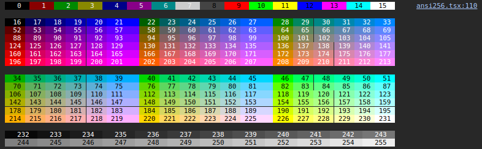
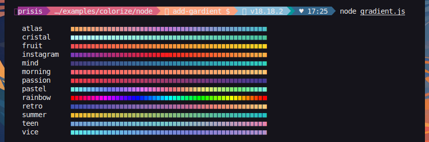
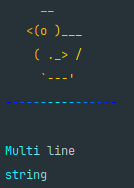

<div align="center">
  <h3>Visulima Colorize</h3>
  <p>
  Terminal and Console string styling done right, powered by <a href="https://github.com/visulima/visulima/packages/is-ansi-color-supported">@visulima/is-ansi-color-supported</a>.

Colorize stands as a sleek, lightning-fast alternative to [Chalk][chalk], boasting a plethora of additional, valuable features.<br>
Elevate your terminal experience by effortlessly adding vibrant colors to your output with its clean and straightforward syntax.<br>
For instance, you can use `green` to make `` green`Hello World!` `` pop, `` red`Error!` `` to signify Errors, or `` black.bgYellow`Warning!` `` to highlight warnings.

  </p>
</div>

<br />

<div align="center">

[![typescript-image]][typescript-url] [![npm-image]][npm-url] [![license-image]][license-url]

</div>

---

<div align="center">
    <p>
        <sup>
            Daniel Bannert's open source work is supported by the community on <a href="https://github.com/sponsors/prisis">GitHub Sponsors</a>
        </sup>
    </p>
</div>

---

## Why Colorize?

- Supports both **ESM** and **CommonJS**
- **TypeScript** support out of the box
- Supports **Deno**, **Next.JS** runtimes and **Browser** (not only chrome) (currently multi nesting is not supported)
- [Standard API](#base-colors) compatible with **Chalk**, switch from **Chalk** to **Colorize** without changing your code

```diff
- import chalk from 'chalk';
+ import chalk, { red } from '@visulima/colorize';

chalk.red.bold('Error!'); // <- Chalk like syntax works fine with Colorize
red.bold('Error!');       // <- the same result with Colorize
red.bold`Error!`;         // <- the same result with Colorize
```

- Default import
    - `import colorize from '@visulima/colorize'` or `const colorize = require('@visulima/colorize')`
- [Named import](#named-import)
    - `import { red } from '@visulima/colorize'` or `const { red } = require('@visulima/colorize')`
- [Chained syntax](#chained-syntax) `red.bold.underline('text')`
- [Template literals](#template-literals) `` red`text` ``
- String styling with [tagged template literals](https://developer.mozilla.org/en-US/docs/Web/JavaScript/Reference/Template_literals#tagged_templates), see [template-literals](#tagged-template-literals)
- [Nested **template strings**](#nested-syntax) `` red`R ${green`G`} R` ``
- [Base ANSI styles](#base-colors) `dim` **`bold`** _`italic`_ <u>`underline`</u> <s>`strikethrough`</s>
- [Base ANSI 16 colors](#base-colors) `` red`Error!` `` `` redBright`Error!` `` `` bgRed`Error!` `` `` bgRedBright`Error!` ``
- [ANSI 256 colors](#256-colors) and [TrueColor](#truecolor) (**RGB**, **HEX**) `` rgb(224, 17, 95)`Ruby` ``, `` hex('#96C')`Amethyst` ``
- [TrueColor](#truecolor) (**RGB**, **HEX**) `` rgb(224, 17, 95)`Ruby` ``, `` hex('#96C')`Amethyst` ``
- [Fallback](#fallback) to supported [color space](#color-support): TrueColor → 256 colors → 16 colors → no colors
- [ANSI codes](#escape-codes) as `open` and `close` property for each style `` `Hello ${red.open}World${red.close}!` ``
- [Strip ANSI codes](#strip) method `colorize.strip()`
- [Correct style break](#new-line) at the `end of line` when used `\n` in string
- Supports the [environment variables](#cli-vars) `NO_COLOR` `FORCE_COLOR` and flags `--no-color` `--color`
- Expressive API
- Doesn't extend `String.prototype`
- Up to **x3 faster** than **chalk**, [see benchmarks](#benchmark)
- **Auto detects** color support
- Clean and focused
- [String Gradient´s](#gradient)

## Install

```sh
npm install @visulima/colorize
```

```sh
yarn add @visulima/colorize
```

```sh
pnpm add @visulima/colorize
```

## Demo

<center>


</center>

## Usage

```typescript
// ESM default import
import colorize from "@visulima/colorize";
// ESM named import
import { red, green, blue } from "@visulima/colorize";
```

or

```typescript
// CommonJS default import
const colorize = require("@visulima/colorize");
// CommonJS named import
const { red, green, blue } = require("@visulima/colorize");
```

Some examples:

```typescript
console.log(colorize.green("Success!"));
console.log(green("Success!"));

// template string
console.log(blue`Info!`);

// chained syntax
console.log(green.bold`Success!`);

// nested syntax
console.log(red`The ${blue.underline`file.js`} not found!`);
```

### Browser

> **Note:** It has the same API as in Node.js.

> The return value of the browser version is an array of strings, not a string, because the browser console use the `%c` syntax for styling.
> This is why you need the spread operator `...` to log the colorized string.

```typescript
// ESM default import
import colorize from "@visulima/colorize/browser";
// ESM named import
import { red, green, blue } from "@visulima/colorize/browser";
```

Some examples:

```typescript
console.log(...colorize.green("Success!"));
console.log(...green("Success!"));

// template string
console.log(...blue`Info!`);

// chained syntax
console.log(...green.bold`Success!`);

// nested syntax
console.log(...red`The ${blue.underline`file.js`} not found!`);
```

Workaround/Hack to not use the spread operator `...`.

> Warning: But you will lose the correct file path and line number in the console.

```typescript
let consoleOverwritten = false;

// Heck the window.console object to add colorized logging
if (typeof navigator !== "undefined" && typeof window !== "undefined" && !consoleOverwritten) {
    ["error", "group", "groupCollapsed", "info", "log", "trace", "warn"].forEach((o) => {
        const originalMethod = (window.console as any)[o as keyof Console];

        (window.console as any)[o as keyof Console] = (...args: any[]) => {
            if (Array.isArray(args[0]) && args[0].length >= 2 && args[0][0].includes("%c")) {
                originalMethod(...args[0]);
            } else {
                originalMethod(...args);
            }
        };
    });

    consoleOverwritten = true;
}
```

### Named import

The `@visulima/colorize` supports both the `default import` and `named import`.

```typescript
// default import
import colorize from "@visulima/colorize";

colorize.red.bold("text");
```

You can import named colors, styles and functions. All imported colors and styles are `chainable`.

```typescript
// named import
import { red, hex, italic } from "@visulima/colorize";

red.bold("text");
```

Default import and named import can be combined.

```typescript
// default and named import
import colorize, { red } from "@visulima/colorize";

const redText = red("text"); // colorized ANSI string
const text = colorize.strip(redText); // pure string without ANSI codes
```

## Template literals

The `@visulima/colorize` supports both the function syntax `red('error')` and template literals `` red`error` ``.

The `template literals` allow you to make a complex template more readable and shorter.\
The `function syntax` can be used to colorize a variable.

```typescript
import { red, blue } from "@visulima/colorize";

let message = "error";

red(message);
blue`text`;
blue`text ${message} text`;
```

## Tagged Template Literals

The `@visulima/colorize` supports the [tagged template literals](https://developer.mozilla.org/en-US/docs/Web/JavaScript/Reference/Template_literals#tagged_templates).

<!--
 Modified copy of https://github.com/chalk/chalk-template/blob/main/readme.md

 MIT License

 Copyright (c) Josh Junon
 Copyright (c) Sindre Sorhus <sindresorhus@gmail.com> (https://sindresorhus.com)
-->

```typescript
import template from "@visulima/colorize/template";

console.log(template`
CPU: {red ${cpu.totalPercent}%}
RAM: {green ${(ram.used / ram.total) * 100}%}
DISK: {rgb(255,131,0) ${(disk.used / disk.total) * 100}%}
`);

const miles = 18;
const calculateFeet = (miles) => miles * 5280;

console.log(template`
    There are {bold 5280 feet} in a mile.
    In {bold ${miles} miles}, there are {green.bold ${calculateFeet(miles)} feet}.
`);

console.log(template`
    There are also {#FF0000 shorthand hex styles} for
    both the {#ABCDEF foreground}, {#:123456 background},
    or {#ABCDEF:123456 both}.
`);
```

### API

Blocks are delimited by an opening curly brace (`{`), a style, some content, and a closing curly brace (`}`).

Template styles are chained exactly like normal Colorize styles. The following two statements are equivalent:

```typescript
import colorize from "@visulima/colorize";
import template from "@visulima/colorize/template";

console.log(colorize.bold.rgb(10, 100, 200)("Hello!"));
console.log(template`{bold.rgb(10,100,200) Hello!}`);
```

## Chained syntax

All colors, styles and functions are chainable. Each color or style can be combined in any order.

```typescript
import { blue, bold, italic, hex } from "@visulima/colorize";

blue.bold`text`;

hex("#FF75D1").bgCyan.bold`text`;

bold.bgHex("#FF75D1").cyan`text`;

italic.yellow.bgMagentaBright`text`;
```

## Nested syntax

You can nest functions and template strings within each other.
None of the other libraries (chalk, kleur, colorette, colors.js etc.) support nested template strings.

Nested template strings:

```typescript
import { red, green } from "@visulima/colorize";

red`red ${green`green`} red`;
```

Deep nested chained styles:

```typescript
import { red, green, cyan, magenta, yellow, italic, underline } from "@visulima/colorize";

console.log(red(`red ${italic(`red italic ${underline(`red italic underline`)}`)} red`));

// deep nested chained styles
console.log(green(`green ${yellow(`yellow ${magenta(`magenta ${cyan(`cyan ${red.italic.underline`red italic underline`} cyan`)} magenta`)} yellow`)} green`));
```

Output:\


<!--
Copy of a readme example from https://github.com/webdiscus/ansis

ISC License

Copyright (c) 2023, webdiscus
-->

Multiline nested template strings:

```typescript
import { red, green, hex, visible, inverse } from "@visulima/colorize";

// defined a TrueColor as the constant
const orange = hex("#FFAB40");

// normal colors
console.log(visible`
CPU: ${red`${cpu.totalPercent}%`}
RAM: ${green`${(ram.used / ram.total) * 100}%`}
DISK: ${orange`${(disk.used / disk.total) * 100}%`}
`);

// inversed colors
console.log(inverse`
CPU: ${red`${cpu.totalPercent}%`}
RAM: ${green`${(ram.used / ram.total) * 100}%`}
DISK: ${orange`${(disk.used / disk.total) * 100}%`}
`);
```

Output:\


<a id="base-colors" name="base-colors"></a>

## Base ANSI 16 colors and styles

Colors and styles have standard names used by many popular libraries, such
as [chalk][chalk], [colorette][colorette], [kleur][kleur].

| Foreground colors     | Background colors         | Styles                                                                  |
| :-------------------- | :------------------------ | ----------------------------------------------------------------------- |
| `black`               | `bgBlack`                 | `dim`                                                                   |
| `red`                 | `bgRed`                   | **`bold`**                                                              |
| `green`               | `bgGreen`                 | _`italic`_                                                              |
| `yellow`              | `bgYellow`                | <u>`underline`</u>                                                      |
| `blue`                | `bgBlue`                  | <s>`strikethrough`</s> (alias `strike`)                                 |
| `magenta`             | `bgMagenta`               | <s>`doubleUnderline`</s> (_not included, because not widely supported_) |
| `cyan`                | `bgCyan`                  | <s>`overline`</s> (_not included, because not widely supported_)        |
| `white`               | `bgWhite`                 | <s>`frame`</s> (_not included, because not widely supported_)           |
| `gray` (alias `grey`) | `bgGray` (alias `bgGrey`) | <s>`encircle`</s> (_not included, because not widely supported_)        |
| `blackBright`         | `bgBlackBright`           | `inverse`                                                               |
| `redBright`           | `bgRedBright`             | `visible`                                                               |
| `greenBright`         | `bgGreenBright`           | `hidden`                                                                |
| `yellowBright`        | `bgYellowBright`          | `reset`                                                                 |
| `blueBright`          | `bgBlueBright`            |                                                                         |
| `magentaBright`       | `bgMagentaBright`         |                                                                         |
| `cyanBright`          | `bgCyanBright`            |                                                                         |
| `whiteBright`         | `bgWhiteBright`           |                                                                         |

## ANSI 256 colors

The pre-defined set of 256 colors.

<center>


Browser



</center>

| Code range | Description                               |
| ---------: | ----------------------------------------- |
|      0 - 7 | standard colors                           |
|     8 - 15 | bright colors                             |
|   16 - 231 | 6 × 6 × 6 cube (216 colors)               |
|  232 - 255 | grayscale from black to white in 24 steps |

Foreground function: `ansi256(code)` has short alias `fg(code)`\
Background function: `bgAnsi256(code)` has short alias `bg(code)`

> The `ansi256()` and `bgAnsi256()` methods are implemented for compatibility with the `chalk` API.

See [ANSI color codes](https://en.wikipedia.org/wiki/ANSI_escape_code#8-bit).

### Fallback

If a terminal supports only 16 colors then ANSI 256 colors will be interpolated into base 16 colors.

#### Usage Example

```typescript
import { bold, ansi256, fg, bgAnsi256, bg } from "@visulima/colorize";

// foreground color
ansi256(96)`Bright Cyan`;
fg(96)`Bright Cyan`; // alias for ansi256

// background color
bgAnsi256(105)`Bright Magenta`;
bg(105)`Bright Magenta`; // alias for bgAnsi256

// function is chainable
ansi256(96).bold`bold Bright Cyan`;

// function is avaliable in each style
bold.ansi256(96).underline`bold underline Bright Cyan`;

// you can combine the functions and styles in any order
bgAnsi256(105).ansi256(96)`cyan text on magenta background`;
bg(105).fg(96)`cyan text on magenta background`;
```

```typescript
import { bold, ansi256, fg, bgAnsi256, bg } from "@visulima/colorize";

// foreground color
ansi256(96)`Bright Cyan`;
fg(96)`Bright Cyan`;

// background color
bgAnsi256(105)`Bright Magenta`;
bg(105)`Bright Magenta`;

// function is chainable
ansi256(96).bold`bold Bright Cyan`;

// function is available in each style
bold.ansi256(96).underline`bold underline Bright Cyan`;

// you can combine the functions and styles in any order
bgAnsi256(105).ansi256(96)`cyan text on magenta background`;
bg(105).fg(96)`cyan text on magenta background`;
```

## Truecolor (16 million colors)

You can use the `hex` or `rgb` format.

Foreground function: `hex()` `rgb()`\
Background function: `bgHex()` `bgRgb()`

```typescript
import { bold, hex, rgb, bgHex, bgRgb } from "@visulima/colorize";

// foreground color
hex("#E0115F").bold`bold Ruby`;
hex("#96C")`Amethyst`;
rgb(224, 17, 95).italic`italic Ruby`;

// background color
bgHex("#E0115F")`Ruby`;
bgHex("#96C")`Amethyst`;
bgRgb(224, 17, 95)`Ruby`;

// you can combine the functions and styles in any order
bold.hex("#E0115F").bgHex("#96C")`ruby bold text on amethyst background`;
```

## Fallback

If a terminal does not support ANSI colors, the library will automatically fall back to the next supported color space.

> TrueColor —> 256 colors —> 16 colors —> no colors (black & white)

If you use the `hex()`, `rgb()` or `ansis256()` functions in a terminal not supported TrueColor or 256 colors, then colors will be interpolated.

<!--
Copy of a readme example from https://github.com/webdiscus/ansis

ISC License

Copyright (c) 2023, webdiscus
-->

## Use ANSI codes

You can use the [ANSI escape codes](https://en.wikipedia.org/wiki/ANSI_escape_code#Colors_and_Styles) with `open`
and `close` properties for each style.

```typescript
import { green, bold } from "@visulima/colorize";

// each style has `open` and `close` properties
console.log(`Hello ${green.open}ANSI${green.close} World!`);

// you can define own style which will have the `open` and `close` properties
const myStyle = bold.italic.black.bgHex("#E0115F");

console.log(`Hello ${myStyle.open}ANSI${myStyle.close} World!`);
```

<!--
Copy of a readme example from https://github.com/webdiscus/ansis

ISC License

Copyright (c) 2023, webdiscus
-->

## Strip ANSI codes

The Colorize class contains the method `strip()` to remove all ANSI codes from string.

```typescript
import colorize from "@visulima/colorize";
// or named import
import { strip } from "@visulima/colorize";

const ansiString = colorize.blue`Hello World!`;
const string = colorize.strip(ansiString);
```

The variable `string` will contain the pure string without ANSI codes.

## New lines

Supports correct style break at the `end of line`.

```typescript
import { bgGreen } from "@visulima/colorize";

console.log(bgGreen`\nColorize\nNew Line\nNext New Line\n`);
```


## Environment variables and CLI arguments

Please check [@visulima/is-ansi-color-supported](https://github.com/visulima/visulima/packages/is-ansi-color-supported) for more information.

## Browser support

Since Chrome 69 (every chrome based browser), ANSI escape codes are natively supported in the developer console.

For other browsers (like firefox) we use the console style syntax command `%c`.

### Browser Compatibility for ANSI Codes

| Browser     | Version   | Colors Supported |
| ----------- | --------- | ---------------- |
| **Chrome**  | **v69+**  | TrueColor (16M)  |
| **Safari**  | **v10+**  | TrueColor (16M)  |
| **Edge**    | **v79+**  | TrueColor (16M)  |
| **Opera**   | **v56+**  | TrueColor (16M)  |
| **Brave**   | **v1.0+** | TrueColor (16M)  |
| **Vivaldi** | **v2.0+** | TrueColor (16M)  |

> [!WARNING]
> **Firefox** doesn't natively support ANSI codes in the developer console. Colorize automatically falls back to `%c` syntax for Firefox.

## Windows

If you're on Windows, do yourself a favor and use [Windows Terminal](https://github.com/microsoft/terminal) instead of cmd.exe.

## Edge Cases: Handling Input Arguments

Colorize ensures consistent and predictable behavior for edge-case inputs, making it reliable for production use.

### Handling falsy arguments

```typescript
import colorize, { red } from "@visulima/colorize";

colorize.red(); // ✅ Returns empty string ''
colorize.red(undefined); // ✅ Returns empty string ''
colorize.red(null); // ✅ Returns empty string ''
colorize.red(""); // ✅ Returns empty string ''
colorize.reset(); // ✅ Returns reset ANSI code '\x1b[0m'
```

This reliable handling prevents unexpected output when working with variables that might be `undefined`, `null`, or empty strings.

## Which One Should You Use?

### Quick Decision Guide

- **Need basic 16 colors only?** Both Colorize and `styleText()` work, but Colorize is **~100x faster** and supports more environments.
- **Need truecolor (hex/rgb), 256 colors, or browser support?** Use **Colorize** - `styleText()` doesn't support these.
- **Need nested template strings or chained syntax?** Use **Colorize** - `styleText()` requires verbose nested calls.
- **Only targeting Node.js 22+ and want zero dependencies?** `styleText()` works, but consider the performance and feature trade-offs.

### Checklist

- Does support for **ESM** or **CJS** matter?
    - ✅ Colorize: `ESM` and `CJS`
    - ❌ styleText: Node.js only

- Does **browser compatibility** matter?
    - ✅ Colorize: Works in Chromium-based browsers and Safari
    - ❌ styleText: Node.js only

- Does **performance** matter? (e.g., high-frequency logging)
    - ✅ Colorize: **~100x faster** than styleText
    - ❌ styleText: Significantly slower

- Does support for **[ANSI 256 colors](#256-colors)** or **[Truecolor](#truecolor)** with [fallback](#fallback) matter?
    - ✅ Colorize: Full support with automatic fallback
    - ❌ styleText: Limited to 16 colors only

- Does handling **[edge cases](#edge-cases-handling-input-arguments)** (undefined, null, empty strings) matter?
    - ✅ Colorize: Reliable handling of all edge cases
    - ⚠️ styleText: Behavior varies by Node.js version

- Does keeping your code **clean and readable** matter?
    - ✅ Colorize: [Default and named import](#named-import), [chained syntax](#chained-syntax), [nested template strings](#nested-syntax)
    - ❌ styleText: Verbose nested calls, no chaining

- Does **TypeScript** support and IDE autocomplete matter?
    - ✅ Colorize: Full TypeScript support with autocomplete
    - ⚠️ styleText: Basic TypeScript support

## Library Maintenance Status

As of 2025, here's the maintenance status of popular ANSI color libraries:

- ✅ **@visulima/colorize**: Actively maintained
- ✅ **ansis**: Actively maintained
- ✅ **chalk**: Actively maintained
- ✅ **picocolors**: Actively maintained
- ⚠️ **colorette**: Last updated 2+ years ago
- ⚠️ **ansi-colors**: Last updated 3+ years ago
- ⚠️ **kleur**: Last updated 3+ years ago
- ⚠️ **colors.js**: Last updated 2+ years ago
- ⚠️ **cli-color**: Last updated 1+ year ago
- ⚠️ **colors-cli**: Last updated 1+ year ago

Colorize is actively maintained and regularly updated with new features, bug fixes, and performance improvements.

## Colorize vs `util.styleText()`

Since **Node.js v22**, the built-in [`util.styleText()`](https://nodejs.org/api/util.html#utilstyletextformat-text-options) function has been officially introduced, supporting [standard modifiers](https://nodejs.org/api/util.html#modifiers) - the basic 16 colors and styles.

### Where it works

**Colorize**

✅ Works on **Node.js v20.19+**\
✅ Works in Chromium-based browsers and Safari (useful for shared utils)\
✅ Works in **Deno** and **Next.JS** runtimes\
⚠️ **Firefox DevTools** don't render ANSI escape sequences.

**styleText**

✅ Native since **Node.js v22+**\
❌ Node only - it doesn't work in browsers or other runtimes

### Performance

In practical benchmarks, `styleText()` is dramatically slower, **~100x slower** than Colorize:

```js
styleText("red", "text"); //    579.832 ops/sec
colorize.red("text"); // 59.646.465 ops/sec
```

See the [benchmark](./__bench__/README.md) for detailed performance comparisons.

### Color support detection

**Colorize**

- Detects terminal, TTY, CI, or browser color capability and automatically falls back to the supported level (truecolor → 256 → 16 → no color).
- Supports common flags and environment variables:\
  `NO_COLOR`, `FORCE_COLOR`, `COLORTERM`, `--no-color`, `--color`.

**styleText**

- Detects terminal color support automatically.
- Supports only environment variables:\
  `NO_COLOR`, `FORCE_COLOR`, `NODE_DISABLE_COLORS`.

### Simple styling

**Colorize** has a compact and elegant syntax:

```typescript
import colorize, { green } from "@visulima/colorize";

console.log(colorize.green("Success!"));
// or even shorter using named import
console.log(green`Success!`);
console.log(green.bold`Success!`);
```

The same example with **styleText** is more verbose:

```js
const { styleText } = require("node:util");

console.log(styleText("green", "Success!"));
console.log(styleText(["green", "bold"], "Success!"));
```

### Nested styling

**Colorize** keeps your code short and readable:

```typescript
import { red, cyan } from "@visulima/colorize";

console.log(red`Error: ${cyan.bold`file.js`} not found!`);
```

Using **styleText** becomes awkward and verbose for nested or combined styles:

```js
const { styleText } = require("node:util");

console.log(styleText("red", `Error: ${styleText(["cyan", "bold"], "file.js")} not found!`));
```

### Truecolor

**Colorize**

- Supports 16-color, 256-color, and truecolor output.
- Truecolor methods `hex()` and `rgb()`:

    ```typescript
    console.log(colorize.hex("#ffa500")("orange text"));
    console.log(colorize.rgb(255, 165, 0)("orange text"));
    ```

**styleText**

- Limited to the 16 ANSI colors and standard styles.
- No support for hex, rgb, or truecolor.

### TypeScript & IDE support

**Colorize** includes `d.ts` type definitions for seamless **TypeScript** integration.\
Color names, methods, and style chains are fully typed, enabling **autocomplete** and **type checking** in IDEs like VS Code.

## Comparison of most popular libraries

| Library<br>**\*\***\_\_**\*\***<br> - name<br> - named import                                 | Code size                                                                      |               Naming colors                | ANSI 256<br>colors | True-<br>color | Chained<br>syntax | Nested<br>template strings | New<br>Line |            Supports<br>CLI params<br>ENV vars            | Fallbacks                          |
| :-------------------------------------------------------------------------------------------- | :----------------------------------------------------------------------------- | :----------------------------------------: | :----------------: | :------------: | :---------------: | :------------------------: | :---------: | :------------------------------------------------------: | ---------------------------------- |
| [`@visulima/colorize`][npm-url]<br><nobr>`✅ named import`</nobr>                             |  |        **standard**<br>`16` colors         |         ✅         |       ✅       |        ✅         |             ✅             |     ✅      | `NO_COLOR`<br>`FORCE_COLOR`<br>`--no-color`<br>`--color` | 256 color<br>16 colors<br>no color |
| [`ansi-colors`][ansi-colors]<br><nobr>`❌ named import`</nobr>                                |         |        **standard**<br>`16` colors         |         ❌         |       ❌       |        ✅         |             ❌             |     ✅      |                  only<br>`FORCE_COLOR`                   | ❌                                 |
| [`ansis`][ansis]<br><nobr>`✅ named import`</nobr>                                            |               |        **standard**<br>`16` colors         |         ✅         |       ✅       |        ✅         |             ✅             |     ✅      | `NO_COLOR`<br>`FORCE_COLOR`<br>`--no-color`<br>`--color` | 256 color<br>16 colors<br>no color |
| [`chalk`][chalk]<br><nobr>`❌ named import`</nobr>                                            |               |        **standard**<br>`16` colors         |         ✅         |       ✅       |        ✅         |             ❌             |     ✅      | `NO_COLOR`<br>`FORCE_COLOR`<br>`--no-color`<br>`--color` | 256 color<br>16 colors<br>no color |
| [`cli-color`][cli-color]<br><nobr>`❌ named import`</nobr>                                    |           |        **standard**<br>`16` colors         |         ✅         |       ❌       |        ✅         |             ❌             |     ❌      |                    only<br>`NO_COLOR`                    | 16 colors<br>no color              |
| [`colorette`][colorette]<br><nobr>`✅ named import`</nobr>                                    |           |        **standard**<br>`16` colors         |         ❌         |       ❌       |        ❌         |             ❌             |     ❌      | `NO_COLOR`<br>`FORCE_COLOR`<br>`--no-color`<br>`--color` | no color                           |
| [`colors-cli`][colors-cli]<br><nobr>`❌ named import`</nobr>                                  |          | <nobr>_non-standard_</nobr><br>`16` colors |         ✅         |       ❌       |        ✅         |             ❌             |     ✅      |            only<br>`--no-color`<br>`--color`             | no color                           |
| [`colors.js`][colors.js]<br><nobr>`❌ named import`</nobr>                                    |           | <nobr>_non-standard_</nobr><br>`16` colors |         ❌         |       ❌       |        ✅         |             ❌             |     ✅      |    only<br>`FORCE_COLOR`<br>`--no-color`<br>`--color`    | no color                           |
| [`kleur`][kleur]<br><nobr>`✅ named import`</nobr>                                            |               |         **standard**<br>`8` colors         |         ❌         |       ❌       |        ✅         |             ❌             |     ❌      |           only<br>`NO_COLOR`<br>`FORCE_COLOR`            | no color                           |
| [`picocolors`][picocolors]<br><nobr>`❌ named import`</nobr>                                  |          |         **standard**<br>`8` colors         |         ❌         |       ❌       |        ❌         |             ❌             |     ❌      | `NO_COLOR`<br>`FORCE_COLOR`<br>`--no-color`<br>`--color` | no color                           |
| [`util.styleText()`][styleText]<br><nobr>`❌ named import`</nobr><br><nobr>`Node ≥ 22`</nobr> | Built-in                                                                       |        **standard**<br>`16` colors         |         ❌         |       ❌       |        ❌         |             ❌             |     ❓      |   `NO_COLOR`<br>`FORCE_COLOR`<br>`NODE_DISABLE_COLORS`   | no color                           |

> **Note**
>
> **Code size**\
> The size of distributed code that will be loaded via `require` or `import` into your app. It's not a package size.
>
> **Named import**\
> `import { red, green, blue } from 'lib';`\
> or\
> `const { red, green, blue } = require('lib');`
>
> **Naming colors**
>
> - standard: colors have [standard names](#base-colors-and-styles), e.g.: `red`, `redBright`, `bgRed`, `bgRedBright`
> - _non-standard_: colors have lib-specific names, e.g.: `brightRed`, `bgBrightRed`, `red_b`, `red_btt`
>
> **ANSI 256 colors**
>
> The method names:
>
> - [`@visulima/colorize`][npm-url]: `ansi256(n)` `bgAnsi256(n)` `fg(n)` `bg(n)`
> - [`ansis`][ansis]: `ansi256(n)` `bgAnsi256(n)` `fg(n)` `bg(n)`
> - [`chalk`][chalk]: `ansi256(n)` `bgAnsi256(n)`
> - [`cli-color`][cli-color]: `xterm(n)`
> - [`colors-cli`][colors-cli]: `x<n>`
>
> **Truecolor**
>
> The method names:
>
> - [`@visulima/colorize`][npm-url]: `hex()` `rgb()`
> - [`ansis`][ansis]: `hex()` `rgb()`
> - [`chalk`][chalk]: `hex()` `rgb()`
> - [`util.styleText()`][styleText]: Not supported (limited to 16 colors)
>
> **Chained syntax**\
> `lib.red.bold('text')`
>
> **Nested template strings**\
> `` lib.red`text ${lib.cyan`nested`} text` ``
>
> **New line**\
> Correct break styles at `end-of-line`.
>
> ```
> lib.bgGreen(`First Line
> Next Line`);
> ```

<!--
 Modified table from https://github.com/webdiscus/ansis

 ISC License

 Copyright (c) 2023, webdiscus
-->

## Gradient



The `@visulima/colorize/gradient` supports the string gradient´s, single and multi line.

```typescript
import { gradient } from "@visulima/colorize/gradient";

console.log(gradient("red", "green", "blue")("Hello World!"));
```

### Multi line gradient

In some cases, you may want to apply the same horizontal gradient on each line of a long text (or a piece of ASCII art).

You can use the `multilineGradient` method of a gradient to ensure that the colors are vertically aligned.

```typescript
import { multilineGradient, gradient } from "@visulima/colorize/gradient";

console.log(multilineGradient(["orange", "yellow"])(["     __", "   <(o )___", "    ( ._> /", "     `---'"].join("\n")));
console.log(gradient(["blue", "cyan", "blue"])("----------------"));
```



## Benchmark

[See benchmark](./__bench__/README.md)

## Reference

- [The opaque named colors](https://drafts.csswg.org/css-color/#named-colors)
- [ANSI escape code](https://en.wikipedia.org/wiki/ANSI_escape_code)

The [ANSI Escape](https://en.wikipedia.org/wiki/ANSI_escape_code) sequences control code screen.

```bash
echo -e "\033[31;41;4m something here 33[0m"
```

`\033` As the escape character, inform the terminal to switch to the escape mode.
`[` The beginning of the CSI.
`m` Make the action to be performed.
`;` ASCII code separator.

## Supported Node.js Versions

Libraries in this ecosystem make the best effort to track [Node.js’ release schedule](https://github.com/nodejs/release#release-schedule).
Here’s [a post on why we think this is important](https://medium.com/the-node-js-collection/maintainers-should-consider-following-node-js-release-schedule-ab08ed4de71a).

## Contributing

If you would like to help take a look at the [list of issues](https://github.com/visulima/visulima/issues) and check our [Contributing](.github/CONTRIBUTING.md) guild.

> **Note:** please note that this project is released with a Contributor Code of Conduct. By participating in this project you agree to abide by its terms.

## Credits

- [WebDiscus](https://github.com/webdiscus)
- [Daniel Bannert](https://github.com/prisis)
- [All Contributors](https://github.com/visulima/visulima/graphs/contributors)

## About

### Related Projects

- [ansis][ansis] - The Node.js library for formatting text in terminal with ANSI colors & styles
- [ansi-colors][ansi-colors] - Easily add ANSI colors to your text and symbols in the terminal.
- [chalk][chalk] - Terminal string styling done right
- [cli-color][cli-color] - Colors and formatting for the console
- [colorette][colorette] - Easily set your terminal text color & styles
- [colors-cli][colors-cli] - Terminal string styling done right.
- [colors.js][colors.js] - get colors in your node.js console
- [kleur][kleur] - The fastest Node.js library for formatting terminal text with ANSI colors~!
- [picocolors][picocolors] - Tiny yet powerful colors for terminal

Template:

- [chalk-template][chalk-template] - Terminal string styling with tagged template literals

Gradient:

- [tinygradient](https://github.com/mistic100/tinygradient) - Easily generate color gradients with an unlimited number of color stops and steps.
- [gradient-string](https://github.com/bokub/gradient-string) - Beautiful color gradients in terminal output

## License

The visulima colorize is open-sourced software licensed under the [MIT][license-url]

[typescript-image]: https://img.shields.io/badge/Typescript-294E80.svg?style=for-the-badge&logo=typescript

[typescript-url]: https://www.typescriptlang.org/ "TypeScript" "typescript"
[license-image]: https://img.shields.io/npm/l/@visulima/colorize?color=blueviolet&style=for-the-badge
[license-url]: LICENSE.md "license"
[npm-image]: https://img.shields.io/npm/v/@visulima/colorize/latest.svg?style=for-the-badge&logo=npm
[npm-url]: https://www.npmjs.com/package/@visulima/colorize/v/latest "npm"
[colors.js]: https://github.com/Marak/colors.js
[colorette]: https://github.com/jorgebucaran/colorette
[picocolors]: https://github.com/alexeyraspopov/picocolors
[cli-color]: https://github.com/medikoo/cli-color
[colors-cli]: https://github.com/jaywcjlove/colors-cli
[ansi-colors]: https://github.com/doowb/ansi-colors
[kleur]: https://github.com/lukeed/kleur
[chalk]: https://github.com/chalk/chalk
[chalk-template]: https://github.com/chalk/chalk-template
[ansis]: https://github.com/webdiscus/ansis
[styleText]: https://nodejs.org/api/util.html#utilstyletextformat-text-options
