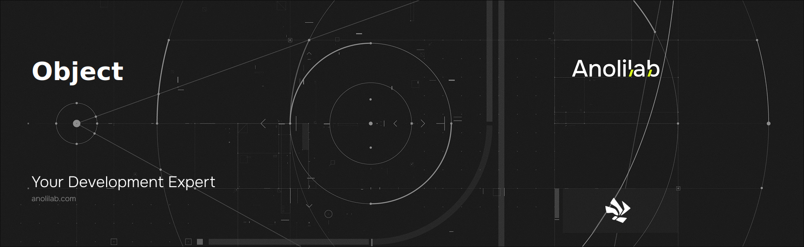

<!-- START_PACKAGE_OG_IMAGE_PLACEHOLDER -->

<a href="https://www.anolilab.com/open-source" align="center">

  

</a>

<h3 align="center">Helper functions for working with objects and arrays.</h3>

<!-- END_PACKAGE_OG_IMAGE_PLACEHOLDER -->

<br />

<div align="center">

[![typescript-image][typescript-badge]][typescript-url]
[![mit licence][license-badge]][license]
[![npm downloads][npm-downloads-badge]][npm-downloads]
[![Chat][chat-badge]][chat]
[![PRs Welcome][prs-welcome-badge]][prs-welcome]

</div>

---

<div align="center">
    <p>
        <sup>
            Daniel Bannert's open source work is supported by the community on <a href="https://github.com/sponsors/prisis">GitHub Sponsors</a>
        </sup>
    </p>
</div>

---

## Install

```sh
npm install @visulima/object
```

```sh
yarn add @visulima/object
```

```sh
pnpm add @visulima/object
```

## Usage

`@visulima/object` exposes two local helpers (`pick`, `omit`) plus a curated set
of re-exports from [`dot-prop`](https://github.com/sindresorhus/dot-prop) and
[`deeks`](https://github.com/mrodrig/deeks).

### pick

With `pick` you pass an object and an array of keys - **the props which may stay**.

```js
import { pick } from "@visulima/object";

const squirtle = { id: "007", name: "Squirtle", type: "water" };

pick(squirtle, ["name", "type"]);
// => { name: 'Squirtle', type: 'water' }

const doc = { items: { keep: "📌", discard: "✂️" } };

pick(doc, ["items.keep"]);
// => { items: { keep: '📌' } }
```

`pick` returns a **new object** and never shares structure with the input. An
empty key list returns `{}`.

### omit

With `omit` you pass an object and an array of keys - the props which should be removed.

```js
import { omit } from "@visulima/object";

const squirtle = { id: "007", name: "Squirtle", type: "water" };

omit(squirtle, ["id"]);
// => { name: 'Squirtle', type: 'water' }

const doc = { items: { keep: "📌", discard: "✂️" } };

omit(doc, ["items.discard"]);
// => { items: { keep: '📌' } }
```

`omit` always returns a **fresh deep copy** — even when the key list is empty —
so mutating the result never affects the input.

### Path features (`pick` / `omit`)

Both helpers share the same path dialect:

- **Dot-notation** for nested props: `nested.prop`.
- **Wildcard segments** with `*` to match any single key: `items.*.secret`.
- **Array traversal** by index or wildcard: `users.0.password`, `users.*.password`.
- **Backslash-escaped dots** for keys that literally contain a `.`: `omit(obj, ["a\\.b"])`
  targets the key named `"a.b"` (compatible with the re-exported `escapePath`).
- **Symbol-keyed properties** are always preserved (string paths can never name them).

```js
omit({ users: [{ name: "a", password: "x" }] }, ["users.*.password"]);
// => { users: [{ name: "a" }] }
```

### isPlainObject

Returns `true` only for objects created from `{}` or `Object.create(null)`
(arrays, class instances, `Map`/`Set`, etc. return `false`).

```js
import { isPlainObject } from "@visulima/object";

isPlainObject({}); // => true
isPlainObject([]); // => false
isPlainObject(new Map()); // => false
```

### getProperty / setProperty / hasProperty / deleteProperty / escapePath

Re-exported from [`dot-prop`](https://github.com/sindresorhus/dot-prop) for
get/set/has/delete on nested objects using a dot path (this uses dot-prop's own
`a.b[0].c` array syntax). `escapePath` escapes a string so dots inside it are
treated as literal characters.

```js
import { getProperty, setProperty, hasProperty, deleteProperty, escapePath } from "@visulima/object";

getProperty({ foo: { bar: "baz" } }, "foo.bar"); // => "baz"
setProperty({}, "foo.bar", "baz"); // => { foo: { bar: "baz" } }
hasProperty({ foo: { bar: "baz" } }, "foo.bar"); // => true
deleteProperty({ foo: { bar: "baz" } }, "foo.bar"); // => true (mutates input)
escapePath("foo.bar"); // => "foo\\.bar"
```

> Note: the `dot-prop` helpers use dot-prop's own path/array syntax, while
> `pick`/`omit` use the dialect described above. Use `escapePath` for the
> dot-prop helpers and `\\.`-escaping for `pick`/`omit`.

### deepKeys / deepKeysFromList

Re-exported from [`deeks`](https://github.com/mrodrig/deeks) — collect every
dot-notation key path from a single object (`deepKeys`) or an array of objects
(`deepKeysFromList`). Accepts a `DeepKeysOptions` object.

```js
import { deepKeys, deepKeysFromList } from "@visulima/object";

deepKeys({ a: { b: 1, c: 2 } }); // => ["a.b", "a.c"]
deepKeysFromList([{ a: 1 }, { b: { c: 2 } }]); // => [["a"], ["b.c"]]
```

## Related

- [is-plain-object](https://github.com/jonschlinkert/is-plain-object) - Returns true if the given value is an object created by the Object constructor.
- [is-plain-obj][is-plain-obj] - Check if a value is a plain object.
- [dot-prop][dot-prop] - Get, set, or delete a property from a nested object using a dot path.
- [ts-dot-prop](https://github.com/justinlettau/ts-dot-prop) - TypeScript utility to transform nested objects using a dot notation path.
- [dset](https://www.npmjs.com/package/dset) - A tiny (194B) utility for safely writing deep Object values~!
- [filter-anything](https://github.com/mesqueeb/filter-anything) - A simple (TypeScript) integration of "pick" and "omit" to filter props of an object.

## Supported Node.js Versions

Libraries in this ecosystem make the best effort to track [Node.js’ release schedule](https://github.com/nodejs/release#release-schedule).
Here’s [a post on why we think this is important](https://medium.com/the-node-js-collection/maintainers-should-consider-following-node-js-release-schedule-ab08ed4de71a).

## Contributing

If you would like to help take a look at the [list of issues](https://github.com/visulima/visulima/issues) and check our [Contributing](.github/CONTRIBUTING.md) guidelines.

> **Note:** please note that this project is released with a Contributor Code of Conduct. By participating in this project you agree to abide by its terms.

## Credits

- [Daniel Bannert](https://github.com/prisis)
- [All Contributors](https://github.com/visulima/visulima/graphs/contributors)

## Made with ❤️ at Anolilab

This is an open source project and will always remain free to use. If you think it's cool, please star it 🌟. [Anolilab](https://www.anolilab.com/open-source) is a Development and AI Studio. Contact us at [hello@anolilab.com](mailto:hello@anolilab.com) if you need any help with these technologies or just want to say hi!

## License

The visulima object is open-sourced software licensed under the [MIT][license]

<!-- badges -->

[license-badge]: https://img.shields.io/npm/l/@visulima/object?style=for-the-badge
[license]: https://github.com/visulima/visulima/blob/main/LICENSE
[npm-downloads-badge]: https://img.shields.io/npm/dm/@visulima/object?style=for-the-badge
[npm-downloads]: https://www.npmjs.com/package/@visulima/object
[prs-welcome-badge]: https://img.shields.io/badge/PRs-welcome-brightgreen.svg?style=for-the-badge
[prs-welcome]: https://github.com/visulima/visulima/blob/main/.github/CONTRIBUTING.md
[chat-badge]: https://img.shields.io/discord/932323359193186354.svg?style=for-the-badge
[chat]: https://discord.gg/TtFJY8xkFK
[typescript-badge]: https://img.shields.io/badge/Typescript-294E80.svg?style=for-the-badge&logo=typescript
[typescript-url]: https://www.typescriptlang.org/
