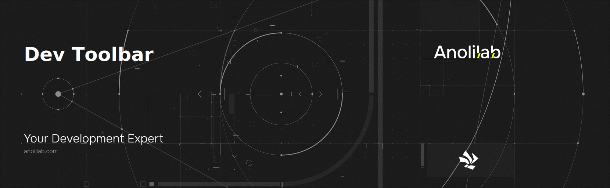

<!-- START_PACKAGE_OG_IMAGE_PLACEHOLDER -->

<a href="https://www.anolilab.com/open-source" align="center">

  

</a>

<h3 align="center">Devtools is a set of tools for building advanced devtools for your application</h3>

<!-- END_PACKAGE_OG_IMAGE_PLACEHOLDER -->

<br />

<div align="center">

[![typescript-image][typescript-badge]][typescript-url]
[![mit licence][license-badge]][license]
[![npm downloads][npm-downloads-badge]][npm-downloads]
[![Chat][chat-badge]][chat]
[![PRs Welcome][prs-welcome-badge]][prs-welcome]

</div>

---

<div align="center">
    <p>
        <sup>
            Daniel Bannert's open source work is supported by the community on <a href="https://github.com/sponsors/prisis">GitHub Sponsors</a>
        </sup>
    </p>
</div>

---

## Overview

`@visulima/dev-toolbar` is a framework-agnostic development toolbar for **any Vite project** — React, Vue, Svelte, SolidJS, or plain HTML. Inspired by Astro DevToolbar, Vue DevTools, and Nuxt DevTools, it provides a consistent developer experience regardless of your framework.

The toolbar renders inside a Shadow DOM custom element (zero style leakage), communicates with the Vite dev server over type-safe RPC, and ships **nine built-in apps** covering the most common development workflows.

## Install

```sh
npm install -D @visulima/dev-toolbar
```

```sh
pnpm add -D @visulima/dev-toolbar
```

```sh
yarn add -D @visulima/dev-toolbar
```

## Quick Start

Add the plugin to your `vite.config.ts`:

```ts
import { defineConfig } from "vite";
import { devToolbar } from "@visulima/dev-toolbar/vite";

export default defineConfig({
    plugins: [devToolbar()],
});
```

Start your dev server and press **`Alt`+`Shift`+`D`** to open the toolbar.

## Built-in Apps

| App               | What it does                                                                  |
| ----------------- | ----------------------------------------------------------------------------- |
| **Accessibility** | axe-core WCAG audit with live element overlays and sessionStorage persistence |
| **Performance**   | Web Vitals (LCP, INP, CLS, FCP, TTFB), resource timing, navigation waterfall  |
| **SEO**           | Social preview cards for 7 platforms + full meta tag audit                    |
| **Timeline**      | Chronological event log from your app and integrated libraries                |
| **Module Graph**  | Browse and filter Vite's live module dependency graph                         |
| **Vite Config**   | Inspect the fully resolved Vite configuration                                 |
| **Inspector**     | Click any element to jump to its JSX source in your editor                    |
| **Tailwind**      | Browse all resolved Tailwind CSS design tokens and their values               |
| **Settings**      | Theme, toolbar behaviour, panel sizing, and custom keyboard shortcuts         |

Most apps are **disabled by default** to keep the toolbar minimal. Out of the box
only **Settings** and **Vite Config** are shown (and **Annotations**, which is
auto-enabled whenever the inspector is). Opt into the apps you want:

```ts
devToolbar({
    apps: {
        inspector: true,
        a11y: true,
        seo: true,
    },
});
```

> Enabling `inspector` also auto-enables `annotations` (the inspector's badge
> links to the annotations panel). Set `annotations: false` to suppress it.

## Plugin Options

```ts
devToolbar({
    // Master switch — `false` returns an empty plugin array, disabling the whole
    // toolbar without removing it from vite.config.ts (handy for CI/preview).
    enabled: true,

    // Built-in apps. Only `settings` and `viteConfig` default to true; everything
    // else defaults to false. Set an app to true to enable it.
    apps: {
        a11y: false,
        annotations: false, // auto-enabled when `inspector` is true
        assets: false,
        inspector: false,
        moduleGraph: false,
        performance: false,
        seo: false,
        settings: true, // enabled by default
        tailwind: false,
        timeline: false,
        viteConfig: true, // enabled by default
    },

    // Register custom apps
    customApps: [],

    // Toolbar pill placement
    placement: "bottom-center", // "bottom-left" | "bottom-center" | "bottom-right"
    position: "bottom", // "bottom" | "top" | "left" | "right"

    // Panel defaults (users can override via Settings app).
    // height/width are clamped to the 20–95 range.
    height: 60, // % of viewport height (20–95)
    width: 80, // % of viewport width (20–95)
    minimizePanelInactive: 5000, // ms; -1 = never auto-hide
    closeOnOutsideClick: true,

    // Keyboard shortcuts (project-level defaults)
    keybindings: {
        toggle: "Alt+Shift+D",
        close: "Escape",
    },

    // Strip toolbar from production builds (default: true)
    removeDevtoolsOnBuild: true,

    // Force a specific editor for "Open in editor" (auto-detected if omitted)
    editor: "webstorm",

    // `readFile` RPC policy. Restricted to a curated extension allowlist by
    // default. Set to `false` to remove it entirely (recommended with `vite --host`),
    // or override the allowed extensions.
    readFile: { extensions: ["ts", "tsx", "js", "jsx", "css", "json", "md"] },

    // JSX source injection for click-to-source in the inspector
    injectSource: {
        enabled: true, // set false to opt out
        ignore: {
            files: ["**/generated/**"], // glob patterns
            components: ["StrictMode"], // component names
        },
    },
});
```

See the [full configuration reference](./docs/configuration.mdx) for all options.

## Keyboard Shortcuts

| Action                    | Default           |
| ------------------------- | ----------------- |
| Toggle toolbar open/close | `Alt`+`Shift`+`D` |
| Close active app / panel  | `Escape`          |

Both shortcuts are configurable in the Settings app or via plugin options.

## Custom Apps

Build your own devtools panel with a Preact component:

```tsx
/** @jsxImportSource preact */
import type { ComponentChildren } from "preact";
import type { AppComponentProps } from "@visulima/dev-toolbar";

const MyApp = ({ helpers }: AppComponentProps): ComponentChildren => {
    return <div class="p-5">Hello from My App!</div>;
};
```

```ts
// vite.config.ts
devToolbar({
    customApps: [
        {
            id: "my-package:my-app",
            name: "My App",
            icon: myIconSvg, // raw SVG string
            component: MyApp,
            tooltip: MyTooltip, // optional hover summary
        },
    ],
});
```

See the [custom apps guide](./docs/custom-apps/creating-apps.mdx) for a step-by-step walkthrough including RPC, tooltips, and styling.

## RPC — Server ↔ Client Communication

Call Node.js functions from your app component over the Vite HMR WebSocket:

```ts
// Add server functions in vite.config.ts
devToolbar({
    serverFunctions: {
        async getRoutes() {
            const files = await fs.readdir("src/pages");
            return files.map((f) => `/${f.replace(/\.(tsx?|jsx?)$/, "")}`);
        },
    },
});

// Call from your app component
const routes = await helpers.rpc.getRoutes();
```

Built-in RPC functions:

| Function                              | Returns                                           |
| ------------------------------------- | ------------------------------------------------- |
| `getViteConfig()`                     | Fully resolved Vite config (serializable subset)  |
| `getModuleGraph()`                    | Vite's live module dependency graph               |
| `getStaticAssets()`                   | Files under `publicDir` (capped at 5000)          |
| `getTailwindConfig()`                 | Resolved Tailwind theme tokens                    |
| `openInEditor(file, line?, col?)`     | Opens the file in the configured editor           |
| `readFile(path)`                      | Text file under the project root (allowlisted)    |
| `getAnnotations()`                    | All saved annotations                             |
| `createAnnotation(data)`              | Creates an annotation                             |
| `updateAnnotation(id, data)`          | Updates an annotation                             |
| `deleteAnnotation(id)`                | Deletes an annotation + its screenshot            |
| `saveScreenshot(id, dataUrl)`         | Stores a screenshot, returns its relative path    |
| `getScreenshot(id)`                   | Returns a screenshot as a base64 data URL         |

## Security

The dev toolbar runs only during `vite dev` and is stripped from production builds
(`removeDevtoolsOnBuild`, default `true`). Still, be aware of the RPC surface:

- **`readFile` returns project files to any connected WebSocket client.** It is
  confined to the project root and a curated extension allowlist (no `.env`,
  lockfiles, or key material by default), but if you run the dev server with
  `vite --host` (e.g. for mobile testing) **any device on your LAN can call it**.
  Disable it (`readFile: false`) or narrow `readFile.extensions` in that scenario.
- Screenshot/annotation writes are path-traversal hardened and symlink escapes are
  rejected; `openInEditor` confines paths to the project root and never shells out.

## Global API

Programmatic control from any script or the browser console:

```ts
const api = (window as any).__VISULIMA_DEVTOOLS__;

// Open an app
await api.openApp("dev-toolbar:a11y");

// Show a notification badge on an app button
api.notify("my-package:monitor", "warning");

// Update toolbar settings
api.updateSettings({ viewMode: "fullscreen" });

// Access RPC from outside a component
const config = await api.rpc.getViteConfig();
```

## Library Integration

Add zero-dependency devtools support to your library. Users get devtools automatically when they install the toolbar — no extra configuration needed:

```ts
function installDevTools(instance: MyLibrary): void {
    const hook = (window as any).__DEV_TOOLBAR_HOOK__;
    if (!hook) return;

    hook.registerApp({
        id: "my-library:devtools",
        name: "My Library",
        icon: iconSvg,
        component: MyLibraryPanel,
    });

    instance.on("action", (action) => {
        hook.addTimelineEvent("my-library", {
            id: crypto.randomUUID(),
            title: action.type,
            time: Date.now(),
            level: "info",
            data: action,
        });
    });
}
```

See the [library integration guide](./docs/integrations/library-integration.mdx) for the full pattern.

## Documentation

All docs are in the [`docs/`](./docs/) folder in Fumadocs MDX format:

| Page                                                               | Contents                                 |
| ------------------------------------------------------------------ | ---------------------------------------- |
| [Getting Started](./docs/getting-started.mdx)                      | Install, framework examples, first steps |
| [Configuration](./docs/configuration.mdx)                          | Full plugin options reference            |
| [Accessibility](./docs/built-in-apps/accessibility.mdx)            | axe-core, overlays, WCAG standards       |
| [Performance](./docs/built-in-apps/performance.mdx)                | Web Vitals thresholds, timing APIs       |
| [SEO](./docs/built-in-apps/seo.mdx)                                | Social previews, meta tag audit          |
| [Timeline](./docs/built-in-apps/timeline.mdx)                      | Event structure, emitting events         |
| [Module Graph](./docs/built-in-apps/module-graph.mdx)              | Search, ext badges, importer view        |
| [Vite Config](./docs/built-in-apps/vite-config.mdx)                | Resolved config sections                 |
| [Settings](./docs/built-in-apps/settings.mdx)                      | All settings, localStorage schema        |
| [Creating Apps](./docs/custom-apps/creating-apps.mdx)              | Step-by-step custom app guide            |
| [App API](./docs/custom-apps/app-api.mdx)                          | TypeScript interface reference           |
| [RPC](./docs/custom-apps/rpc.mdx)                                  | Server functions, type-safe pattern      |
| [Global API](./docs/custom-apps/global-api.mdx)                    | `__VISULIMA_DEVTOOLS__` reference        |
| [Library Integration](./docs/integrations/library-integration.mdx) | Zero-dependency hook pattern             |

## Supported Node.js Versions

Libraries in this ecosystem make the best effort to track
[Node.js' release schedule](https://github.com/nodejs/release#release-schedule).
Here's [a post on why we think this is important](https://medium.com/the-node-js-collection/maintainers-should-consider-following-node-js-release-schedule-ab08ed4de71a).

## Contributing

If you would like to help take a look at the [list of issues](https://github.com/visulima/visulima/issues) and check our [Contributing](https://github.com/visulima/visulima/blob/main/.github/CONTRIBUTING.md) guidelines.

> **Note:** please note that this project is released with a Contributor Code of Conduct. By participating in this project you agree to abide by its terms.

## Credits

- [Daniel Bannert](https://github.com/prisis)
- [All Contributors](https://github.com/visulima/visulima/graphs/contributors)

## Made with ❤️ at Anolilab

This is an open-source project and will always remain free to use. If you think it's cool, please star it 🌟. [Anolilab](https://www.anolilab.com/open-source) is a Development and AI Studio. Contact us at [hello@anolilab.com](mailto:hello@anolilab.com) if you need any help with these technologies or just want to say hi!

## License

The visulima dev-toolbar is open-sourced software licensed under the [MIT][license]

<!-- badges -->

[license-badge]: https://img.shields.io/npm/l/@visulima/dev-toolbar?style=for-the-badge
[license]: https://github.com/visulima/visulima/blob/main/LICENSE
[npm-downloads-badge]: https://img.shields.io/npm/dm/@visulima/dev-toolbar?style=for-the-badge
[npm-downloads]: https://www.npmjs.com/package/@visulima/dev-toolbar
[prs-welcome-badge]: https://img.shields.io/badge/PRs-welcome-brightgreen.svg?style=for-the-badge
[prs-welcome]: https://github.com/visulima/visulima/blob/main/.github/CONTRIBUTING.md
[chat-badge]: https://img.shields.io/discord/932323359193186354.svg?style=for-the-badge
[chat]: https://discord.gg/TtFJY8xkFK
[typescript-badge]: https://img.shields.io/badge/Typescript-294E80.svg?style=for-the-badge&logo=typescript
[typescript-url]: https://www.typescriptlang.org/
