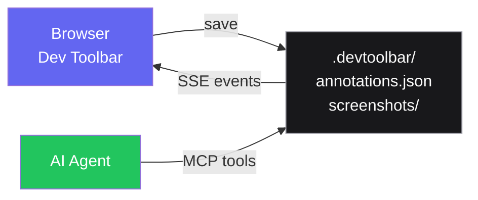
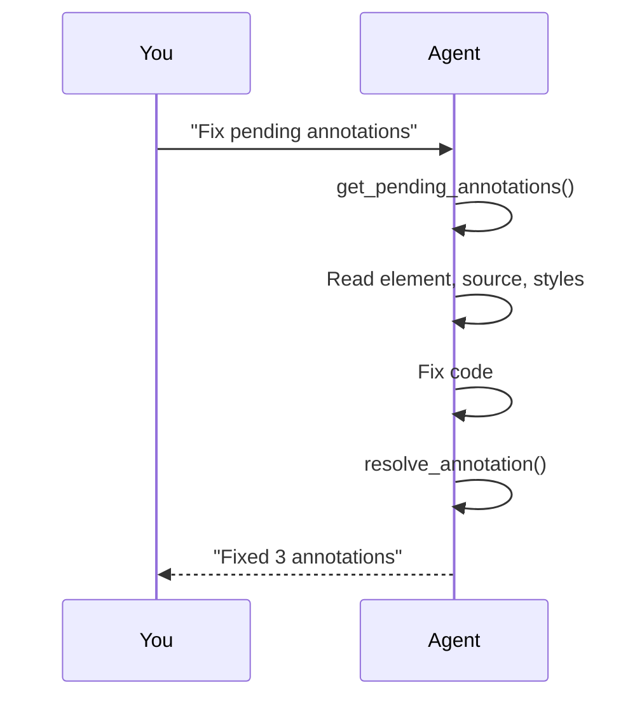
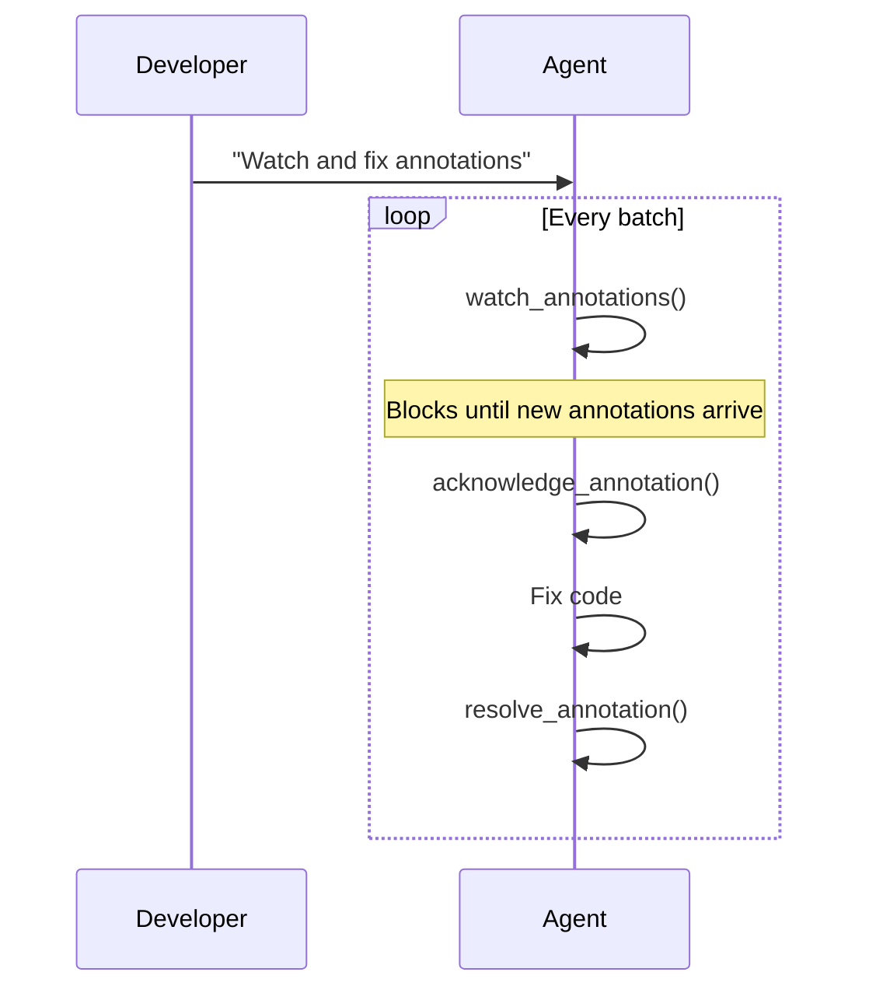

import { Callout } from "fumadocs-ui/components/callout";
import { Step, Steps } from "fumadocs-ui/components/steps";
import { Tab, Tabs } from "fumadocs-ui/components/tabs";

The MCP (Model Context Protocol) server bridges the dev toolbar and AI coding agents. It exposes annotation data — comments, element context, source locations, screenshots — as structured tool calls that agents like Claude Code can consume directly.

## Why MCP?

Annotations capture _what_ needs to change and _where_ in the codebase. The MCP server makes that context available to AI agents so they can:

1. Read pending annotations with full element context
2. View screenshots of annotated elements
3. Acknowledge work-in-progress
4. Add messages to annotation threads
5. Mark annotations as resolved when the fix is complete



The browser writes annotations to disk. The MCP server reads them. SSE events notify the browser when the agent makes changes.

---

## Setup

<Steps>

<Step>

### Install the package

The MCP server is included in `@visulima/dev-toolbar` — no extra package needed.

</Step>

<Step>

### Configure your MCP client

Add the dev-toolbar MCP server to your agent's configuration.

<Tabs items={["Claude Code", "Generic MCP Client"]}>
    <Tab value="Claude Code">
        Add to your project's `.mcp.json`:

        ```json title=".mcp.json"
        {
            "mcpServers": {
                "dev-toolbar": {
                    "command": "npx",
                    "args": ["visulima-dev-toolbar-mcp"],
                    "cwd": "/absolute/path/to/your/project"
                }
            }
        }
        ```
    </Tab>
    <Tab value="Generic MCP Client">
        Run the server directly:

        ```bash
        npx visulima-dev-toolbar-mcp
        ```

        The server communicates over stdio using the MCP protocol. Point your MCP client at this command.
    </Tab>

</Tabs>

<Callout type="info">
    The `cwd` must point to the project root where `.devtoolbar/annotations.json` is stored. The server reads and writes to this directory.
</Callout>

</Step>

<Step>

### Create annotations in the browser

Open your app in the browser, activate the Inspector, and annotate elements. The MCP server reads directly from the `.devtoolbar/` directory — no additional sync needed.

</Step>

<Step>

### Let your agent work

Ask your agent to check for pending annotations. It will use the MCP tools to read context, fix issues, and resolve annotations.

</Step>

</Steps>

---

## MCP Tools

The server exposes six tools:

### `get_pending_annotations`

Retrieve all annotations with `status: "pending"`.

Returns an array of annotation objects with full metadata (element tag, source location, CSS classes, accessibility info, component context, etc.). Screenshot fields return `true`/`false` instead of binary data — use `get_screenshot` to fetch the actual image.

```json
// Example response
[
    {
        "id": "a1b2c3",
        "comment": "Fix alignment on mobile",
        "intent": "fix",
        "severity": "important",
        "status": "pending",
        "elementTag": "div",
        "source": "src/components/Hero.tsx:42:8",
        "screenshot": true,
        "cssClasses": "flex items-center gap-4",
        "url": "http://localhost:5173/"
    }
]
```

### `get_screenshot`

Fetch a specific annotation's screenshot as a base64-encoded data URL.

**Parameters:**

- `annotationId` (string) — the annotation ID

Returns the screenshot as `data:image/png;base64,...` (or JPEG/WebP depending on capture format).

### `acknowledge_annotation`

Mark an annotation as `acknowledged` — signals that work has started.

**Parameters:**

- `annotationId` (string) — the annotation ID

### `add_thread_message`

Add a message to an annotation's conversation thread.

**Parameters:**

- `annotationId` (string) — the annotation ID
- `content` (string) — the message text

The message is added with `role: "agent"`, a unique `id`, and a server-generated timestamp. Thread messages are visible in the browser's annotation detail popup and sync in real-time via SSE.

### `resolve_annotation`

Mark an annotation as `resolved`. The associated screenshot is automatically deleted.

**Parameters:**

- `annotationId` (string) — the annotation ID

### `watch_annotations`

Block until new pending annotations appear. Useful for hands-free workflows where the agent polls for work.

**Parameters:**

- `timeout` (number, optional) — maximum wait time in milliseconds
- `batchWindow` (number, optional) — wait this many milliseconds after the first new annotation before returning, to batch multiple annotations

---

## Workflow Patterns

### Manual Review

The simplest pattern — you annotate, then ask your agent to check:

```
You:   "Check for pending annotations and fix them"
Agent: get_pending_annotations → reads context → fixes code → resolve_annotation
```



### Hands-free Mode

The agent watches for new annotations and acts on them automatically:

```
You:   "Watch for annotations and fix them as they come in"
Agent: watch_annotations in a loop → acknowledge → fix → resolve
```



### Critique Mode

Use annotations to review AI-generated code:

```
Agent: Writes code
You:   Annotate issues in the browser ("this button is misaligned", "wrong colour")
Agent: Reads annotations → applies fixes → resolves
```

---

## Security

The MCP server enforces several safety measures:

- **Directory traversal protection** — all file paths are validated to stay within the project root
- **Screenshot path validation** — screenshot paths must start with `screenshots/`
- **ID sanitization** — annotation IDs are stripped of unsafe characters before use as filenames
- **Async file locking** — prevents race conditions on concurrent reads/writes

---

## Limitations

- The MCP server reads from the filesystem. The Vite dev server provides real-time SSE notifications when annotations change, but the MCP server itself uses file polling in `watch_annotations`.
- Screenshots are captured via the browser's Screen Capture API. If you skip the screenshot step, `get_screenshot` returns nothing.
- The server runs with the permissions of the process that spawned it. Ensure `cwd` points to a trusted project directory.
