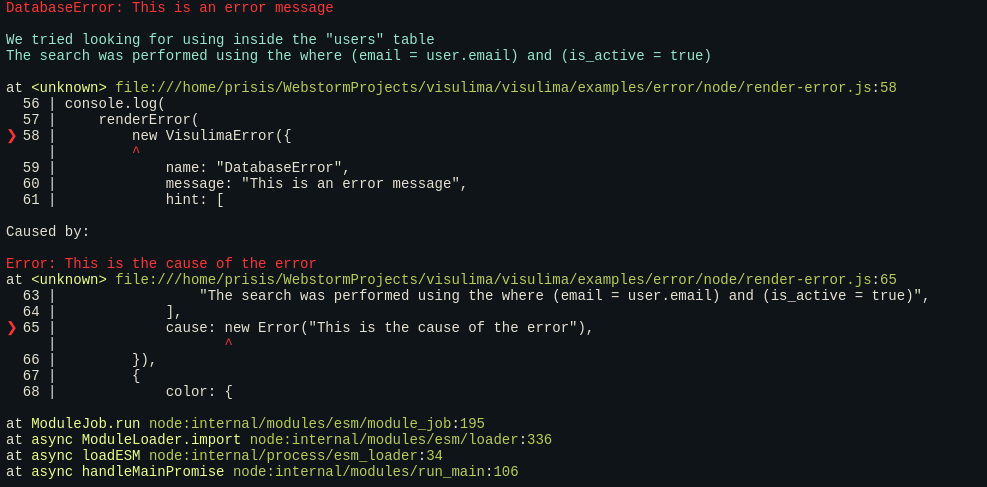

<!-- START_PACKAGE_OG_IMAGE_PLACEHOLDER -->

<a href="https://www.anolilab.com/open-source" align="center">

  

</a>

<h3 align="center">Error with more than just a message, stacktrace parsing.</h3>

<!-- END_PACKAGE_OG_IMAGE_PLACEHOLDER -->

<br />

<div align="center">

[![typescript-image][typescript-badge]][typescript-url]
[![mit licence][license-badge]][license]
[![npm downloads][npm-downloads-badge]][npm-downloads]
[![Chat][chat-badge]][chat]
[![PRs Welcome][prs-welcome-badge]][prs-welcome]

</div>

---

<div align="center">
    <p>
        <sup>
            Daniel Bannert's open source work is supported by the community on <a href="https://github.com/sponsors/prisis">GitHub Sponsors</a>
        </sup>
    </p>
</div>

---

## Install

```sh
npm install @visulima/error
```

```sh
yarn add @visulima/error
```

```sh
pnpm add @visulima/error
```

### Optional: AI integration

If you want to generate AI-powered solution hints, install these optional peer dependencies in your app:

```sh
# pnpm
pnpm add ai

# npm
npm i ai

# yarn
yarn add ai
```

## Usage

### Extend the VisulimaError

```ts
import { VisulimaError } from "@visulima/error";

class MyError extends VisulimaError {
    constructor(message: string) {
        super({
            name: "MyError",
            message,
        });
    }
}

throw new MyError("My error message");

// or

const error = new MyError("My error message");

error.hint = "My error hint";

throw error;
```

### Get all causes in a error

```ts
import { getErrorCauses } from "@visulima/error";

const error = new Error("My error message");
const error2 = new Error("Nested Error");

error.cause = error2;

// The getErrorCauses function will return an array of all causes in the error in the order they occurred.
const causes = getErrorCauses(error);

console.log(causes);

// [
//     {
//         message: "My error message",
//         name: "Error",
//         stack: "Error: My error message\n    at Object.<anonymous> (/visulima/packages/error/src/index.ts:2:16)",
//     },
//     {
//         message: "Nested Error",
//         name: "Error",
//         stack: "Error: Nested Error\n    at Object.<anonymous> (/visulima/packages/error/src/index.ts:3:16)",
//     },
// ];
```

## Pretty Code Frame

Display a pretty code frame with the error location.

> Note: Tabs can be used in the source code, codeFrame transforms them to spaces based on the tabWidth option.
> The default tabWidth is 4, to disable the transformation, set tabWidth to false.

```ts
import { codeFrame } from "@visulima/error";

const source = "const x = 10;\nconst error = x.y;\n";
const loc = { column: 16, line: 2 };

const frame = codeFrame(source, { start: loc });

console.log(frame);
//   1 | const x = 10;
// > 2 | const error = x.y;
//     |                ^
```

### API

#### source

Type: `string`

The source code to frame.

#### location

Type: `object`

The location of the error.

##### location.start

Type: `object`

The location of the start of the frame.

##### location.start.line

Type: `number`

The line number of the error.

##### location.start.column

Type: `number`

The column number of the error.

##### location.end

Type: `object`

The location of the end of the frame.

##### location.end.line

Type: `number`

The line number of the error.

##### location.end.column

Type: `number`

The column number of the error.

#### options

Type: `object`

##### options.linesAbove

Type: `number`

Default: `2`

The number of lines to show above the error.

##### options.linesBelow

Type: `number`

Default: `3`

The number of lines to show below the error.

##### options.tabWidth

Type: `number` | `false`

Default: `4`

## Stacktrace

> Browser older than 6 years are not supported.

Currently supported browsers/platforms:

- Firefox
- Chrome
- Webkit / Safari
- Edge
- Node / Node V8
- Opera (Chromium based)

```ts
import { parseStacktrace } from "@visulima/error";

const error = new Error("My error message");

const stack = parseStacktrace(error);

console.log(stack);

// [
//     {
//         column: 16,
//         file: "file:///Users/danielbannert/Projects/visulima/packages/error/src/index.ts",
//         line: 2,
//         methodName: "Object.<anonymous>",
//         raw: "    at Object.<anonymous> (/visulima/packages/error/src/index.ts:2:16)",
//         type: undefined, // optional property, can be undefined, "eval", "native", or "internal"
//         evalOrigin: undefined, // optional property only available if the stacktrace contains eval
//     },
//     ...and so on
// ];
```

### Format stacktrace to a string

Turn parsed frames into a printable stack string (Node-style), optionally with a header line.

```ts
import { parseStacktrace, stringifyStackFrames, formatStackFrameLine } from "@visulima/error";

const error = new Error("Boom");

const frames = parseStacktrace(error);

// Full stack as a single string with a header ("Error: Boom")
const stackText = stringifyStackFrames(frames, {
    header: { name: error.name, message: error.message },
});
console.log(stackText);

// Format a single frame line (e.g., for custom rendering)
const firstLine = formatStackFrameLine(frames[0]);
```

#### API

- `stringifyStackFrames(frames, options?)`
    - `frames`: `Trace[]` — parsed frames from `parseStacktrace`
    - `options.header`: `{ name?: string; message?: string }` — optional first-line header
- `formatStackFrameLine(frame)`
    - `frame`: `Trace`
    - returns a single formatted line like `"    at myMethod (/path/file.ts:10:5)"`

## Solutions (finders)

Generate helpful hints to fix an error. Two finders ship out of the box:

- Rule-based finder: provides best-effort fixes for common errors (ESM/CJS mix, missing default export, DNS issues, hydration mismatch, etc.)
- Error-hint finder: reads `error.hint` you attach to an `Error` or `VisulimaError`

Both return a `Solution` (`{ header?: string; body: string }`) or `undefined`.

```ts
import { codeFrame } from "@visulima/error";
import { ruleBasedFinder, errorHintFinder } from "@visulima/error";

const error = new Error("Cannot read properties of undefined (reading 'x')");

const source = "const o = undefined\nconsole.log(o.x)\n";
const snippet = codeFrame(source, { start: { line: 2, column: 13 } });

const fileCtx = {
    file: "/path/to/file.ts",
    line: 2,
    language: "ts",
    snippet,
};

// 1) Rule-based finder
const ruleHint = await ruleBasedFinder.handle(error, fileCtx);
if (ruleHint) {
    console.log(ruleHint.header);
    console.log(ruleHint.body);
}

// 2) Error-hint finder (reads error.hint)
const custom = new Error("failed") as Error & { hint?: unknown };
custom.hint = ["Check the environment variables.", "Ensure the service is reachable."];
const hintHint = await errorHintFinder.handle(custom, { file: "", line: 0 });
```

### AI solution helper (optional)

You can build an AI prompt with rich context and render the LLM result into a nice HTML snippet.

```ts
import { aiPrompt, aiSolutionResponse } from "@visulima/error/solution/ai";
// or
// import aiPrompt from "@visulima/error/solution/ai/prompt";

const prompt = aiPrompt({
    applicationType: undefined,
    error,
    file: fileCtx,
});

// Send `prompt` to your LLM of choice.
// When you receive the model's text output, format it for display:
const html = aiSolutionResponse(modelText);
```

You may also use a convenience finder that calls an AI provider for you (requires optional peer dep `ai`):

```ts
import { aiFinder } from "@visulima/error/solution/ai";
import { createOpenAI } from "@ai-sdk/openai";

const client = createOpenAI(apiKey ? { apiKey } : undefined);

const findAI = aiFinder(client(modelId), {
    temperature: 0,
});

const aiHint = await findAI.handle(error, fileCtx);
```

### API

#### error

Type: `Error`

The error to parse.

#### options

Type: `object`

##### options.filter

Type: `Function`

A function to filter the stack frames.

##### options.frameLimit

Type: `number`

The maximum number of frames to parse.

## `serialize` an error object

- Ensures errors are safe to serialize with JSON
- Can be used as error.toJSON()
- Deep serialization, including transforming
- Custom serialization (e.g. YAML or process.send())
- Keeps both native (TypeError, etc.) and custom error classes
- Preserves errors' additional properties
- Can keep constructor's arguments
- Works recursively with error.cause and AggregateError
- Buffer properties are replaced with [object Buffer]
- Circular references are handled.
- If the input object has a .toJSON() method, then it's called instead of serializing the object's properties.
- It's up to .toJSON() implementation to handle circular references and enumerability of the properties.

```ts
import { serializeError } from "@visulima/error";

const error = new TypeError("example");
const errorObject = serializeError(error);
// Plain object: { name: 'TypeError', message: 'example', stack: '...' }

const errorString = JSON.stringify(errorObject);
const newErrorObject = JSON.parse(errorString);
```

## `deserialize` an error object

Deserialize a previously serialized error back to an Error instance.

- Automatically detects error-like objects
- Reconstructs proper Error instances with correct constructors
- Handles custom error classes registered with `addKnownErrorConstructor`
- Supports AggregateError deserialization
- Preserves error properties and cause chains
- Wraps non-error-like objects in NonError

```ts
import { serializeError, deserializeError } from "@visulima/error";

const error = new TypeError("example");
const serialized = serializeError(error);

// Deserialize back to Error instance
const deserialized = deserializeError(serialized);

console.log(deserialized instanceof TypeError); // true
console.log(deserialized.message); // "example"
```

### Registering Custom Error Constructors

```ts
import { addKnownErrorConstructor, deserializeError } from "@visulima/error";

class CustomError extends Error {
    constructor(message: string, code: number) {
        super(message);
        this.name = "CustomError";
        this.code = code;
    }
}

// Register the custom error constructor
addKnownErrorConstructor(CustomError);

// Now it can be deserialized properly
const serialized = { name: "CustomError", message: "test", code: 42 };
const deserialized = deserializeError(serialized);

console.log(deserialized instanceof CustomError); // true
console.log(deserialized.code); // 42
```

### NonError for Non-Error Objects

When deserializing objects that don't look like errors, they're wrapped in a `NonError`:

```ts
import { deserializeError, NonError } from "@visulima/error";

const deserialized = deserializeError({ foo: "bar" });

console.log(deserialized instanceof NonError); // true
console.log(deserialized.message); // '{"foo":"bar"}'
```

## renderError - pretty print an error

```ts
import { renderError } from "@visulima/error";

const error = new Error("This is an error message");

console.log(renderError(error));

// Error: This is an error message
//
// at <unknown> file:///home/visulima/visulima/examples/error/node/render-error.js:5
//   1 | import { renderError } from "@visulima/error";
//   2 |
//   3 | const error = new Error("This is an error message");
//   4 |
// ❯ 5 | console.log(renderError(new Error("This is an error message")));
//     |                         ^
//   6 |
//
// at ModuleJob.run node:internal/modules/esm/module_job:195
// at async ModuleLoader.import node:internal/modules/esm/loader:336
// at async loadESM node:internal/process/esm_loader:34
// at async handleMainPromise node:internal/modules/run_main:106
```

#### colorized output

Use the `@visulima/colorize`, `chalk` or some other package to colorize the output.



### API

#### error

Type: `AggregateError | Error | VisulimaError` \
The error to render.

#### options

Type: `object`

##### options.color

Type: `object` \
The color options.

##### options.cwd

Type: `string`

The current working directory.

##### options.displayShortPath

Type: `boolean` \
Default: `false`

Display the short path.

##### options.framesMaxLimit

Type: `number` \
Default: `Number.Infinity`

The maximum number of frames to display.

##### options.hideErrorCauseCodeView

Type: `boolean` \
Default: `false`

Hide the error cause code view.

##### options.hideErrorCodeView

Type: `boolean` \
Default: `false`

Hide the error code view.

##### options.hideErrorTitle

Type: `boolean` \
Default: `false`

Hide the error title.

##### options.hideMessage

Type: `boolean` \
Default: `false`

Hide the error message.

### `deserializeError`

Deserialize a value back to its original form. If the value looks like a serialized error, it will be reconstructed as an Error instance. Otherwise, it will be wrapped in a NonError.

```ts
import { deserializeError } from "@visulima/error";

const deserialized = deserializeError({ name: "TypeError", message: "example" });

console.log(deserialized instanceof TypeError); // true
```

#### value

Type: `unknown`

The value to deserialize.

#### options

Type: `object`

##### options.maxDepth

Type: `number` \
Default: `Number.POSITIVE_INFINITY`

The maximum depth to deserialize nested objects.

### `NonError`

A class for wrapping non-error-like objects during deserialization.

```ts
import { NonError } from "@visulima/error";

const nonError = new NonError("some message");

console.log(nonError instanceof Error); // true
console.log(nonError.name); // "NonError"
```

### `addKnownErrorConstructor`

Add a known error constructor to the registry for proper deserialization.

```ts
import { addKnownErrorConstructor } from "@visulima/error";

class CustomError extends Error {
    constructor(message: string) {
        super(message);
        this.name = "CustomError";
    }
}

addKnownErrorConstructor(CustomError);
```

#### constructor

Type: `new (...args: unknown[]) => Error`

The error constructor to add to the registry.

### `isErrorLike`

Check if an object looks like a serialized error.

```ts
import { isErrorLike } from "@visulima/error";

const obj = { name: "TypeError", message: "example" };

console.log(isErrorLike(obj)); // true
```

#### value

Type: `unknown`

The value to check.

### captureRawStackTrace

Capture a raw stack trace.

```ts
import { captureRawStackTrace } from "@visulima/error";

const stack = captureRawStackTrace();

console.log(stack);
```

## Supported Node.js Versions

Libraries in this ecosystem make the best effort to track [Node.js’ release schedule](https://github.com/nodejs/release#release-schedule).
Here’s [a post on why we think this is important](https://medium.com/the-node-js-collection/maintainers-should-consider-following-node-js-release-schedule-ab08ed4de71a).

## Contributing

If you would like to help take a look at the [list of issues](https://github.com/visulima/visulima/issues) and check our [Contributing](.github/CONTRIBUTING.md) guild.

> **Note:** please note that this project is released with a Contributor Code of Conduct. By participating in this project you agree to abide by its terms.

## Credits

- [Daniel Bannert](https://github.com/prisis)
- [All Contributors](https://github.com/visulima/visulima/graphs/contributors)

## About

### Related Projects

- [baseerr](https://github.com/tjmehta/baseerr): merge another error with additional properties.
- [callsites](https://github.com/sindresorhus/callsites): get callsites from the V8 stack trace API.
- [explain-error](https://github.com/dominictarr/explain-error): wrap an error with additional explanation.
- [error-wrapper](https://github.com/spudly/error-wrapper): merges the stack of another error to its own.
- [errwischt/stacktrace-parser](https://github.com/errwischt/stacktrace-parser)
- [trace](https://github.com/AndreasMadsen/trace): create super long stack traces.
- [clarify](https://github.com/AndreasMadsen/clarify): remove node related stack trace noise.
- [piotr-szewczyk/stacktrace-parser-node](https://github.com/piotr-szewczyk/stacktrace-parser-node)
- [pretty-error](https://github.com/AriaMinaei/pretty-error): make the call stacks clear.
- [node-pretty-exceptions](https://github.com/ahmadnassri/node-pretty-exceptions) - Pretty and more helpful uncaught exceptions, automatically
- [youch-terminal](https://github.com/poppinss/youch-terminal/tree/develop) - Display youch error message on terminal
- [ono](https://github.com/bigstickcarpet/ono): allow different types of error to be thrown.
- [stacktracejs/error-stack-parser](https://github.com/stacktracejs/error-stack-parser)
- [marvinhagemeister/errorstacks](https://github.com/marvinhagemeister/errorstacks) Tiny library to parse error stack traces
- [getsentry/sentry-javascript](https://github.com/getsentry/sentry-javascript)
- [serialize-error](https://github.com/sindresorhus/serialize-error) - Serialize/deserialize an error into a plain object
- [baseerr](https://github.com/tjmehta/baseerr): merge another error with additional properties.
- [callsite-record](https://github.com/inikulin/callsite-record) - Create fancy log entries for errors and function call sites

## Made with ❤️ at Anolilab

This is an open source project and will always remain free to use. If you think it's cool, please star it 🌟. [Anolilab](https://www.anolilab.com/open-source) is a Development and AI Studio. Contact us at [hello@anolilab.com](mailto:hello@anolilab.com) if you need any help with these technologies or just want to say hi!

## License

The visulima error is open-sourced software licensed under the [MIT][license]

<!-- badges -->

[license-badge]: https://img.shields.io/npm/l/@visulima/error?style=for-the-badge
[license]: https://github.com/visulima/visulima/blob/main/LICENSE
[npm-downloads-badge]: https://img.shields.io/npm/dm/@visulima/error?style=for-the-badge
[npm-downloads]: https://www.npmjs.com/package/@visulima/error
[prs-welcome-badge]: https://img.shields.io/badge/PRs-welcome-brightgreen.svg?style=for-the-badge
[prs-welcome]: https://github.com/visulima/visulima/blob/main/.github/CONTRIBUTING.md
[chat-badge]: https://img.shields.io/discord/932323359193186354.svg?style=for-the-badge
[chat]: https://discord.gg/TtFJY8xkFK
[typescript-badge]: https://img.shields.io/badge/Typescript-294E80.svg?style=for-the-badge&logo=typescript
[typescript-url]: https://www.typescriptlang.org/
