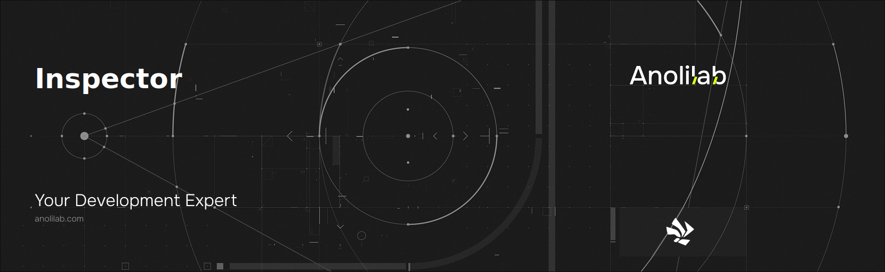

<!-- START_PACKAGE_OG_IMAGE_PLACEHOLDER -->

<a href="https://www.anolilab.com/open-source" align="center">

  

</a>

<h3 align="center">Inspect utility for Node.js and Browsers.</h3>

<!-- END_PACKAGE_OG_IMAGE_PLACEHOLDER -->

<br />

<div align="center">

[![typescript-image][typescript-badge]][typescript-url]
[![mit licence][license-badge]][license]
[![npm downloads][npm-downloads-badge]][npm-downloads]
[![Chat][chat-badge]][chat]
[![PRs Welcome][prs-welcome-badge]][prs-welcome]

</div>

---

<div align="center">
    <p>
        <sup>
            Daniel Bannert's open source work is supported by the community on <a href="https://github.com/sponsors/prisis">GitHub Sponsors</a>
        </sup>
    </p>
</div>

---

## Install

```sh
npm install @visulima/inspector
```

```sh
yarn add @visulima/inspector
```

```sh
pnpm add @visulima/inspector
```

## Usage

```typescript
import { inspect } from "@visulima/inspector";

console.log(inspect({ foo: "bar" })); // { foo: 'bar' }
```

### Circular

```typescript
import { inspect } from "@visulima/inspector";

const obj = { a: 1, b: [3, 4] };
obj.c = obj;

console.log(inspect(obj)); // { a: 1, b: [ 3, 4 ], c: [Circular] }
```

## API

### inspect(input: any, options?: InspectOptions): string

#### input

Type: `any`

The input value to inspect.

#### options

Type: `InspectOptions`

The options for the inspect function.

#### options.breakLength

Type: `number`

Default: `Number.POSITIVE_INFINITY`

#### options.customInspect

Type: `boolean`

Default: `true`

#### options.depth

Type: `number`

Default: `5`

The maximum depth to traverse.

#### options.indent

Type: `number | "\t" | undefined`

Default: `undefined`

The indentation to use.

## Related

- [object-inspect](https://github.com/inspect-js/object-inspect) - string representations of objects in node and the browser
- [loupe](https://github.com/chaijs/loupe) - Inspect utility for Node.js and browsers
- [util.inspect](https://nodejs.org/api/util.html#util_util_inspect_object_options)

## Supported Node.js Versions

Libraries in this ecosystem make the best effort to track [Node.js’ release schedule](https://github.com/nodejs/release#release-schedule).
Here’s [a post on why we think this is important](https://medium.com/the-node-js-collection/maintainers-should-consider-following-node-js-release-schedule-ab08ed4de71a).

## Contributing

If you would like to help take a look at the [list of issues](https://github.com/visulima/visulima/issues) and check our [Contributing](.github/CONTRIBUTING.md) guidelines.

> **Note:** please note that this project is released with a Contributor Code of Conduct. By participating in this project you agree to abide by its terms.

## Credits

- [Daniel Bannert](https://github.com/prisis)
- [All Contributors](https://github.com/visulima/visulima/graphs/contributors)

## Made with ❤️ at Anolilab

This is an open source project and will always remain free to use. If you think it's cool, please star it 🌟. [Anolilab](https://www.anolilab.com/open-source) is a Development and AI Studio. Contact us at [hello@anolilab.com](mailto:hello@anolilab.com) if you need any help with these technologies or just want to say hi!

## License

The visulima inspector is open-sourced software licensed under the [MIT][license]

<!-- badges -->

[license-badge]: https://img.shields.io/npm/l/@visulima/inspector?style=for-the-badge

[license]: https://github.com/visulima/visulima/blob/main/LICENSE

[npm-downloads-badge]: https://img.shields.io/npm/dm/@visulima/inspector?style=for-the-badge

[npm-downloads]: https://www.npmjs.com/package/@visulima/inspector

[prs-welcome-badge]: https://img.shields.io/badge/PRs-welcome-brightgreen.svg?style=for-the-badge

[prs-welcome]: https://github.com/visulima/visulima/blob/main/.github/CONTRIBUTING.md

[chat-badge]: https://img.shields.io/discord/932323359193186354.svg?style=for-the-badge

[chat]: https://discord.gg/TtFJY8xkFK

[typescript-badge]: https://img.shields.io/badge/Typescript-294E80.svg?style=for-the-badge&logo=typescript

[typescript-url]: https://www.typescriptlang.org/