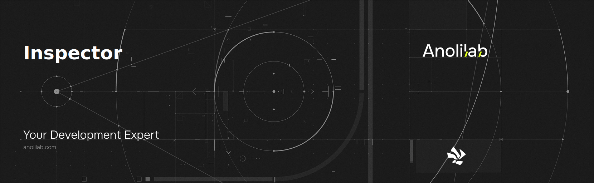

<!-- START_PACKAGE_OG_IMAGE_PLACEHOLDER -->

<a href="https://www.anolilab.com/open-source" align="center">

  

</a>

<h3 align="center">Inspect utility for Node.js and Browsers.</h3>

<!-- END_PACKAGE_OG_IMAGE_PLACEHOLDER -->

<br />

<div align="center">

[![typescript-image][typescript-badge]][typescript-url]
[![mit licence][license-badge]][license]
[![npm downloads][npm-downloads-badge]][npm-downloads]
[![Chat][chat-badge]][chat]
[![PRs Welcome][prs-welcome-badge]][prs-welcome]

</div>

---

<div align="center">
    <p>
        <sup>
            Daniel Bannert's open source work is supported by the community on <a href="https://github.com/sponsors/prisis">GitHub Sponsors</a>
        </sup>
    </p>
</div>

---

## Install

```sh
npm install @visulima/inspector
```

```sh
yarn add @visulima/inspector
```

```sh
pnpm add @visulima/inspector
```

## Usage

```typescript
import { inspect } from "@visulima/inspector";

console.log(inspect({ foo: "bar" })); // { foo: 'bar' }
```

### Circular

```typescript
import { inspect } from "@visulima/inspector";

const obj = { a: 1, b: [3, 4] };
obj.c = obj;

console.log(inspect(obj)); // { a: 1, b: [ 3, 4 ], c: [Circular] }
```

## API

### inspect(input: unknown, options?: Partial<Options>): string

Returns a human-readable string representation of `input`.

#### input

Type: `unknown`

The input value to inspect.

#### options

Type: `Partial<Options>`

All options are optional; the documented defaults are used for any you omit.

| Option             | Type                                          | Default              | Description                                                                                                                            |
| ------------------ | --------------------------------------------- | -------------------- | ------------------------------------------------------------------------------------------------------------------------------------- |
| `depth`            | `number`                                      | `5`                  | Maximum nesting depth before a value collapses to `[Object]` / `[Array]`. `<= 0` disables the limit.                                  |
| `indent`           | `number \| "\t" \| undefined`                 | `undefined`          | Pretty-print indentation: `"\t"` for tabs, a positive integer for that many spaces, `undefined` for single-line output.               |
| `truncate`         | `number`                                      | `Infinity`           | Maximum length (characters) of a rendered value before it is truncated with an ellipsis.                                              |
| `maxArrayLength`   | `number`                                      | `Infinity`           | Maximum number of array / typed-array elements to render before the remainder is replaced with `… N more`.                            |
| `quoteStyle`       | `"single" \| "double"`                        | `"single"`           | Quote character used for strings and complex object keys.                                                                             |
| `numericSeparator` | `boolean`                                      | `true`               | Render large numbers / bigints with `_` digit-group separators (e.g. `1_000_000`).                                                    |
| `showHidden`       | `boolean`                                      | `false`              | Also render non-enumerable own properties of plain objects.                                                                           |
| `customInspect`    | `boolean`                                      | `true`               | Honour custom inspectors (see [Custom inspectors](#custom-inspectors)).                                                               |
| `stylize`          | `(value: string, styleType: string) => string`| identity             | Colourize / decorate rendered fragments (e.g. wire up `@visulima/colorize`).                                                          |

```typescript
import { inspect } from "@visulima/inspector";

inspect([1, 2, 3, 4, 5, 6], { maxArrayLength: 2 }); // [ 1, 2, … 4 more ]
inspect({ a: 1, b: { c: 2 } }, { indent: 2 });
```

### Custom inspectors

When `customInspect` is `true` (the default), `inspect` will defer to a value's own
inspector in this order:

1. `value[Symbol.for("chai/inspect")](options)` — also exposed as the `custom` symbol export.
2. `value[Symbol.for("nodejs.util.inspect.custom")](depth, options)` — Node only.
3. `value.inspect(depth, options)`.

You can also register inspectors for whole classes or `Symbol.toStringTag` values at
runtime:

#### custom

Type: `symbol`

The `Symbol.for("chai/inspect")` symbol. Attach a function under this key to control
how an instance is rendered:

```typescript
import { custom, inspect } from "@visulima/inspector";

const value = { [custom]: () => "<redacted>" };

inspect(value); // <redacted>
```

#### registerConstructor(constructor: Function, inspector: (value, options) => string): boolean

Registers an inspector keyed by constructor function. Returns `false` if one is
already registered for that constructor.

```typescript
import { inspect, registerConstructor } from "@visulima/inspector";

class Money {
    constructor(public amount: number) {}
}

registerConstructor(Money, (value) => `$${(value as Money).amount}`);

inspect(new Money(42)); // $42
```

#### registerStringTag(stringTag: string, inspector: (value, options) => string): boolean

Registers an inspector keyed by a value's `Symbol.toStringTag`. Returns `false` if
one is already registered for that tag.

```typescript
import { inspect, registerStringTag } from "@visulima/inspector";

registerStringTag("Temperature", () => "registered-tag");

inspect({ [Symbol.toStringTag]: "Temperature" }); // registered-tag
```

## Related

- [object-inspect](https://github.com/inspect-js/object-inspect) - string representations of objects in node and the browser
- [loupe](https://github.com/chaijs/loupe) - Inspect utility for Node.js and browsers
- [util.inspect](https://nodejs.org/api/util.html#util_util_inspect_object_options)

## Supported Node.js Versions

Libraries in this ecosystem make the best effort to track [Node.js’ release schedule](https://github.com/nodejs/release#release-schedule).
Here’s [a post on why we think this is important](https://medium.com/the-node-js-collection/maintainers-should-consider-following-node-js-release-schedule-ab08ed4de71a).

## Contributing

If you would like to help take a look at the [list of issues](https://github.com/visulima/visulima/issues) and check our [Contributing](.github/CONTRIBUTING.md) guidelines.

> **Note:** please note that this project is released with a Contributor Code of Conduct. By participating in this project you agree to abide by its terms.

## Credits

- [Daniel Bannert](https://github.com/prisis)
- [All Contributors](https://github.com/visulima/visulima/graphs/contributors)

## Made with ❤️ at Anolilab

This is an open source project and will always remain free to use. If you think it's cool, please star it 🌟. [Anolilab](https://www.anolilab.com/open-source) is a Development and AI Studio. Contact us at [hello@anolilab.com](mailto:hello@anolilab.com) if you need any help with these technologies or just want to say hi!

## License

The visulima inspector is open-sourced software licensed under the [MIT][license]

<!-- badges -->

[license-badge]: https://img.shields.io/npm/l/@visulima/inspector?style=for-the-badge

[license]: https://github.com/visulima/visulima/blob/main/LICENSE

[npm-downloads-badge]: https://img.shields.io/npm/dm/@visulima/inspector?style=for-the-badge

[npm-downloads]: https://www.npmjs.com/package/@visulima/inspector

[prs-welcome-badge]: https://img.shields.io/badge/PRs-welcome-brightgreen.svg?style=for-the-badge

[prs-welcome]: https://github.com/visulima/visulima/blob/main/.github/CONTRIBUTING.md

[chat-badge]: https://img.shields.io/discord/932323359193186354.svg?style=for-the-badge

[chat]: https://discord.gg/TtFJY8xkFK

[typescript-badge]: https://img.shields.io/badge/Typescript-294E80.svg?style=for-the-badge&logo=typescript

[typescript-url]: https://www.typescriptlang.org/