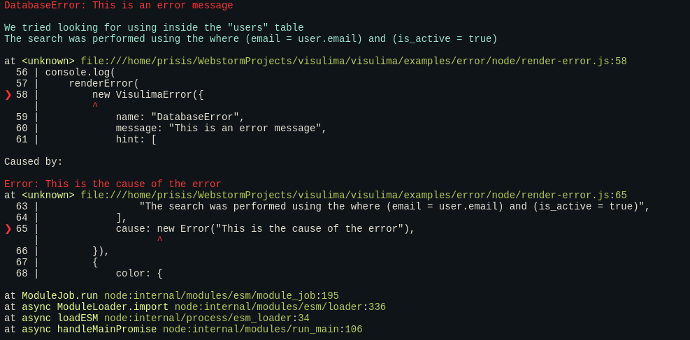

<div align="center">
  <h3>Visulima error</h3>
  <p>
  Error with more than just a message, stacktrace parsing and sourcemap loading.
  </p>
</div>

<br />

<div align="center">

[![typescript-image]][typescript-url] [![npm-image]][npm-url] [![license-image]][license-url]

</div>

---

<div align="center">
    <p>
        <sup>
            Daniel Bannert's open source work is supported by the community on <a href="https://github.com/sponsors/prisis">GitHub Sponsors</a>
        </sup>
    </p>
</div>

---

## Install

```sh
npm install @visulima/error
```

```sh
yarn add @visulima/error
```

```sh
pnpm add @visulima/error
```

## Usage

### Extend the VisulimaError

```ts
import { VisulimaError } from "@visulima/error";

class MyError extends VisulimaError {
    constructor(message: string) {
        super({
            name: "MyError",
            message,
        });
    }
}

throw new MyError("My error message");

// or

const error = new MyError("My error message");

error.hint = "My error hint";

throw error;
```

### Get all causes in a error

```ts
import { getErrorCauses } from "@visulima/error";

const error = new Error("My error message");
const error2 = new Error("Nested Error");

error.cause = error2;

// The getErrorCauses function will return an array of all causes in the error in the order they occurred.
const causes = getErrorCauses(error);

console.log(causes);

// [
//     {
//         message: "My error message",
//         name: "Error",
//         stack: "Error: My error message\n    at Object.<anonymous> (/visulima/packages/error/src/index.ts:2:16)",
//     },
//     {
//         message: "Nested Error",
//         name: "Error",
//         stack: "Error: Nested Error\n    at Object.<anonymous> (/visulima/packages/error/src/index.ts:3:16)",
//     },
// ];
```

## Pretty Code Frame

Display a pretty code frame with the error location.

> Note: Tabs can be used in the source code, codeFrame transforms them to spaces based on the tabWidth option.
> The default tabWidth is 4, to disable the transformation, set tabWidth to false.

```ts
import { codeFrame } from "@visulima/error";

const source = "const x = 10;\nconst error = x.y;\n";
const loc = { column: 16, line: 2 };

const frame = codeFrame(source, { start: loc });

console.log(frame);
//   1 | const x = 10;
// > 2 | const error = x.y;
//     |                ^
```

### API

#### source

Type: `string`

The source code to frame.

#### location

Type: `object`

The location of the error.

##### location.start

Type: `object`

The location of the start of the frame.

##### location.start.line

Type: `number`

The line number of the error.

##### location.start.column

Type: `number`

The column number of the error.

##### location.end

Type: `object`

The location of the end of the frame.

##### location.end.line

Type: `number`

The line number of the error.

##### location.end.column

Type: `number`

The column number of the error.

#### options

Type: `object`

##### options.linesAbove

Type: `number`

Default: `2`

The number of lines to show above the error.

##### options.linesBelow

Type: `number`

Default: `3`

The number of lines to show below the error.

##### options.tabWidth

Type: `number` | `false`

Default: `4`

## Stacktrace

> Browser older than 6 years are not supported.

Currently supported browsers/platforms:

- Firefox
- Chrome
- Webkit / Safari
- Edge
- Node / Node V8
- Opera (Chromium based)

```ts
import { parseStacktrace } from "@visulima/error";

const error = new Error("My error message");

const stack = parseStacktrace(error);

console.log(stack);

// [
//     {
//         column: 16,
//         file: "file:///Users/danielbannert/Projects/visulima/packages/error/src/index.ts",
//         line: 2,
//         methodName: "Object.<anonymous>",
//         raw: "    at Object.<anonymous> (/visulima/packages/error/src/index.ts:2:16)",
//         type: undefined, // optional property, can be undefined, "eval", "native", or "internal"
//         evalOrigin: undefined, // optional property only available if the stacktrace contains eval
//     },
//     ...and so on
// ];
```

### API

#### error

Type: `Error`

The error to parse.

#### options

Type: `object`

##### options.filter

Type: `Function`

A function to filter the stack frames.

##### options.frameLimit

Type: `number`

The maximum number of frames to parse.

## `serialize` an error object

- Ensures errors are safe to serialize with JSON
- Can be used as error.toJSON()
- Deep serialization, including transforming
- Custom serialization (e.g. YAML or process.send())
- Keeps both native (TypeError, etc.) and custom error classes
- Preserves errors' additional properties
- Can keep constructor's arguments
- Works recursively with error.cause and AggregateError
- Buffer properties are replaced with [object Buffer]
- Circular references are handled.
- If the input object has a .toJSON() method, then it's called instead of serializing the object's properties.
- It's up to .toJSON() implementation to handle circular references and enumerability of the properties.

```ts
import { serializeError } from "@visulima/error";

const error = new TypeError("example");
const errorObject = serializeError(error);
// Plain object: { name: 'TypeError', message: 'example', stack: '...' }

const errorString = JSON.stringify(errorObject);
const newErrorObject = JSON.parse(errorString);
```

## renderError - pretty print an error

```ts
import { renderError } from "@visulima/error";

const error = new Error("This is an error message");

console.log(renderError(error));

// Error: This is an error message
//
// at <unknown> file:///home/visulima/visulima/examples/error/node/render-error.js:5
//   1 | import { renderError } from "@visulima/error";
//   2 |
//   3 | const error = new Error("This is an error message");
//   4 |
// ❯ 5 | console.log(renderError(new Error("This is an error message")));
//     |                         ^
//   6 |
//
// at ModuleJob.run node:internal/modules/esm/module_job:195
// at async ModuleLoader.import node:internal/modules/esm/loader:336
// at async loadESM node:internal/process/esm_loader:34
// at async handleMainPromise node:internal/modules/run_main:106
```

#### colorized output

Use the `@visulima/colorize`, `chalk` or some other package to colorize the output.



### API

#### error

Type: `AggregateError | Error | VisulimaError` \
The error to render.

#### options

Type: `object`

##### options.color

Type: `object` \
The color options.

##### options.cwd

Type: `string`

The current working directory.

##### options.displayShortPath

Type: `boolean` \
Default: `false`

Display the short path.

##### options.framesMaxLimit

Type: `number` \
Default: `Number.Infinity`

The maximum number of frames to display.

##### options.hideErrorCauseCodeView

Type: `boolean` \
Default: `false`

Hide the error cause code view.

##### options.hideErrorCodeView

Type: `boolean` \
Default: `false`

Hide the error code view.

##### options.hideErrorTitle

Type: `boolean` \
Default: `false`

Hide the error title.

##### options.hideMessage

Type: `boolean` \
Default: `false`

Hide the error message.

### captureRawStackTrace

Capture a raw stack trace.

```ts
import { captureRawStackTrace } from "@visulima/error";

const stack = captureRawStackTrace();

console.log(stack);
```

## Supported Node.js Versions

Libraries in this ecosystem make the best effort to track [Node.js’ release schedule](https://github.com/nodejs/release#release-schedule).
Here’s [a post on why we think this is important](https://medium.com/the-node-js-collection/maintainers-should-consider-following-node-js-release-schedule-ab08ed4de71a).

## Contributing

If you would like to help take a look at the [list of issues](https://github.com/visulima/visulima/issues) and check our [Contributing](.github/CONTRIBUTING.md) guild.

> **Note:** please note that this project is released with a Contributor Code of Conduct. By participating in this project you agree to abide by its terms.

## Credits

- [Daniel Bannert](https://github.com/prisis)
- [All Contributors](https://github.com/visulima/visulima/graphs/contributors)

## About

### Related Projects

- [baseerr](https://github.com/tjmehta/baseerr): merge another error with additional properties.
- [callsites](https://github.com/sindresorhus/callsites): get callsites from the V8 stack trace API.
- [explain-error](https://github.com/dominictarr/explain-error): wrap an error with additional explanation.
- [error-wrapper](https://github.com/spudly/error-wrapper): merges the stack of another error to its own.
- [errwischt/stacktrace-parser](https://github.com/errwischt/stacktrace-parser)
- [trace](https://github.com/AndreasMadsen/trace): create super long stack traces.
- [clarify](https://github.com/AndreasMadsen/clarify): remove node related stack trace noise.
- [piotr-szewczyk/stacktrace-parser-node](https://github.com/piotr-szewczyk/stacktrace-parser-node)
- [pretty-error](https://github.com/AriaMinaei/pretty-error): make the call stacks clear.
- [node-pretty-exceptions](https://github.com/ahmadnassri/node-pretty-exceptions) - Pretty and more helpful uncaught exceptions, automatically
- [youch-terminal](https://github.com/poppinss/youch-terminal/tree/develop) - Display youch error message on terminal
- [ono](https://github.com/bigstickcarpet/ono): allow different types of error to be thrown.
- [stacktracejs/error-stack-parser](https://github.com/stacktracejs/error-stack-parser)
- [marvinhagemeister/errorstacks](https://github.com/marvinhagemeister/errorstacks) Tiny library to parse error stack traces
- [getsentry/sentry-javascript](https://github.com/getsentry/sentry-javascript)
- [serialize-error](https://github.com/sindresorhus/serialize-error) - Serialize/deserialize an error into a plain object
- [baseerr](https://github.com/tjmehta/baseerr): merge another error with additional properties.
- [callsite-record](https://github.com/inikulin/callsite-record) - Create fancy log entries for errors and function call sites

## License

The visulima error is open-sourced software licensed under the [MIT][license-url]

[typescript-image]: https://img.shields.io/badge/Typescript-294E80.svg?style=for-the-badge&logo=typescript

[typescript-url]: https://www.typescriptlang.org/ "TypeScript" "typescript"
[license-image]: https://img.shields.io/npm/l/@visulima/error?color=blueviolet&style=for-the-badge
[license-url]: LICENSE.md "license"
[npm-image]: https://img.shields.io/npm/v/@visulima/error/latest.svg?style=for-the-badge&logo=npm
[npm-url]: https://www.npmjs.com/package/@visulima/error/v/latest "npm"
