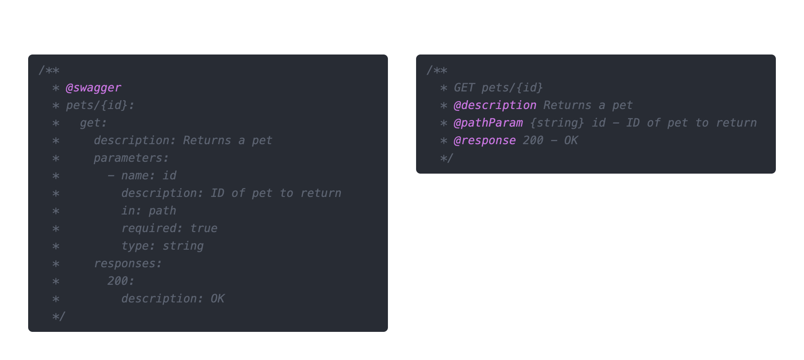

<div align="center">
  <h3>Visulima jsdoc-open-api</h3>
  <p>
    Generate OpenAPI (Swagger) specifications automatically from your JSDoc comments.
    <br />
    This package parses your existing code comments to create comprehensive API documentation, saving you time and effort.
    <br />
    It is designed for speed and minimal runtime overhead, building upon the foundations of JSDoc and Swagger standards.
  </p>
  <p>
    <small>
      <i>Note: This package originated as a fork of <a href="https://github.com/bee-travels/openapi-comment-parser" target="_blank" rel="noopener noreferrer">openapi-comment-parser</a> and <a href="https://github.com/Surnet/swagger-jsdoc" target="_blank" rel="noopener noreferrer">swagger-jsdoc</a>.</i>
    </small>
  </p>
</div>

<br />

<div align="center">

[![typescript-image]][typescript-url] [![npm-image]][npm-url] [![license-image]][license-url]

</div>

---

<div align="center">
    <p>
        <sup>
            Daniel Bannert's open source work is supported by the community on <a href="https://github.com/sponsors/prisis">GitHub Sponsors</a>
        </sup>
    </p>
</div>

---

## Features

-   **Automatic Generation:** Creates OpenAPI specs from JSDoc comments.
-   **Multiple Syntaxes:** Supports standard OpenAPI YAML/JSON within comments and a concise short syntax.
-   **CLI Tool:** Provides a command-line interface for easy generation.
-   **Programmatic API:** Offers a JavaScript API for integration into build processes.
-   **Framework Integration:** Includes helpers like a Webpack plugin (useful for Next.js).
-   **Performance:** Focused on speed and low overhead.

## Installation

```sh
npm install @visulima/jsdoc-open-api
```

```sh
yarn add @visulima/jsdoc-open-api
```

```sh
pnpm add @visulima/jsdoc-open-api
```

## Usage Overview

You can use `@visulima/jsdoc-open-api` in several ways:

1.  **Via Command Line (CLI):** Quick generation for simple use cases or manual runs.
2.  **Programmatically:** Integrate generation into your custom scripts or build tools.
3.  **With Webpack (e.g., Next.js):** Automate generation during your build process.

Choose the syntax you prefer for defining OpenAPI details within your JSDoc comments:



---

## Usage with CLI

The Command Line Interface (CLI) provides a straightforward way to generate your OpenAPI specification.

### Optional Dependencies

The CLI relies on `commander` and `cli-progress`. These are listed as `optionalDependencies`. Depending on your package manager (npm/yarn/pnpm) and configuration, you *might* need to install them manually if they weren't installed automatically:

```sh
# If needed:
npm install commander cli-progress
# or
yarn add commander cli-progress
# or
pnpm add commander cli-progress
```

### Commands

#### `init`

Initializes the project by creating a `.openapirc.js` configuration file. This is typically run once per project.

```bash
jsdoc-open-api init
```

#### `generate`

Parses your source files based on the configuration (or command-line arguments) and generates the OpenAPI specification file.

```bash
# Generate using defaults defined in .openapirc.js (if it exists)
jsdoc-open-api generate

# Specify input path(s) directly
jsdoc-open-api generate src/routes/**/*.js src/controllers/

# Specify output file
jsdoc-open-api generate -o ./public/swagger.json src/

# Use verbose output
jsdoc-open-api generate -v src/

# Use very verbose output for debugging
jsdoc-open-api generate -d src/
```

### `generate` Command Options:

```bash
jsdoc-open-api generate [options] [path ...]
```

-   `[path ...]` : Paths to files or directories to parse (optional, uses configuration if not provided).
-   `-c, --config [.openapirc.js]` : Specify the configuration file path. Defaults to `.openapirc.js`.
-   `-o, --output [swaggerSpec.json]` : Specify the output file for the OpenAPI specification. Defaults to `swaggerSpec.json`.
-   `-v, --verbose` : Enable verbose output during generation.
-   `-d, --very-verbose` : Enable *very* verbose output for detailed debugging.

---

## Programmatic Usage

You can integrate the generation process directly into your Node.js scripts.

```javascript
import path from 'node:path';
import { fileURLToPath } from 'node:url';
import jsdocOpenApi from '@visulima/jsdoc-open-api'; // Adjust import based on your module system (require vs import)

const __filename = fileURLToPath(import.meta.url);
const __dirname = path.dirname(__filename);

const options = {
  definition: {
    openapi: '3.0.0',
    info: {
      title: 'My Programmatic API',
      version: '1.0.0',
      description: 'API documentation generated programmatically',
    },
    // Add other base OpenAPI definition properties here
  },
  // Glob patterns pointing to your source files with JSDoc comments
  sources: [path.join(__dirname, 'src/routes/**/*.js')],
  // Optional: Specify output path (defaults to 'swaggerSpec.json' in current dir)
  // output: path.join(__dirname, 'public/api-docs.json'),
  // Optional: Enable verbose logging
  // verbose: true,
};

async function generateDocs() {
  try {
    const specification = await jsdocOpenApi(options);
    console.log('OpenAPI specification generated successfully:');
    // The specification object is returned, and also written to the output file if specified.
    // console.log(JSON.stringify(specification, null, 2));
  } catch (error) {
    console.error('Error generating OpenAPI specification:', error);
  }
}

generateDocs();

```

---

## Usage with Next.js (via Webpack Plugin)

The package includes a Webpack plugin for seamless integration with frameworks like Next.js.

### `with-open-api.js` Helper

Create a helper file (e.g., `with-open-api.js`) in your project root:

```js
const path = require("node:path");
const fs = require("node:fs");
// Adjust the import path based on your project structure if needed
const { SwaggerCompilerPlugin } = require("@visulima/jsdoc-open-api");

/**
 * @param {object} options
 * @param {import('@visulima/jsdoc-open-api').SwaggerDefinition} options.definition - Base OpenAPI definition.
 * @param {string[]} options.sources - Glob patterns for source files relative to project root.
 * @param {boolean} [options.verbose=false] - Enable verbose logging.
 * @param {string} [options.output='swagger/swagger.json'] - Output path relative to project root.
 *
 * @returns {function(import('next').NextConfig): import('next').NextConfig & {webpack: function(import('webpack').Configuration, object): import('webpack').Configuration}}
 */
const withOpenApi =
    ({ definition, sources, verbose, output = "swagger/swagger.json" }) =>
    (nextConfig = {}) => {
        return {
            ...nextConfig,
            webpack: (config, options) => {
                // Run generation only on the server build in Next.js
                if (!options.isServer) {
                    return config;
                }

                let outputPath = output;
                if (outputPath.startsWith("/")) {
                    outputPath = outputPath.slice(1);
                }

                if (!outputPath.endsWith(".json")) {
                    // Consider allowing YAML output as well?
                    throw new Error("The output path must end with .json");
                }

                const absoluteOutputPath = path.join(options.dir, outputPath);
                const absoluteSourcePaths = sources.map((source) => path.join(options.dir, source.replace(/^\.\//, ""))); // Normalize paths

                // Add the SwaggerCompilerPlugin to webpack plugins
                config.plugins = config.plugins || [];
                config.plugins.push(
                    new SwaggerCompilerPlugin(
                        absoluteOutputPath,
                        absoluteSourcePaths,
                        definition,
                        { verbose },
                    ),
                );

                // Call the original webpack config function if it exists
                if (typeof nextConfig.webpack === "function") {
                    return nextConfig.webpack(config, options);
                }

                return config;
            },
        };
    };

module.exports = withOpenApi;
```

### `next.config.js`

Wrap your Next.js configuration with the helper:

```js
const withOpenApi = require("./with-open-api"); // Adjust path if necessary

/** @type {import('next').NextConfig} */
const nextConfig = {
    reactStrictMode: true,
    swcMinify: true,
    env: {
        NEXT_PUBLIC_APP_ORIGIN: process.env.VERCEL_URL || "http://localhost:3000", // Default to 3000?
    },
    // ... other Next.js config
};

module.exports = withOpenApi({
    definition: {
        openapi: "3.0.0",
        info: {
            title: "My Next.js API",
            version: "1.0.0",
        },
        // servers: [{ url: '/api' }], // Optional: Define servers
    },
    // Paths relative to your project root
    sources: ["pages/api/**/*.js", "src/controllers/**/*.js"],
    output: "public/swagger.json", // Output to the public folder
    verbose: false,
})(nextConfig);
```

Now, the OpenAPI specification (`public/swagger.json`) will be generated automatically during your Next.js build.

---

## Configuration (`.openapirc.js`)

When using the CLI `generate` command without specifying paths or using the `init` command, `@visulima/jsdoc-open-api` looks for a `.openapirc.js` file in your project root. This file should export an options object similar to the one used in Programmatic Usage:

```javascript
// .openapirc.js
module.exports = {
  definition: {
    openapi: '3.0.0',
    info: {
      title: 'API from Config',
      version: '2.0.0',
    },
    // ... other base definition properties
  },
  // Array of glob patterns for your source files
  sources: ['src/**/*.js', 'routes/**/*.js'],
  output: 'docs/swagger.json', // Default output file path
  verbose: false, // Default verbosity
};
```

---

## Defining OpenAPI Specs in JSDoc

You have two main ways to define your API specifications within JSDoc comments:

### 1. Standard OpenAPI (YAML/JSON) Syntax

Embed standard OpenAPI 3.0 YAML or JSON directly within `@openapi` or `@swagger` blocks. The library extracts and merges these definitions.

```javascript
/**
 * @openapi
 * components:
 *   schemas:
 *     User:
 *       type: object
 *       properties:
 *         id:
 *           type: integer
 *           format: int64
 *           example: 10
 *         username:
 *           type: string
 *           example: 'theUser'
 *         firstName:
 *           type: string
 *           example: 'John'
 *         lastName:
 *           type: string
 *           example: 'Doe'
 *       required:
 *         - id
 *         - username
 */

/**
 * @openapi
 * /users/{userId}:
 *   get:
 *     summary: Get user by ID
 *     description: Retrieve detailed information about a specific user.
 *     tags:
 *       - Users
 *     parameters:
 *       - name: userId
 *         in: path
 *         required: true
 *         description: ID of the user to retrieve.
 *         schema:
 *           type: integer
 *           format: int64
 *     responses:
 *       '200':
 *         description: Successful response with user data.
 *         content:
 *           application/json:
 *             schema:
 *               $ref: '#/components/schemas/User' # Reference the schema defined above
 *       '404':
 *         description: User not found.
 */
function getUserById(userId) {
  // Implementation...
}
```

### 2. OpenApi Short Syntax

Use custom JSDoc tags for a more concise way to define paths, operations, parameters, and responses.

#### Basic Structure

Define the HTTP method and path, followed by tags like `@summary`, `@description`, `@response`, etc.

```javascript
/**
 * GET /users
 * @summary Returns a list of users.
 * @description Optional extended description in CommonMark or HTML.
 * @tags Users
 * @response 200 - A JSON array of user names
 * @responseContent {string[]} 200.application/json
 */
 function listUsers() {
  // Implementation...
 }
```

#### Parameters

Use `@pathParam`, `@queryParam`, `@headerParam`, `@cookieParam` to define parameters.

```javascript
/**
 * GET /users/{userId}
 * @summary Returns a user by ID.
 * @tags Users
 * @pathParam {integer | int64} userId - The ID of the user to retrieve. {required}
 * @queryParam {string} [role] - Filter users by role (optional). Possible values: 'admin', 'member'.
 * @response 200 - OK
 * @responseContent {User} 200.application/json - A user object (assuming 'User' schema is defined elsewhere).
 */
 function getUser(userId, role) {
  // Implementation...
 }
```

#### Request Body

Use `@bodyContent` to describe the request body and `@bodyRequired` if it's mandatory.

```javascript
/**
 * POST /users
 * @summary Creates a new user.
 * @tags Users
 * @bodyContent {User} application/json - User object to create.
 * @bodyRequired
 * @response 201 - User created successfully.
 * @responseContent {User} 201.application/json - The created user object.
 */
 function createUser(userData) {
  // Implementation...
 }
```

#### Responses

Define responses using `@response` for the status code and description, and `@responseContent` for the body schema.

```javascript
/**
 * GET /products/{productId}
 * @summary Get product details.
 * @tags Products
 * @pathParam {string} productId - ID of the product.
 * @response 200 - Product details.
 * @responseContent {ProductSchema} 200.application/json
 * @response 404 - Product not found.
 * @response default - Unexpected error.
 */
 function getProduct(productId) {
  // Implementation...
 }
```

#### Input and Output Models (Schema References)

Reference schemas defined globally (usually using the standard `@openapi` syntax in a central file or comment block) within your short syntax using type definitions like `{User}` or `{ProductSchema}`.

```javascript
// Assuming 'User' schema is defined in components/schemas

/**
 * PUT /users/{userId}
 * @summary Update an existing user.
 * @tags Users
 * @pathParam {integer} userId - ID of the user to update.
 * @bodyContent {User} application/json - Updated user data.
 * @bodyRequired
 * @response 200 - User updated successfully.
 * @responseContent {User} 200.application/json
 * @response 404 - User not found.
 */
 function updateUser(userId, userData) {
  // Implementation...
 }
```

#### Authentication

Reference `securitySchemes` defined globally (using standard `@openapi` syntax) with the `@security` tag.

```javascript
// Assuming 'BasicAuth' is defined in components/securitySchemes

/**
 * GET /admin/settings
 * @summary Get administrative settings (requires auth).
 * @tags Admin
 * @security BasicAuth
 * @response 200 - Admin settings object.
 */
 function getAdminSettings() {
  // Implementation...
 }
```

For detailed information on the short syntax tags and possibilities, please refer to the documentation (link to be added if available).
<!-- Add link to short syntax docs here if they exist -->

---

## Contributing

Contributions are welcome! Please refer to the [Contribution Guidelines](../../../.github/CONTRIBUTING.md) for details on how to submit pull requests, report issues, and suggest improvements.

---

## License

This project is licensed under the **MIT License**. See the [LICENSE.md](LICENSE.md) file for details.

---

[typescript-image]: https://img.shields.io/badge/Typescript-294E80.svg?style=for-the-badge&logo=typescript
[typescript-url]: https://www.typescriptlang.org/ "TypeScript"
[license-image]: https://img.shields.io/npm/l/@visulima/jsdoc-open-api?color=blueviolet&style=for-the-badge
[license-url]: LICENSE.md "license"
[npm-image]: https://img.shields.io/npm/v/@visulima/jsdoc-open-api/latest.svg?style=for-the-badge&logo=npm
[npm-url]: https://www.npmjs.com/package/@visulima/jsdoc-open-api/v/latest "npm"
