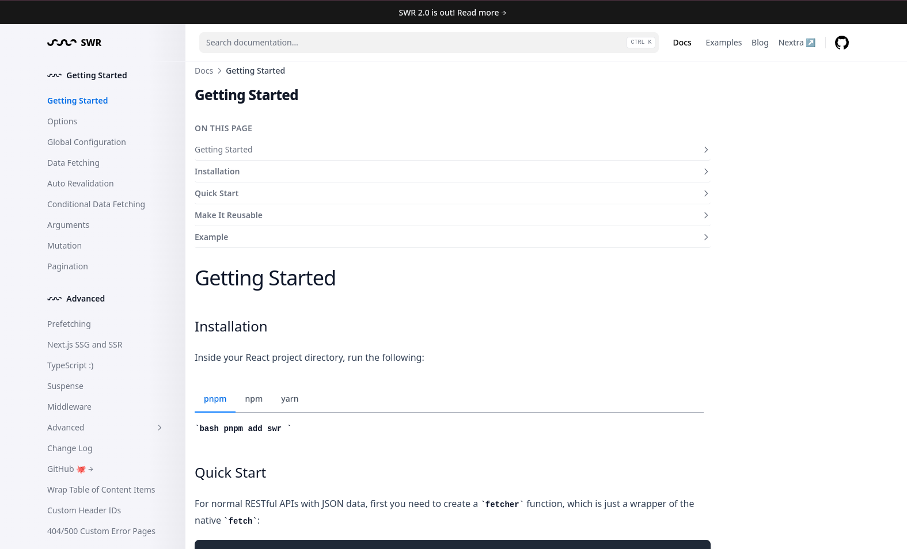

<div align="center">
  <h3>Visulima nextra-theme-docs</h3>
  <p>
  Nextra Docs Theme is a theme that includes almost everything you need to build a modern documentation website. It includes a top navigation bar, a search bar, a pages sidebar, a TOC sidebar, and other built-in components.

  <br/>
  Visulima nextra-theme-doc is built on top of

[Nextra](https://nextra.site/),
[Tailwind CSS](https://tailwindcss.com/),
[Next.js](https://nextjs.org/),
[giscus](https://giscus.app/),
[react-hot-toast](https://react-hot-toast.com/),

  </p>
</div>

<br />

<div align="center">

[![typescript-image]][typescript-url] [![npm-image]][npm-url] [![license-image]][license-url]

</div>

---

<div align="center">
    <p>
        <sup>
            Daniel Bannert's open source work is supported by the community on <a href="https://github.com/sponsors/prisis">GitHub Sponsors</a>
        </sup>
    </p>
</div>

---



## Install

If you have a Nextra project, you can install the theme with:

```sh
npm install @visulima/nextra-theme-docs zod
```

```sh
yarn add @visulima/nextra-theme-docs zod
```

```sh
pnpm add @visulima/nextra-theme-docs zod
```

if you don't have a Nextra project, you can use the [Next CLI](https://nextjs.org/docs/api-reference/create-next-app) to create one and install

```sh
npm install nextra @visulima/nextra-theme-docs zod
```

```sh
yarn add nextra @visulima/nextra-theme-docs zod
```

```sh
pnpm add nextra @visulima/nextra-theme-docs zod
```

## Add Next.js Config

If not there create the following `next.config.js` file in your project’s root directory:

```js
const withNextra = require("nextra")({
    theme: "@visulima/nextra-theme-docs",
    themeConfig: "./theme.config.jsx",
});

module.exports = withNextra();

// If you have other Next.js configurations, you can pass them as the parameter:
// module.exports = withNextra({ /* other next.js config */ })
```

## Add Css style to your `pages/_app.{jsx,tsx,mdx}` file

```ts
import "@visulima/nextra-theme-docs/style";

import type { AppProps } from "next/app";
import Head from "next/head";
import type { FC, ReactElement } from "react";
import React from "react";

const MyApp: FC<AppProps & { Component: AppProps["Component"] & { getLayout?: (component: ReactElement) => ReactElement } }> = ({ Component, pageProps }) => {
    const getLayout: (component: ReactElement) => ReactElement = Component.getLayout ?? ((page) => page);

    return (
        <>
            <Head>
                <link as="font" crossOrigin="anonymous" href="/Inter.var.woff2" rel="preload" type="font/woff2" />
            </Head>
            {/* eslint-disable-next-line react/jsx-props-no-spreading */}
            {getLayout(<Component {...pageProps} />)}
        </>
    );
};

export default MyApp;

```

## Add `SkipNavLink` component your `pages/_document.{jsx,tsx,mdx}` file

```ts
import { SkipNavLink } from "@visulima/nextra-theme-docs/components";
import Document, { Head, Html, Main, NextScript } from "next/document";
import type { ReactElement } from "react";
import React from "react";

class MyDocument extends Document {
    public render(): ReactElement {
        return (
            <Html lang="en">
                <Head />
                <body className="relative">
                    <SkipNavLink />
                    <Main />
                    <NextScript />
                </body>
            </Html>
        );
    }
}

export default MyDocument;

```

## Create Docs Theme Config

Lastly, create the corresponding theme.config.jsx file in your project’s root directory. This will be used to configure the Nextra Docs theme:

```jsx
export default {
    logo: <span>My Nextra Documentation</span>,
    project: {
        link: "https://github.com/shuding/nextra",
    },
    // ...
};
```

## Ready to Go!

Now, you can create your first MDX page as `pages/index.mdx`:

```mdx
## Welcome to Nextra

Hello, world!
```

For more information, check out the [Nextra documentation](https://nextra.site/docs).
You can also check the example project [here](https://github.com/visulima/visulima/tree/main/examples/nextra).

## Supported Node.js Versions

Libraries in this ecosystem make the best effort to track [Node.js’ release schedule](https://github.com/nodejs/release#release-schedule).
Here’s [a post on why we think this is important](https://medium.com/the-node-js-collection/maintainers-should-consider-following-node-js-release-schedule-ab08ed4de71a).

## Contributing

If you would like to help take a look at the [list of issues](https://github.com/visulima/visulima/issues) and check our [Contributing](.github/CONTRIBUTING.md) guild.

> **Note:** please note that this project is released with a Contributor Code of Conduct. By participating in this project you agree to abide by its terms.

## Credits

-   [Daniel Bannert](https://github.com/prisis)
-   [All Contributors](https://github.com/visulima/visulima/graphs/contributors)

## License

The visulima nextra-theme-docs is open-sourced software licensed under the [MIT][license-url]

[typescript-image]: https://img.shields.io/badge/Typescript-294E80.svg?style=for-the-badge&logo=typescript
[typescript-url]: "typescript"
[license-image]: https://img.shields.io/npm/l/@visulima/nextra-theme-docs?color=blueviolet&style=for-the-badge
[license-url]: LICENSE.md "license"
[npm-image]: https://img.shields.io/npm/v/@visulima/nextra-theme-docs/latest.svg?style=for-the-badge&logo=npm
[npm-url]: https://www.npmjs.com/package/@visulima/nextra-theme-docs/v/latest "npm"
