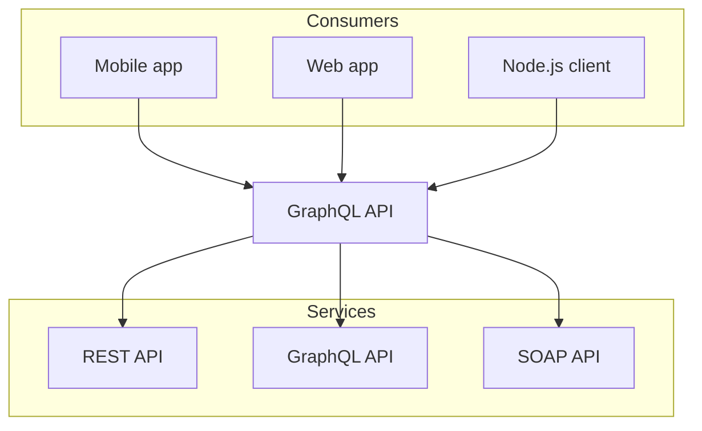

import { Callout } from "@visulima/nextra-theme-docs";

Best used for section headers.

```md
## Titles
```

### Subtitles

Best use to subsection headers.

```md
### Subtitles
```

<Callout>Each **title** and **subtitle** creates an anchor and also shows up on the table of contents on the right.</Callout>

## Text Formatting

We support most markdown formatting. Simply add `**`, `_`, or `~` around text to format it.

| Style         | How to write it   | Result          |
| ------------- | ----------------- | --------------- |
| Bold          | `**bold**`        | **bold**        |
| Italic        | `_italic_`        | _italic_        |
| Strikethrough | `~strikethrough~` | ~strikethrough~ |

You can combine these. For example, write `**_bold and italic_**` to get **_bold and italic_** text.

You need to use HTML to write superscript and subscript text. That is, add `<sup>` or `<sub>` around your text.

| Text Size   | How to write it          | Result                 |
| ----------- | ------------------------ | ---------------------- |
| Superscript | `<sup>superscript</sup>` | <sup>superscript</sup> |
| Subscript   | `<sub>subscript</sub>`   | <sub>subscript</sub>   |

## Linking to Pages

You can add a link by wrapping text in `[]()`. You would write `[link to google](https://google.com)` to [link to google](https://google.com).

Links to pages in your docs need to be root-relative. Basically, you should include the entire folder path. For example, `[link to text](/writing-content/text)` links to the page "Text" in our components section.

Relative links like `[link to text](../text)` will open slower because we cannot optimize them as easily.

## Blockquotes

### Singleline

To create a blockquote, add a `>` in front of a paragraph.

> Dorothy followed her through many of the beautiful rooms in her castle.

```md
> Dorothy followed her through many of the beautiful rooms in her castle.
```

### Multiline

> Dorothy followed her through many of the beautiful rooms in her castle.
>
> The Witch bade her clean the pots and kettles and sweep the floor and keep the fire fed with wood.

```md
> Dorothy followed her through many of the beautiful rooms in her castle.
>
> The Witch bade her clean the pots and kettles and sweep the floor and keep the fire fed with wood.
```

## LaTeX

Nextra supports [LaTeX](https://www.latex-project.org/), check the [Nextra docs](https://nextra.site/docs/guide/latex) for more information.

## Mermaid

Nextra supports [Mermaid](https://mermaid.js.org/) out of the box, check the [Nextra docs](https://nextra.site/docs/guide/mermaid) for more information.



## Npm2Yarn

Nextra uses
[`@theguild/remark-npm2yarn`](https://npmjs.com/package/@theguild/remark-npm2yarn)
package that replaces the code block that has `npm2yarn` metadata with
[`<Tabs />` and `<Tab />` components](/docs/guide/built-ins/tabs) from
`nextra/components`.

<Callout type="warning"> This is a custom plugin that is not supported by our theme.</Callout>

## Footnotes

Footnote. [^1]

[^1]: The footnote value.
