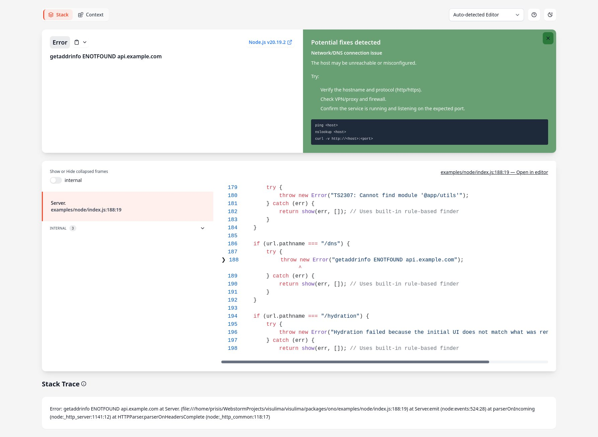
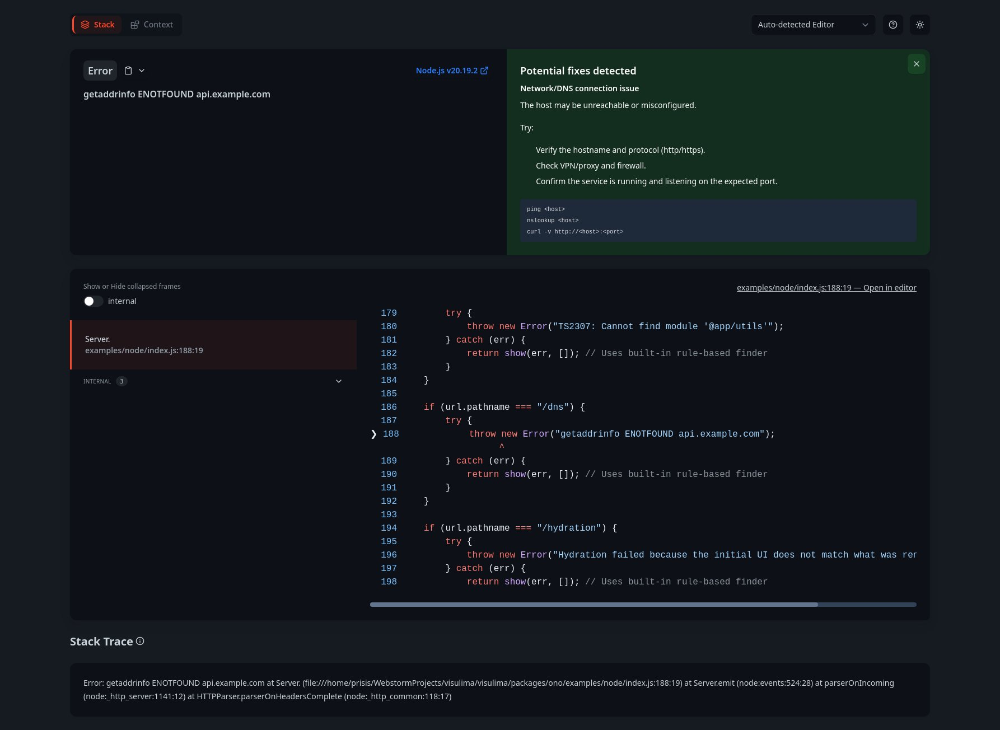

<div align="center">
  <h3>Visulima ono (Oh No!)</h3>
  <p>
  A modern, delightful error overlay and inspector for Node.js servers and dev tooling.
  </p>
</div>

<br />

<div align="center">

[![typescript-image]][typescript-url] [![npm-image]][npm-url] [![license-image]][license-url]

</div>

---

<div align="center">
    <p>
        <sup>
            Daniel Bannert's open source work is supported by the community on <a href="https://github.com/sponsors/prisis">GitHub Sponsors</a>
        </sup>
    </p>
</div>

---

| Light Mode                       | Dark Mode                      |
| -------------------------------- | ------------------------------ |
|  |  |

## Install

```sh
pnpm add @visulima/ono
```

```sh
npm i @visulima/ono
```

```sh
yarn add @visulima/ono
```

## Features

- Pretty, theme‑aware error page
    - Sticky header (shows error name/message while scrolling)
    - One‑click copy for error title (icon feedback)
- Stack trace viewer
    - Shiki‑powered syntax highlighting (singleton highlighter)
    - Tabs for frames; grouping for internal/node_modules/application frames
    - Tooltips and labels to guide usage
    - Optional "Open in editor" button per frame
- Error causes viewer (nested causes, each with its own viewer)
- Solutions panel
    - Default open; smooth expand/collapse without layout jump
    - Animated height/opacity; icon toggles open/close
    - Built-in rule-based Markdown hints for common issues (ESM/CJS interop, export mismatch, port in use, missing files/case, TS path mapping, DNS/connection, React hydration mismatch, undefined property access)
    - Custom solution finders support
- Raw stack trace panel
- Theme toggle (auto/dark/light) with persistence
- **Copy to Clipboard** - One-click copying for all data sections
- **Responsive Design** - Sticky sidebar navigation with smooth scrolling
- Consistent tooltips (one global script; components only output HTML)

**New in latest version:**

- **Tabbed Interface** - Switch between Stack and Context views
- **Request Context Panel** - Detailed HTTP request debugging information
    - cURL command with proper formatting and copy functionality
    - Headers, cookies, body, and session data
    - App routing, client info, Git status, and version details
    - Smart data sanitization and masking for sensitive information
    - **Flexible Context API** - Add any custom context data via `createRequestContextPage()`
- **Modern Ono Class API** - Simple, consistent interface for both HTML and ANSI rendering
- **Solution Finders** - Extensible system for custom error solutions

Accessibility and keyboard UX

- ARIA-correct tabs and panels for stack frames; improved labeling
- Focus trap within the overlay; restores focus on close
- Keyboard shortcuts help dialog (press Shift+/ or “?” button)
- Buttons/controls are keyboard-activatable (Enter/Space)

Editor integration

- Editor selector is always visible; selection persists (localStorage)
- Uses server endpoint when configured; otherwise opens via editor URL scheme (defaults to VS Code)

### Using the Ono class (recommended)

The new Ono class provides a simple, consistent API for both HTML and ANSI error rendering:

```ts
import { Ono } from "@visulima/ono";

const ono = new Ono();

// HTML error page
const html = await ono.toHTML(error, {
    cspNonce: "your-nonce",
    theme: "dark",
    solutionFinders: [
        /* custom finders */
    ],
});

// ANSI terminal output
const { errorAnsi, solutionBox } = await ono.toANSI(error, {
    solutionFinders: [
        /* custom finders */
    ],
});
```

### Node.js HTTP Server Example

```ts
import { createServer } from "node:http";
import { Ono } from "@visulima/ono";
import createRequestContextPage from "@visulima/ono/page/context";
import { createNodeHttpHandler } from "@visulima/ono/server/open-in-editor";

const ono = new Ono();
const openInEditorHandler = createNodeHttpHandler();

const server = createServer(async (request, response) => {
    const url = new URL(request.url || "/", `http://localhost:3000`);

    // Open-in-editor endpoint
    if (url.pathname === "/__open-in-editor") {
        return openInEditorHandler(request, response);
    }

    try {
        // Your app logic here
        throw new Error("Something went wrong!");
    } catch (error) {
        // Create context page with request information
        const contextPage = await createRequestContextPage(request, {
            context: {
                request: {
                    method: request.method,
                    url: request.url,
                    headers: request.headers,
                },
                user: {
                    client: {
                        ip: request.socket?.remoteAddress,
                        userAgent: request.headers["user-agent"],
                    },
                },
            },
        });

        // Generate HTML error page
        const html = await ono.toHTML(error, {
            content: [contextPage],
            openInEditorUrl: "__open-in-editor",
            cspNonce: "nonce-" + Date.now(),
            theme: "auto",
        });

        response.writeHead(500, {
            "Content-Type": "text/html",
            "Content-Length": Buffer.byteLength(html, "utf8"),
        });
        response.end(html);
    }
});

server.listen(3000);
```

### Hono Framework Example

```ts
import { serve } from "@hono/node-server";
import { Hono } from "hono";
import { Ono } from "@visulima/ono";
import createRequestContextPage from "@visulima/ono/page/context";

const app = new Hono();
const ono = new Ono();

app.get("/", (c) => c.text("OK"));

app.get("/error", () => {
    throw new Error("Boom from Hono");
});

app.onError(async (err, c) => {
    const contextPage = await createRequestContextPage(c.req.raw, {
        context: {
            request: {
                method: c.req.method,
                url: c.req.url,
                headers: Object.fromEntries(c.req.raw.headers.entries()),
            },
        },
    });

    const html = await ono.toHTML(err, {
        content: [contextPage],
        cspNonce: "hono-nonce-" + Date.now(),
        theme: "dark",
    });

    return c.html(html, 500);
});

serve({ fetch: app.fetch, port: 3000 });
```

## API

### Ono Class

The main API for rendering errors in both HTML and ANSI formats.

#### Constructor

```ts
const ono = new Ono();
```

#### Methods

##### `toHTML(error, options?)` => `Promise<string>`

Renders an error as an HTML page.

- **error**: `unknown` - The error to render
- **options**: `TemplateOptions` (optional)
    - `content?: ContentPage[]` - Additional pages to display as tabs
    - `cspNonce?: string` - CSP nonce for inline scripts/styles
    - `editor?: Editors` - Default editor for "Open in editor" functionality
    - `openInEditorUrl?: string` - Server endpoint for opening files in editor
    - `solutionFinders?: SolutionFinder[]` - Custom solution finders
    - `theme?: 'dark' | 'light' | 'auto'` - Theme preference

Returns the complete HTML string for the error page.

##### `toANSI(error, options?)` => `Promise<{ errorAnsi: string; solutionBox?: string }>`

Renders an error as ANSI terminal output.

- **error**: `unknown` - The error to render
- **options**: `CliOptions` (optional)
    - `solutionFinders?: SolutionFinder[]` - Custom solution finders
    - All other options from `@visulima/error` renderError options

Returns an object with `errorAnsi` (the formatted error) and optional `solutionBox` (suggested solutions).

### createRequestContextPage(request, options) => `Promise<ContentPage | undefined>`

Creates a context page with detailed request debugging information.

- **request**: `Request` - The HTTP request object
- **options**: `ContextContentOptions`
    - `context?: Record<string, unknown>` - Additional context data
    - `headerAllowlist?: string[]` - Headers to include (default: all)
    - `headerDenylist?: string[]` - Headers to exclude
    - `maskValue?: string` - Mask for sensitive values (default: "[masked]")

### createNodeHttpHandler(options) => `(req, res) => void`

Creates an HTTP handler for opening files in editors.

- **options**: `OpenInEditorOptions` (optional)
    - `projectRoot?: string` - Project root directory
    - `allowOutsideProject?: boolean` - Allow opening files outside project

Returns an Express/Node.js compatible request handler.

### CLI Example

```ts
import { Ono } from "@visulima/ono";

const ono = new Ono();

try {
    throw new Error("Something went wrong!");
} catch (error) {
    // Basic ANSI output
    const result = await ono.toANSI(error);
    console.log(result.errorAnsi);

    if (result.solutionBox) {
        console.log("\n" + result.solutionBox);
    }

    // With custom solution finder
    const resultWithCustom = await ono.toANSI(error, {
        solutionFinders: [
            {
                name: "custom-finder",
                priority: 100,
                handle: async (err, context) => ({
                    header: "Custom Solution",
                    body: "Try checking your configuration.",
                }),
            },
        ],
    });
}
```

### Request Context Panel

Use `createRequestContextPage()` to create a "Context" tab with comprehensive debugging information:

- **Request Overview** - cURL command with proper formatting and copy functionality
- **Headers** - HTTP headers with smart masking for sensitive data
- **Body** - Request body content with proper formatting
- **Session** - Session data in organized key-value tables
- **Cookies** - Cookie information in readable format
- **Dynamic Context Sections** - Any additional context keys you provide are automatically rendered as sections with:
    - Proper titles (capitalized)
    - Copy buttons for JSON data
    - Organized key-value tables
    - Sticky sidebar navigation

**Built-in sections** (when data is provided):

- `app` - Application routing details (route, params, query)
- `user` - Client information (IP, User-Agent, geo)
- `git` - Repository status (branch, commit, tag, dirty state)
- `versions` - Package versions and dependencies

**Custom sections** - Add any context data you want:

- `database` - Database connection info, queries, etc.
- `cache` - Cache status and keys
- `environment` - Environment variables
- `performance` - Performance metrics
- And more!

**Deep Object & Array Support** - The context panel intelligently renders:

- Nested objects with proper indentation and visual hierarchy
- Arrays with indexed items and collapsible structure
- Complex data types (strings, numbers, booleans, null, undefined)
- Performance-optimized rendering with depth limits (max 3 levels)
- Smart truncation for large datasets (shows first 10 items/keys)

All sections include copy buttons for easy data extraction and debugging.

### Custom Solution Finders

Create custom solution finders to provide specific guidance for your application's errors:

```ts
import { Ono } from "@visulima/ono";

const customFinder = {
    name: "my-app-finder",
    priority: 100, // Higher priority = checked first
    handle: async (error, context) => {
        if (error.message.includes("database connection")) {
            return {
                header: "Database Connection Issue",
                body: "Check your database configuration and ensure the server is running.",
            };
        }

        if (error.message.includes("authentication")) {
            return {
                header: "Authentication Error",
                body: "Verify your API keys and authentication tokens are valid.",
            };
        }

        return undefined; // No solution found
    },
};

const ono = new Ono();
const html = await ono.toHTML(error, {
    solutionFinders: [customFinder],
});
```

### Copy to Clipboard

All data sections in the Request Context Panel include copy buttons that:

- Copy data in JSON format for easy debugging
- Provide visual feedback (button changes to "Copied!" with green styling)
- Support both modern `navigator.clipboard` API and fallback methods
- Work across all browsers and environments

### Adding custom pages/tabs via `options.content`

You can add any number of custom pages using the `content` option:

```ts
import { Ono } from "@visulima/ono";
import createRequestContextPage from "@visulima/ono/page/context";

const ono = new Ono();

// Create a context page with request information
const contextPage = await createRequestContextPage(request, {
    context: {
        request: request,
        app: { routing: { route: "/api/users", params: {}, query: {} } },
        user: { client: { ip: "127.0.0.1", userAgent: "Mozilla/5.0..." } },
        database: { connection: "active", queries: ["SELECT * FROM users"] },
    },
});

// Add custom pages
const customPages = [
    contextPage, // Context page with request info
    {
        id: "performance",
        name: "Performance",
        code: {
            html: "<div><h3>Performance Metrics</h3><p>Custom performance data here...</p></div>",
        },
    },
    {
        id: "debug",
        name: "Debug Info",
        code: {
            html: "<div><h3>Debug Information</h3><pre>" + JSON.stringify(debugData, null, 2) + "</pre></div>",
        },
    },
];

const html = await ono.toHTML(error, {
    content: customPages,
    cspNonce: "your-nonce",
});
```

## Examples

The `examples/` directory contains working examples for different use cases:

### CLI Example (`examples/cli/`)

Demonstrates basic ANSI output and custom solution finders:

```bash
cd examples/cli
node index.js
```

### Node.js HTTP Server (`examples/node/`)

Complete HTTP server example with rich context pages:

```bash
cd examples/node
node index.js
```

Try these routes:

- `/error` - Basic error with context
- `/esm-cjs` - ESM/CJS interop error
- `/export-mismatch` - Export mismatch error
- `/custom-solution` - Custom solution finder demo

### Hono Framework (`examples/hono/`)

Hono framework integration example:

```bash
cd examples/hono
node index.js
```

Try these routes:

- `/error` - Basic error handling
- `/error-html` - HTML error page
- `/api/error-json` - JSON error response

### Server helpers

From `@visulima/ono/server/open-in-editor`:

- `openInEditor(request, options)` — core function (uses `open-editor` under the hood)
- `createNodeHttpHandler(options)` — returns `(req, res) => void` for Node http servers
- `createExpressHandler(options)` — returns `(req, res) => void` for Express/Connect

Options:

- `projectRoot?: string` — defaults to `process.cwd()`
- `allowOutsideProject?: boolean` — defaults to `false`

### Editor selector

- Always visible
- Persists user choice in `localStorage` (`ono:editor`)
- Used for both the server opener (sent as `editor` in the POST body) and the client-side fallback

### Client-side fallback editor links

- If `openInEditorUrl` is not set, clicking “Open in editor” uses editor URL schemes on the client. The default editor is VS Code. The selected editor in the header is respected.
- Supported editors and templates (placeholders: `%f` = file, `%l` = line, `%c` = column when supported):
    - textmate: `txmt://open?url=file://%f&line=%l`
    - macvim: `mvim://open?url=file://%f&line=%l`
    - emacs: `emacs://open?url=file://%f&line=%l`
    - sublime: `subl://open?url=file://%f&line=%l`
    - phpstorm: `phpstorm://open?file=%f&line=%l`
    - atom: `atom://core/open/file?filename=%f&line=%l`
    - atom-beta: `atom-beta://core/open/file?filename=%f&line=%l`
    - brackets: `brackets://open?url=file://%f&line=%l`
    - clion: `clion://open?file=%f&line=%l`
    - code (VS Code): `vscode://file/%f:%l:%c`
    - code-insiders: `vscode-insiders://file/%f:%l:%c`
    - codium (VSCodium): `vscodium://file/%f:%l:%c`
    - cursor: `cursor://file/%f:%l:%c`
    - emacs: `emacs://open?url=file://%f&line=%l`
    - idea: `idea://open?file=%f&line=%l`
    - intellij: `idea://open?file=%f&line=%l`
    - macvim: `mvim://open?url=file://%f&line=%l`
    - notepad++: `notepad-plus-plus://open?file=%f&line=%l`
    - phpstorm: `phpstorm://open?file=%f&line=%l`
    - pycharm: `pycharm://open?file=%f&line=%l`
    - rider: `rider://open?file=%f&line=%l`
    - rubymine: `rubymine://open?file=%f&line=%l`
    - sublime: `subl://open?url=file://%f&line=%l`
    - textmate: `txmt://open?url=file://%f&line=%l`
    - vim: `vim://open?url=file://%f&line=%l`
    - visualstudio: `visualstudio://open?file=%f&line=%l`
    - vscode: `vscode://file/%f:%l:%c`
    - vscodium: `vscodium://file/%f:%l:%c`
    - webstorm: `webstorm://open?file=%f&line=%l`
    - xcode: `xcode://open?file=%f&line=%l`
    - zed: `zed://open?file=%f&line=%l&column=%c`
    - android-studio: `idea://open?file=%f&line=%l`

### Keyboard Shortcuts

- **Shift+/ (or ?)** — Open shortcuts help dialog
- **Esc** — Close dialogs
- **Enter/Space** — Activate focused control (e.g., toggles, tabs)

### Tooltips

Components emit HTML with `data-tooltip-trigger`; a single script exported by the tooltip module is imported once by the layout (so there's no duplication).

### Extend the VisulimaError

```ts
import { VisulimaError } from "@visulima/error";

class MyError extends VisulimaError {
    constructor(message: string) {
        super({
            name: "MyError",
            message,
        });
    }
}

throw new MyError("My error message");

// or

const error = new MyError("My error message");

error.hint = "My error hint";

throw error;
```

### Pretty code frame

```ts
import { codeFrame } from "@visulima/error";

const source = "const x = 10;\nconst error = x.y;\n";
const loc = { column: 16, line: 2 };

const frame = codeFrame(source, loc);

console.log(frame);
//   1 | const x = 10;
// > 2 | const error = x.y;
//     |                ^
```

## Supported Node.js Versions

Libraries in this ecosystem make the best effort to track [Node.js’ release schedule](https://github.com/nodejs/release#release-schedule).
Here’s [a post on why we think this is important](https://medium.com/the-node-js-collection/maintainers-should-consider-following-node-js-release-schedule-ab08ed4de71a).

## Contributing

If you would like to help take a look at the [list of issues](https://github.com/visulima/visulima/issues) and check our [Contributing](.github/CONTRIBUTING.md) guild.

> **Note:** please note that this project is released with a Contributor Code of Conduct. By participating in this project you agree to abide by its terms.

## Credits

- [Daniel Bannert](https://github.com/prisis)
- [All Contributors](https://github.com/visulima/visulima/graphs/contributors)

## License

The visulima error is open-sourced software licensed under the [MIT][license-url]

[typescript-image]: https://img.shields.io/badge/Typescript-294E80.svg?style=for-the-badge&logo=typescript
[typescript-url]: "typescript"
[license-image]: https://img.shields.io/npm/l/@visulima/ono?color=blueviolet&style=for-the-badge
[license-url]: LICENSE.md "license"
[npm-image]: https://img.shields.io/npm/v/@visulima/ono/latest.svg?style=for-the-badge&logo=npm
[npm-url]: https://www.npmjs.com/package/@visulima/ono/v/latest "npm"
