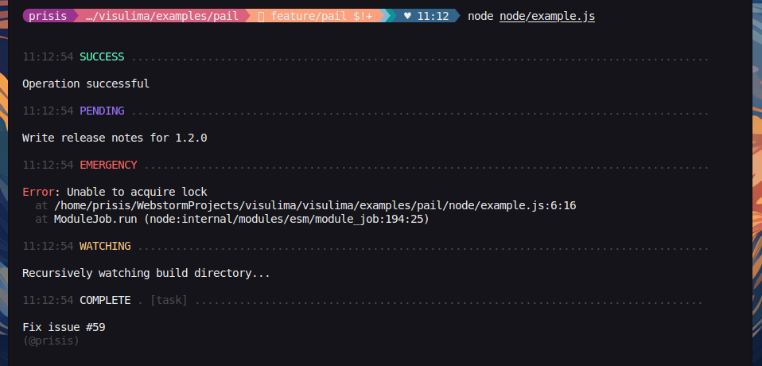
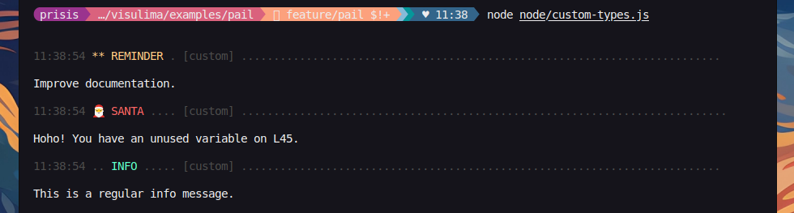
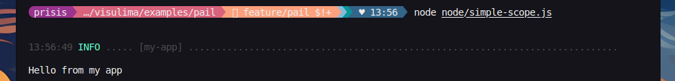
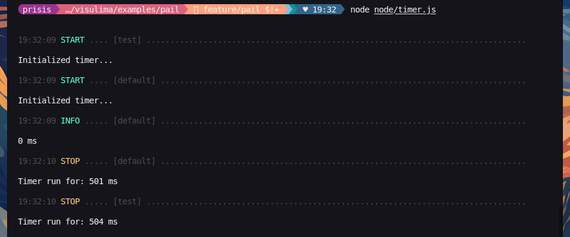

<div align="center">
  <h3>Visulima Pail</h3>
  <p>
  Highly configurable Logger for Node.js, Edge and Browser, built on top of

[@visulima/fmt][fmt],
[@visulima/colorize](https://github.com/visulima/visulima/tree/main/packages/colorize),
[@visulima/string](https://github.com/visulima/visulima/tree/main/packages/string),
[ansi-escapes](https://www.npmjs.com/package/ansi-escapes),
[safe-stable-stringify](https://www.npmjs.com/package/safe-stable-stringify), and
[terminal-size](https://www.npmjs.com/package/terminal-size)

  </p>
</div>


<div align="center">

[](https://www.typescriptlang.org/) [](https://www.npmjs.com/package/@visulima/pail/v/latest) [](https://github.com/visulima/visulima/blob/main/packages/pail/LICENSE.md)

</div>

---

<div align="center">
    <p>
        <sup>
            Daniel Bannert's open source work is supported by the community on <a href="https://github.com/sponsors/prisis">GitHub Sponsors</a>
        </sup>
    </p>
</div>

---

## 📋 Migration Guide

If you're upgrading from an earlier version of pail, check out our [Migration Guide](MIGRATION-GUIDE.md) for breaking changes and upgrade instructions.

---

## Why Pail?

- Easy to use
- Hackable to the core
- Integrated timers
- Custom pluggable processors and reporters
- TypeScript support
- Interactive and regular modes
- Secrets & sensitive information filtering
- Filename, date and timestamp support
- Scoped loggers and timers
- Scaled logging levels mechanism
- String interpolation support
- Object and error interpolation
- Stack trace and pretty errors
- Simple and minimal syntax
- Spam prevention by throttling logs
- [Browser](./__assets__/header-browser.png) and [Server](./__assets__/header-server.png) support
- Redirect console and stdout/stderr to pail and easily restore redirect.
- `Pretty` or `JSON` output
- ESM‑only with tree‑shaking support (Node.js ≥ 20.19)
- Supports circular structures
- Fast and powerful, see the [benchmarks](__bench__/README.md)

## Install

```sh
npm install @visulima/pail
```

```sh
yarn add @visulima/pail
```

```sh
pnpm add @visulima/pail
```

## Concepts

> Most importantly, `pail` adheres to the log levels defined in [RFC 5424][rfc-5424] extended with `trace` level.
> This means that you can use the log levels to filter out messages that are not important to you.

### Log Levels

Pail supports the logging levels described by [RFC 5424][rfc-5424].

- `DEBUG`: Detailed debug information.

- `INFO`: Interesting events. Examples: User logs in, SQL logs.

- `NOTICE`: Normal but significant events.

- `TRACE`: Very detailed and fine-grained informational events.

- `WARNING`: Exceptional occurrences that are not errors. Examples: Use of deprecated APIs, poor use of an API, undesirable things that are not necessarily wrong.

- `ERROR`: Runtime errors that do not require immediate action but should typically be logged and monitored.

- `CRITICAL`: Critical conditions. Example: Application component unavailable, unexpected exception.

- `ALERT`: Action must be taken immediately. Example: Entire website down, database unavailable, etc. This should trigger the SMS alerts and wake you up.

- `EMERGENCY`: Emergency: system is unusable.

### Bypass Log Level Filter with Force

Normally, the logger will only output messages at or above the configured level.

However, you can force a log to be emitted regardless of the current level:

```typescript
import { createPail } from "@visulima/pail";

const logger = createPail({
    logLevel: "warn", // Only show warning and above
});

logger.info("This won't be logged"); // Filtered out

logger.force.error("Something went wrong!");
logger.force.info("This will show even if level is set to 'warn'");
```

⚠️ **Use this with care**—force is designed for exceptional situations where logs must be guaranteed to appear.

### Reporters

Reporters are responsible for writing the log messages to the console or a file. `pail` comes with a few built-in reporters:

| Browser (console.{function}) | Server (stdout or stderr) |
| ---------------------------- | ------------------------- |
| `JsonReporter`               | `JsonReporter`            |
| `PrettyReporter`             | `PrettyReporter`          |
| `HttpReporter`               | `HttpReporter`            |
| x                            | `SimpleReporter`          |
| x                            | `FileReporter`            |

### Processors

Processors are responsible for processing the log message (Meta Object) before it's written to the console or a file.
This usually means that they add some metadata to the record's `context` property.

A processor can be added to a logger directly (and is subsequently applied to log records before they reach any handler).

`pail` comes with a few built-in processors:

- `CallerProcessor` - adds the caller information to the log message
    - The Meta Object is extended with a file name, line number and column number
- `RedactProcessor` - redacts sensitive information from the log message
    > The redact processor needs the "@visulima/redact" package to work.
    > Use `npm install @visulima/redact`, `pnpm add @visulima/redact` or `yarn add @visulima/redact` to install it.
- `MessageFormatterProcessor` - formats the log message (Util.format-like unescaped string formatting utility) [@visulima/fmt][fmt]
- `ErrorProcessor` - serializes the error with cause object to a std error object that can be serialized.
- `OpenTelemetryProcessor` - adds OpenTelemetry trace context to log metadata
    > The OpenTelemetry processor needs the "@opentelemetry/api" package to work.
    > Use `npm install @opentelemetry/api`, `pnpm add @opentelemetry/api` or `yarn add @opentelemetry/api` to install it.
    > Extracts trace ID, span ID, and trace flags from the active OpenTelemetry span and adds them to the log context for distributed tracing correlation.

## Usage

```typescript
import { pail } from "@visulima/pail";

pail.success("Operation successful");
pail.debug("Hello", "from", "L59");
pail.pending("Write release notes for %s", "1.2.0");
pail.fatal(new Error("Unable to acquire lock"));
pail.watch("Recursively watching build directory...");
pail.complete({
    prefix: "[task]",
    message: "Fix issue #59",
    suffix: "(@prisis)",
});
```



### Custom Loggers

To create a custom logger define an `options` object yielding a types field with the logger data and pass it as argument to the createPail function.

```typescript
import { createPail } from "@visulima/pail";

const custom = createPail({
    types: {
        remind: {
            badge: "**",
            color: "yellow",
            label: "reminder",
            logLevel: "info",
        },
        santa: {
            badge: "🎅",
            color: "red",
            label: "santa",
            logLevel: "info",
        },
    },
});

custom.remind("Improve documentation.");
custom.santa("Hoho! You have an unused variable on L45.");
```



Here is an example where we override the default `error` and `success` loggers.

```typescript
import { pail, createPail } from "@visulima/pail";

pail.error("Default Error Log");
pail.success("Default Success Log");

const custom = createPail({
    scope: "custom",
    types: {
        error: {
            badge: "!!",
            label: "fatal error",
        },
        success: {
            badge: "++",
            label: "huge success",
        },
    },
});

custom.error("Custom Error Log");
custom.success("Custom Success Log");
```


## Scoped Loggers

To create a scoped logger from scratch, define the `scope` field inside the options object and pass it as argument to the createPail function.

```typescript
import { createPail } from "@visulima/pail";

const mayAppLogger = createPail({
    scope: "my-app",
});

mayAppLogger.info("Hello from my app");
```



To create a scoped logger based on an already existing one, use the `scope()` function, which will return a new pail instance, inheriting all custom loggers, timers, secrets, streams, configuration, log level, interactive mode & disabled statuses from the initial one.

```typescript
import { pail } from "@visulima/pail";

const global = pail.scope("global scope");

global.success("Hello from the global scope");

function foo() {
    const outer = global.scope("outer", "scope");
    outer.success("Hello from the outer scope");

    setTimeout(() => {
        const inner = outer.scope("inner", "scope");
        inner.success("Hello from the inner scope");
    }, 500);
}

foo();
```


## Child Loggers

Create child loggers that inherit settings from their parent while overriding only what you need. Child loggers are independent instances with their own state (timers, counters, etc.), but they inherit configuration like reporters, processors, types, log levels, and throttle settings.

```typescript
import { createPail } from "@visulima/pail";
import { PrettyReporter } from "@visulima/pail/reporter/pretty";

const parent = createPail({
    logLevel: "informational",
    types: {
        http: {
            label: "HTTP",
            logLevel: "informational",
        },
    },
    reporters: [new PrettyReporter()],
});

// Child inherits all parent settings
const child = parent.child();
child.http("GET /api/users 200"); // Inherits http type from parent
child.info("Request processed"); // Inherits log level from parent

// Child can override specific settings
const debugChild = parent.child({ logLevel: "debug" });
debugChild.debug("Detailed debug info"); // Uses debug level

// Child can add new types
const dbChild = parent.child({
    types: {
        db: {
            label: "DB",
            logLevel: "informational",
        },
    },
});
dbChild.db("Query executed"); // New type available
dbChild.http("GET /api 200"); // Still has parent types

// Child scope extends parent scope
const scopedChild = parent.child({ scope: ["api"] });
// Logs will include both parent and child scope if parent had scope set
```

### What Gets Inherited

- **Types**: Child types are merged with parent types (child can add new or override existing)
- **Reporters**: Child reporters are added to parent reporters (both are used)
- **Processors**: Child processors are added to parent processors (both are applied)
- **Log Levels**: Child log levels override parent log levels
- **Scope**: Child scope extends parent scope (combined into array)
- **Throttle Settings**: Child inherits parent throttle settings unless overridden
- **Timer Messages**: Child inherits parent timer messages unless overridden

### What's Independent

- **State**: Each child logger has its own timers, counters, and message queue
- **Disabled/Paused**: Child logger state is independent from parent

## Interactive Loggers (Only on if stdout and stderr is a TTY)

To initialize an interactive logger, create a new pail instance with the `interactive` attribute set to `true`.
While into the interactive mode, previously logged messages originating from an interactive logger, will be overridden only by new ones originating from the same or a different interactive logger.
Note that regular messages originating from regular loggers are not overridden by the interactive ones.

```typescript
import { createPail } from "@visulima/pail";

console.log("\n");

const pail = createPail();

const interactive = createPail({ interactive: true });

pail.info("This is a log message 1");

setTimeout(() => {
    interactive.await("[%d/4] - Process A", 1);
    setTimeout(() => {
        interactive.success("[%d/4] - Process A", 2);
        setTimeout(() => {
            interactive.await("[%d/4] - Process B", 3);
            setTimeout(() => {
                interactive.error("[%d/4] - Process B", 4);
            }, 1000);
        }, 1000);
    }, 1000);
});

pail.info("This is a log message 2");
pail.info("This is a log message 3");
pail.info("This is a log message 4");
```

For a more complex example, use can use the `getInteractiveManager` function, see the following code:

```typescript
import { createPail } from "@visulima/pail";

const interactive = createPail({ interactive: true });

const TICKS = 60;
const TIMEOUT = 80;
const frames = ["⠋", "⠙", "⠹", "⠸", "⠼", "⠴", "⠦", "⠧", "⠇", "⠏"];
const messages = ["Swapping time and space...", "Have a good day.", "Don't panic...", "Updating Updater...", "42"];
let ticks = TICKS;
let i = 0;

const interactiveManager = interactive.getInteractiveManager();

interactiveManager.hook();

// eslint-disable-next-line no-console
console.log(" - log message");
// eslint-disable-next-line no-console
console.error(" - error message");
// eslint-disable-next-line no-console
console.warn(" - warn message");

const id = setInterval(() => {
    if (--ticks < 0) {
        clearInterval(id);

        interactiveManager.update("stdout", ["✔ Success", "", "Messages:", "this line will be deleted!!!"]);
        interactiveManager.erase("stdout", 1);
        interactiveManager.unhook(false);
    } else {
        const frame = frames[(i = ++i % frames.length)];
        const index = Math.round(ticks / 10) % messages.length;
        const message = messages[index];

        if (message) {
            interactiveManager.update("stdout", [`${frame} Some process...`, message]);
        }
    }
}, TIMEOUT);
```

### Timers

Timer are managed by the `time()`, `timeLog()` and `timeEnd()` functions.
A unique label can be used to identify a timer on initialization, though if none is provided the timer will be assigned one automatically.
In addition, calling the `timeEnd()` function without a specified label will have as effect the termination of the most recently initialized timer, that was created without providing a label.

```typescript
import { pail } from "@visulima/pail";

pail.time("test");
pail.time();
pail.timeLog("default", "Hello");

setTimeout(() => {
    pail.timeEnd();
    pail.timeEnd("test");
}, 500);
```



Its also possible to change the text inside `time()` and `timeEnd()` by using the options object.

```typescript
import { createPail } from "@visulima/pail";

const pail = createPail({
    messages: {
        timerStart: "Start Timer:",
        timerEnd: "End Timer:",
    },
});

pail.time("test");
pail.timeEnd("test");
```

## Progress Bars (Server Only)

Pail includes a comprehensive progress bar system inspired by cli-progress, with support for single and multi-bar modes, various styles, and interactive terminal output.

### Single Progress Bar

```typescript
import { createPail } from "@visulima/pail";

const logger = createPail({ interactive: true });
const bar = logger.createProgressBar({
    total: 100,
    format: "Downloading [{bar}] {percentage}% | ETA: {eta}s | {value}/{total}",
});

bar.start();
bar.update(50);
bar.increment(10);
bar.stop();
```

### Styled Progress Bars

Pail supports various built-in progress bar styles:

```typescript
import { createPail } from "@visulima/pail";

const logger = createPail({ interactive: true });

// Shades classic (default)
const bar1 = logger.createProgressBar({
    total: 100,
    style: "shades_classic",
    format: "Progress [{bar}] {percentage}%",
});

// Shades grey
const bar2 = logger.createProgressBar({
    total: 100,
    style: "shades_grey",
    format: "Progress [{bar}] {percentage}%",
});

// Rect style
const bar3 = logger.createProgressBar({
    total: 100,
    style: "rect",
    format: "Progress [{bar}] {percentage}%",
});

// ASCII style
const bar4 = logger.createProgressBar({
    total: 100,
    style: "ascii",
    format: "Progress [{bar}] {percentage}%",
});

// You can still override individual style settings
const bar5 = logger.createProgressBar({
    total: 100,
    style: "shades_classic",
    barCompleteChar: "🚀", // Override the complete character
    format: "Progress [{bar}] {percentage}%",
});
```

Available styles: `shades_classic`, `shades_grey`, `rect`, `filled`, `solid`, `ascii`, `custom`

### Multi Progress Bars

Display multiple progress bars simultaneously:

```typescript
import { createPail } from "@visulima/pail";

const logger = createPail({ interactive: true });
const multiBar = logger.createMultiProgressBar({
    style: "shades_classic", // Apply style to all bars
});

const bar1 = multiBar.create(100);
const bar2 = multiBar.create(200);
const bar3 = multiBar.create(150);

// Update bars as needed
bar1.update(50);
bar2.update(75);
bar3.update(25);

// Clean up when done
multiBar.stop();
```

### Custom Progress Bar

Create fully customized progress bars with your own characters and formatting:

```typescript
import { createPail } from "@visulima/pail";

const logger = createPail({ interactive: true });
const bar = logger.createProgressBar({
    total: 100,
    format: "🚀 Downloading {filename}: [{bar}] {percentage}% | Speed: {speed} MB/s | ETA: {eta}s",
    barCompleteChar: "🚀",
    barIncompleteChar: "⚪",
    width: 20,
});

bar.start(0, 0, {
    filename: "large-file.zip",
    speed: "0.0",
});

// Update with payload data
bar.update(50, { speed: "2.5" });
bar.stop();
```

### Gradient Character Arrays

Create smooth gradient animations by providing arrays of characters that progressively fill:

```typescript
import { createPail } from "@visulima/pail";

const logger = createPail({ interactive: true });

// Shade gradient (light to dark)
const bar = logger.createProgressBar({
    total: 100,
    barCompleteChar: ["░", "▒", "▓", "█"], // Gradient array
    barIncompleteChar: " ",
    format: "Downloading [{bar}] {percentage}%",
});

bar.start();
for (let i = 0; i <= 100; i++) {
    bar.update(i);
}
bar.stop();
```

Supported gradients:

- **Shades**: `["░", "▒", "▓", "█"]` (light to dark)
- **Blocks**: `["▁", "▂", "▃", "▄", "▅", "▆", "▇", "█"]` (small to large)
- **Temperature**: `["🔵", "🟢", "🟡", "🟠", "🔴"]` (cold to hot)
- **Custom**: Any array of characters for your own gradient effect

### Composite Progress Bars

Track multiple related progress bars simultaneously with automatic color layering based on progress percentage. This is perfect for operations with multiple parallel sources or stages:

```typescript
import { createPail } from "@visulima/pail";
import colorize from "@visulima/colorize";

const logger = createPail({ interactive: true });

// Create a composite multi-bar that displays all bars as a single layered composite
const multiBar = logger.createMultiProgressBar({
    composite: true, // Enable composite mode
    format: "[{bar}]  ① {r}%  ② {y}%  ③ {b}%",
});

const source1 = multiBar.create(100, 0, { r: "0", y: "0", b: "0" });
const source2 = multiBar.create(100, 0, { r: "0", y: "0", b: "0" });
const source3 = multiBar.create(100, 0, { r: "0", y: "0", b: "0" });

// Apply colors to each source
multiBar.setBarColor(source1, colorize.red);
multiBar.setBarColor(source2, colorize.yellow);
multiBar.setBarColor(source3, colorize.blue);

// Update sources with different speeds
for (let i = 0; i <= 100; i++) {
    source1.update(i); // Red: 100% progress
    source2.update(Math.floor(i * 0.7)); // Yellow: 70% progress
    source3.update(Math.floor(i * 0.4)); // Blue: 40% progress
    await new Promise((r) => setTimeout(r, 40));
}

multiBar.stop();
```

**Output example:**

```txt
[▒▒▒▒▒▒▒▒▒▒▓▓▓▓▓▓▓▓██████████████████████]  ① 100%  ② 70%  ③ 40%
```

#### Color Layering & Character Shading

The composite bar uses character shading to represent overlapping progress bars:

| Character        | Meaning            | Example             |
| ---------------- | ------------------ | ------------------- |
| **█** (solid)    | One bar visible    | Red at 100%         |
| **▓** (medium)   | Two bars overlap   | Red + Yellow        |
| **▒** (light)    | Three bars overlap | Red + Yellow + Blue |
| **░** (lightest) | Four+ bars overlap | All bars present    |

#### How It Works

The composite bar renders based on **progress percentage at each position**:

1. **At position 0-40%**: Only Red (①) is filled → shows **█** with red color
2. **At position 40-70%**: Red + Yellow (①+②) filled → shows **▓** with yellow color (highest index shown)
3. **At position 70-100%**: All three (①+②+③) filled → shows **▒** with blue color (highest index)

The **highest-indexed bar's color** is used at each position, creating a natural progression.

**Dynamic Visibility Based on Progress:**

The bar with the **smallest progress percentage** is shown on top for maximum visibility:

- Red at 30%, Yellow at 60% → Red is visible first (30% < 60%)
- When Red reaches 30% and Yellow is only at 20% → Yellow becomes visible (20% < 30%)
- This ensures slower-progressing operations are always visible and not hidden beneath faster ones

#### Use Cases

1. **Multi-source Download**: Show progress from multiple download sources
2. **Parallel Tasks**: Monitor concurrent operations (build, test, lint)
3. **Pipeline Stages**: Upload → Process → Finalize with different completion times
4. **Batch Operations**: Parse → Validate → Compile at different speeds
5. **Resource Tracking**: CPU, Memory, Disk usage in parallel

Each progress bar:

- Updates independently at its own speed
- Can have different total values and progress rates
- Uses color to distinguish sources
- Shows through character shading when overlapping

## Spinners (Server Only)

Pail includes a comprehensive spinner system inspired by cli-progress, with support for single and multi-spinner modes, various styles, and interactive terminal output.

### Single Spinner

```typescript
import { createPail } from "@visulima/pail";

const logger = createPail({ interactive: true });
const spinner = logger.createSpinner({
    text: "Loading...",
    color: "blue",
});

spinner.start();
spinner.succeed("Loaded!");
spinner.fail("Failed!");
spinner.stop();
```

### Multi Spinner

```typescript
import { createPail } from "@visulima/pail";

const logger = createPail({ interactive: true });
const multiSpinner = logger.createMultiSpinner({
    style: "dots", // Apply style to all spinners
});

const spinner1 = multiSpinner.create("Loading A");
const spinner2 = multiSpinner.create("Loading B");
const spinner3 = multiSpinner.create("Loading C");

// Update spinners as needed
spinner1.succeed("Loaded A!");
spinner2.succeed("Loaded B!");
spinner3.succeed("Loaded C!");

// Clean up when done
multiSpinner.stop();
```

### Custom Spinner

Create fully customized spinners with your own characters and formatting:

```typescript
import { createPail } from "@visulima/pail";

const logger = createPail({ interactive: true });
const spinner = logger.createSpinner({
    text: "🚀 Downloading {filename}: [{bar}] {percentage}% | Speed: {speed} MB/s | ETA: {eta}s",
    barCompleteChar: "🚀",
    barIncompleteChar: "⚪",
    width: 20,
});

spinner.start(0, 0, {
    filename: "large-file.zip",
    speed: "0.0",
});

// Update with payload data
spinner.update(50, { speed: "2.5" });
spinner.succeed();
```

## Object Tree

Render objects and data structures as formatted ASCII trees for better terminal visualization and debugging:

```typescript
import { renderObjectTree } from "@visulima/pail/object-tree";

const data = {
    user: {
        name: "John Doe",
        email: "john@example.com",
        profile: {
            age: 30,
            location: "New York",
            skills: ["JavaScript", "TypeScript", "Node.js"],
        },
    },
    settings: {
        theme: "dark",
        notifications: true,
    },
};

console.log(renderObjectTree(data));
```

**Output:**

```txt
├─ user:
│  ├─ name: John Doe
│  ├─ email: john@example.com
│  └─ profile:
│     ├─ age: 30
│     ├─ location: New York
│     └─ skills:
├─ settings:
│  ├─ theme: dark
│  └─ notifications: true
```

> **Note:** `renderObjectTree` is exported as a separate module (`@visulima/pail/object-tree`) to reduce main bundle size. It works in both **Node.js** and **Browser** environments and is a pure utility function with no platform-specific dependencies.

### Custom Rendering

Customize how object trees are rendered:

```typescript
import { renderObjectTree } from "@visulima/pail/object-tree";

const obj = {
    name: "John",
    age: 30,
    address: {
        street: "Main St",
        city: "New York",
    },
};

// Custom rendering with sorting and formatting
const tree = renderObjectTree(obj, {
    sortFn: (a, b) => a.localeCompare(b), // Sort keys alphabetically
    renderFn: (node) => {
        if (typeof node === "string") return node.toUpperCase();
        return ["boolean", "string", "number"].includes(typeof node) ? String(node) : undefined;
    },
    joined: true, // Return as single string (false for array of lines)
});

console.log(tree);
```

### Configuration Options

| Option              | Description                                           | Default              |
| ------------------- | ----------------------------------------------------- | -------------------- |
| `joined`            | Return as single string or array of lines             | `true`               |
| `sortFn`            | Function to sort object keys (null for natural order) | `null`               |
| `renderFn`          | Function to render node values                        | Renders primitives   |
| `separator`         | Separator between key and value                       | `": "`               |
| `keyNeighbour`      | Connector for keys with siblings                      | `"├─ "`              |
| `keyNoNeighbour`    | Connector for last keys                               | `"└─ "`              |
| `spacerNeighbour`   | Spacer for branches with siblings                     | `"│  "`              |
| `spacerNoNeighbour` | Spacer for branches without siblings                  | `"   "`              |
| `breakCircularWith` | Text for circular references                          | `" (circular ref.)"` |

### Use Cases

1. **Debugging**: Visualize complex object structures during development
2. **Logging**: Pretty-print objects for better readability in logs
3. **API Responses**: Display JSON API responses in tree format
4. **Configuration Display**: Show configuration trees in terminal applications
5. **Data Inspection**: Inspect deeply nested data structures

## HTTP Reporter

The HTTP Reporter sends logs to HTTP endpoints, making it perfect for centralized logging services, log aggregation platforms, or custom logging APIs. It supports batching, compression, retries, rate limiting, and Edge Runtime compatibility.

**Note:** When used in Edge Runtime environments (Next.js Edge, Cloudflare Workers, etc.), the package automatically resolves to an Edge-compatible version that disables compression and uses Edge-compatible APIs. You don't need to import a separate class - just use `HttpReporter` and the package handles the routing.

### Basic Usage

```typescript
import { createPail } from "@visulima/pail";
import { HttpReporter } from "@visulima/pail/reporter/http";

const logger = createPail({
    reporters: [
        new HttpReporter({
            url: "https://api.example.com/logs",
            method: "POST",
            headers: {
                Authorization: "Bearer your-token",
            },
        }),
    ],
});

logger.info("Application started", { version: "1.0.0" });
```

### Edge Runtime Compatibility

For Edge Runtime environments, enable Edge compatibility mode explicitly (or let the package auto-detect):

```typescript
import { createPail } from "@visulima/pail";
import { HttpReporter } from "@visulima/pail/reporter/http";

const logger = createPail({
    reporters: [
        new HttpReporter({
            url: "https://api.example.com/logs",
            edgeCompat: true, // Enable Edge compatibility (auto-enabled in Edge environments)
            headers: {
                Authorization: "Bearer your-token",
            },
        }),
    ],
});

logger.info("Edge function executed");
```

When `edgeCompat` is enabled (or automatically enabled in Edge environments), compression is disabled and Edge-compatible APIs are used.

### Batching

HTTP Reporter supports automatic batching to reduce network requests:

```typescript
const logger = createPail({
    reporters: [
        new HttpReporter({
            url: "https://api.example.com/logs",
            enableBatchSend: true,
            batchSize: 100, // Send when 100 logs are queued
            batchSendTimeout: 5000, // Or send after 5 seconds
            batchMode: "delimiter", // Options: "delimiter", "array", "field"
            batchSendDelimiter: "\n", // Delimiter for batch entries
        }),
    ],
});
```

**Batch Modes:**

- `delimiter` (default): Join entries with a delimiter (e.g., newline-delimited JSON)
- `array`: Send entries as a JSON array
- `field`: Wrap entries in an object with a field name (requires `batchFieldName`)

```typescript
// Field mode example (e.g., for Logflare)
new HttpReporter({
    url: "https://api.logflare.app/logs",
    batchMode: "field",
    batchFieldName: "batch", // Wraps entries in { batch: [...] }
});
```

### Compression

Enable gzip compression to reduce payload size:

```typescript
const logger = createPail({
    reporters: [
        new HttpReporter({
            url: "https://api.example.com/logs",
            compression: true, // Enable gzip compression
        }),
    ],
});
```

**Note:** Compression is automatically disabled when Edge compatibility mode is enabled (either via `edgeCompat: true` or automatically in Edge Runtime environments).

### Retry Logic

Configure retry behavior for failed requests:

```typescript
const logger = createPail({
    reporters: [
        new HttpReporter({
            url: "https://api.example.com/logs",
            maxRetries: 3, // Retry up to 3 times
            retryDelay: 1000, // Base delay: 1 second
            respectRateLimit: true, // Wait on 429 responses
        }),
    ],
});
```

### Error Handling

Handle errors with custom callbacks:

```typescript
const logger = createPail({
    reporters: [
        new HttpReporter({
            url: "https://api.example.com/logs",
            onError: (error) => {
                console.error("Failed to send log:", error);
                // Send to fallback service, alert, etc.
            },
            onDebug: (entry) => {
                console.log("Sending log entry:", entry);
            },
            onDebugRequestResponse: ({ req, res }) => {
                console.log("Request:", req.method, req.url);
                console.log("Response:", res.status, res.statusText);
            },
        }),
    ],
});
```

### Payload Customization

Customize the payload format with a template function:

```typescript
const logger = createPail({
    reporters: [
        new HttpReporter({
            url: "https://api.example.com/logs",
            payloadTemplate: ({ data, logLevel, message }) => {
                return JSON.stringify({
                    timestamp: new Date().toISOString(),
                    level: logLevel,
                    message,
                    metadata: data,
                });
            },
        }),
    ],
});
```

### Size Limits

Configure maximum sizes to prevent oversized payloads:

```typescript
const logger = createPail({
    reporters: [
        new HttpReporter({
            url: "https://api.example.com/logs",
            maxLogSize: 1_048_576, // 1MB per log entry
            maxPayloadSize: 5_242_880, // 5MB per batch payload
        }),
    ],
});
```

When a log entry exceeds `maxLogSize`, a `LogSizeError` is thrown. When a batch exceeds `maxPayloadSize`, it's automatically split into smaller batches.

### Configuration Options

| Option                   | Type                                       | Default              | Description                                   |
| ------------------------ | ------------------------------------------ | -------------------- | --------------------------------------------- |
| `url`                    | `string`                                   | **required**         | HTTP endpoint URL                             |
| `method`                 | `string`                                   | `"POST"`             | HTTP method                                   |
| `headers`                | `Record<string, string> \| (() => ...)`    | `{}`                 | Request headers (object or function)          |
| `contentType`            | `string`                                   | `"application/json"` | Content type for single requests              |
| `batchContentType`       | `string`                                   | `"application/json"` | Content type for batch requests               |
| `enableBatchSend`        | `boolean`                                  | `true`               | Enable automatic batching                     |
| `batchSize`              | `number`                                   | `100`                | Number of logs to batch before sending        |
| `batchSendTimeout`       | `number`                                   | `5000`               | Timeout (ms) to send batch regardless of size |
| `batchMode`              | `"delimiter" \| "array" \| "field"`        | `"delimiter"`        | Batch format mode                             |
| `batchSendDelimiter`     | `string`                                   | `"\n"`               | Delimiter for batch entries                   |
| `batchFieldName`         | `string`                                   | `undefined`          | Field name for "field" batch mode             |
| `compression`            | `boolean`                                  | `false`              | Enable gzip compression                       |
| `maxRetries`             | `number`                                   | `3`                  | Maximum retry attempts                        |
| `retryDelay`             | `number`                                   | `1000`               | Base delay between retries (ms)               |
| `respectRateLimit`       | `boolean`                                  | `true`               | Wait on 429 rate limit responses              |
| `maxLogSize`             | `number`                                   | `1048576`            | Maximum size per log entry (bytes)            |
| `maxPayloadSize`         | `number`                                   | `5242880`            | Maximum size per payload (bytes)              |
| `edgeCompat`             | `boolean`                                  | `false`              | Enable Edge Runtime compatibility             |
| `onError`                | `(error: Error) => void`                   | `undefined`          | Error callback                                |
| `onDebug`                | `(entry: Record<string, unknown>) => void` | `undefined`          | Debug callback for log entries                |
| `onDebugRequestResponse` | `(reqRes: {...}) => void`                  | `undefined`          | Debug callback for HTTP requests/responses    |
| `payloadTemplate`        | `(data: {...}) => string`                  | `undefined`          | Custom payload formatter                      |

## Integrations

### Use with @visulima/boxen

Create nicely framed messages with `@visulima/boxen` and log them with Pail:

```typescript
import { pail } from "@visulima/pail";
import { boxen } from "@visulima/boxen";

const output = boxen("Build completed successfully", {
    headerText: "Success",
    padding: 1,
    borderStyle: "round",
});

pail.success(output);
```

You can also include multi‑line content; Pail preserves newlines:

```typescript
import { pail } from "@visulima/pail";
import { boxen } from "@visulima/boxen";

const details = ["Service: api", "Env: production", "Commit: a1b2c3"].join("\n");

pail.info(
    boxen(details, {
        headerText: "Deploy Info",
        padding: { top: 0, right: 2, bottom: 0, left: 2 },
        borderStyle: "classic",
    }),
);
```

### Use with @visulima/tabular

Render tables with `@visulima/tabular` and send them through Pail:

```typescript
import { pail } from "@visulima/pail";
import { createTable } from "@visulima/tabular";

const table = createTable({
    showHeader: true,
    style: {
        // optional: customize colors/border via @visulima/colorize
    },
});

table.setHeaders(["Task", "Status", "Duration"]).addRow(["build", "ok", "1.2s"]).addRow(["test", "ok", "3.4s"]).addRow(["lint", "warn", "0.8s"]);

pail.info("\n" + table.toString());
```

For dynamic dashboards, combine `tabular` with Pail's interactive mode and update the rendered table as your process runs.

## Disable and Enable Loggers

To disable a logger, use the `disable()` function, which will prevent any log messages from being written to the console or a file.

```typescript
import { pail } from "@visulima/pail";

pail.disable();
pail.success("This message will not be logged");
```

To enable a logger, use the `enable()` function, which will allow log messages to be written to the console or a file.

```typescript
import { pail } from "@visulima/pail";

pail.disable();
pail.success("This message will not be logged");
pail.enable();
pail.success("This message will be logged");
```

## Pause and Resume Loggers

The `pause()` and `resume()` functions allow you to temporarily queue log messages and then flush them all at once. This is similar to how consola works and is useful when you need to buffer output during critical operations.

When paused, all log calls will be queued instead of being output immediately. When you call `resume()`, all queued messages will be processed in the order they were called.

```typescript
import { pail } from "@visulima/pail";

pail.pause();

// These messages will be queued
pail.info("First message");
pail.warn("Second message");
pail.success("Third message");

// Resume logging - all queued messages are now output in order
pail.resume();

// This message is output immediately
pail.info("Fourth message");
```

**Note:** Unlike `disable()`, which discards log messages, `pause()` queues them for later output. This makes it ideal for scenarios where you want to control when messages appear without losing them.

## Api

## Supported Node.js Versions

Libraries in this ecosystem make the best effort to track [Node.js’ release schedule](https://github.com/nodejs/release#release-schedule).
Here’s [a post on why we think this is important](https://medium.com/the-node-js-collection/maintainers-should-consider-following-node-js-release-schedule-ab08ed4de71a).

## Contributing

If you would like to help take a look at the [list of issues](https://github.com/visulima/visulima/issues) and check our [Contributing](.github/CONTRIBUTING.md) guidelines.

> **Note:** please note that this project is released with a Contributor Code of Conduct. By participating in this project you agree to abide by its terms.

## Credits

- [Daniel Bannert](https://github.com/prisis)
- [All Contributors](https://github.com/visulima/visulima/graphs/contributors)

## About

### Related Projects

- [pino](https://github.com/pinojs/pino) - 🌲 super fast, all natural json logger
- [winston](https://github.com/winstonjs/winston) - A logger for just about everything.
- [signale](https://github.com/klaudiosinani/signale) - Highly configurable logging utility
- [consola](https://github.com/unjs/consola) - 🐨 Elegant Console Logger for Node.js and Browser

## License

The visulima pail is open-sourced software licensed under the [MIT](https://github.com/visulima/visulima/blob/main/packages/pail/LICENSE.md)


[rfc-5424]: https://datatracker.ietf.org/doc/html/rfc5424#page-36
[fmt]: https://github.com/visulima/visulima/tree/main/packages/fmt
