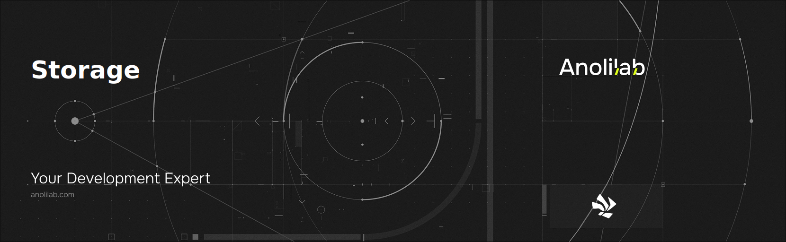

<!-- START_PACKAGE_OG_IMAGE_PLACEHOLDER -->

<a href="https://www.anolilab.com/open-source" align="center">

  

</a>

<h3 align="center">Visulima upload - Store files in a web-accessible location via a simplified API. Can automatically scale and rotate images. Includes S3, Azure, GCS and local filesystem-based backends with the most convenient features of each.</h3>

<!-- END_PACKAGE_OG_IMAGE_PLACEHOLDER -->

<br />

<div align="center">

[![typescript-image][typescript-badge]][typescript-url]
[![mit licence][license-badge]][license]
[![npm downloads][npm-downloads-badge]][npm-downloads]
[![Chat][chat-badge]][chat]
[![PRs Welcome][prs-welcome-badge]][prs-welcome]

</div>

<div align="center">
  <sub>Built with ❤︎ by <a href="https://twitter.com/_prisis_">Daniel Bannert</a></sub>
</div>

## Two surfaces, one library

- **`Files`** — one-liner API for ad-hoc storage operations. Web-standard body types (`Blob`, `Uint8Array`, `ReadableStream`), eight methods, and a `.raw` escape hatch. Use this when you just need to put files somewhere.
- **`BaseStorage` adapters** (`S3Storage`, `DiskStorage`, `BunnyStorage`, …) — the full upload-server framework. TUS / multipart / REST handlers, lifecycle hooks, validators, image / video / audio transformers, OpenAPI export. Use this when you're hosting an upload service.

Both surfaces wrap the same adapters — swap providers without touching call sites.

## Install

```sh
npm install @visulima/storage
# or yarn add / pnpm add
```

Each provider has its own peer dependency (e.g. `@aws-sdk/client-s3` for S3, `@azure/storage-blob` for Azure). See the relevant [service page](https://visulima.com/docs/packages/storage/services) for the exact install command.

## Quick start with `Files`

```ts
import { Files } from "@visulima/storage";
import { S3Storage } from "@visulima/storage/provider/aws";

const files = new Files({
    adapter: new S3Storage({ bucket: "uploads", region: "us-east-1" }),
});

await files.upload("avatars/abc.png", buffer, { contentType: "image/png" });

const url = await files.url("avatars/abc.png", { expiresIn: 900 });
const { body } = await files.download("avatars/abc.png");
```

Swap the adapter to change provider — everything else stays the same:

```ts
import { Files, DiskStorage } from "@visulima/storage";
import { BunnyStorage } from "@visulima/storage/provider/bunny";

new Files({ adapter: new DiskStorage({ directory: "./uploads" }) });
new Files({ adapter: new BunnyStorage({ zone, accessKey, region: "de" }) });
```

→ See the [Files facade reference](https://visulima.com/docs/packages/storage/files-facade) for the full method surface (`upload`, `download`, `head`, `delete`, `copy`, `list`, `url`, `signedUploadUrl`, `.raw`) and body-type matrix.

## Building an upload server?

If you're handling client uploads from a browser — large files, resumable transfers, form posts — use the adapter directly with one of the HTTP handlers.

```ts
import { DiskStorage } from "@visulima/storage";
import { Multipart, Rest } from "@visulima/storage/handler/http/node";

const storage = new DiskStorage({ directory: "./uploads" });

const multipart = new Multipart({ storage });
app.use("/upload", multipart.handle, (req, res) => {
    res.json(req.body); // handler writes the stored file metadata to req.body
});

const rest = new Rest({ storage });
app.use("/files", rest.handle);
```

Three handlers cover the common upload patterns:

- **Multipart** — `multipart/form-data` from HTML forms.
- **REST** — direct binary `POST` / `PUT`. Optional client-side chunking for large files.
- **TUS** — resumable uploads ([tus.io](https://tus.io)) for unreliable networks and very large files.

→ Runtime adapters live under `@visulima/storage/handler/http/{node,fetch,hono,nextjs,solid-start,bun,deno,cloudflare,edge}`. See [framework integrations](https://visulima.com/docs/packages/storage/framework).

## Choosing your surface

| You want to…                                           | Use                                         |
| ------------------------------------------------------ | ------------------------------------------- |
| Save a `Blob` / `Buffer` to S3 and get a signed URL    | `Files`                                     |
| Drop in a file picker / "import from cloud" flow       | `Files` with a consumer-provider adapter    |
| Expose ad-hoc storage to an AI agent or LLM tool       | `Files` + `@visulima/storage/ai/*` subpaths |
| Build a TUS / multipart / chunked upload endpoint      | adapter + handler                           |
| Transform images / video / audio on the fly            | adapter + transformer                       |
| Hook `onCreate` / `onComplete` / `onDelete` lifecycles | adapter                                     |
| Export OpenAPI for an upload endpoint                  | adapter                                     |

## Providers

Object storage (service credentials, presigned URLs, S3-style):

- AWS S3 · Azure Blob · Google Cloud Storage · Vercel Blob · Netlify Blobs · Local disk

S3-compatible (branded client configs under `provider/aws/s3/clients`):

- Cloudflare R2 · DigitalOcean Spaces · MinIO · Hetzner · Storj · Backblaze B2 · Tigris · Wasabi · Akamai

Consumer providers (user OAuth or service-credential, all peer-dep gated):

- Dropbox · Google Drive · Microsoft OneDrive · Box · Supabase · UploadThing · Bunny Storage

→ See the [capability matrix](https://visulima.com/docs/packages/storage/services/capabilities) for what each provider supports (presign, copy, list, signed uploads, …).

## AI tool integrations

The package ships four optional subpaths that expose `Files` as tools an LLM can call — same eight canonical operations wrapped in each SDK's native tool format, with per-tool approval gating.

```ts
import { Files } from "@visulima/storage";
import { S3Storage } from "@visulima/storage/provider/aws";
import { createFileTools } from "@visulima/storage/ai/sdk";

const files = new Files({ adapter: new S3Storage({ bucket: "uploads", region: "us-east-1" }) });
const tools = createFileTools({ files });
```

Subpaths: `@visulima/storage/ai/{sdk,openai,claude,tanstack}` — Vercel AI SDK, OpenAI Responses + Agents (both under `/openai`), Claude Agent SDK, and TanStack AI.

## Documentation

- [Introduction](https://visulima.com/docs/packages/storage/introduction) — the two surfaces, when to use each
- [Files facade](https://visulima.com/docs/packages/storage/files-facade) — the eight-method reference
- [Services](https://visulima.com/docs/packages/storage/services) — per-provider configuration and capability matrix
- [Framework integrations](https://visulima.com/docs/packages/storage/framework) — Node, Fetch, Hono, Next.js, SolidStart, Bun, Deno, Cloudflare
- [Custom storage](https://visulima.com/docs/packages/storage/custom-storage) — write your own adapter against `BaseStorage`
- [Transformers](https://visulima.com/docs/packages/storage/transformers) — image / video / audio pipelines, caching
- [TUS handler](https://visulima.com/docs/packages/storage/tus-handler) · [Chunked uploads](https://visulima.com/docs/packages/storage/chunked-uploads) · [Authenticated uploads](https://visulima.com/docs/packages/storage/authenticated-file-uploads)
- [Batch operations](https://visulima.com/docs/packages/storage/batch-operations) · [Retry mechanism](https://visulima.com/docs/packages/storage/retry-mechanism) · [Caching](https://visulima.com/docs/packages/storage/caching)
- [Error handling](https://visulima.com/docs/packages/storage/error-handling) — `UploadError`, `ERRORS` enum, `wrapStorageError`
- [Observability](https://visulima.com/docs/packages/storage/observability) — metrics, OpenTelemetry, structured logs
- [OpenAPI export](https://visulima.com/docs/packages/storage/openapi)

## Supported Node.js Versions

Libraries in this ecosystem make the best effort to track
[Node.js’ release schedule](https://github.com/nodejs/release#release-schedule). Here’s [a
post on why we think this is important](https://medium.com/the-node-js-collection/maintainers-should-consider-following-node-js-release-schedule-ab08ed4de71a).

## Contributing

If you would like to help take a look at the [list of issues](https://github.com/visulima/visulima/issues) and check our [Contributing](.github/CONTRIBUTING.md) guild.

> **Note:** please note that this project is released with a Contributor Code of Conduct. By participating in this project you agree to abide by its terms.

## Credits

- [Daniel Bannert](https://github.com/prisis)
- [All Contributors](https://github.com/visulima/visulima/graphs/contributors)

## Made with ❤️ at Anolilab

This is an open source project and will always remain free to use. If you think it's cool, please star it 🌟. [Anolilab](https://www.anolilab.com/open-source) is a Development and AI Studio. Contact us at [hello@anolilab.com](mailto:hello@anolilab.com) if you need any help with these technologies or just want to say hi!

## License

The visulima storage is open-sourced software licensed under the [MIT][license]

<!-- badges -->

[license-badge]: https://img.shields.io/npm/l/@visulima/storage?style=for-the-badge
[license]: https://github.com/visulima/visulima/blob/main/LICENSE
[npm-downloads-badge]: https://img.shields.io/npm/dm/@visulima/storage?style=for-the-badge
[npm-downloads]: https://www.npmjs.com/package/@visulima/storage
[prs-welcome-badge]: https://img.shields.io/badge/PRs-welcome-brightgreen.svg?style=for-the-badge
[prs-welcome]: https://github.com/visulima/visulima/blob/main/.github/CONTRIBUTING.md
[chat-badge]: https://img.shields.io/discord/932323359193186354.svg?style=for-the-badge
[chat]: https://discord.gg/TtFJY8xkFK
[typescript-badge]: https://img.shields.io/badge/Typescript-294E80.svg?style=for-the-badge&logo=typescript
[typescript-url]: https://www.typescriptlang.org/
