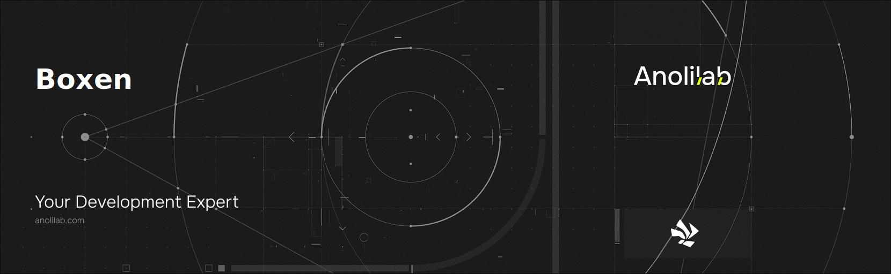
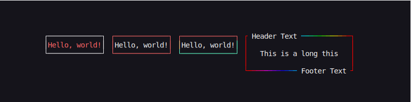

<!-- START_PACKAGE_OG_IMAGE_PLACEHOLDER -->

<a href="https://www.anolilab.com/open-source" align="center">

  

</a>

<h3 align="center">Create beautiful boxes in the terminal with customizable borders, padding, and alignment.</h3>

<!-- END_PACKAGE_OG_IMAGE_PLACEHOLDER -->

<div align="center">

[![typescript-image][typescript-badge]][typescript-url]
[![mit licence][license-badge]][license]
[![npm downloads][npm-downloads-badge]][npm-downloads]
[![Chat][chat-badge]][chat]
[![PRs Welcome][prs-welcome-badge]][prs-welcome]

</div>

---

<div align="center">
    <p>
        <sup>
            Daniel Bannert's open source work is supported by the community on <a href="https://github.com/sponsors/prisis">GitHub Sponsors</a>
        </sup>
    </p>
</div>

---

  
  
## Install

```sh
npm install @visulima/boxen
```

```sh
yarn add @visulima/boxen
```

```sh
pnpm add @visulima/boxen
```

## Usage

```typescript
import { boxen } from "@visulima/boxen";

console.log(boxen("unicorn", { padding: 1 }));
/*
┌─────────────┐
│             │
│   unicorn   │
│             │
└─────────────┘
*/

console.log(boxen("unicorn", { padding: 1, margin: 1, borderStyle: "double" }));
/*
   ╔═════════════╗
   ║             ║
   ║   unicorn   ║
   ║             ║
   ╚═════════════╝

*/

console.log(
    boxen("unicorns love rainbows", {
        headerText: "magical",
        headerAlignment: "center",
    }),
);
/*
┌────── magical ───────┐
│unicorns love rainbows│
└──────────────────────┘
*/

console.log(
    boxen("unicorns love rainbows", {
        headerText: "magical",
        headerAlignment: "center",
        footerText: "magical",
        footerAlignment: "center",
    }),
);
/*
┌────── magical ───────┐
│unicorns love rainbows│
└────── magical ───────┘
*/
```

Check more examples in the [examples folder](./examples).

## API

### boxen(text, options?)

#### text

Type: `string`

Text inside the box.

#### options

Type: `object`

##### borderColor

Type: `(border: string, position: BorderPosition, length: number) => string`\

Set the color of the box border.

```js
import { boxen } from "@visulima/boxen";
import { red, green, yellow, blue } from "@visulima/colorize";

console.log(
    boxen("Hello, world!", {
        borderColor: (border, position) => {
            if (["top", "topLeft", "topRight"].includes(position)) {
                return red(border);
            }

            if (position === "left") {
                return yellow(border);
            }

            if (position === "right") {
                return green(border);
            }

            if (["bottom", "bottomLeft", "bottomRight"].includes(position)) {
                return blue(border);
            }
        },
    }),
);
```

##### borderStyle

Type: `string | object`\
Default: `'single'`\
Values:

- `'single'`

```
┌───┐
│foo│
└───┘
```

- `'double'`

```
╔═══╗
║foo║
╚═══╝
```

- `'round'` (`'single'` sides with round corners)

```
╭───╮
│foo│
╰───╯
```

- `'bold'`

```
┏━━━┓
┃foo┃
┗━━━┛
```

- `'singleDouble'` (`'single'` on top and bottom, `'double'` on right and left)

```
╓───╖
║foo║
╙───╜
```

- `'doubleSingle'` (`'double'` on top and bottom, `'single'` on right and left)

```
╒═══╕
│foo│
╘═══╛
```

- `'classic'`

```
+---+
|foo|
+---+
```

- `'arrow'`

```
↘↓↓↓↙
→foo←
↗↑↑↑↖
```

- `'none'`

```
foo
```

Style of the box border.

Can be any of the above predefined styles or an object with the following keys:

```js
{
    topLeft: '+',
    topRight: '+',
    bottomLeft: '+',
    bottomRight: '+',
    top: '-',
    bottom: '-',
    left: '|',
    right: '|'
}
```

The built-in catalog is also exported as `boxes`, so you can derive a custom style from a predefined one without copying box-drawing characters by hand:

```js
import { boxen, boxes } from "@visulima/boxen";
import type { BorderStyleName } from "@visulima/boxen";

console.log(boxen("foo", { borderStyle: { ...boxes.round, top: "=" } }));
```

##### headerText

Type: `string`

Display text at the top of the box.
If needed, the box will horizontally expand to fit the text.

Example:

```js
import { boxen } from "@visulima/boxen";

console.log(boxen("foo bar", { headerText: "example" }));

/*
┌ example ┐
│foo bar  │
└─────────┘
*/
```

##### headerColor

Type: `(text: string) => string`

```js
import { red } from "@visulima/colorize";
import { boxen } from "@visulima/boxen";

console.log(
    boxen("foo bar", {
        headerText: "example",
        headerColor: (text) => red(text),
    }),
);
```

##### headerAlignment

Type: `string`\
Default: `'left'`

Align the text in the top bar.

Values:

- `'left'`

```text
┌ example ──────┐
│foo bar foo bar│
└───────────────┘
```

- `'center'`

```text
┌─── example ───┐
│foo bar foo bar│
└───────────────┘
```

- `'right'`

```text
┌────── example ┐
│foo bar foo bar│
└───────────────┘
```

##### footerText

Type: `string`

Display text at the bottom of the box.
If needed, the box will horizontally expand to fit the text.

Example:

```js
import { boxen } from "@visulima/boxen";

console.log(boxen("foo bar", { footerText: "example" }));

/*
┌─────────┐
│foo bar  │
└ example ┘
*/
```

##### footerColor

Type: `(text: string) => string`

```js
import { red } from "@visulima/colorize";
import { boxen } from "@visulima/boxen";

console.log(
    boxen("foo bar", {
        footerText: "example",
        footerColor: (text) => red(text),
    }),
);
```

##### footerAlignment

Type: `string`\
Default: `'left'`

Align the footer text.

Values:

- `'left'`

```text
┌───────────────┐
│foo bar foo bar│
└ Footer Text ──┘
```

- `'center'`

```text
┌───────────────┐
│foo bar foo bar│
└─── example ───┘
```

- `'right'`

```text
┌───────────────┐
│foo bar foo bar│
└────── example ┘
```

##### width

Type: `number`

Set a fixed width for the box.

_Note:_ This disables terminal overflow handling and may cause the box to look broken if the user's terminal is not wide enough.

```js
import { boxen } from "@visulima/boxen";

console.log(boxen("foo bar", { width: 15 }));
// ┌─────────────┐
// │foo bar      │
// └─────────────┘
```

##### height

Type: `number`

Set a fixed height for the box.

_Note:_ This option will crop overflowing content.

```js
import { boxen } from "@visulima/boxen";

console.log(boxen("foo bar", { height: 5 }));
// ┌───────┐
// │foo bar│
// │       │
// │       │
// └───────┘
```

##### fullscreen

Type: `boolean | ((width: number, height: number) => [width: number, height: number] | { columns: number; rows: number })`

Whether or not to fit all available space within the terminal.

Pass a callback function to control box dimensions. The callback may return
either a `[width, height]` tuple or a `{ columns, rows }` object:

```js
import { boxen } from "@visulima/boxen";

// Tuple form
console.log(
    boxen("foo bar", {
        fullscreen: (width, height) => [width, height - 1],
    }),
);

// Object form
console.log(
    boxen("foo bar", {
        fullscreen: (width, height) => ({ columns: width, rows: height - 1 }),
    }),
);
```

##### padding

Type: `number | object`\
Default: `0`

Space between the text and box border.

Accepts a number or an object with any of the `top`, `right`, `bottom`, `left` properties. When a number is specified, the left/right padding is 3 times the top/bottom to make it look nice.

##### margin

Type: `number | object`\
Default: `0`

Space around the box.

Accepts a number or an object with any of the `top`, `right`, `bottom`, `left` properties. When a number is specified, the left/right margin is 3 times the top/bottom to make it look nice.

##### float

Type: `string`\
Default: `'left'`\
Values: `'right'` `'center'` `'left'`

Float the box on the available terminal screen space.

##### textColor

Type: `(text: string) => string`\

```js
import { bgRed } from "@visulima/colorize";
import { boxen } from "@visulima/boxen";

console.log(
    boxen("foo bar", {
        textColor: (text) => bgRed(text),
    }),
);
```

##### textAlignment

Type: `string`\
Default: `'left'`\
Values: `'left'` `'center'` `'right'`

Align the text in the box based on the widest line.

##### backgroundColor

Type: `(line: string) => string`

Fill the interior of each content line (including padding) with a color. Receives the already-padded interior of a single line and must return it re-styled. Useful for solid-fill status banners.

```js
import { bgRed } from "@visulima/colorize";
import { boxen } from "@visulima/boxen";

console.log(
    boxen("alert", {
        backgroundColor: (line) => bgRed(line),
    }),
);
```

##### verticalAlignment

Type: `string`\
Default: `'top'`\
Values: `'top'` `'center'` `'bottom'`

When a fixed `height` leaves spare rows, align the content vertically within the box.

```js
import { boxen } from "@visulima/boxen";

console.log(
    boxen("foo bar", {
        height: 5,
        verticalAlignment: "center",
    }),
);
// ┌───────┐
// │       │
// │foo bar│
// │       │
// └───────┘
```

##### terminalColumns

Type: `number`

Number of columns the box may occupy. When omitted, the current terminal width is probed via `terminal-size`.

Providing this skips the (potentially blocking, in non-TTY/CI contexts) terminal-size probe and makes rendering deterministic for snapshot tests.

##### terminalRows

Type: `number`

Number of rows the terminal has, used only by `fullscreen`. When omitted, the current terminal height is probed via `terminal-size`.

##### transformTabToSpace

Type: `false | number`\
Default: `4`

Transform tab characters to spaces. Set to `false` to disable.

## Supported Node.js Versions

Libraries in this ecosystem make the best effort to track [Node.js’ release schedule](https://github.com/nodejs/release#release-schedule).
Here’s [a post on why we think this is important](https://medium.com/the-node-js-collection/maintainers-should-consider-following-node-js-release-schedule-ab08ed4de71a).

## Contributing

If you would like to help take a look at the [list of issues](https://github.com/visulima/visulima/issues) and check our [Contributing](.github/CONTRIBUTING.md) guidelines.

> **Note:** please note that this project is released with a Contributor Code of Conduct. By participating in this project you agree to abide by its terms.

## Credits

- [boxen](https://github.com/sindresorhus/boxen)
- [ansi-align](https://github.com/nexdrew/ansi-align)
- [Daniel Bannert](https://github.com/prisis)
- [All Contributors](https://github.com/visulima/visulima/graphs/contributors)

## Made with ❤️ at Anolilab

This is an open source project and will always remain free to use. If you think it's cool, please star it 🌟. [Anolilab](https://www.anolilab.com/open-source) is a Development and AI Studio. Contact us at [hello@anolilab.com](mailto:hello@anolilab.com) if you need any help with these technologies or just want to say hi!

## License

The visulima boxen is open-sourced software licensed under the [MIT][license]

<!-- badges -->

[license-badge]: https://img.shields.io/npm/l/@visulima/boxen?style=for-the-badge
[license]: https://github.com/visulima/visulima/blob/main/LICENSE
[npm-downloads-badge]: https://img.shields.io/npm/dm/@visulima/boxen?style=for-the-badge
[npm-downloads]: https://www.npmjs.com/package/@visulima/boxen
[prs-welcome-badge]: https://img.shields.io/badge/PRs-welcome-brightgreen.svg?style=for-the-badge
[prs-welcome]: https://github.com/visulima/visulima/blob/main/.github/CONTRIBUTING.md
[chat-badge]: https://img.shields.io/discord/932323359193186354.svg?style=for-the-badge
[chat]: https://discord.gg/TtFJY8xkFK
[typescript-badge]: https://img.shields.io/badge/Typescript-294E80.svg?style=for-the-badge&logo=typescript
[typescript-url]: https://www.typescriptlang.org/
