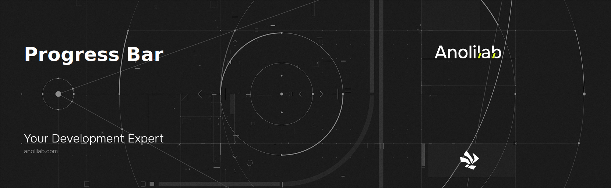

<!-- START_PACKAGE_OG_IMAGE_PLACEHOLDER -->

<a href="https://www.anolilab.com/open-source" align="center">

  

</a>

<h3 align="center">Terminal progress bars with multiple styles and multi-bar support</h3>

<!-- END_PACKAGE_OG_IMAGE_PLACEHOLDER -->

<br />

<div align="center">

[![typescript-image][typescript-badge]][typescript-url]
[![mit licence][license-badge]][license]
[![npm downloads][npm-downloads-badge]][npm-downloads]

</div>

---

<div align="center">
    <p>
        <sup>
            Daniel Bannert's open source work is supported by the community on <a href="https://github.com/sponsors/prisis">GitHub Sponsors</a>
        </sup>
    </p>
</div>

---

## Install

```sh
npm install @visulima/progress-bar
```

```sh
yarn add @visulima/progress-bar
```

```sh
pnpm add @visulima/progress-bar
```

## Usage

### Basic Progress Bar

```typescript
import { ProgressBar } from "@visulima/progress-bar";

const bar = new ProgressBar({ total: 100, style: "shades_classic" });

bar.update(50);
console.log(bar.render());
// progress [████████████████████░░░░░░░░░░░░░░░░░░░░] 50% | ETA: 0s | 50/100
```

### Custom Format

```typescript
const bar = new ProgressBar(
    {
        total: 200,
        format: "{task} [{bar}] {percentage}% | {value}/{total}",
    },
    undefined,
    { task: "Downloading" },
);

bar.update(100);
console.log(bar.render());
// Downloading [████████████████████░░░░░░░░░░░░░░░░░░░░] 50% | 100/200
```

### Format Tokens

The `format` string supports the following tokens:

| Token             | Description                                              |
| ----------------- | -------------------------------------------------------- |
| `{bar}`           | The rendered bar segment                                 |
| `{percentage}`    | Integer percentage (0–100)                               |
| `{value}`         | Current value                                            |
| `{total}`         | Total value                                              |
| `{eta}`           | Estimated seconds remaining (raw number)                 |
| `{eta_formatted}` | Estimated time remaining, formatted (e.g. `1m30s`)       |
| `{duration}`      | Elapsed time since `start()`, formatted (e.g. `1m30s`)   |
| `{rate}`          | Processed items per second (rounded)                     |
| `{<payloadKey>}`  | Any key present on the `payload` object                  |

ETA and rate use a sliding window of recent samples, so they stay accurate for variable-rate work such as downloads.

### Render Throttling (`fps`)

Live rendering (when an `InteractiveManager` is attached) is throttled to `fps` frames per second (default `10`). Updates that arrive faster than this are coalesced, and a final frame is always flushed on `stop()`. `render()` itself is never throttled. Set `fps: 0` to disable throttling.

### Colorizing the Bar

Use the `formatBar` callback to transform the rendered bar segment (e.g. apply ANSI colors) without post-processing the whole line:

```typescript
const bar = new ProgressBar({
    total: 100,
    // `yellow`/`green` stand in for any ANSI color function (e.g. from picocolors/chalk).
    formatBar: (segment, { percentage }) => (percentage < 50 ? yellow(segment) : green(segment)),
});
```

### Auto-stop / Clear on Complete

```typescript
// Stop automatically at 100% and erase the bar from the terminal.
const bar = new ProgressBar({ total: 100, stopOnComplete: true, clearOnComplete: true }, manager);
```

- `stopOnComplete` — calls `stop()` automatically once `value >= total`.
- `clearOnComplete` — erases the rendered bar on `stop()` instead of leaving the final frame (requires an `InteractiveManager`).

### Multiple Progress Bars

```typescript
import { MultiProgressBar } from "@visulima/progress-bar";

const multi = new MultiProgressBar({});
const bar1 = multi.create(100);
const bar2 = multi.create(200);

bar1.update(50);
bar2.update(100);

multi.stop();
```

#### Per-bar options

`create()` accepts per-bar overrides (4th argument). Anything omitted falls back to the `MultiProgressBar` defaults:

```typescript
const multi = new MultiProgressBar({ style: "shades_classic" });

const download = multi.create(100, 0, { task: "download" }, { style: "braille", width: 20 });
const extract = multi.create(100, 0, { task: "extract" }, { format: "{task} {percentage}%" });
```

#### Composite mode

`composite: true` merges every bar into a single bar where each column is shaded by how many bars have filled it (using a per-style gradient). Composite mode **requires** the `format` to contain a bracketed `[{bar}]` region — if it does not, rendering silently falls back to the first bar's output, and the constructor logs a warning.

```typescript
import { MultiProgressBar } from "@visulima/progress-bar";
import type { MultiBarInstance } from "@visulima/progress-bar";

const multi = new MultiProgressBar({ composite: true, format: "[{bar}] {percentage}%" }, manager);
const a = multi.create(100);
const b = multi.create(100);

// Optional: colorize an individual bar's contribution to the composite.
multi.setBarColor(a as unknown as MultiBarInstance, (text) => red(text));

a.update(40);
b.update(70);
```

### With Interactive Manager

Real-time terminal updates (animated progress) are powered by `@visulima/interactive-manager`, which is a runtime dependency of this package (no separate install needed). Pass an instance to the constructor to opt into live rendering; `render()` works without it for one-off string output.

```typescript
import { InteractiveManager, InteractiveStreamHook } from "@visulima/interactive-manager";
import { ProgressBar } from "@visulima/progress-bar";

const stdoutHook = new InteractiveStreamHook(process.stdout);
const stderrHook = new InteractiveStreamHook(process.stderr);
const manager = new InteractiveManager(stdoutHook, stderrHook);

const bar = new ProgressBar({ total: 100 }, manager);

bar.start();

// Progress updates render to the terminal in real-time
for (let i = 0; i <= 100; i++) {
    bar.update(i);
    await new Promise((resolve) => setTimeout(resolve, 50));
}

bar.stop();
```

### Available Styles

- `shades_classic` — █░ (default)
- `shades_grey` — ▓░
- `rect` — ▬▭
- `filled` — █ (space)
- `solid` — █ (space)
- `ascii` — #-
- `braille` — ⣿⠤ (with pill-shaped caps)

## Related

For detailed documentation on all styles, API reference, and usage patterns:

- **Online Docs:** [visulima.com/packages/progress-bar](https://visulima.com/packages/progress-bar)
- **Local Docs:** [./docs](./docs)

## Supported Node.js Versions

Libraries in this ecosystem make the best effort to track [Node.js' release schedule](https://github.com/nodejs/release#release-schedule).

## Contributing

If you would like to help take a look at the [list of issues](https://github.com/visulima/visulima/issues) and check our [Contributing](.github/CONTRIBUTING.md) guidelines.

## Credits

- [Daniel Bannert](https://github.com/prisis)
- [All Contributors](https://github.com/visulima/visulima/graphs/contributors)

## License

The visulima progress-bar is open-sourced software licensed under the [MIT][license]

[license-badge]: https://img.shields.io/npm/l/@visulima/progress-bar?style=for-the-badge
[license]: https://github.com/visulima/visulima/blob/main/LICENSE
[npm-downloads-badge]: https://img.shields.io/npm/dm/@visulima/progress-bar?style=for-the-badge
[npm-downloads]: https://www.npmjs.com/package/@visulima/progress-bar
[typescript-badge]: https://img.shields.io/badge/Typescript-294E80.svg?style=for-the-badge&logo=typescript
[typescript-url]: https://www.typescriptlang.org/
