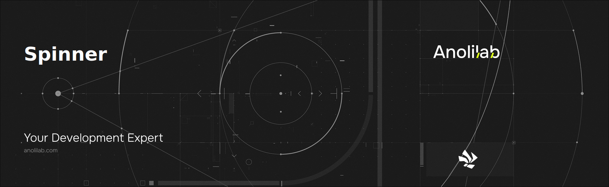

<!-- START_PACKAGE_OG_IMAGE_PLACEHOLDER -->

<a href="https://www.anolilab.com/open-source" align="center">

  

</a>

<h3 align="center">Minimal terminal spinners</h3>

<!-- END_PACKAGE_OG_IMAGE_PLACEHOLDER -->

<br />

<div align="center">

[![typescript-image][typescript-badge]][typescript-url]
[![mit licence][license-badge]][license]
[![npm downloads][npm-downloads-badge]][npm-downloads]
[![Chat][chat-badge]][chat]
[![PRs Welcome][prs-welcome-badge]][prs-welcome]

</div>

---

<div align="center">
    <p>
        <sup>
            Daniel Bannert's open source work is supported by the community on <a href="https://github.com/sponsors/prisis">GitHub Sponsors</a>
        </sup>
    </p>
</div>

---

## Install

```sh
npm install @visulima/spinner
```

```sh
yarn add @visulima/spinner
```

```sh
pnpm add @visulima/spinner
```

## Usage

### Basic Example

```ts
import { InteractiveManager, InteractiveStreamHook } from "@visulima/interactive-manager";
import { Spinner } from "@visulima/spinner";

const stdoutHook = new InteractiveStreamHook(process.stdout);
const stderrHook = new InteractiveStreamHook(process.stderr);
const manager = new InteractiveManager(stdoutHook, stderrHook);

const spinner = new Spinner({ name: "dots" }, manager);

spinner.start("Loading...");

// Do work...
await new Promise((resolve) => setTimeout(resolve, 3000));

spinner.succeed("Done!");
```

### Styling

```ts
// Declarative style — uses Node.js util.styleText
const spinner = new Spinner(
    {
        name: "dots",
        style: { bold: true, color: "blue" },
    },
    manager,
);

// Function style — full control (e.g., with @visulima/colorize)
const spinner = new Spinner(
    {
        name: "dots",
        style: (text) => colorize.bold.blue(text),
    },
    manager,
);
```

### Status Methods

```ts
const spinner = new Spinner({ name: "dots" }, manager);

spinner.start("Loading...");

// Update text
spinner.text = "Still loading...";

// Update prefix
spinner.prefixText = "[INFO]";

// Finish with status
spinner.succeed("Task completed!");
spinner.failed("Task failed!");
spinner.warn("Task completed with warnings");
spinner.info("Information");
```

### Pause and Resume

```ts
spinner.start("Working...");
spinner.pause(); // Stops animation, keeps state
spinner.resume(); // Continues animation
spinner.succeed("Done!");
```

### MultiSpinner

```ts
import { MultiSpinner } from "@visulima/spinner";

const multi = new MultiSpinner({ name: "dots" }, manager);

const spinner1 = multi.create("Task 1");
const spinner2 = multi.create("Task 2");

spinner1.start();
spinner2.start();

// Later...
spinner1.succeed("Task 1 done");
spinner2.succeed("Task 2 done");
multi.stop();
```

### Custom Icons

```ts
const spinner = new Spinner(
    {
        name: "dots",
        icons: {
            success: "OK",
            error: "FAIL",
            warning: "WARN",
            info: "NOTE",
        },
    },
    manager,
);
```

### Available Spinners

109 spinners from cli-spinners, Rattles, and unicode-animations:

- `dots`, `dots2`, `dots3` — Braille dots
- `line`, `line2` — Simple line spinners
- `breathe`, `helix`, `cascade` — Unicode braille animations
- `bouncingBar`, `bouncingBall` — Bouncing animations
- `clock`, `earth`, `moon` — Themed spinners
- And 90+ more!

## Related

For detailed documentation on all spinners, API reference, and usage patterns:

- **Online Docs:** [visulima.com/packages/spinner](https://visulima.com/packages/spinner)
- **Local Docs:** [./docs](./docs)

## Supported Node.js Versions

Libraries in this ecosystem make the best effort to track [Node.js' release schedule](https://github.com/nodejs/release#release-schedule).
Here's [a post on why we think this is important](https://medium.com/the-node-js-collection/maintainers-should-consider-following-node-js-release-schedule).

## Contributing

If you would like to help take a look at the [list of issues](https://github.com/visulima/visulima/issues) and check our [Contributing](.github/CONTRIBUTING.md) guidelines.

> **Note:** please note that this project is released with a Contributor Code of Conduct. By participating in this project you agree to abide by its terms.

## Credits

Spinner animations inspired by [cli-spinners](https://github.com/sindresorhus/cli-spinners) by Sindre Sorhus.

- [Daniel Bannert](https://github.com/prisis)
- [All Contributors](https://github.com/visulima/visulima/graphs/contributors)

## Made with ❤️ at Anolilab

This is an open source project and will always remain free to use. If you think it's cool, please star it 🌟. [Anolilab](https://www.anolilab.com/open-source) is a Development and AI Studio. Contact us at [hello@anolilab.com](mailto:hello@anolilab.com) if you need any help with these technologies or just want to say hi!

## License

The visulima spinner is open-sourced software licensed under the [MIT][license]

<!-- badges -->

[license-badge]: https://img.shields.io/npm/l/@visulima/spinner?style=for-the-badge
[license]: https://github.com/visulima/visulima/blob/main/LICENSE
[npm-downloads-badge]: https://img.shields.io/npm/dm/@visulima/spinner?style=for-the-badge
[npm-downloads]: https://www.npmjs.com/package/@visulima/spinner
[prs-welcome-badge]: https://img.shields.io/badge/PRs-welcome-brightgreen.svg?style=for-the-badge
[prs-welcome]: https://github.com/visulima/visulima/blob/main/.github/CONTRIBUTING.md
[chat-badge]: https://img.shields.io/discord/932323359193186354.svg?style=for-the-badge
[chat]: https://discord.gg/TtFJY8xkFK
[typescript-badge]: https://img.shields.io/badge/Typescript-294E80.svg?style=for-the-badge&logo=typescript
[typescript-url]: https://www.typescriptlang.org/
