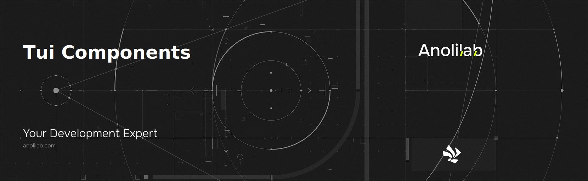

<!-- START_PACKAGE_OG_IMAGE_PLACEHOLDER -->

<a href="https://www.anolilab.com/open-source" align="center">

  

</a>

<h3 align="center">Component library for @visulima/tui — installable as a package, or copy-pasteable via the shadcn CLI registry</h3>

<!-- END_PACKAGE_OG_IMAGE_PLACEHOLDER -->

<div align="center">

[![typescript-image][typescript-badge]][typescript-url]
[![mit licence][license-badge]][license]
[![npm downloads][npm-downloads-badge]][npm-downloads]
[![Chat][chat-badge]][chat]
[![PRs Welcome][prs-welcome-badge]][prs-welcome]

</div>

---

<div align="center">
    <p>
        <sup>
            Daniel Bannert's open source work is supported by the community on <a href="https://github.com/sponsors/prisis">GitHub Sponsors</a>
        </sup>
    </p>
</div>

---

Charts, inputs, overlays, layout and AI-chat components for [`@visulima/tui`](../tui/README.md). Every component is rendered by the `@visulima/tui` runtime — its React reconciler, yoga layout and native Rust diff engine — so this package holds components only.

## Two ways to use it

Pick whichever fits. The source is identical; only the delivery differs.

### 1. Install it

You get versioned components and upgrades for free. Each component is its own subpath export, so you only pay for what you import.

```sh
npm install @visulima/tui @visulima/tui-components
```

```sh
pnpm add @visulima/tui @visulima/tui-components
```

```tsx
import { render } from "@visulima/tui";
import Box from "@visulima/tui/components/box";
import Gauge from "@visulima/tui-components/gauge";

render(
    <Box>
        <Gauge label="CPU" value={72} />
    </Box>,
);
```

### 2. Copy it in

You own the code and can change anything. The component is copied into your repo; `@visulima/tui` stays an installed dependency because the renderer can't be copy-pasted.

```sh
npx shadcn@latest add https://visulima.com/r/gauge.json
```

Components that build on others (`area-chart` uses `line-chart` and `chart-utils`) declare those as registry dependencies, so the CLI fetches them too.

> **Note:** copied files use the automatic JSX runtime and do not import React. Your `tsconfig.json` needs `"jsx": "react-jsx"`, otherwise you'll hit `ReferenceError: React is not defined`.

## What lives where

`@visulima/tui` owns the runtime and the primitives every component builds on — `Box`, `Text`, `Canvas`, `Cursor`, `Newline`, `Spacer`, `Static`, `StaticRender`, `Transform` — plus the hooks (`@visulima/tui/hooks/*`). Import those from there:

```tsx
import Box from "@visulima/tui/components/box";
import Text from "@visulima/tui/components/text";
import useInput from "@visulima/tui/hooks/use-input";
```

Everything above that layer lives here: charts (`gauge`, `area-chart`, `bar-chart`, `line-chart`, `sparkline`, `heatmap`, `histogram`, `scatter-plot`), inputs (`text-input`, `textarea`, `select-input`, `multi-select`, `slider`, `date-picker`, `calendar`, `masked-input`, `search-input`), overlays (`dialog`, `toast`, `tooltip`, `command-palette`), layout (`card`, `table`, `tabs`, `tree-view`, `scroll-view`), and AI-chat widgets (`message-bubble`, `streaming-text`, `approval-prompt`, `operation-tree`).

## Heavy features are optional

Some components need a peer that is not installed by default, so unused features cost nothing. Install the peer only if you use the component:

| Component          | Peer                               |
| ------------------ | ---------------------------------- |
| `code`, `markdown` | `shiki`, `@shikijs/langs`/`themes` |
| `markdown`         | `marked`                           |
| `diff-view`        | `diff`                             |
| `big-text`         | `cfonts`                           |
| `table`            | `@visulima/tabular`                |

## Contributing

If you would like to help take a look at the [list of issues](https://github.com/visulima/visulima/issues) and check our [Contributing](.github/CONTRIBUTING.md) guidelines.

> **Note:** please note that this project is released with a Contributor Code of Conduct. By participating in this project you agree to abide by its terms.

## Credits

- [Daniel Bannert](https://github.com/prisis)
- [All Contributors](https://github.com/visulima/visulima/graphs/contributors)

## Made with ❤️ at Anolilab

This is an open source project and will always remain free to use. If you think it's cool, please star it 🌟. [Anolilab](https://www.anolilab.com/open-source) is a Development and AI Studio. Contact us at [hello@anolilab.com](mailto:hello@anolilab.com) if you need any help with these technologies or just want to say hi!

## License

The visulima tui-components is open-sourced software licensed under the [MIT][license]

<!-- badges -->

[license-badge]: https://img.shields.io/npm/l/@visulima/tui-components?style=for-the-badge
[license]: https://github.com/visulima/visulima/blob/main/LICENSE
[npm-downloads-badge]: https://img.shields.io/npm/dm/@visulima/tui-components?style=for-the-badge
[npm-downloads]: https://www.npmjs.com/package/@visulima/tui-components
[prs-welcome-badge]: https://img.shields.io/badge/PRs-welcome-brightgreen.svg?style=for-the-badge
[prs-welcome]: https://github.com/visulima/visulima/blob/main/.github/CONTRIBUTING.md
[chat-badge]: https://img.shields.io/discord/932323359193186354.svg?style=for-the-badge
[chat]: https://discord.gg/TtFJY8xkFK
[typescript-badge]: https://img.shields.io/badge/Typescript-294E80.svg?style=for-the-badge&logo=typescript
[typescript-url]: https://www.typescriptlang.org/
