# Scroll Components

`@visulima/tui` provides two approaches to scrolling:

1. **CSS-level scrolling** via `Box` props (`overflow="scroll"`, `scrollTop`, `sticky`) — integrated into the layout engine with native scrollbar rendering and sticky header support. See the [Box component docs](./components#overflow-and-css-level-scrolling).
2. **Component-based scrolling** via `ScrollView`, `ScrollList`, etc. — higher-level React components with imperative APIs, selection management, and alignment modes.

### When to use which

| Feature                         | Box `overflow="scroll"`                       | `ScrollView` component                                       |
| ------------------------------- | --------------------------------------------- | ------------------------------------------------------------ |
| **Scrollbar**                   | Built-in (`scrollbar` prop, on by default)    | Built-in (`scrollbar` prop)                                  |
| **Scroll position**             | You manage via `scrollTop`/`scrollLeft` props | Managed internally, control via ref (`scrollBy`, `scrollTo`) |
| **Keyboard navigation**         | You handle via `useInput`                     | Built-in (`keyboard` prop, optional `vimBindings`)           |
| **Sticky headers**              | Yes (`sticky` prop on children)               | No                                                           |
| **Selection tracking**          | No                                            | Yes (via `ScrollList` with `selectedIndex`)                  |
| **Follow output (log tailing)** | No                                            | Yes (`followOutput` prop)                                    |
| **Virtualization**              | No                                            | Yes (`virtualize` prop)                                      |
| **Reach callbacks**             | No                                            | Yes (`onReachEnd`/`onReachStart`)                            |
| **Best for**                    | Simple overflow with sticky headers           | Lists, dynamic content, keyboard-driven UIs                  |

> **Important:** These are separate scroll systems. Do not nest `ScrollView` inside a `Box` with
> `overflow="scroll"` — the Box scrollbar will not reflect ScrollView's scroll position because
> they track scroll state independently. Use one or the other, not both.

## Component-Based Scroll

Ported from the [ByteLand](https://github.com/ByteLandTechnology) scroll ecosystem. Import from `@visulima/tui`.

```tsx
import { ControlledScrollView } from "@visulima/tui/components/controlled-scroll-view";
import { ScrollBar } from "@visulima/tui/components/scroll-bar";
import { ScrollBarBox } from "@visulima/tui/components/scroll-bar-box";
import { ScrollList } from "@visulima/tui/components/scroll-list";
import { ScrollView } from "@visulima/tui/components/scroll-view";
```

## `ScrollView`

A scrollable viewport that manages its own scroll state. Control it imperatively via a ref.


```tsx
import { useRef } from "react";
import { Box } from "@visulima/tui/components/box";
import { ScrollView } from "@visulima/tui/components/scroll-view";
import { Text } from "@visulima/tui/components/text";
import { useInput } from "@visulima/tui/hooks/use-input";
import type { ScrollViewRef } from "@visulima/tui/components/scroll-view";
const Demo = () => {
    const scrollRef = useRef<ScrollViewRef>(null);

    useInput((input, key) => {
        if (key.downArrow) scrollRef.current?.scrollBy(1);
        if (key.upArrow) scrollRef.current?.scrollBy(-1);
    });

    return (
        <Box height={10} borderStyle="single">
            <ScrollView ref={scrollRef}>
                {items.map((item) => (
                    <Text key={item.id}>{item.label}</Text>
                ))}
            </ScrollView>
        </Box>
    );
};
```

### Dynamic Items


### Expand / Collapse



### Terminal Resize


### Width Changes (Text Wrapping)


### Props

Extends `BoxProps`.

| Prop                    | Type       | Description                                                                 |
| ----------------------- | ---------- | --------------------------------------------------------------------------- |
| `onScroll`              | `function` | Callback with current scroll offset                                         |
| `onViewportSizeChange`  | `function` | Fires when viewport dimensions change                                       |
| `onContentHeightChange` | `function` | Fires when total content height changes                                     |
| `onItemHeightChange`    | `function` | Fires when an individual item resizes                                       |
| `debug`                 | `boolean`  | Disables overflow hidden for debugging                                      |
| `keyboard`              | `boolean`  | Enable built-in keyboard navigation (default: `false`)                      |
| `vimBindings`           | `boolean`  | Enable vim-style keys j/k/g/G/u/d (requires `keyboard`, default: `false`)   |
| `followOutput`          | `boolean`  | Auto-scroll to bottom when content grows (default: `false`)                 |
| `followThreshold`       | `number`   | Lines from bottom that count as "at bottom" for followOutput (default: `3`) |
| `onReachEnd`            | `function` | Fires once when scrolled within `reachThreshold` of the end                 |
| `onReachStart`          | `function` | Fires once when scrolled within `reachThreshold` of the start               |
| `reachThreshold`        | `number`   | Distance in lines to trigger reach callbacks (default: `5`)                 |
| `scrollbar`             | `boolean`  | Show a scrollbar when content overflows (default: `false`)                  |
| `scrollbarColor`        | `string`   | Color of the scrollbar thumb and track                                      |
| `virtualize`            | `boolean`  | Only render visible items + overscan (default: `false`)                     |
| `overscan`              | `number`   | Extra items to render outside viewport when virtualized (default: `3`)      |

### Ref Methods

| Method                | Description                          |
| --------------------- | ------------------------------------ |
| `scrollTo(offset)`    | Scroll to absolute position          |
| `scrollBy(delta)`     | Scroll by relative amount            |
| `scrollToTop()`       | Scroll to top                        |
| `scrollToBottom()`    | Scroll to bottom                     |
| `getScrollOffset()`   | Current scroll position              |
| `getContentHeight()`  | Total content height                 |
| `getViewportHeight()` | Visible viewport height              |
| `getBottomOffset()`   | Max scroll offset                    |
| `getItemHeight(i)`    | Height of item at index              |
| `getItemPosition(i)`  | Position and height of item at index |
| `remeasure()`         | Re-measure viewport dimensions       |
| `remeasureItem(i)`    | Re-measure a specific child          |

## `ControlledScrollView`

Lower-level variant where the parent owns the `scrollOffset` state.

```tsx
import { useState } from "react";
import { Box } from "@visulima/tui/components/box";
import { ControlledScrollView } from "@visulima/tui/components/controlled-scroll-view";
import { Text } from "@visulima/tui/components/text";
import { useInput } from "@visulima/tui/hooks/use-input";
const Demo = () => {
    const [offset, setOffset] = useState(0);

    useInput((input, key) => {
        if (key.downArrow) setOffset((o) => o + 1);
        if (key.upArrow) setOffset((o) => Math.max(0, o - 1));
    });

    return (
        <Box height={10} borderStyle="single">
            <ControlledScrollView scrollOffset={offset}>
                {items.map((item) => (
                    <Text key={item.id}>{item.label}</Text>
                ))}
            </ControlledScrollView>
        </Box>
    );
};
```

## `ScrollBar`

A visual scroll position indicator. Works in two placement modes:

- **Border mode** (`placement="left"` or `"right"`): Integrates with a container's border.
- **Inset mode** (`placement="inset"`): Placed inside the content area.

### Border Mode


### Inset Mode


### Auto Hide


```tsx
import { Box } from "@visulima/tui/components/box";
import { ScrollBar } from "@visulima/tui/components/scroll-bar";
import { Text } from "@visulima/tui/components/text";
<Box flexDirection="row">
    <Box borderStyle="single" borderRight={false} height={10}>
        <Text>Content here</Text>
    </Box>
    <ScrollBar placement="right" style="single" contentHeight={100} viewportHeight={10} scrollOffset={scrollOffset} />
</Box>;
```

### Props

| Prop             | Type                 | Default   | Description                         |
| ---------------- | -------------------- | --------- | ----------------------------------- |
| `contentHeight`  | `number`             | required  | Total content height                |
| `viewportHeight` | `number`             | required  | Visible viewport height             |
| `scrollOffset`   | `number`             | required  | Current scroll position             |
| `placement`      | `ScrollBarPlacement` | `'right'` | `'left'`, `'right'`, or `'inset'`   |
| `style`          | `ScrollBarStyle`     | varies    | Visual style                        |
| `thumbChar`      | `string`             | ---       | Custom thumb character (inset only) |
| `trackChar`      | `string`             | ---       | Custom track character (inset only) |
| `autoHide`       | `boolean`            | `false`   | Hide when content fits (inset only) |
| `color`          | `string`             | ---       | Scroll bar color                    |
| `dimColor`       | `boolean`            | `false`   | Dimmed styling                      |

## `ScrollBarBox`

A `Box` with a built-in scroll bar on one border.

```tsx
import { ScrollBarBox } from "@visulima/tui/components/scroll-bar-box";
import { Text } from "@visulima/tui/components/text";
<ScrollBarBox height={12} borderStyle="single" contentHeight={50} viewportHeight={10} scrollOffset={scrollOffset}>
    {visibleItems.map((item) => (
        <Text key={item.id}>{item.label}</Text>
    ))}
</ScrollBarBox>;
```

### Props

Extends `BoxProps`.

| Prop                | Type                | Default   | Description                  |
| ------------------- | ------------------- | --------- | ---------------------------- |
| `contentHeight`     | `number`            | required  | Total content height         |
| `viewportHeight`    | `number`            | required  | Visible viewport height      |
| `scrollOffset`      | `number`            | required  | Current scroll position      |
| `scrollBarPosition` | `'left' \| 'right'` | `'right'` | Which side to show the bar   |
| `scrollBarAutoHide` | `boolean`           | `false`   | Hide thumb when content fits |
| `thumbChar`         | `string`            | ---       | Custom thumb character       |

## `ScrollList`

A `ScrollView` with externally controlled selection and automatic scroll-into-view.

### Selection & Navigation


### Scroll Alignment Modes


### Expand / Collapse


### Dynamic Items


```tsx
import { useRef, useState } from "react";
import { Box } from "@visulima/tui/components/box";
import { ScrollList } from "@visulima/tui/components/scroll-list";
import { Text } from "@visulima/tui/components/text";
import { useInput } from "@visulima/tui/hooks/use-input";
const Demo = () => {
    const [selected, setSelected] = useState(0);
    const items = ["Apple", "Banana", "Cherry", "Date", "Elderberry"];

    useInput((input, key) => {
        if (key.downArrow) setSelected((i) => Math.min(i + 1, items.length - 1));
        if (key.upArrow) setSelected((i) => Math.max(i - 1, 0));
    });

    return (
        <ScrollList height={5} selectedIndex={selected}>
            {items.map((item, i) => (
                <Box key={i}>
                    <Text color={i === selected ? "blue" : "white"}>
                        {i === selected ? "> " : "  "}
                        {item}
                    </Text>
                </Box>
            ))}
        </ScrollList>
    );
};
```

### Props

Extends `ScrollViewProps`.

| Prop              | Type              | Default  | Description                               |
| ----------------- | ----------------- | -------- | ----------------------------------------- |
| `selectedIndex`   | `number`          | ---      | Currently selected item (controlled)      |
| `scrollAlignment` | `ScrollAlignment` | `'auto'` | How to position the selected item in view |

Alignment modes:

- `'auto'` --- Minimal scrolling to bring item into view
- `'top'` --- Align item to top of viewport
- `'bottom'` --- Align item to bottom of viewport
- `'center'` --- Center item in viewport

## Keyboard Navigation

Enable built-in keyboard controls on any `ScrollView` or `ScrollList` with the `keyboard` prop:

```tsx
<ScrollView keyboard height={20}>
    {items.map((item) => (
        <Text key={item.id}>{item.label}</Text>
    ))}
</ScrollView>
```

**Default key bindings:**

| Key           | Action                    |
| ------------- | ------------------------- |
| Arrow Up/Down | Scroll by 1 line          |
| Page Up/Down  | Scroll by viewport height |
| Home/End      | Jump to top/bottom        |
| Ctrl+U/D      | Half-page scroll          |

**Vim bindings** (add `vimBindings` prop):

```tsx
<ScrollView keyboard vimBindings height={20}>
    ...
</ScrollView>
```

| Key     | Action            |
| ------- | ----------------- |
| `j`/`k` | Scroll down/up    |
| `G`     | Jump to bottom    |
| `g`     | Jump to top       |
| `u`/`d` | Half-page up/down |

The `useScrollInput` hook is also available for custom scroll containers:

```tsx
import { useScrollInput } from "@visulima/tui/hooks/use-scroll-input";
useScrollInput({
    scrollBy: (delta) => ref.current?.scrollBy(delta),
    scrollToTop: () => ref.current?.scrollToTop(),
    scrollToBottom: () => ref.current?.scrollToBottom(),
    viewportHeight: 20,
    vimBindings: true,
});
```

## Auto-Follow (Log Tailing)

Keep a ScrollView pinned to the bottom as content grows — useful for log viewers:

```tsx
<ScrollView followOutput height={20}>
    {logLines.map((line, i) => (
        <Text key={i}>{line}</Text>
    ))}
</ScrollView>
```

When `followOutput` is enabled:

- If the user is at/near the bottom, new content auto-scrolls to stay at the bottom
- If the user scrolls up, auto-follow pauses
- Scrolling back to the bottom resumes auto-follow

Adjust `followThreshold` (default 3) to control how many lines from the bottom still counts as "at bottom".

## Infinite Scroll Callbacks

Detect when the user scrolls near the edges for lazy loading:

```tsx
<ScrollView height={20} onReachEnd={() => loadMoreItems()} onReachStart={() => loadPreviousItems()} reachThreshold={5}>
    {items.map((item) => (
        <Text key={item.id}>{item.label}</Text>
    ))}
</ScrollView>
```

Callbacks fire once per entry into the threshold zone and don't re-fire until the user scrolls away and back.

## Linked Scroll

Synchronize scroll position across multiple ScrollView instances (e.g., diff viewers, multi-pane layouts):

```tsx
import { ScrollView } from "@visulima/tui/components/scroll-view";
import { Text } from "@visulima/tui/components/text";
import { createLinkedScrollGroup } from "@visulima/tui/hooks/use-linked-scroll";
const group = createLinkedScrollGroup();

const LeftPane = () => {
    const { ref, onScroll } = group.useLinkedScroll();

    return (
        <ScrollView ref={ref} onScroll={onScroll} height={20}>
            {leftItems.map((item) => (
                <Text key={item.id}>{item.label}</Text>
            ))}
        </ScrollView>
    );
};

const RightPane = () => {
    const { ref, onScroll } = group.useLinkedScroll();

    return (
        <ScrollView ref={ref} onScroll={onScroll} height={20}>
            {rightItems.map((item) => (
                <Text key={item.id}>{item.label}</Text>
            ))}
        </ScrollView>
    );
};
```

Scrolling one pane automatically scrolls all others in the same group.

## Virtualization

For large lists, enable virtualization to only render items visible in the viewport:

```tsx
<ScrollView virtualize overscan={5} height={20}>
    {thousandsOfItems.map((item) => (
        <Text key={item.id}>{item.label}</Text>
    ))}
</ScrollView>
```

- Items are measured on first render, then only visible items (plus `overscan` buffer) are rendered
- Spacer elements maintain correct scroll position and content height
- Works with all other ScrollView features (keyboard, followOutput, etc.)
