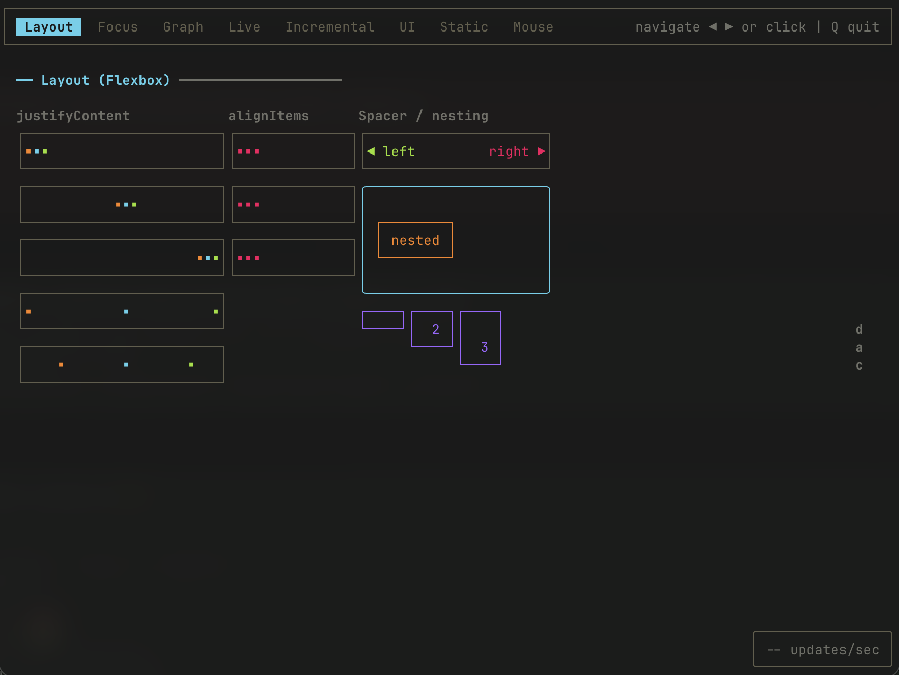
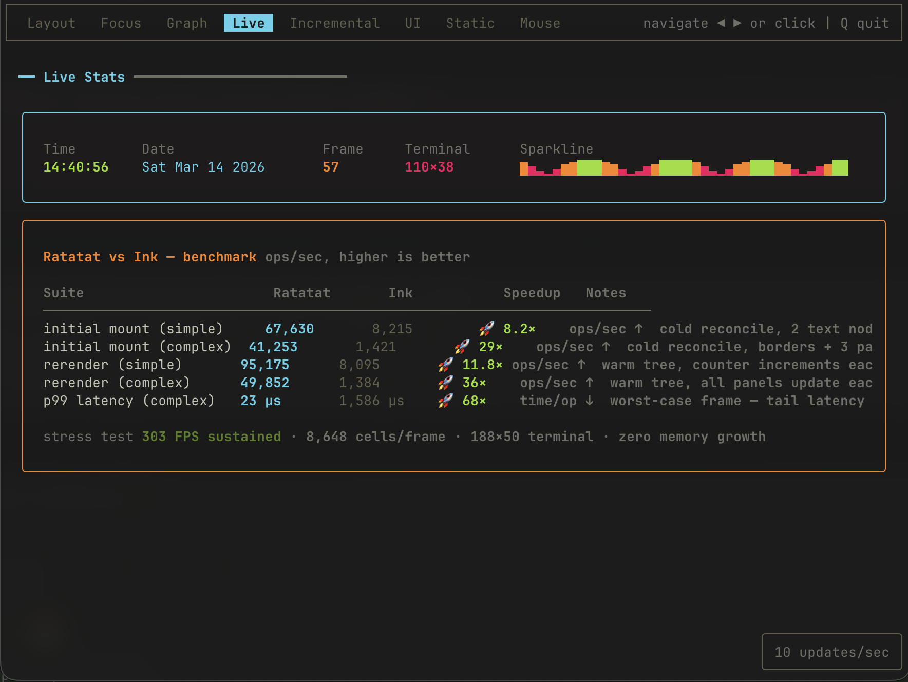
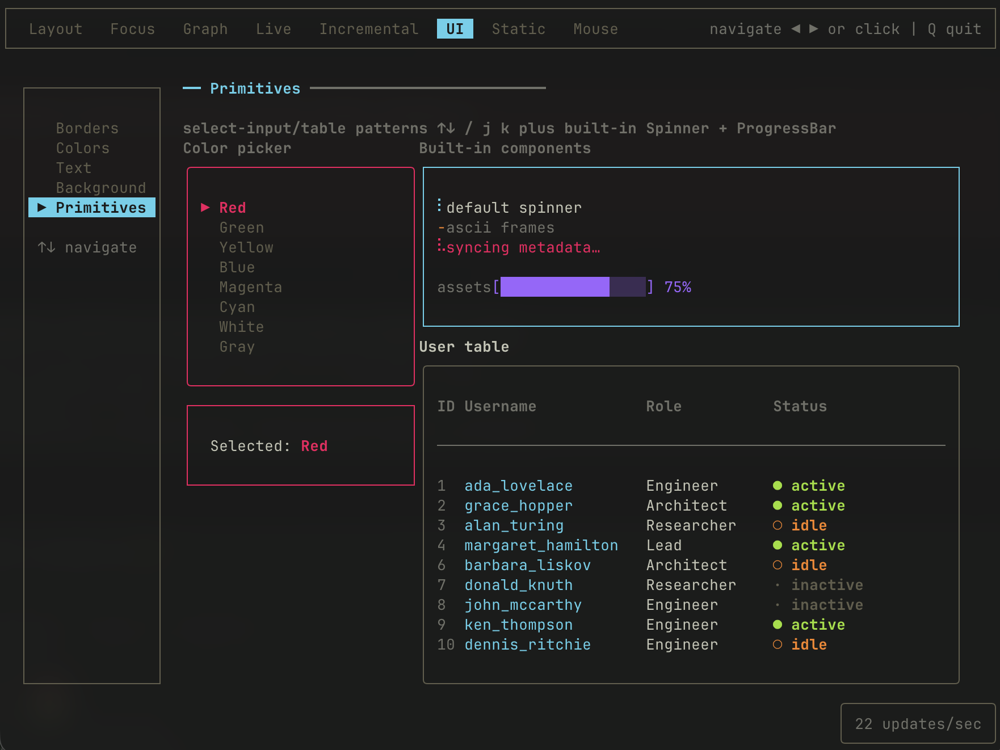
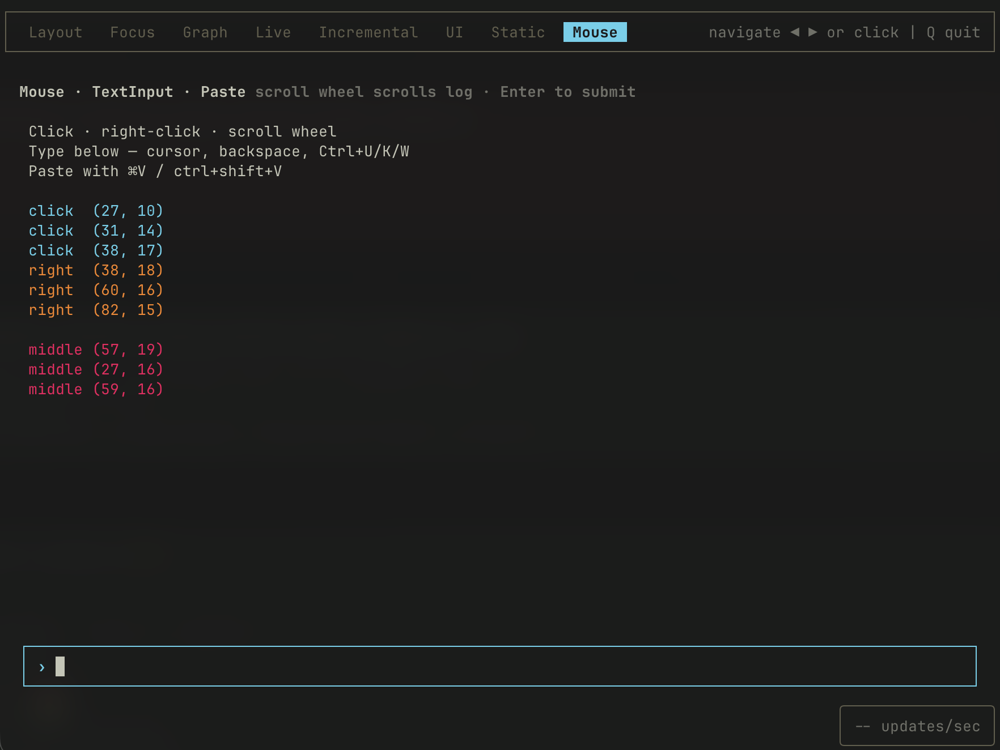

<!-- START_PACKAGE_OG_IMAGE_PLACEHOLDER -->

<a href="https://www.anolilab.com/open-source" align="center">

  

</a>

<h3 align="center">React-based TUI library powered by a native Rust diff engine, drop-in Ink-compatible API</h3>

<!-- END_PACKAGE_OG_IMAGE_PLACEHOLDER -->

<br />

<div align="center">

[![typescript-image][typescript-badge]][typescript-url]
[![mit licence][license-badge]][license]
[![npm downloads][npm-downloads-badge]][npm-downloads]
[![Chat][chat-badge]][chat]
[![PRs Welcome][prs-welcome-badge]][prs-welcome]

</div>

---

<div align="center">
    <p>
        <sup>
            Daniel Bannert's open source work is supported by the community on <a href="https://github.com/sponsors/prisis">GitHub Sponsors</a>
        </sup>
    </p>
</div>

---

## Overview

`@visulima/tui` is a React-based terminal UI library with a native Rust diff engine and drop-in [Ink](https://github.com/vadimdemedes/ink)-compatible API. Build rich, interactive CLI applications with React components, hooks, and a familiar developer experience.

Based on [ratatat](https://github.com/geoffmiller/ratatat) by Geoff Miller.

> [!IMPORTANT]
> **Breaking change.** The component library (~110 components) moved to the companion package [`@visulima/tui-kit`](https://visulima.com/docs/packages/tui-kit) — installable or copy-pasteable via its shadcn registry. `@visulima/tui` now ships only the renderer, hooks, and layout/text primitives, and its runtime dependencies dropped from 13 to 3. See the [migration guide](https://visulima.com/docs/packages/tui/migration).

## Features

- **Faster than Ink** on mount (1.3-2.3x), competitive on rerender
- **Drop-in Ink-compatible** React API
- **Native Rust diff engine** via NAPI for high-throughput rendering
- **React hooks** for input, focus, clipboard, mouse, scroll, animation, and window size
- **Layout & text primitives** - Box, Text, Static, Transform, and more; the full component library (inputs, charts, tables, 100+) ships in [`@visulima/tui-kit`](https://visulima.com/docs/packages/tui-kit)
- **Cross-platform** native bindings (macOS, Linux glibc/musl, Windows x64/arm64)
- **Server-side rendering** via `renderToString`
- **Testing utilities** with mock streams and frame capture

## Install

```sh
npm install @visulima/tui react react-reconciler
```

```sh
yarn add @visulima/tui react react-reconciler
```

```sh
pnpm add @visulima/tui react react-reconciler
```

### Component imports

`@visulima/tui` provides `render`, the hooks, and the layout/text primitives (`Box`, `Text`, …) at `@visulima/tui/components/<kebab-name>`. The higher-level component library lives in [`@visulima/tui-kit`](https://visulima.com/docs/packages/tui-kit), imported from `@visulima/tui-kit/<kebab-name>`.

```tsx
import { Box } from "@visulima/tui/components/box";
import { Text } from "@visulima/tui/components/text";
import { Spinner } from "@visulima/tui-kit/spinner";
import { useApp } from "@visulima/tui/hooks/use-app";
import { useInput } from "@visulima/tui/hooks/use-input";
import { render } from "@visulima/tui";
```

### Optional peer dependencies

A few `@visulima/tui-kit` components have heavy peer dependencies. Install only the peers for the components you use:

| Component  | Subpath                       | Required peers                                                                                            |
| ---------- | ----------------------------- | --------------------------------------------------------------------------------------------------------- |
| `BigText`  | `@visulima/tui-kit/big-text`  | `cfonts`                                                                                                  |
| `Code`     | `@visulima/tui-kit/code`      | `shiki`, `@shikijs/langs`, `@shikijs/themes`                                                              |
| `DiffView` | `@visulima/tui-kit/diff-view` | `diff` (+ `shiki`, `@shikijs/langs`, `@shikijs/themes` for syntax highlighting)                           |
| `Markdown` | `@visulima/tui-kit/markdown`  | `marked` (+ `shiki`, `@shikijs/langs`, `@shikijs/themes` for code blocks; `@visulima/tabular` for tables) |
| `Table`    | `@visulima/tui-kit/table`     | `@visulima/tabular`                                                                                       |

To enable the in-app React DevTools overlay (`DEV=true`), install `react-devtools-core` (the bridge uses the native `WebSocket`, so no `ws` is needed).

## Quick Start

```tsx
import { Box } from "@visulima/tui/components/box";
import { Text } from "@visulima/tui/components/text";
import { render } from "@visulima/tui";
const App = () => (
    <Box flexDirection="column" padding={1}>
        <Text bold>Hello, world!</Text>
        <Text color="green">Powered by a native Rust diff engine</Text>
    </Box>
);

render(<App />);
```

## Hooks

### `useAnimation(options?)`

Drive frame-based or time-based animations with a shared timer. Multiple `useAnimation` calls consolidate into one render cycle.

```tsx
import { Text } from "@visulima/tui/components/text";
import { useAnimation } from "@visulima/tui/hooks/use-animation";
const Spinner = () => {
    const { frame } = useAnimation({ interval: 80 });
    const characters = ["⠋", "⠙", "⠹", "⠸", "⠼", "⠴", "⠦", "⠧", "⠇", "⠏"];

    return <Text>{characters[frame % characters.length]}</Text>;
};
```

| Option     | Type      | Default | Description                                                                                                                 |
| ---------- | --------- | ------- | --------------------------------------------------------------------------------------------------------------------------- |
| `interval` | `number`  | `100`   | Time between ticks in milliseconds.                                                                                         |
| `isActive` | `boolean` | `true`  | Whether the animation is running. When set to `false`, the animation stops. When toggled back to `true`, values reset to 0. |

Returns `{ frame, time, delta, reset }`. See the [full hooks reference](https://visulima.com/packages/tui/hooks#useanimation) for detailed return values, more examples (sine waves, physics, pausable, reset), and `maxFps` interaction.

The full list of hooks (each at `@visulima/tui/hooks/<name>`): `use-animation`, `use-app`, `use-box-metrics`, `use-clipboard`, `use-color-blindness`, `use-console-capture`, `use-cursor`, `use-element-position`, `use-focus`, `use-focus-manager`, `use-form`, `use-hotkey`, `use-input`, `use-interval`, `use-is-screen-reader-enabled`, `use-key-bindings`, `use-key-chord`, `use-linked-scroll`, `use-mouse`, `use-mouse-action`, `use-mouse-position`, `use-on-mouse-click`, `use-on-mouse-hover`, `use-on-mouse-state`, `use-paste`, `use-persistent-state`, `use-scroll-acceleration`, `use-scroll-input`, `use-stderr`, `use-stdin`, `use-stdout`, `use-stopwatch`, `use-terminal-palette`, `use-text-buffer`, `use-text-selection`, `use-timeout`, `use-timer`, `use-window-size`. See the [hooks reference](https://visulima.com/packages/tui/hooks) for details.

## Component Catalog

`@visulima/tui` ships 90+ components, each at its own subpath `@visulima/tui/components/<name>`:

- **Layout & text**: `box`, `text`, `paragraph`, `heading`, `divider`, `spacer`, `newline`, `transform`, `gradient`, `big-text`, `shimmer-text`, `streaming-text`, `placeholder`, `link`, `kbd`, `code`, `markdown`, `diff-view`.
- **Lists & data**: `ordered-list`, `unordered-list`, `definition-list`, `option-list`, `table`, `tree-view`, `operation-tree`, `breadcrumb`, `paginator`, `tag`, `badge`, `model-badge`.
- **Inputs & forms**: `text-input`, `textarea`, `masked-input`, `search-input`, `confirm-input`, `select-input` (`select-input-item`, `select-input-indicator`), `multi-select`, `checkbox`, `radio-group`, `switch`, `slider`, `date-picker`, `calendar`, `form`, `button`, `file-picker`.
- **Feedback & status**: `alert`, `toast`, `status-line`, `status-message`, `progress-bar`, `gauge`, `spinner`, `loading-indicator`, `blink-dot`, `stepper`, `timer`, `stopwatch`, `cursor`.
- **Overlays & navigation**: `dialog`, `confirm-dialog`, `approval-prompt`, `command-palette`, `command-block`, `menu`, `tooltip`, `tab`, `tabs`, `content-switcher`, `accordion`, `collapsible`, `help`, `console-overlay`, `message-bubble`.
- **Charts & viz**: `area-chart`, `bar-chart`, `line-chart`, `scatter-plot`, `histogram`, `heatmap`, `sparkline`, `canvas`, `card`.
- **Scrolling**: `scroll-view`, `controlled-scroll-view`, `scroll-list`, `scroll-bar`, `scroll-bar-box`.
- **Animation & rendering**: `animate-presence`, `transition`, `static`, `static-render`.

Browse the live gallery and per-component APIs in the [component docs](https://visulima.com/packages/tui/components).

## Documentation

Full documentation, API reference, component gallery, and guides are available at:

**[visulima.com/packages/tui](https://visulima.com/packages/tui)**

- [Getting Started](https://visulima.com/packages/tui/getting-started)
- [Package Map](https://visulima.com/packages/tui/package-map) - Entry points and what they export
- [Components](https://visulima.com/packages/tui/components) - Box, Text, Spinner, Select, TextInput, and more
- [Hooks](https://visulima.com/packages/tui/hooks) - useInput, useFocus, useApp, useStdout, and more
- [Mouse Support](https://visulima.com/packages/tui/mouse) - Click, hover, drag, and scroll events
- [Scroll](https://visulima.com/packages/tui/scroll) - ScrollView, ScrollList, and overflow handling
- [Rendering Modes](https://visulima.com/packages/tui/rendering-modes) - Ink-compatible, React, and raw buffer
- [Ink Compatibility](https://visulima.com/packages/tui/ink-compat) - Migration guide from Ink
- [Testing](https://visulima.com/packages/tui/testing) - Testing utilities with mock streams
- [Troubleshooting](https://visulima.com/packages/tui/troubleshooting)

## Performance

| Scenario                   | @visulima/tui |      Ink 6.8 |         Speedup |
| -------------------------- | ------------: | -----------: | --------------: |
| Mount + render (simple)    |   3,221 ops/s |  2,694 ops/s | **1.2x faster** |
| Mount + render (dashboard) |   1,659 ops/s |    718 ops/s | **2.3x faster** |
| Rerender (simple)          |  19,111 ops/s | 25,743 ops/s |           0.74x |

> Benchmarks use production builds. Run: `pnpm --filter @visulima/tui run build:prod && pnpm vitest bench`

### Kitchen Sink Demo

| Layout                              | Focus                             | Graph                             | Live                            |
| ----------------------------------- | --------------------------------- | --------------------------------- | ------------------------------- |
|  |  |  |  |

| Incremental                                   | UI                          | Static                              | Mouse                             |
| --------------------------------------------- | --------------------------- | ----------------------------------- | --------------------------------- |
|  |  |  |  |

## Related

- [ink](https://github.com/vadimdemedes/ink) - React for interactive command-line apps
- [ratatat](https://github.com/geoffmiller/ratatat) - The project this library is based on
- [jacob314/ink](https://github.com/jacob314/ink) - Fork with StyledLine, Region model, and render caching (ported features)

## Supported Node.js Versions

Libraries in this ecosystem make the best effort to track [Node.js' release schedule](https://github.com/nodejs/release#release-schedule).
Here's [a post on why we think this is important](https://medium.com/the-node-js-collection/maintainers-should-consider-following-node-js-release-schedule-ab08ed4de71a).

## Contributing

If you would like to help take a look at the [list of issues](https://github.com/visulima/visulima/issues) and check our [Contributing](.github/CONTRIBUTING.md) guidelines.

> **Note:** please note that this project is released with a Contributor Code of Conduct. By participating in this project you agree to abide by its terms.

## Credits

- [Daniel Bannert](https://github.com/prisis)
- [Geoff Miller](https://github.com/geoffmiller) - Original [ratatat](https://github.com/geoffmiller/ratatat) library
- [Vadym Demedes](https://github.com/vadimdemedes) - [Ink](https://github.com/vadimdemedes/ink) (MIT)
- [Google LLC / jacob314](https://github.com/jacob314/ink) - StyledLine, Region model, render caching (Apache-2.0)
- [Zeno Jiricek](https://github.com/nickhudkins/ink-mouse) - Mouse event system (Apache-2.0)
- [All Contributors](https://github.com/visulima/visulima/graphs/contributors)

## Made with ❤️ at Anolilab

This is an open source project and will always remain free to use. If you think it's cool, please star it 🌟. [Anolilab](https://www.anolilab.com/open-source) is a Development and AI Studio. Contact us at [hello@anolilab.com](mailto:hello@anolilab.com) if you need any help with these technologies or just want to say hi!

## License

The visulima tui is open-sourced software licensed under the [MIT][license]

<!-- badges -->

[license-badge]: https://img.shields.io/npm/l/@visulima/tui?style=for-the-badge
[license]: https://github.com/visulima/visulima/blob/main/LICENSE
[npm-downloads-badge]: https://img.shields.io/npm/dm/@visulima/tui?style=for-the-badge
[npm-downloads]: https://www.npmjs.com/package/@visulima/tui
[prs-welcome-badge]: https://img.shields.io/badge/PRs-welcome-brightgreen.svg?style=for-the-badge
[prs-welcome]: https://github.com/visulima/visulima/blob/main/.github/CONTRIBUTING.md
[chat-badge]: https://img.shields.io/discord/932323359193186354.svg?style=for-the-badge
[chat]: https://discord.gg/TtFJY8xkFK
[typescript-badge]: https://img.shields.io/badge/Typescript-294E80.svg?style=for-the-badge&logo=typescript
[typescript-url]: https://www.typescriptlang.org/
