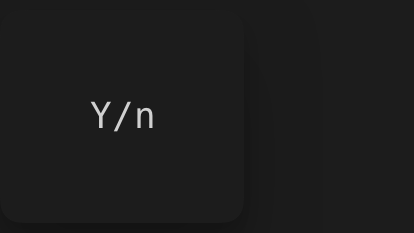
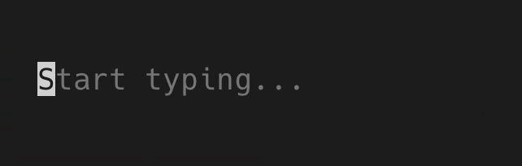
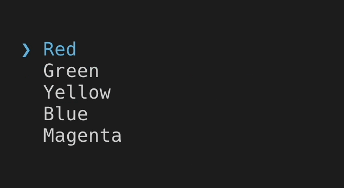
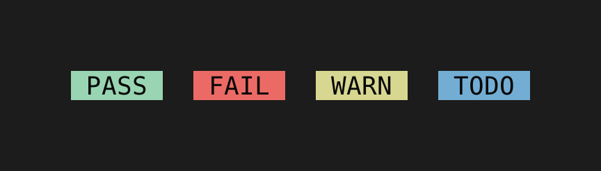
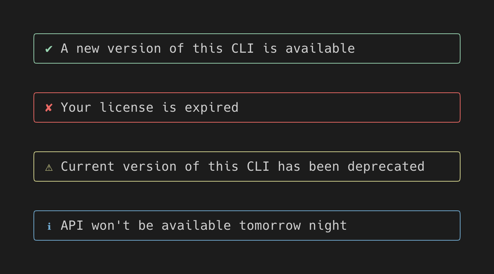
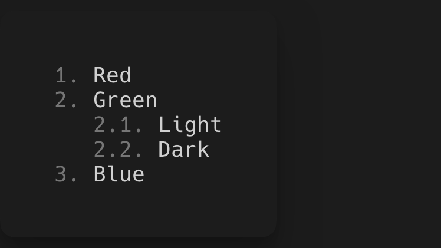

# Components

`@visulima/tui` exposes Ink-compatible core components plus Ratatat-only additions.

```tsx
import { Box, Cursor, Newline, Spacer, Static, Text, Transform } from "@visulima/tui";
import { BigText, ConfirmInput, Gradient, MultiSelect, ProgressBar, SelectInput, Spinner, Tab, Table, Tabs, TextInput } from "@visulima/tui";
```

## `Box`

Layout primitive backed by Yoga.

```tsx
<Box
    flexDirection="row" // row | column | row-reverse | column-reverse
    flexGrow={1}
    flexShrink={1}
    width={40}
    height={10}
    minWidth={10}
    minHeight={4}
    padding={1}
    paddingX={2}
    margin={1}
    gap={1}
    alignItems="center"
    justifyContent="space-between"
    borderStyle="round" // single | double | round | bold | classic | singleDouble | doubleSingle
    borderColor="cyan"
    borderBackgroundColor="blue"
    borderTop={true}
    borderRight={true}
    borderBottom={true}
    borderLeft={true}
>
    {children}
</Box>
```

### Overflow and CSS-Level Scrolling

`Box` supports CSS-level scrolling via `overflow: 'scroll'`. This is separate from the component-based `ScrollView` and provides native-style overflow clipping with integrated scrollbar rendering.

```tsx
<Box
    overflow="scroll" // visible | hidden | scroll
    overflowX="hidden" // per-axis overflow control
    overflowY="scroll" // per-axis overflow control
    scrollTop={0} // vertical scroll position (rows)
    scrollLeft={0} // horizontal scroll position (columns)
    scrollbarThumbColor="gray" // scrollbar thumb color
    scrollbar={true} // show/hide scrollbar (default: true)
    height={10}
    width={40}
>
    {longContent}
</Box>
```

### Sticky Headers

Elements within a scrollable `Box` can be pinned to the top or bottom of the viewport using the `sticky` prop. A sticky header remains pinned only while its parent section is visible.

```tsx
<Box overflow="scroll" height={15}>
    <Box sticky>
        <Text bold>Section A</Text>
    </Box>
    {sectionAContent}

    <Box sticky>
        <Text bold>Section B</Text>
    </Box>
    {sectionBContent}
</Box>
```

| Prop        | Type                           | Description                                                                                       |
| ----------- | ------------------------------ | ------------------------------------------------------------------------------------------------- |
| `sticky`    | `boolean \| 'top' \| 'bottom'` | Pin this element during scroll. `true` and `'top'` pin to the top; `'bottom'` pins to the bottom. |
| `opaque`    | `boolean`                      | Marks this element as opaque for rendering optimization (not yet active).                         |
| `scrollbar` | `boolean`                      | Show/hide the scrollbar for scrollable elements. Defaults to `true`.                              |

Notes:

- `Box` defaults to `flexDirection="row"` unless you set it explicitly.
- Border side toggles (`borderTop`, etc.) are supported.
- Per-side border colors are supported: `borderTopColor`, `borderBottomColor`, `borderLeftColor`, `borderRightColor`.
- Per-side border background colors are supported: `borderTopBackgroundColor`, `borderBottomBackgroundColor`, `borderLeftBackgroundColor`, `borderRightBackgroundColor`.
- Per-side dim is supported: `borderTopDimColor`, `borderBottomDimColor`, `borderLeftDimColor`, `borderRightDimColor`.

## `Text`

Renders styled text.

```tsx
<Text
    color="cyan" // named, #rgb, #rrggbb, rgb(r,g,b), or ANSI index 0-255
    backgroundColor="blue"
    bold
    italic
    underline
    strikethrough
    dim
    inverse
>
    Hello world
</Text>
```

`dimColor` is supported as an Ink-compat alias for `dim`.

## `Cursor`

Declaratively position the terminal cursor. Two modes are available:

### Inline mode (no props)

Place `<Cursor />` after a `<Text>` node. The cursor appears where the preceding text ended, even when text wraps across lines.

```tsx
<Box>
    <Text>{prompt + value}</Text>
    <Cursor />
</Box>
```

This is the recommended approach for text inputs. It handles text wrapping, wide characters (CJK, emoji), and multi-line output automatically because the cursor position is derived from the actual rendered text output.

For editable text with a cursor position in the middle:

```tsx
<Box>
    <Text>{value.slice(0, cursorPos)}</Text>
    <Cursor />
    <Text>{value.slice(cursorPos)}</Text>
</Box>
```

### Anchor mode

Pass `anchorRef` and/or `x`/`y` to position the cursor relative to another element's content origin.

```tsx
const ref = useRef(null);

<Box ref={ref}>
    <Text>{content}</Text>
</Box>
<Cursor anchorRef={ref} x={5} y={1} />
```

| Prop        | Type                         | Default     |
| ----------- | ---------------------------- | ----------- |
| `anchorRef` | `RefObject<DOMElement/null>` | parent node |
| `x`         | `number`                     | `0`         |
| `y`         | `number`                     | `0`         |

Notes:

- `<Cursor>` must not be rendered inside `<Text>`.
- If multiple `<Cursor>` components are rendered, the last one controls the terminal cursor.
- If `anchorRef` is set but unresolved, the cursor is hidden for that frame.
- See also [`useCursor()`](./hooks.mdx#usecursor) for imperative cursor control (e.g. IME support).

## `Code`

Syntax-highlighted code display using [Shiki](https://shiki.style/). Supports 25+ languages with lazy loading and VS Code-quality tokenization.

```tsx
import { Code } from "@visulima/tui";

<Code code='const x = "hello";' language="javascript" />
<Code code={source} language="python" showLineNumbers startLine={10} />
```

| Prop              | Type                  | Default                 | Description                                |
| ----------------- | --------------------- | ----------------------- | ------------------------------------------ |
| `code`            | `string`              | _(required)_            | Source code to highlight                   |
| `language`        | `string`              | —                       | Programming language (e.g. `"typescript"`) |
| `theme`           | `string`              | `"github-dark-default"` | Shiki theme name                           |
| `showLineNumbers` | `boolean`             | `false`                 | Show line number gutter                    |
| `startLine`       | `number`              | `1`                     | Starting line number (for excerpts)        |
| `highlightLines`  | `ReadonlySet<number>` | —                       | Line numbers to visually emphasize         |

Supported languages: `javascript`, `typescript`, `jsx`, `tsx`, `json`, `html`, `css`, `python`, `ruby`, `rust`, `go`, `java`, `bash`, `shell`, `sql`, `markdown`, `yaml`, `toml`, `xml`, `svelte`, `vue`, and more. Unknown languages fall back to plain text.

The highlighter loads asynchronously — the first render shows plain text, then re-renders with colors once Shiki is ready.

## `DiffView`

Display file differences with colored additions/deletions. Supports unified and split (side-by-side) views with optional inline character-level diff highlighting.

```tsx
import { DiffView } from "@visulima/tui";

<DiffView oldText={original} newText={modified} />
<DiffView diff={unifiedDiffString} mode="split" />
<DiffView oldText={a} newText={b} oldLabel="v1.0" newLabel="v2.0" inlineDiff />
```

| Prop              | Type                     | Default                 | Description                                           |
| ----------------- | ------------------------ | ----------------------- | ----------------------------------------------------- |
| `oldText`         | `string`                 | `""`                    | Original text (left / old)                            |
| `newText`         | `string`                 | `""`                    | Modified text (right / new)                           |
| `diff`            | `string`                 | —                       | Pre-computed unified diff (overrides oldText/newText) |
| `mode`            | `"unified"` \| `"split"` | `"unified"`             | Display mode                                          |
| `showLineNumbers` | `boolean`                | `true`                  | Show line numbers                                     |
| `context`         | `number`                 | `3`                     | Unchanged context lines around changes                |
| `inlineDiff`      | `boolean`                | `true`                  | Character-level highlighting within changed lines     |
| `oldLabel`        | `string`                 | `"old"`                 | Label for the old version                             |
| `newLabel`        | `string`                 | `"new"`                 | Label for the new version                             |
| `language`        | `string`                 | —                       | Programming language for syntax highlighting          |
| `theme`           | `string`                 | `"github-dark-default"` | Shiki theme for syntax highlighting                   |

### Syntax highlighting in diffs

When `language` is provided, diff content is highlighted with Shiki (same engine as the `Code` component). Syntax colors are preserved for context lines, and overlaid with diff colors (red/green) for changed lines.

```tsx
<DiffView oldText={oldCode} newText={newCode} language="typescript" />
```

Colors: additions in green (`+`), deletions in red (`-`), context lines dimmed. Inline diff highlights changed characters with inverted background.

## `BigText`

Render large ASCII art text using [CFonts](https://github.com/dominikwilkowski/cfonts). Ported from [`ink-big-text`](https://github.com/sindresorhus/ink-big-text).

```tsx
import { BigText } from "@visulima/tui";

<BigText text="Hello" />
<BigText text="Cool" font="chrome" colors={["red", "blue"]} />
```

| Prop              | Type                            | Default         |
| ----------------- | ------------------------------- | --------------- |
| `text`            | `string`                        | required        |
| `font`            | `Font`                          | `'block'`       |
| `align`           | `'left' \| 'center' \| 'right'` | `'left'`        |
| `colors`          | `string[]`                      | `['system']`    |
| `backgroundColor` | `BackgroundColor`               | `'transparent'` |
| `letterSpacing`   | `number`                        | `1`             |
| `lineHeight`      | `number`                        | `1`             |
| `space`           | `boolean`                       | `true`          |
| `maxLength`       | `number`                        | `0`             |

Available fonts: `block`, `slick`, `tiny`, `grid`, `pallet`, `shade`, `simple`, `simpleBlock`, `3d`, `simple3d`, `chrome`, `huge`.

## `Gradient`

Apply a terminal color gradient to child text. Ported from [`ink-gradient`](https://github.com/sindresorhus/ink-gradient), uses `@visulima/colorize` internally.

```tsx
import { Gradient, Text } from "@visulima/tui";

<Gradient name="rainbow">
    <Text>Hello, World!</Text>
</Gradient>

<Gradient colors={["#ff0000", "#00ff00", "#0000ff"]}>
    <Text>Custom gradient</Text>
</Gradient>
```

| Prop     | Type             | Default |
| -------- | ---------------- | ------- |
| `name`   | `GradientName`   | —       |
| `colors` | `GradientColors` | —       |

`name` and `colors` are mutually exclusive — exactly one must be provided.

Built-in presets: `rainbow`, `cristal`, `teen`, `mind`, `morning`, `vice`, `passion`, `fruit`, `instagram`, `atlas`, `retro`, `summer`, `pastel`.

## `Link`

Create clickable hyperlinks in the terminal using OSC 8 sequences. Ported from [`ink-link`](https://github.com/sindresorhus/ink-link).

```tsx
import { Link, Text } from "@visulima/tui";

<Link url="https://example.com">
    <Text color="cyan">My Website</Text>
</Link>

// Custom fallback for unsupported terminals
<Link url="https://example.com" fallback={(text, url) => `[${text}](${url})`}>
    <Text>Docs</Text>
</Link>
```

| Prop       | Type                                                 | Default | Description                        |
| ---------- | ---------------------------------------------------- | ------- | ---------------------------------- |
| `url`      | `string`                                             | —       | The URL to link to (required)      |
| `fallback` | `boolean \| ((text: string, url: string) => string)` | `true`  | Fallback for unsupported terminals |
| `children` | `ReactNode`                                          | —       | Link text content                  |

When `fallback` is `true`, unsupported terminals show: `My Website https://example.com`. When `false`, only the text is shown. A function receives `(text, url)` for custom formatting.

[Supported terminals.](https://gist.github.com/egmontkob/eb114294efbcd5adb1944c9f3cb5feda)

## `Markdown`

Render Markdown content as terminal UI elements. Parses with [marked](https://marked.js.org/) and maps tokens to Ink components. Code blocks are syntax-highlighted via the `Code` component.

````tsx
import { Markdown } from "@visulima/tui";

<Markdown>{"# Hello World\n\nThis is **bold** and *italic*."}</Markdown>
<Markdown codeTheme="github-dark-default">{"```js\nconst x = 1;\n```"}</Markdown>
````

| Prop        | Type      | Default                 | Description                          |
| ----------- | --------- | ----------------------- | ------------------------------------ |
| `children`  | `string`  | _(required)_            | Markdown source string               |
| `codeTheme` | `string`  | `"github-dark-default"` | Shiki theme for code blocks          |
| `maxWidth`  | `number`  | terminal width          | Maximum text wrap width              |
| `streaming` | `boolean` | `false`                 | Progressive rendering for LLM output |

### Streaming mode

Enable `streaming` when rendering Markdown that arrives incrementally (e.g., token-by-token from an AI model). The component handles incomplete Markdown gracefully — unclosed code fences and partial blocks render as text until they close.

```tsx
const [text, setText] = useState("");
// ... text grows as tokens arrive ...
<Markdown streaming>{text}</Markdown>;
```

### Supported Markdown features

- **Headings** (H1-H6) — bold, color-coded by depth
- **Paragraphs** — with word wrapping
- **Code blocks** — syntax highlighted via `<Code>` component
- **Inline code** — rendered with inverse styling
- **Bold**, **italic**, **strikethrough**
- **Links** — rendered via the existing `<Link>` component (OSC 8)
- **Ordered and unordered lists** — via existing `<OrderedList>` / `<UnorderedList>`
- **Blockquotes** — with left border
- **Horizontal rules**
- **Tables** — via existing `<Table>` component
- **Images** — displayed as `[image: alt text]` (terminals cannot render images)

## `Newline`

```tsx
<Newline />
<Newline count={2} />
```

## `Spacer`

```tsx
<Box flexDirection="row">
    <Text>Left</Text>
    <Spacer />
    <Text>Right</Text>
</Box>
```

## `Static`

Append-only region for completed items and log lines.

```tsx
<Static items={completedTasks}>
    {(task) => (
        <Box key={task.id}>
            <Text color="green">✓ {task.name}</Text>
        </Box>
    )}
</Static>
```

`Static` only appends new tail items from `items`.

## `Transform`

Applies a transform function to the collected text output of its subtree.

```tsx
<Transform transform={(s) => s.toUpperCase()}>
    <Text>hello world</Text>
</Transform>
```

## `Spinner` (Ratatat-only)

```tsx
<Spinner />
<Spinner color="cyan" />
<Spinner frames={["-", "\\", "|", "/"]} interval={100} />
```

Props (plus all `Text` props):

| Prop       | Type       | Default        |
| ---------- | ---------- | -------------- |
| `frames`   | `string[]` | Braille frames |
| `interval` | `number`   | `80`           |

## `ProgressBar`

A terminal progress bar that fills proportionally to a percentage value. Ported from [`ink-progress-bar`](https://github.com/brigand/ink-progress-bar).

```tsx
import { ProgressBar } from "@visulima/tui";

<ProgressBar percent={0.5} />
<ProgressBar percent={0.75} color="green" left={10} right={5} />
<ProgressBar percent={1} character="▓" rightPad />
```

All `Text` props (color, bold, dimColor, etc.) are forwarded to the underlying `<Text>`.

| Prop        | Type      | Default | Description                                    |
| ----------- | --------- | ------- | ---------------------------------------------- |
| `percent`   | `number`  | `1`     | Completion between 0 and 1 (clamped)           |
| `columns`   | `number`  | `0`     | Override terminal width (0 = auto-detect)      |
| `left`      | `number`  | `0`     | Columns reserved on the left (e.g. for labels) |
| `right`     | `number`  | `0`     | Columns reserved on the right                  |
| `character` | `string`  | `'█'`   | Fill character for the completed portion       |
| `rightPad`  | `boolean` | `false` | Pad remaining space with whitespace            |

Example with labels:

```tsx
<Box>
    <Text>Progress: </Text>
    <ProgressBar percent={0.6} left={10} right={5} color="cyan" />
    <Text> 60%</Text>
</Box>
```

## `Slider`

A keyboard-driven range input for selecting numeric values. Supports horizontal and vertical orientations.

```tsx
import { Slider } from "@visulima/tui";

<Slider defaultValue={50} onChange={(v) => console.log(v)} />
<Slider defaultValue={22} min={10} max={40} step={1} accentColor="red" width={30} />
<Slider defaultValue={60} orientation="vertical" width={8} />
```

| Prop              | Type                           | Default        | Description                                  |
| ----------------- | ------------------------------ | -------------- | -------------------------------------------- |
| `value`           | `number`                       | —              | Controlled value                             |
| `defaultValue`    | `number`                       | `0`            | Initial value (uncontrolled)                 |
| `min`             | `number`                       | `0`            | Minimum value                                |
| `max`             | `number`                       | `100`          | Maximum value                                |
| `step`            | `number`                       | `1`            | Increment per arrow key press                |
| `orientation`     | `"horizontal"` \| `"vertical"` | `"horizontal"` | Layout direction                             |
| `width`           | `number`                       | `20`           | Track width in columns (or rows if vertical) |
| `isFocused`       | `boolean`                      | `true`         | Whether the component responds to input      |
| `isDisabled`      | `boolean`                      | `false`        | Ignores all input and dims the slider        |
| `filledCharacter` | `string`                       | `"█"`          | Character for the filled portion             |
| `emptyCharacter`  | `string`                       | `"░"`          | Character for the empty portion              |
| `thumbCharacter`  | `string`                       | `"●"`          | Character marking the current position       |
| `accentColor`     | `string`                       | `"green"`      | Color for filled portion and thumb           |
| `defaultColor`    | `string`                       | `"gray"`       | Color for empty portion                      |
| `onChange`        | `(value: number) => void`      | —              | Called when value changes                    |

### Keyboard

- **Left/Right arrows** (horizontal) or **Up/Down** (vertical): move by `step`
- **Home/End**: jump to min/max
- **Page Up/Down**: move by 10 × step
- **0–9**: jump to 0%, 10%, … 90% of the range

### Controlled mode

```tsx
const [value, setValue] = useState(50);
<Slider value={value} onChange={setValue} />;
```

## `ConsoleOverlay`

A dockable panel that captures `console.log`/`warn`/`error`/`debug` output and displays it within the TUI. Similar to browser devtools console.

```tsx
import { Box, ConsoleOverlay } from "@visulima/tui";

<Box flexDirection="column" height="100%">
    <Box flexGrow={1}>{/* main app content */}</Box>
    <ConsoleOverlay dock="bottom" height={6} />
</Box>;
```

| Prop            | Type                  | Default    | Description                    |
| --------------- | --------------------- | ---------- | ------------------------------ |
| `dock`          | `"top"` \| `"bottom"` | `"bottom"` | Panel position                 |
| `height`        | `number`              | `8`        | Visible rows                   |
| `maxEntries`    | `number`              | `200`      | Buffer size                    |
| `showTimestamp` | `boolean`             | `true`     | Show `[HH:MM:SS]` prefix       |
| `showLevel`     | `boolean`             | `true`     | Show level label (LOG/WRN/ERR) |
| `filter`        | `ConsoleLevel[]`      | all levels | Which levels to capture        |

Entries are color-coded: gray (debug), white (log), blue (info), yellow (warn), red (error). Auto-scrolls to show the latest entry.

## `ConfirmInput`

A Y/N confirmation prompt. Inspired by [ink-ui](https://github.com/vadimdemedes/ink-ui).



```tsx
import { ConfirmInput, Text } from "@visulima/tui";

<Text>Do you want to continue? </Text>
<ConfirmInput
    onConfirm={() => console.log("Confirmed!")}
    onCancel={() => console.log("Cancelled.")}
/>
```

| Prop            | Type                      | Default      | Description                              |
| --------------- | ------------------------- | ------------ | ---------------------------------------- |
| `defaultChoice` | `"confirm"` \| `"cancel"` | `"confirm"`  | Default action when Enter is pressed     |
| `isDisabled`    | `boolean`                 | `false`      | Ignores all input when true              |
| `submitOnEnter` | `boolean`                 | `true`       | Whether Enter submits the default choice |
| `onConfirm`     | `() => void`              | _(required)_ | Called when user presses Y               |
| `onCancel`      | `() => void`              | _(required)_ | Called when user presses N               |

Shows `Y/n` when default is confirm, `y/N` when default is cancel. Press `Y`/`y` to confirm, `N`/`n` to cancel, Enter to submit the default.

## `MultiSelect`

Multi-choice selection component with checkboxes and keyboard navigation. Inspired by [ink-ui](https://github.com/vadimdemedes/ink-ui).


```tsx
import { MultiSelect } from "@visulima/tui";

const options = [
    { label: "TypeScript", value: "ts" },
    { label: "JavaScript", value: "js" },
    { label: "Python", value: "py" },
];

<MultiSelect options={options} onSubmit={(values) => console.log("Selected:", values)} />;
```

| Prop           | Type                         | Default      | Description                                         |
| -------------- | ---------------------------- | ------------ | --------------------------------------------------- |
| `options`      | `MultiSelectOption[]`        | _(required)_ | Available choices                                   |
| `defaultValue` | `string[]`                   | `[]`         | Initially selected values                           |
| `isDisabled`   | `boolean`                    | `false`      | Ignores all input when true                         |
| `isFocused`    | `boolean`                    | `true`       | Whether the component captures input                |
| `limit`        | `number`                     | —            | Max visible options; auto-limits to terminal height |
| `accentColor`  | `string`                     | `"blue"`     | Color for the focused indicator                     |
| `defaultColor` | `string`                     | —            | Color for unfocused, unselected labels              |
| `onChange`     | `(values: string[]) => void` | —            | Called when selection changes (space)               |
| `onSubmit`     | `(values: string[]) => void` | —            | Called when Enter is pressed                        |

Keyboard: arrow keys or `j`/`k` to navigate, Space to toggle, `a` to select/deselect all, Enter to submit.

## `TextInput`

Single-line text input with cursor navigation, autocomplete suggestions, and optional password masking. Inspired by [ink-ui](https://github.com/vadimdemedes/ink-ui).



```tsx
import { TextInput } from "@visulima/tui";

<TextInput placeholder="Enter your name..." onSubmit={(value) => console.log("Name:", value)} />;
```

| Prop           | Type                      | Default | Description                                           |
| -------------- | ------------------------- | ------- | ----------------------------------------------------- |
| `defaultValue` | `string`                  | `""`    | Starting value                                        |
| `isDisabled`   | `boolean`                 | `false` | Ignores all input when true                           |
| `mask`         | `boolean`                 | `false` | Renders asterisks instead of characters               |
| `placeholder`  | `string`                  | —       | Greyed-out text when input is empty                   |
| `suggestions`  | `string[]`                | —       | Autocomplete candidates (case-sensitive prefix match) |
| `onChange`     | `(value: string) => void` | —       | Called on every keystroke                             |
| `onSubmit`     | `(value: string) => void` | —       | Called when Enter is pressed                          |

Keyboard: left/right arrows for cursor, Home/End or Ctrl+A/E for start/end, Ctrl+U/K/W for line editing, Backspace/Delete, right arrow to accept suggestion, Enter to submit (accepts suggestion if pending).

### Password mode

```tsx
<TextInput mask onSubmit={(password) => authenticate(password)} />
```

### Autocomplete

```tsx
<TextInput suggestions={["react", "react-dom", "react-native"]} onSubmit={install} />
```

The first matching suggestion is shown dimmed after the cursor. Press right arrow or Enter to accept it.

## `Textarea`

Multi-line text input with cursor navigation, selection, clipboard copy (OSC 52), undo/redo, paste support, and viewport scrolling.

```tsx
import { Textarea } from "@visulima/tui";

<Textarea
    placeholder="Write something..."
    rows={8}
    showLineNumbers
    onChange={(value) => console.log(value)}
    onSubmit={(value) => console.log("Submitted:", value)}
/>;
```

| Prop              | Type                      | Default | Description                                  |
| ----------------- | ------------------------- | ------- | -------------------------------------------- |
| `defaultValue`    | `string`                  | `""`    | Starting content                             |
| `placeholder`     | `string`                  | —       | Greyed-out text shown when empty             |
| `rows`            | `number`                  | `5`     | Visible rows (viewport height)               |
| `maxRows`         | `number`                  | —       | Auto-grow up to this height before scrolling |
| `isDisabled`      | `boolean`                 | `false` | Ignores all input and dims the text          |
| `isFocused`       | `boolean`                 | `true`  | Whether the component responds to input      |
| `showLineNumbers` | `boolean`                 | `false` | Show line numbers in the left gutter         |
| `tabSize`         | `number`                  | `2`     | Number of spaces inserted for Tab            |
| `onChange`        | `(value: string) => void` | —       | Called on every edit                         |
| `onSubmit`        | `(value: string) => void` | —       | Called on Meta+Enter or Ctrl+Enter           |

### Keyboard

| Key                     | Action                     |
| ----------------------- | -------------------------- |
| Arrow keys              | Move cursor                |
| Shift+Arrows            | Extend selection           |
| Home / Ctrl+A           | Start of line              |
| End / Ctrl+E            | End of line                |
| Ctrl+Home               | Start of buffer            |
| Ctrl+End                | End of buffer              |
| Enter                   | Insert newline             |
| Meta+Enter / Ctrl+Enter | Submit (`onSubmit`)        |
| Backspace / Delete      | Delete character           |
| Ctrl+U                  | Kill to line start         |
| Ctrl+K                  | Kill to line end           |
| Ctrl+W                  | Kill word backward         |
| Tab                     | Insert spaces (`tabSize`)  |
| Ctrl+Z                  | Undo                       |
| Ctrl+Y                  | Redo                       |
| Ctrl+Shift+A            | Select all                 |
| Ctrl+C (with selection) | Copy to clipboard (OSC 52) |
| Escape                  | Clear selection            |
| Paste (bracketed)       | Insert pasted text         |

### Auto-growing height

```tsx
<Textarea rows={3} maxRows={15} placeholder="Grows from 3 to 15 rows..." />
```

### With line numbers

```tsx
<Textarea showLineNumbers defaultValue={"function hello() {\n  return 'world';\n}"} rows={5} />
```

## `SelectInput`

Interactive select input for choosing from a list of options. Ported from [`ink-select-input`](https://github.com/vadimdemedes/ink-select-input).



```tsx
import { SelectInput } from "@visulima/tui";

const items = [
    { label: "TypeScript", value: "ts" },
    { label: "JavaScript", value: "js" },
    { label: "Python", value: "py" },
];

<SelectInput items={items} onSelect={(item) => console.log(item.value)} />;
```

Navigate with arrow keys or `j`/`k`, select with Enter, or jump to an item by pressing a number key (1–9).

### Props

| Prop                 | Type                                     | Default                | Description                                                  |
| -------------------- | ---------------------------------------- | ---------------------- | ------------------------------------------------------------ |
| `items`              | `Item<V>[]`                              | `[]`                   | Choices to display                                           |
| `isFocused`          | `boolean`                                | `true`                 | Whether the component captures keyboard input                |
| `initialIndex`       | `number`                                 | —                      | Initially-selected item index; omit for no initial selection |
| `index`              | `number`                                 | —                      | Controlled selected index (see below)                        |
| `limit`              | `number`                                 | —                      | Max visible items; enables scroll windowing                  |
| `accentColor`        | `string`                                 | `"blue"`               | Color for the selected item and indicator                    |
| `defaultColor`       | `string`                                 | —                      | Color for unselected items                                   |
| `indicatorComponent` | `FC<IndicatorProps>`                     | `SelectInputIndicator` | Custom indicator component                                   |
| `itemComponent`      | `FC<ItemProps>`                          | `SelectInputItem`      | Custom item component                                        |
| `onSelect`           | `(item: Item<V>) => void`                | —                      | Called on Enter or number key press                          |
| `onHighlight`        | `(item: Item<V>, index: number) => void` | —                      | Called when selection moves; second arg is the new index     |
| `resetOnItemsChange` | `boolean`                                | `true`                 | Reset selection when item values change                      |

Each item in the `items` array must have a `label` (display text) and a `value` (returned on select). An optional `key` provides a stable React key. An optional `action` function is called automatically when the item is selected.

### Item actions

Instead of switching on `value` in the `onSelect` handler, you can define per-item behavior inline:

```tsx
const items = [
    { label: "Build", value: "build", action: () => runBuild() },
    { label: "Test", value: "test", action: () => runTests() },
    { label: "Deploy", value: "deploy", action: () => deploy() },
];

<SelectInput items={items} initialIndex={0} />;
```

When an item is selected (Enter or number key), `onSelect` fires first (if provided), then `item.action()` is called. Both are optional — you can use either or both.

### Separators

Add non-focusable separator lines between groups of items. Separators are skipped during keyboard navigation and cannot be selected:

```tsx
const items = [
    { label: "Cut", value: "cut" },
    { label: "Copy", value: "copy" },
    { label: "Paste", value: "paste" },
    { isSeparator: true },
    { label: "Select All", value: "selectAll" },
];

<SelectInput items={items} initialIndex={0} />;
```

A separator renders as `───` by default. Pass a custom `label` to change the text:

```tsx
{ isSeparator: true, label: "── Advanced ──" }
```

The `SeparatorItem` type is exported for use in typed item arrays:

```tsx
import type { SelectInputEntry, SelectInputSeparator } from "@visulima/tui";

const items: SelectInputEntry<string>[] = [{ label: "Option A", value: "a" }, { isSeparator: true }, { label: "Option B", value: "b" }];
```

Note: the reset check compares item **values** only — changing labels or other properties while keeping the same values will not trigger a reset. Set `resetOnItemsChange={false}` to preserve the selection across all item changes.

### No initial selection

When `initialIndex` is omitted, no item is highlighted until the user presses a navigation key. This is useful for rendering a list without a pre-selected value, similar to an empty radio group:

```tsx
<SelectInput items={items} onHighlight={(item) => console.log("Browsing:", item.label)} />
```

The first down arrow or `j` press highlights the first item; the first up arrow or `k` press highlights the last. Enter is a no-op until an item is highlighted. Number keys (1–9) still work for direct selection.

To start with the first item already highlighted, pass `initialIndex={0}`.

### Controlled mode

Pass `index` to control the selection externally. When `index` is set, `initialIndex` is ignored. Update `index` from your `onHighlight` callback to track the selection:

```tsx
const [selectedIndex, setSelectedIndex] = useState(0);

<SelectInput
    items={items}
    index={selectedIndex}
    onHighlight={(item, idx) => setSelectedIndex(idx)}
    onSelect={(item) => console.log("Selected:", item.value)}
/>;
```

### Scroll windowing

When no `limit` is specified and the list has more items than the terminal has rows, the component automatically caps the visible items to the terminal height. This prevents overflow without any manual measurement.

You can also set `limit` explicitly to control the window size:

```tsx
<SelectInput items={longList} limit={5} />
```

The list wraps around when navigating past the first or last visible item.

### Custom colors

Override the default blue highlight with `accentColor` and `defaultColor`:

```tsx
<SelectInput items={items} accentColor="green" defaultColor="gray" />
```

These colors are passed through to the indicator and item components.

### Focus dimming

When multiple `SelectInput` components are on screen, the unfocused ones automatically dim their selected item using `dimColor`. This makes it easy to tell which list has focus:

```tsx
<Box>
    <SelectInput items={leftItems} initialIndex={0} isFocused={leftActive} />
    <SelectInput items={rightItems} initialIndex={0} isFocused={!leftActive} />
</Box>
```

The `isFocused` prop is passed through to both `indicatorComponent` and `itemComponent`, so custom components can implement their own unfocused styling.

### Custom components

Replace the default indicator or item rendering:

```tsx
import { Box, Text } from "@visulima/tui";

const CustomIndicator = ({ isSelected, isFocused, accentColor }) => (
    <Box marginRight={1}>
        <Text color={isSelected ? accentColor : undefined} dimColor={!isFocused}>
            {isSelected ? "→" : " "}
        </Text>
    </Box>
);

const CustomItem = ({ label, isSelected, isFocused, accentColor, defaultColor }) => (
    <Text bold={isSelected} color={isSelected ? accentColor : defaultColor} dimColor={isSelected && !isFocused}>
        {label}
    </Text>
);

<SelectInput items={items} indicatorComponent={CustomIndicator} itemComponent={CustomItem} />;
```

Custom components receive `isSelected`, `isFocused`, `accentColor`, and (for items) `defaultColor` plus the item's own `label`/`value`/`key` fields.

## `Tab` / `Tabs`

Tabbed navigation component with keyboard support. Inspired by [`ink-tab`](https://github.com/jdeniau/ink-tab).

```tsx
import { Tab, Tabs } from "@visulima/tui";

<Tabs onChange={(name, tab) => console.log("Active:", name)}>
    <Tab name="files">Files</Tab>
    <Tab name="search">Search</Tab>
    <Tab name="settings">Settings</Tab>
</Tabs>;
```

### `Tabs` Props

| Prop            | Type                                                           | Default      | Description                                              |
| --------------- | -------------------------------------------------------------- | ------------ | -------------------------------------------------------- |
| `children`      | `ReactNode`                                                    | _(required)_ | `<Tab>` elements                                         |
| `onChange`      | `(name: string, tab: ReactElement) => void`                    | _(required)_ | Called when the active tab changes                       |
| `defaultValue`  | `string`                                                       | —            | Name of the initially active tab                         |
| `flexDirection` | `"row"` \| `"column"` \| `"row-reverse"` \| `"column-reverse"` | `"row"`      | Layout direction                                         |
| `isFocused`     | `boolean \| null`                                              | `undefined`  | Focus state; `false` disables input, `null` = unmanaged  |
| `showIndex`     | `boolean`                                                      | `true`       | Show 1-based index numbers before tab names              |
| `width`         | `number \| string`                                             | —            | Container width (also separator width in column layouts) |
| `keyMap`        | `KeyMap`                                                       | —            | Custom keyboard bindings                                 |
| `colors`        | `TabColors`                                                    | —            | Active tab color customization                           |

### `Tab` Props

| Prop       | Type        | Default      | Description                     |
| ---------- | ----------- | ------------ | ------------------------------- |
| `name`     | `string`    | _(required)_ | Unique identifier for this tab  |
| `children` | `ReactNode` | _(required)_ | Content rendered inside the tab |

### Keyboard

- **Left/Right arrows** (or Up/Down in column layout): navigate between tabs
- **Tab/Shift+Tab**: cycle through tabs (only when `isFocused` is unmanaged)
- **Meta/Cmd + 1–9**: jump to a specific tab by index

### Column layout

```tsx
<Tabs flexDirection="column" onChange={handleChange}>
    <Tab name="a">Alpha</Tab>
    <Tab name="b">Beta</Tab>
</Tabs>
```

### Custom colors

```tsx
<Tabs colors={{ activeTab: { color: "cyan", backgroundColor: "white" } }} onChange={handleChange}>
    <Tab name="one">One</Tab>
    <Tab name="two">Two</Tab>
</Tabs>
```

## `Table`

Render data as a formatted table in the terminal. Uses [`@visulima/tabular`](https://visulima.com/packages/tabular) as the rendering engine, supporting multiple border styles, column configuration, cell formatting, and word wrap. Ported from [`ink-table`](https://github.com/maticzav/ink-table).

```tsx
import { Table } from "@visulima/tui";

const data = [
    { name: "Alice", age: 30, city: "NYC" },
    { name: "Bob", age: 25, city: "LA" },
];

<Table data={data} />
<Table data={data} borderStyle="rounded" padding={2} />
```

### Props

| Prop           | Type                                  | Default      | Description                                       |
| -------------- | ------------------------------------- | ------------ | ------------------------------------------------- |
| `data`         | `T[]`                                 | _(required)_ | Array of objects to display as rows               |
| `columns`      | `(string \| ColumnConfig)[]`          | all keys     | Columns to display and their order                |
| `padding`      | `number`                              | `1`          | Cell padding (left and right) in characters       |
| `borderStyle`  | `string \| BorderStyle`               | `"default"`  | Border preset or custom object (see below)        |
| `maxWidth`     | `number`                              | —            | Maximum table width; columns truncate/wrap to fit |
| `showHeader`   | `boolean`                             | `true`       | Whether to show the header row                    |
| `formatCell`   | `(value, column, rowIndex) => string` | —            | Custom cell value formatter                       |
| `formatHeader` | `(column) => string`                  | —            | Custom header label formatter                     |
| `skeleton`     | `string`                              | `""`         | Replacement for `null`/`undefined` cells          |
| `wordWrap`     | `boolean`                             | `false`      | Enable word wrap instead of truncation            |

### Column Configuration

Columns accept either simple key strings or `ColumnConfig` objects for advanced control:

```tsx
<Table data={data} columns={[{ key: "name", header: "Full Name", width: 20, align: "left" }, { key: "age", header: "Years", align: "right" }, "city"]} />
```

| ColumnConfig field | Type                            | Description                           |
| ------------------ | ------------------------------- | ------------------------------------- |
| `key`              | `string` _(required)_           | Key from the data object              |
| `header`           | `string`                        | Custom header label (defaults to key) |
| `width`            | `number`                        | Fixed column width in characters      |
| `align`            | `"left" \| "center" \| "right"` | Horizontal alignment                  |

### Border Styles

Available presets: `"default"`, `"rounded"`, `"double"`, `"minimal"`, `"dots"`, `"markdown"`, `"ascii"`, `"none"`, `"block"`, `"thick"`.

```tsx
<Table data={data} borderStyle="rounded" />
<Table data={data} borderStyle="ascii" />
<Table data={data} borderStyle="none" />
```

You can also pass a custom `BorderStyle` object from `@visulima/tabular` for full control.

### Custom Formatting

```tsx
<Table
    data={data}
    formatCell={(value, column, rowIndex) => {
        if (column === "name") return String(value).toUpperCase();
        return String(value ?? "");
    }}
    formatHeader={(column) => column.toUpperCase()}
    skeleton="N/A"
/>
```

> **Note:** Unlike the original `ink-table`, this component uses function-based formatters (`formatCell`, `formatHeader`) instead of custom React component props (`header`, `cell`, `skeleton`), because the table is rendered as a single string via `@visulima/tabular`.

## `Badge`

Uppercase colored label badge for status indicators. Inspired by [ink-ui](https://github.com/vadimdemedes/ink-ui).



```tsx
import { Badge } from "@visulima/tui";

<Badge>new</Badge>
<Badge color="red">error</Badge>
<Badge color="green">success</Badge>
```

| Prop       | Type        | Default      | Description                                |
| ---------- | ----------- | ------------ | ------------------------------------------ |
| `children` | `ReactNode` | _(required)_ | Label content; strings are auto-uppercased |
| `color`    | `string`    | `"magenta"`  | Background color for the badge             |

## `StatusMessage`

Status notification with a colored variant icon. Inspired by [ink-ui](https://github.com/vadimdemedes/ink-ui).


```tsx
import { StatusMessage } from "@visulima/tui";

<StatusMessage variant="success">Build completed</StatusMessage>
<StatusMessage variant="error">Connection failed</StatusMessage>
<StatusMessage variant="warning">Disk space low</StatusMessage>
<StatusMessage variant="info">3 updates available</StatusMessage>
```

| Prop       | Type                                                | Default      | Description               |
| ---------- | --------------------------------------------------- | ------------ | ------------------------- |
| `children` | `ReactNode`                                         | _(required)_ | Message text              |
| `variant`  | `"success"` \| `"error"` \| `"warning"` \| `"info"` | _(required)_ | Determines icon and color |

Icons: ✔ (success/green), ✖ (error/red), ⚠ (warning/yellow), ℹ (info/blue).

## `Alert`

Bordered alert box with a variant-specific icon and optional title. Inspired by [ink-ui](https://github.com/vadimdemedes/ink-ui).



```tsx
import { Alert } from "@visulima/tui";

<Alert variant="info">Check the docs for details.</Alert>
<Alert variant="warning" title="Deprecation Notice">
    This API will be removed in v3.
</Alert>
```

| Prop       | Type                                                | Default      | Description                |
| ---------- | --------------------------------------------------- | ------------ | -------------------------- |
| `children` | `ReactNode`                                         | _(required)_ | Alert message              |
| `variant`  | `"info"` \| `"success"` \| `"error"` \| `"warning"` | _(required)_ | Border color and icon      |
| `title`    | `string`                                            | —            | Bold heading above message |

## `UnorderedList`

Bullet list with nesting support and customizable markers. Inspired by [ink-ui](https://github.com/vadimdemedes/ink-ui).


```tsx
import { UnorderedList } from "@visulima/tui";

<UnorderedList items={[{ label: "TypeScript" }, { label: "JavaScript" }, { label: "Python", children: [{ label: "Django" }, { label: "Flask" }] }]} />;
```

| Prop     | Type                   | Default           | Description                                       |
| -------- | ---------------------- | ----------------- | ------------------------------------------------- |
| `items`  | `UnorderedListEntry[]` | _(required)_      | List entries with `label` and optional `children` |
| `marker` | `string` \| `string[]` | `["─", "◦", "▪"]` | Bullet symbol(s); arrays cycle by depth           |

Each entry has `label: ReactNode` and optional `children: UnorderedListEntry[]` for nesting.

## `OrderedList`

Numbered list with hierarchical nesting and auto-padded markers. Inspired by [ink-ui](https://github.com/vadimdemedes/ink-ui).



```tsx
import { OrderedList } from "@visulima/tui";

<OrderedList
    items={[
        { label: "Install dependencies" },
        { label: "Configure", children: [{ label: "Create config file" }, { label: "Set environment variables" }] },
        { label: "Deploy" },
    ]}
/>;
```

| Prop    | Type                 | Default      | Description                                       |
| ------- | -------------------- | ------------ | ------------------------------------------------- |
| `items` | `OrderedListEntry[]` | _(required)_ | List entries with `label` and optional `children` |

Numbers are right-padded for alignment (e.g., ` 1.`, ` 2.`, `10.`). Nested lists produce hierarchical markers (`1.`, `1.1.`, `1.2.`).

## `TreeView`

Interactive tree view with keyboard navigation, expand/collapse, single/multi selection, async lazy-loading, and viewport virtualization. Ported from [ink-tree-view](https://github.com/costajohnt/ink-tree-view).

```tsx
import { TreeView } from "@visulima/tui";
import type { TreeNode } from "@visulima/tui";

const data: TreeNode[] = [
    {
        id: "src",
        label: "src",
        children: [
            { id: "src/index.ts", label: "index.ts" },
            {
                id: "src/components",
                label: "components",
                children: [{ id: "src/components/App.tsx", label: "App.tsx" }],
            },
        ],
    },
    { id: "package.json", label: "package.json" },
];

<TreeView data={data} defaultExpanded="all" />;
```

### Keyboard controls

| Key       | Action                                                  |
| --------- | ------------------------------------------------------- |
| `↑` / `↓` | Move focus                                              |
| `→`       | Expand node, or move to first child if already expanded |
| `←`       | Collapse node, or move to parent if already collapsed   |
| `Enter`   | Toggle expand (none mode) or select (single/multi mode) |
| `Space`   | Toggle selection (multi mode) or expand (none/single)   |
| `Home`    | Focus first node                                        |
| `End`     | Focus last node                                         |

### Props

| Prop               | Type                                             | Default       | Description                                                                            |
| ------------------ | ------------------------------------------------ | ------------- | -------------------------------------------------------------------------------------- |
| `data`             | `TreeNode<T>[]`                                  | _(required)_  | Tree data. Must be referentially stable (use `useMemo`).                               |
| `selectionMode`    | `"none"` \| `"single"` \| `"multiple"`           | `"none"`      | `"single"` shows a tick, `"multiple"` shows checkboxes.                                |
| `defaultExpanded`  | `ReadonlySet<string>` \| `"all"`                 | —             | IDs of nodes expanded on mount. Pass `"all"` to expand everything.                     |
| `defaultSelected`  | `ReadonlySet<string>`                            | —             | IDs of nodes selected on mount.                                                        |
| `visibleNodeCount` | `number`                                         | `Infinity`    | Limits visible rows (viewport virtualization). Scroll indicators appear automatically. |
| `renderNode`       | `(props: TreeNodeRendererProps<T>) => ReactNode` | —             | Custom node renderer. Receives `{ node, state }`.                                      |
| `loadChildren`     | `(node: TreeNode<T>) => Promise<TreeNode<T>[]>`  | —             | Async function called when expanding a node with `isParent: true` and no children.     |
| `onFocusChange`    | `(nodeId: string) => void`                       | —             | Called when the focused node changes.                                                  |
| `onExpandChange`   | `(expandedIds: ReadonlySet<string>) => void`     | —             | Called when the expanded set changes.                                                  |
| `onSelectChange`   | `(selectedIds: ReadonlySet<string>) => void`     | —             | Called when the selection changes.                                                     |
| `onLoadError`      | `(nodeId: string, error: Error) => void`         | —             | Called when `loadChildren` rejects.                                                    |
| `isDisabled`       | `boolean`                                        | `false`       | Ignores keyboard input when `true`.                                                    |
| `ariaLabel`        | `string`                                         | `"Tree view"` | Accessible label for the tree container.                                               |

### `TreeNode<T>` shape

```ts
type TreeNode<T = Record<string, unknown>> = {
    id: string; // unique across the whole tree
    label: string; // display text
    data?: T; // arbitrary user data
    children?: TreeNode<T>[]; // child nodes
    isParent?: boolean; // show expand indicator even with no children (for async loading)
};
```

### Custom rendering

Use `renderNode` for full control over each row:

```tsx
<TreeView
    data={data}
    defaultExpanded="all"
    renderNode={({ node, state }) => (
        <Box gap={1}>
            <Text dimColor>{"  ".repeat(state.depth)}</Text>
            <Text color={state.isFocused ? "blue" : undefined}>
                {state.hasChildren ? (state.isExpanded ? "📂" : "📁") : "📄"} {node.label}
            </Text>
        </Box>
    )}
/>
```

### Async lazy-loading

Mark nodes with `isParent: true` and provide a `loadChildren` callback:

```tsx
const data: TreeNode[] = [{ id: "root", label: "Remote Files", isParent: true }];

<TreeView
    data={data}
    loadChildren={async (node) => {
        const response = await fetch(`/api/files/${node.id}`);
        return response.json();
    }}
    onLoadError={(nodeId, error) => console.error(`Failed to load ${nodeId}:`, error)}
/>;
```

A loading indicator (`⟳`) is shown while children are being fetched.

### Viewport virtualization

Limit the visible rows for large trees:

```tsx
<TreeView data={largeTree} defaultExpanded="all" visibleNodeCount={15} />
```

Scroll indicators (`↑ N more above` / `↓ N more below`) appear automatically.

### Headless usage

For full control, use the hooks directly instead of the `<TreeView>` component:

```tsx
import { useTreeViewState, useTreeView } from "@visulima/tui";

function CustomTree({ data }) {
    const state = useTreeViewState({ data, selectionMode: "single" });
    useTreeView({ state, selectionMode: "single" });

    return (
        <Box flexDirection="column">
            {state.viewportNodes.map(({ node, state: nodeState }) => (
                <Text key={node.id} color={nodeState.isFocused ? "blue" : undefined}>
                    {"  ".repeat(nodeState.depth)}
                    {nodeState.isExpanded ? "▾" : nodeState.hasChildren ? "▸" : " "} {node.label}
                </Text>
            ))}
        </Box>
    );
}
```

### Theming

The default theme can be imported and inspected:

```tsx
import { treeViewTheme } from "@visulima/tui";

// treeViewTheme.styles.label({ isFocused: true, isSelected: false })
// => { color: "blue" }
```

For full visual customization, prefer `renderNode` over theme overrides.
