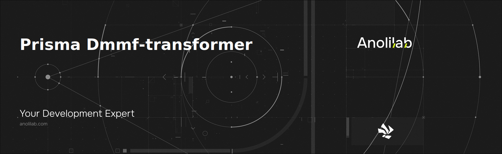

<!-- START_PACKAGE_OG_IMAGE_PLACEHOLDER -->

<a href="https://www.anolilab.com/open-source" align="center">

  

</a>

<h3 align="center">A generator for Prisma to generate a valid JSON Schema v7.</h3>

<!-- END_PACKAGE_OG_IMAGE_PLACEHOLDER -->

<br />

<div align="center">

[![typescript-image][typescript-badge]][typescript-url]
[![mit licence][license-badge]][license]
[![npm downloads][npm-downloads-badge]][npm-downloads]
[![Chat][chat-badge]][chat]
[![PRs Welcome][prs-welcome-badge]][prs-welcome]

</div>

---

<div align="center">
    <p>
        <sup>
            Daniel Bannert's open source work is supported by the community on <a href="https://github.com/sponsors/prisis">GitHub Sponsors</a>
        </sup>
    </p>
</div>

---

## Features

## Installation

```sh
npm install @visulima/prisma-dmmf-transformer
```

```sh
yarn add @visulima/prisma-dmmf-transformer
```

```sh
pnpm add @visulima/prisma-dmmf-transformer
```

## Usage

```ts
import { transformDMMF, getJSONSchemaProperty } from "@visulima/prisma-dmmf-transformer";

const generator = async (prismaClient) => {
    const dmmf = await prismaClient._getDmmf();
    const schema = transformDMMF(dmmf);

    console.log(schema);
};
```

The generator currently supports a few options as a second argument:

| Key                      | Default Value | Description                                                                                                                                                                                            |
| ------------------------ | ------------- | ------------------------------------------------------------------------------------------------------------------------------------------------------------------------------------------------------ |
| keepRelationScalarFields | "false"       | By default, the JSON Schema that’s generated will output only objects for related model records. If set to "true", this will cause the generator to also output foreign key fields for related records |
| schemaId                 | undefined     | Add an id to the generated schema. All references will include the schema id                                                                                                                           |
| includeRequiredFields    | "false"       | If this flag is `"true"` all required scalar prisma fields that do not have a default value, will be added to the `required` properties field for that schema definition.                              |
| persistOriginalType      | "false"       | If this flag is `"true"` the original type will be outputed under the property key "originalType"                                                                                                      |

## Examples

### PostgreSQL

This generator converts a prisma schema like this:

```prisma
datasource db {
    provider = "postgresql"
    url      = env("DATABASE_URL")
}

model User {
    id                  Int      @id @default(autoincrement())
    // Double Slash Comment: It will NOT show up in JSON schema
    createdAt           DateTime @default(now())
    /// Triple Slash Comment: It will show up in JSON schema [EMAIL]
    email               String   @unique
    weight              Float?
    is18                Boolean?
    name                String?
    number              BigInt   @default(34534535435353)
    favouriteDecimal    Decimal
    bytes               Bytes /// Triple Slash Inline Comment: It will show up in JSON schema [BYTES]
    successorId         Int?     @unique
    successor           User?    @relation("BlogOwnerHistory", fields: [successorId], references: [id])
    predecessor         User?    @relation("BlogOwnerHistory")
    role                Role     @default(USER)
    posts               Post[]
    keywords            String[]
    biography           Json
}

model Post {
    id     Int   @id @default(autoincrement())
    user   User? @relation(fields: [userId], references: [id])
    userId Int?
}

enum Role {
    USER
    ADMIN
}
```

Into:

```json5
{
    $schema: "http://json-schema.org/draft-07/schema#",
    definitions: {
        Post: {
            properties: {
                id: { type: "integer" },
                user: {
                    anyOf: [{ $ref: "#/definitions/User" }, { type: "null" }],
                },
            },
            type: "object",
        },
        User: {
            properties: {
                biography: {
                    type: ["number", "string", "boolean", "object", "array", "null"],
                },
                createdAt: { format: "date-time", type: "string" },
                email: {
                    description: "Triple Slash Comment: Will show up in JSON schema [EMAIL]",
                    type: "string",
                },
                id: { type: "integer" },
                is18: { type: ["boolean", "null"] },
                keywords: { items: { type: "string" }, type: "array" },
                name: { type: ["string", "null"] },
                number: { type: "integer", default: "34534535435353" },
                bytes: {
                    description: "Triple Slash Inline Comment: Will show up in JSON schema [BYTES]",
                    type: "string",
                },
                favouriteDecimal: { type: "number" },
                posts: {
                    items: { $ref: "#/definitions/Post" },
                    type: "array",
                },
                predecessor: {
                    anyOf: [{ $ref: "#/definitions/User" }, { type: "null" }],
                },
                role: { enum: ["USER", "ADMIN"], type: "string", default: "USER" },
                successor: {
                    anyOf: [{ $ref: "#/definitions/User" }, { type: "null" }],
                },
                weight: { type: ["integer", "null"] },
            },
            type: "object",
        },
    },
    properties: {
        post: { $ref: "#/definitions/Post" },
        user: { $ref: "#/definitions/User" },
    },
    type: "object",
}
```

### MongoDB

The generator also takes care of composite types in MongoDB:

```prisma
datasource db {
    provider = "mongodb"
    url      = env("DATABASE_URL")
}

model User {
    id      String @id @default(auto()) @map("_id") @db.ObjectId
    photos  Photo[]
}

type Photo {
    height Int      @default(200)
    width  Int      @default(100)
    url    String
}
```

Output:

```json5
{
    $schema: "http://json-schema.org/draft-07/schema#",
    definitions: {
        User: {
            properties: {
                id: { type: "string" },
                photos: {
                    items: { $ref: "#/definitions/Photo" },
                    type: "array",
                },
            },
            type: "object",
        },
        Photo: {
            properties: {
                height: {
                    type: "integer",
                    default: 200,
                },
                width: {
                    type: "integer",
                    default: 100,
                },
                url: {
                    type: "string",
                },
            },
            type: "object",
        },
    },
    properties: {
        user: { $ref: "#/definitions/User" },
    },
    type: "object",
}
```

## Supported Node.js Versions

Libraries in this ecosystem make the best effort to track
[Node.js’ release schedule](https://github.com/nodejs/release#release-schedule). Here’s [a
post on why we think this is important](https://medium.com/the-node-js-collection/maintainers-should-consider-following-node-js-release-schedule-ab08ed4de71a).

## Contributing

If you would like to help take a look at the [list of issues](https://github.com/visulima/visulima/issues) and check our [Contributing](.github/CONTRIBUTING.md) guild.

> **Note:** please note that this project is released with a Contributor Code of Conduct. By participating in this project you agree to abide by its terms.

## Credits

- [Valentin Palkovic](https://github.com/valentinpalkovic) and [prisma-json-schema-generator](https://github.com/valentinpalkovic/prisma-json-schema-generator)
- [Daniel Bannert](https://github.com/prisis)
- [All Contributors](https://github.com/visulima/visulima/graphs/contributors)

## Made with ❤️ at Anolilab

This is an open source project and will always remain free to use. If you think it's cool, please star it 🌟. [Anolilab](https://www.anolilab.com/open-source) is a Development and AI Studio. Contact us at [hello@anolilab.com](mailto:hello@anolilab.com) if you need any help with these technologies or just want to say hi!

## License

The visulima prisma-dmmf-transformer is open-sourced software licensed under the [MIT][license]

<!-- badges -->

[license-badge]: https://img.shields.io/npm/l/@visulima/prisma-dmmf-transformer?style=for-the-badge
[license]: https://github.com/visulima/visulima/blob/main/LICENSE
[npm-downloads-badge]: https://img.shields.io/npm/dm/@visulima/prisma-dmmf-transformer?style=for-the-badge
[npm-downloads]: https://www.npmjs.com/package/@visulima/prisma-dmmf-transformer
[prs-welcome-badge]: https://img.shields.io/badge/PRs-welcome-brightgreen.svg?style=for-the-badge
[prs-welcome]: https://github.com/visulima/visulima/blob/main/.github/CONTRIBUTING.md
[chat-badge]: https://img.shields.io/discord/932323359193186354.svg?style=for-the-badge
[chat]: https://discord.gg/TtFJY8xkFK
[typescript-badge]: https://img.shields.io/badge/Typescript-294E80.svg?style=for-the-badge&logo=typescript
[typescript-url]: https://www.typescriptlang.org/
