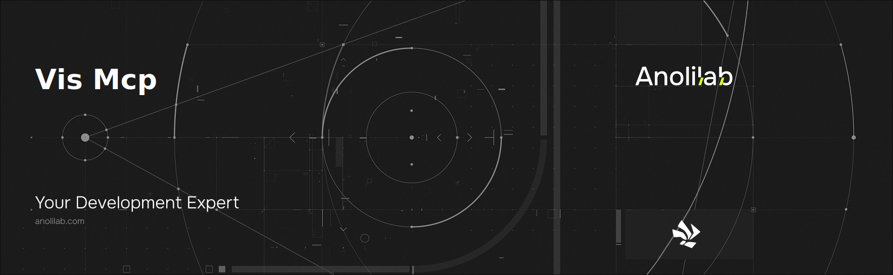

<!-- START_PACKAGE_OG_IMAGE_PLACEHOLDER -->

<a href="https://www.anolilab.com/open-source" align="center">

  

</a>

<h3 align="center">MCP (Model Context Protocol) server for @visulima/vis — exposes vis tooling to AI agents over stdio</h3>

<!-- END_PACKAGE_OG_IMAGE_PLACEHOLDER -->

<br />

<div align="center">

[![typescript-image][typescript-badge]][typescript-url]
[![mit licence][license-badge]][license]
[![npm downloads][npm-downloads-badge]][npm-downloads]
[![Chat][chat-badge]][chat]
[![PRs Welcome][prs-welcome-badge]][prs-welcome]

</div>

---

<div align="center">
    <p>
        <sup>
            Daniel Bannert's open source work is supported by the community on <a href="https://github.com/sponsors/prisis">GitHub Sponsors</a>
        </sup>
    </p>
</div>

---

## Install

```sh
npm install @visulima/vis-mcp
```

```sh
yarn add @visulima/vis-mcp
```

```sh
pnpm add @visulima/vis-mcp
```

## Usage

`@visulima/vis-mcp` is an MCP (Model Context Protocol) server that exposes a read-only view of your `@visulima/vis` workspace to an LLM agent over stdio. It assumes `@visulima/vis` is installed in the workspace it operates against.

### Run

```sh
npx @visulima/vis-mcp
```

The server speaks JSON-RPC on stdout and writes status to stderr. Wire it into any MCP-aware client (Claude Desktop, Cursor, Continue, etc.) by pointing the client at the `vis-mcp` command.

### Claude Desktop config

Add the server to `~/Library/Application Support/Claude/claude_desktop_config.json` (macOS) or `%APPDATA%\Claude\claude_desktop_config.json` (Windows):

```json
{
    "mcpServers": {
        "vis": {
            "command": "npx",
            "args": ["-y", "@visulima/vis-mcp"],
            "env": {
                "VIS_MCP_WORKSPACE_ROOT": "/absolute/path/to/your/workspace"
            }
        }
    }
}
```

### Environment

- `VIS_MCP_WORKSPACE_ROOT` — workspace to operate against. Defaults to `process.cwd()`.
- `VIS_MCP_VIS_BIN` — explicit path to the `vis` CLI. Defaults to resolving `@visulima/vis` from the workspace's `node_modules`.

### Tools

All eight tools are read-only. The agent prepares commands; a human runs them.

| Tool                | What it does                                                                                           |
| ------------------- | ------------------------------------------------------------------------------------------------------ |
| `list_projects`     | List all workspace projects, optionally filtered by a vis query string.                                |
| `describe_project`  | Return full metadata for one project (language, layer, stack, targets).                                |
| `list_targets`      | Flatten projects into per-target rows; optionally narrow to one project.                               |
| `list_templates`    | List scaffolding templates discovered in the workspace, with source and one-line description.          |
| `describe_template` | Return template metadata: description, default destination, and the variable schema for `vis generate`.|
| `get_run_logs`      | Read a run summary from `.task-runner/`; optionally filter to one task.                                |
| `cache_why`         | Diff a task's hash inputs against the previous run to explain a rotation.                              |
| `cache_hash`        | Print the recorded hash and per-input hash details for a task.                                         |

## Related

## Supported Node.js Versions

Libraries in this ecosystem make the best effort to track [Node.js’ release schedule](https://github.com/nodejs/release#release-schedule).
Here’s [a post on why we think this is important](https://medium.com/the-node-js-collection/maintainers-should-consider-following-node-js-release-schedule-ab08ed4de71a).

## Contributing

If you would like to help take a look at the [list of issues](https://github.com/visulima/visulima/issues) and check our [Contributing](.github/CONTRIBUTING.md) guidelines.

> **Note:** please note that this project is released with a Contributor Code of Conduct. By participating in this project you agree to abide by its terms.

## Credits

- [Daniel Bannert](https://github.com/prisis)
- [All Contributors](https://github.com/visulima/visulima/graphs/contributors)

## Made with ❤️ at Anolilab

This is an open source project and will always remain free to use. If you think it's cool, please star it 🌟. [Anolilab](https://www.anolilab.com/open-source) is a Development and AI Studio. Contact us at [hello@anolilab.com](mailto:hello@anolilab.com) if you need any help with these technologies or just want to say hi!

## License

The visulima vis-mcp is open-sourced software licensed under the [MIT][license]

<!-- badges -->

[license-badge]: https://img.shields.io/npm/l/@visulima/vis-mcp?style=for-the-badge
[license]: https://github.com/visulima/visulima/blob/main/LICENSE
[npm-downloads-badge]: https://img.shields.io/npm/dm/@visulima/vis-mcp?style=for-the-badge
[npm-downloads]: https://www.npmjs.com/package/@visulima/vis-mcp
[prs-welcome-badge]: https://img.shields.io/badge/PRs-welcome-brightgreen.svg?style=for-the-badge
[prs-welcome]: https://github.com/visulima/visulima/blob/main/.github/CONTRIBUTING.md
[chat-badge]: https://img.shields.io/discord/932323359193186354.svg?style=for-the-badge
[chat]: https://discord.gg/TtFJY8xkFK
[typescript-badge]: https://img.shields.io/badge/Typescript-294E80.svg?style=for-the-badge&logo=typescript
[typescript-url]: https://www.typescriptlang.org/
