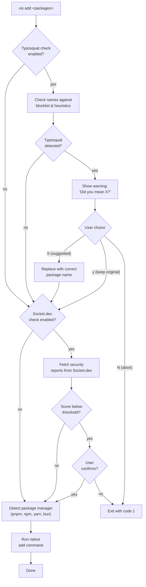

# vis add

Add packages using the detected package manager. Before installing, vis runs a **typosquat check** against a curated blocklist of known malicious package names, followed by an optional **Socket.dev security scan**.

## Secure-by-default behavior

`vis add` blocks dependency lifecycle scripts on every package manager (npm, pnpm, yarn, bun, aube) — the same pnpm v10 default applied universally. The newly-installed package's `preinstall` / `install` / `postinstall` / `prepare` scripts will not run unless:

- the package is listed in `security.allowBuilds` in `vis.config.ts` (vis runs its scripts post-install), or
- you pass `--run-scripts` to opt out for one run.

This pairs with the typosquat and Socket.dev checks: even if a malicious package slips past the name and score checks, its install hooks won't execute.

## Usage

```bash
vis add <packages...> [options]
```

## Examples

```bash
vis add react react-dom              # Add packages (scripts blocked by default)
vis add -D typescript @types/react   # Add as dev dependencies
vis add react --filter app           # Add to specific workspace package
vis add -g typescript                # Add globally (uses npm)
vis add lodash -w                    # Add to workspace root
vis add esbuild --run-scripts        # Opt out of the universal script block for this run
vis add lodash --no-socket-check     # Add without Socket.dev check
vis add lodash --no-typosquat-check  # Skip typosquat name check
```

## Options

| Option                 | Alias | Default | Description                                                                                                                          |
| ---------------------- | ----- | ------- | ------------------------------------------------------------------------------------------------------------------------------------ |
| `--save-dev`           | `-D`  | `false` | Add as dev dependency                                                                                                                |
| `--exact`              | `-E`  | `false` | Save exact version                                                                                                                   |
| `--save-peer`          | `-P`  | `false` | Add as peer dependency                                                                                                               |
| `--save-optional`      | `-O`  | `false` | Add as optional dependency                                                                                                           |
| `--global`             | `-g`  | `false` | Install globally (uses npm)                                                                                                          |
| `--workspace-root`     | `-w`  | `false` | Add to workspace root                                                                                                                |
| `--workspace`          |       | `false` | Use workspace protocol (pnpm)                                                                                                        |
| `--filter`             | `-F`  |         | Filter by workspace package name                                                                                                     |
| `--run-scripts`        |       | `false` | Run lifecycle scripts (opts out of the universal block-by-default policy; allowlisted packages still run via `security.allowBuilds`) |
| `--no-typosquat-check` |       | `false` | Skip typosquat name check before adding                                                                                              |
| `--no-socket-check`    |       | `false` | Skip Socket.dev security check before adding                                                                                         |

## How It Works



## Typosquat Detection

When you run `vis add`, the package names are checked against a curated blocklist of known typosquats for popular packages (react, express, lodash, axios, etc.). The detection uses two methods:

1. **Blocklist lookup** -- Direct match against `data/typosquats.json`, a curated list of known typosquat names that exist on npm.
2. **Heuristic detection** -- Generates variants using common attack patterns (character omission, transposition, duplication, homoglyph substitution, separator swaps) and checks if your input matches any variant of a known package.

### Example

```bash
$ vis add axois
warn: Possible typosquat detected:
warn:   ⚠ axois — did you mean axios? (known typosquat)

Use suggested package instead? [S]uggested / [y]es, keep original / [N]o, abort (default: N)
```

Choosing **S** replaces `axois` with `axios` and continues the add, preserving any version specifier you provided (e.g., `axois@^1.0` becomes `axios@^1.0`).

In non-interactive mode (CI, piped stdin), typosquat detection always aborts to prevent automated installation of malicious packages.

## Socket.dev Security Check

When Socket.dev is configured (via `vis.config.ts`), each package is scored across multiple dimensions (license, maintenance, quality, supply chain, vulnerability). Packages scoring below the minimum threshold (default: 40%) require explicit confirmation.

See [`vis init`](/docs/commands/init) to configure Socket.dev integration.
