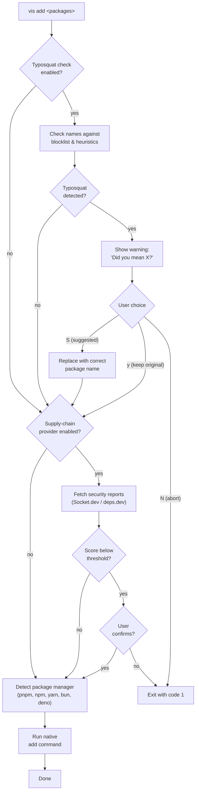

# vis add

Add packages using the detected package manager. Before installing, vis runs a **typosquat check** against a curated blocklist of known malicious package names, an offline **marshall pipeline** (author, provenance, metadata, downloads, expired-domains, new-bin, archived-repo), and an optional **supply-chain security scan** (Socket.dev and/or Google's deps.dev — whichever providers you've enabled).

## Secure-by-default behavior

`vis add` blocks dependency lifecycle scripts on every package manager (npm, pnpm, yarn, bun, aube, deno) — the same pnpm v10 default applied universally. The newly-installed package's `preinstall` / `install` / `postinstall` / `prepare` scripts will not run unless:

- the package is listed in `security.policies.installScripts.allow` in `vis.config.ts` (vis runs its scripts post-install), or
- you pass `--run-scripts` to opt out for one run.

This pairs with the typosquat and supply-chain checks: even if a malicious package slips past the name and score checks, its install hooks won't execute.

## Usage

```bash
vis add <packages...> [options]
```

## Examples

```bash
vis add react react-dom                # Add packages (scripts blocked by default)
vis add -D typescript @types/react     # Add as dev dependencies
vis add react --filter app             # Add to specific workspace package
vis add react --to web                 # Add to one package, conform to existing catalogs
vis add react --auto-install-peers     # Recursively install non-optional peer deps
vis add -g typescript                  # Add globally (uses npm)
vis add lodash -w                      # Add to workspace root
vis add esbuild --run-scripts          # Opt out of the universal script block for this run
vis add lodash --no-socket-check       # Skip the supply-chain provider scan (Socket.dev / deps.dev) for this run
vis add lodash --no-typosquat-check    # Skip typosquat name check
vis add lodash --no-marshall-check     # Skip the offline marshall pipeline
```

## Options

| Option                 | Alias | Default | Description                                                                                                                                                                                                                          |
| ---------------------- | ----- | ------- | ------------------------------------------------------------------------------------------------------------------------------------------------------------------------------------------------------------------------------------ |
| `--save-dev`           | `-D`  | `false` | Add as dev dependency                                                                                                                                                                                                                |
| `--exact`              | `-E`  | `false` | Save exact version                                                                                                                                                                                                                   |
| `--save-peer`          | `-P`  | `false` | Add as peer dependency                                                                                                                                                                                                               |
| `--save-optional`      | `-O`  | `false` | Add as optional dependency                                                                                                                                                                                                           |
| `--global`             | `-g`  | `false` | Install globally (uses npm)                                                                                                                                                                                                          |
| `--workspace-root`     | `-w`  | `false` | Add to workspace root                                                                                                                                                                                                                |
| `--workspace`          |       | `false` | Use workspace protocol (pnpm)                                                                                                                                                                                                        |
| `--filter`             | `-F`  |         | Filter by workspace package name                                                                                                                                                                                                     |
| `--to`                 |       |         | Target a single workspace package and auto-conform the version to existing catalogs / sibling deps (syncpack#285)                                                                                                                    |
| `--auto-install-peers` |       | `false` | After adding, recursively install non-optional peer dependencies that aren't already in the workspace (matches nypm's `installPeerDependencies`)                                                                                     |
| `--run-scripts`        |       | `false` | One-off opt-out: run lifecycle scripts for all packages in this install, overriding the block-by-default policy. The persistent allowlist at `security.policies.installScripts.allow` is the recommended approach for repeated runs. |
| `--no-typosquat-check` |       | `false` | Skip typosquat name check before adding                                                                                                                                                                                              |
| `--no-marshall-check`  |       | `false` | Skip the offline marshall pipeline (author, provenance, metadata, downloads, expired-domains, new-bin, archived-repo). Signatures are opt-in via config and are not run here even when the marshall check is enabled.                |
| `--no-socket-check`    |       | `false` | Skip the enabled supply-chain provider scan (Socket.dev / deps.dev) before adding. Flag name kept for back-compat.                                                                                                                   |

## How It Works



## Typosquat Detection

When you run `vis add`, the package names are checked against a curated blocklist of known typosquats for popular packages (react, express, lodash, axios, etc.). The detection uses two methods:

1. **Blocklist lookup** -- Direct match against `data/typosquats.json`, a curated list of known typosquat names that exist on npm.
2. **Heuristic detection** -- Generates variants using common attack patterns (character omission, transposition, duplication, homoglyph substitution, separator swaps) and checks if your input matches any variant of a known package.

### Example

```bash
$ vis add axois
warn: Possible typosquat detected:
warn:   ⚠ axois — did you mean axios? (known typosquat)

Use suggested package instead? [S]uggested / [y]es, keep original / [N]o, abort (default: N)
```

Choosing **S** replaces `axois` with `axios` and continues the add, preserving any version specifier you provided (e.g., `axois@^1.0` becomes `axios@^1.0`).

In non-interactive mode (CI, piped stdin), typosquat detection always aborts to prevent automated installation of malicious packages.

## Supply-chain security check

When at least one supply-chain provider is enabled in `vis.config.ts`, each package is scored across multiple dimensions (license, maintenance, quality, supply chain, vulnerability). Packages scoring below the minimum threshold (default: 40%) require explicit confirmation.

Two providers are supported:

- **Socket.dev** — Basic-auth token (`security.socket.enabled: true` + `VIS_SOCKET_TOKEN`). Rich proprietary score + alert catalog.
- **deps.dev** — Google's Open Source Insights (`security.depsDev.enabled: true`). No auth required. Surfaces the OpenSSF Scorecard plus GHSA advisories.

You can enable either, or both. With both enabled, the reports are merged: the provider listed in `security.primaryProvider` wins on the overall score; alerts are deduped by id. The `--no-socket-check` flag disables **all** enabled providers for one run (the name is kept for backwards compatibility).

See [`vis init`](/docs/commands/init) to configure either provider, or the [Security audit guide](/docs/guides/security-audit) for a side-by-side comparison.

## Auto-install peers

`--auto-install-peers` mirrors nypm's `installPeerDependencies` behavior. After the primary `add` succeeds, vis reads each freshly-installed package's `package.json`, collects its non-optional `peerDependencies` (entries flagged `optional: true` in `peerDependenciesMeta` are skipped), and recursively adds the peers that aren't already present in the workspace.

The flag is **opt-in**, matching nypm's default. Deno is excluded — it has no peer dependency concept; the recursive add is a no-op there.
