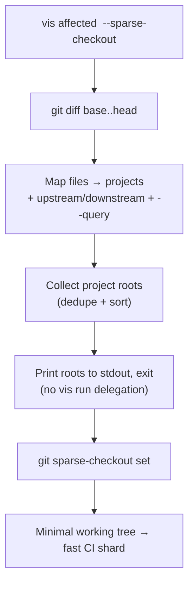

# vis affected

Detect which projects are affected by recent git changes and run a target only on those projects. Uses git diff to find changed files, maps them to projects, and includes transitively dependent projects.

## Usage

```bash
vis affected <target> [options]
```

## Examples

```bash
vis affected build
vis affected test --base=main
vis affected lint --base=HEAD~5 --head=HEAD
vis affected test --query "language=typescript"
vis affected build --downstream=direct
vis affected destroy --reverse
vis affected build --base=origin/main --sparse-checkout
```

## Options

| Option              | Default  | Description                                                                                                   |
| ------------------- | -------- | ------------------------------------------------------------------------------------------------------------- |
| `--base`            | `HEAD~1` | Git base ref for comparison                                                                                   |
| `--head`            | `HEAD`   | Git head ref for comparison                                                                                   |
| `--downstream`      | `deep`   | How far to include dependents: `none`, `direct`, `deep`                                                       |
| `--upstream`        | `none`   | How far to include dependencies: `none`, `direct`, `deep`                                                     |
| `--parallel`        | `3`      | Maximum number of parallel tasks                                                                              |
| `--cache`           | `true`   | Enable caching (`--no-cache` to disable)                                                                      |
| `--dry-run`         | `false`  | Show what would run without executing                                                                         |
| `--partition`       |          | Partition for distributed CI (e.g. `1/4`)                                                                     |
| `--query`           |          | Filter affected projects by query                                                                             |
| `--reverse`         | `false`  | Run leaves-first (teardown order). Forwarded to `vis run`. See [Reverse order](./run#reverse-order-teardown). |
| `--sparse-checkout` | `false`  | Print the affected project roots (one per line, deduped + sorted) and exit **without** running the target     |

## Affected Files Forwarding

When a target declares `options.affectedFiles` in `project.json`, the changed file paths are forwarded to the task process:

```json
{
    "targets": {
        "lint": {
            "command": "eslint",
            "options": {
                "affectedFiles": "args"
            }
        }
    }
}
```

| Mode   | Behavior                                        |
| ------ | ----------------------------------------------- |
| `args` | Appends changed file paths as command arguments |
| `env`  | Sets `VIS_AFFECTED_FILES` environment variable  |
| `both` | Both of the above                               |

## Sparse-checkout cone (`--sparse-checkout`)

On very large monorepos, CI shards don't need the whole tree on disk. With
`--sparse-checkout`, `vis affected` computes the affected set exactly as usual
but, instead of delegating to `vis run`, prints the affected project roots — one
per line, deduplicated and sorted — and exits. Feed that list straight into git
sparse-checkout so a runner materialises **only** the directories a change
touches:

```bash
git sparse-checkout init --cone
vis affected build --base=origin/main --sparse-checkout | xargs git sparse-checkout set
vis affected build --base=origin/main   # now runs against a minimal working tree
```

The `--query` / `--upstream` / `--downstream` filters still apply, so the cone
matches the exact project set the subsequent run will execute. This pairs with
the [`vis doctor`](./doctor#runtime) `git-lfs` runtime check for keeping huge
checkouts fast.

`vis` only emits the project-root list — the actual partial-checkout behaviour
(cone mode, what stays virtual vs. materialised on disk) is plain git. See the
upstream reference: [`git sparse-checkout`](https://git-scm.com/docs/git-sparse-checkout)
and the [cone-mode notes in `git read-tree`](https://git-scm.com/docs/git-read-tree#_sparse_checkout).



## How It Works

1. **Diff** — Runs `git diff` between `--base` and `--head` to find changed files
2. **Map** — Maps changed files to the projects that contain them
3. **Expand** — Includes upstream/downstream based on `--upstream`/`--downstream` scope
4. **Query** — Applies `--query` filter on top of the affected set
5. **Forward** — Passes changed file list to `vis run` via `VIS_AFFECTED_FILES` env var
6. **Execute** — Runs the target on affected projects only, in dependency order

## Use Cases

### CI Pipelines

Only test what changed in a pull request:

```bash
vis affected test --base=origin/main
```

Or use `vis ci` which wraps this with auto-detected refs:

```bash
vis ci lint,test,build
```

### Local Development

Run tests for recent changes:

```bash
vis affected test --base=HEAD~3
```

### Scoped CI

Run tests only on affected TypeScript libraries:

```bash
vis affected test --query "language=typescript && layer=library"
```

### Teardown of changed stacks

Tear down only the stacks affected by a change, in reverse order so dependents go first:

```bash
vis affected destroy --reverse --base=origin/main
```

Mirrors `vis affected deploy` — same project set, opposite order. See [`vis run` reverse order](./run#reverse-order-teardown) for the full mechanics.
