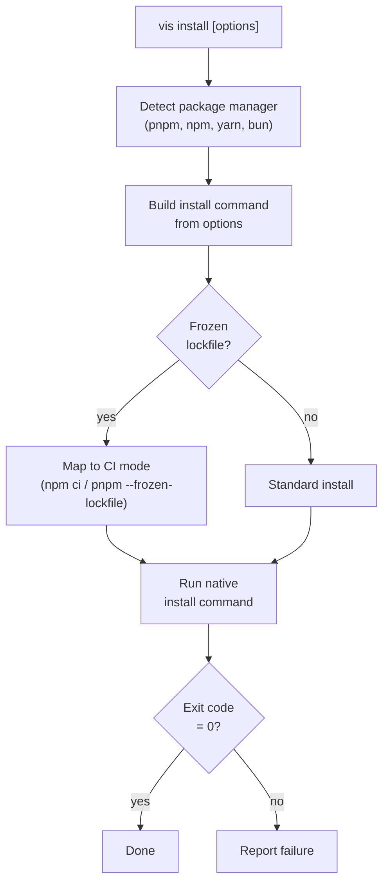

# vis install

Install project dependencies using the detected package manager (pnpm, npm, yarn, or bun). Delegates to the native PM with vis's security enforcement applied.

## Usage

```bash
vis install [options]
```

## Examples

```bash
# Install all dependencies
vis install

# Install with frozen lockfile (CI)
vis install --frozen-lockfile

# Install without optional dependencies
vis install --no-optional

# Force re-install
vis install --force
```

## Options

| Option              | Alias | Default | Description                        |
| ------------------- | ----- | ------- | ---------------------------------- |
| `--frozen-lockfile`  |       | `false` | Error if lockfile needs updating   |
| `--force`            |       | `false` | Force re-resolution of all deps    |
| `--no-optional`      |       | `false` | Skip optional dependencies         |
| `--ignore-scripts`   |       | `false` | Skip lifecycle scripts             |
| `--lockfile-only`    |       | `false` | Update lockfile without installing |
| `--offline`          |       | `false` | Use cached packages only           |
| `--dev`              |       | `false` | Install devDependencies only       |
| `--filter`           |       |         | Filter to specific workspace packages |

## How It Works



## Aliases

```bash
vis i          # Short for vis install
```
