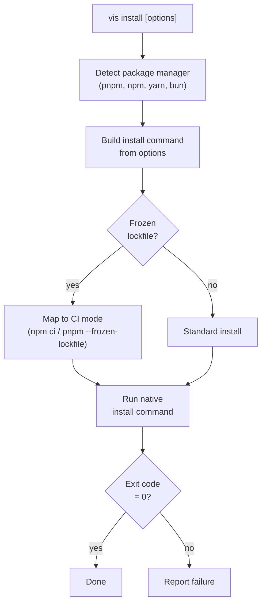

# vis install

Install project dependencies using the detected package manager (pnpm, npm, yarn, bun, or [aube](https://github.com/endevco/aube)). Delegates to the native PM with vis's security enforcement applied.

## Usage

```bash
vis install [options]
```

## Examples

```bash
# Install all dependencies
vis install

# Install with frozen lockfile (CI)
vis install --frozen-lockfile

# Install without optional dependencies
vis install --no-optional

# Force re-install
vis install --force

# Force aube as the installer (errors if not on PATH)
vis install --installer aube

# Bypass aube for one run, use the lockfile-detected PM
vis install --no-aube
```

## Options

| Option              | Alias | Default | Description                                                                                                            |
| ------------------- | ----- | ------- | ---------------------------------------------------------------------------------------------------------------------- |
| `--frozen-lockfile` |       | `false` | Error if lockfile needs updating                                                                                       |
| `--force`           |       | `false` | Force re-resolution of all deps                                                                                        |
| `--no-optional`     |       | `false` | Skip optional dependencies                                                                                             |
| `--ignore-scripts`  |       | `false` | Skip lifecycle scripts (no-op on aube — see [Aube backend](#aube-as-an-installer) below)                               |
| `--lockfile-only`   |       | `false` | Update lockfile without installing                                                                                     |
| `--offline`         |       | `false` | Use cached packages only                                                                                               |
| `--dev`             |       | `false` | Install devDependencies only                                                                                           |
| `--filter`          | `-F`  |         | Filter to specific workspace packages                                                                                  |
| `--installer`       |       | `auto`  | Pick the installer explicitly: `auto`, `aube`, `pnpm`, `npm`, `yarn`, `bun`. Overrides `VIS_INSTALLER` and `vis.config` |
| `--no-aube`         |       | `false` | Bypass aube and use the lockfile-detected PM. Wins over `--installer`, `VIS_INSTALLER`, and `install.backend`          |

## Aube as an installer

[Aube](https://github.com/endevco/aube) is a Rust-native package manager that reads and writes `pnpm-lock.yaml`, `package-lock.json`, `yarn.lock`, and `bun.lock` in place. `vis install` (and `add`, `remove`, `update`, `dlx`, `exec`, `link`, `unlink`, `dedupe`, `why`, `outdated`, `info`, `pm`) honors aube as a drop-in replacement.

### Selecting the installer

Resolution precedence, highest first:

1. `--installer <name>` CLI flag (or `--no-aube` to force the lockfile PM)
2. `VIS_INSTALLER` environment variable
3. `install.backend` in `vis.config.ts`
4. Auto-detect — uses `aube` when it's on `PATH`, otherwise falls back to the lockfile-detected PM

```ts
// vis.config.ts — pin the installer for the whole team
import { defineConfig } from "@visulima/vis/config";

export default defineConfig({
    install: { backend: "aube" }, // or "auto" | "pnpm" | "npm" | "yarn" | "bun"
});
```

```bash
# Per-run override
VIS_INSTALLER=pnpm vis install

# CLI override (wins over env and config)
vis install --installer aube
```

### Installing aube

`vis` does not bundle aube — install it once, then enable via the resolution chain above:

```bash
npm install -g @endevco/aube
# or
mise use -g aube
# or
brew install endevco/tap/aube
```

`vis install --installer aube` errors with an actionable message when the binary is missing instead of silently falling back.

### Catalog support

Aube supports the pnpm `catalog:` and `catalog:<name>` protocol from `pnpm-workspace.yaml`, including walk-up resolution from subpackages. Visulima's own catalogs (`catalog:dev`, `catalog:lint`, etc.) work transparently.

### Lockfile drift caveat

Aube reuses `pnpm-lock.yaml` / `package-lock.json` / `yarn.lock` / `bun.lock` formats but its serialized output is **not byte-identical** to the original tool's. Consequences:

- The first `vis install --installer aube` on a workspace whose lockfile was written by another tool produces a one-time churn diff in git.
- A team that mixes tools on the same lockfile (some on aube, some on pnpm) will see ongoing drift on every install.

`vis install` surfaces a one-line warning when this is about to happen. To eliminate drift, pin `install.backend` in `vis.config.ts` so every team member uses the same installer.

### Lifecycle scripts

Aube already skips dependency lifecycle scripts by default — `--ignore-scripts` is a no-op under aube and `vis install` warns when you pass it. To opt specific packages back in, run `aube approve-builds` (the inverse direction from `pnpm`'s `--ignore-scripts` model).

## How It Works



## Aliases

```bash
vis i          # Short for vis install
```
