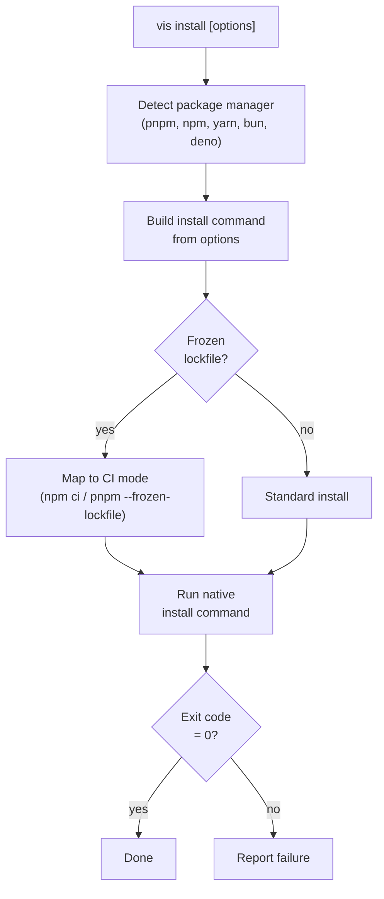

# vis install

Install project dependencies using the detected package manager (pnpm, npm, yarn, bun, deno, or [aube](https://github.com/endevco/aube)). Delegates to the native PM with vis's security enforcement applied.

## Secure-by-default behavior

`vis install` applies two universal hardening defaults across every package manager, inspired by the [`npm`'s defaults are bad](https://nesbitt.io/2026/03/31/npms-defaults-are-bad.html) write-up:

1. **Frozen lockfile by default.** When a lockfile is present, `vis install` refuses to mutate it — `npm ci` semantics rather than `npm install`'s silent rewrites. Pass `--no-frozen-lockfile` to opt out (the lockfile-only and `--force` flows skip the default automatically).
2. **Lifecycle scripts blocked by default.** Mirrors pnpm v10: every PM (npm, pnpm, yarn, bun, aube) installs with `--ignore-scripts`. Packages listed in `security.allowBuilds` (in `vis.config.ts`) get their `preinstall` / `install` / `postinstall` / `prepare` hooks executed afterwards by vis. Pass `--run-scripts` to restore the PM's native script behavior for one run. Deno does not run npm-style lifecycle scripts and is unaffected by these flags.

To bypass both at once, combine the flags: `vis install --no-frozen-lockfile --run-scripts`.

## Usage

```bash
vis install [options]
```

## Examples

```bash
# Install all dependencies (frozen-lockfile + scripts blocked by default)
vis install

# Allow lockfile updates for this run
vis install --no-frozen-lockfile

# Run lifecycle scripts (allowlisted packages run regardless via security.allowBuilds)
vis install --run-scripts

# Install with frozen lockfile (explicit; same as the default when a lockfile exists)
vis install --frozen-lockfile

# Cache-first install — use cached tarballs when available, fall back to network
vis install --prefer-offline

# Strict offline — fail if any package is not already cached
vis install --offline

# Without optional dependencies
vis install --no-optional

# Force re-install
vis install --force

# Force aube as the installer (errors if not on PATH)
vis install --installer aube

# Bypass aube for one run, use the lockfile-detected PM
vis install --no-aube
```

## Options

| Option                 | Alias | Default | Description                                                                                                                          |
| ---------------------- | ----- | ------- | ------------------------------------------------------------------------------------------------------------------------------------ |
| `--frozen-lockfile`    |       | `false` | Explicitly use frozen lockfile (the default when a lockfile is present)                                                              |
| `--no-frozen-lockfile` |       | `false` | Opt out of vis's default frozen-lockfile behavior and allow lockfile updates                                                         |
| `--ci`                 |       | `false` | Clean install: wipes `node_modules` then installs with frozen lockfile (mirrors `npm ci` / `pnpm ci`)                                |
| `--force`              | `-f`  | `false` | Force re-resolution of all deps                                                                                                      |
| `--no-optional`        |       | `false` | Skip optional dependencies                                                                                                           |
| `--run-scripts`        |       | `false` | Run lifecycle scripts (opts out of the universal block-by-default policy; allowlisted packages still run via `security.allowBuilds`) |
| `--lockfile-only`      |       | `false` | Update lockfile without installing                                                                                                   |
| `--offline`            |       | `false` | Strict offline: fail if any package is missing from the cache                                                                        |
| `--prefer-offline`     |       | `false` | Cache-first: use cached packages when available, fall back to network for the rest                                                   |
| `--dev`                | `-D`  | `false` | Install devDependencies only                                                                                                         |
| `--prod`               | `-P`  | `false` | Skip devDependencies                                                                                                                 |
| `--filter`             | `-F`  |         | Filter to specific workspace packages                                                                                                |
| `--installer`          |       | `auto`  | Pick the installer explicitly: `auto`, `aube`, `pnpm`, `npm`, `yarn`, `bun`, `deno`. Overrides `VIS_INSTALLER` and `vis.config`      |
| `--no-aube`            |       | `false` | Bypass aube and use the lockfile-detected PM. Wins over `--installer`, `VIS_INSTALLER`, and `install.backend`                        |

## Aube as an installer

[Aube](https://github.com/endevco/aube) is a Rust-native package manager that reads and writes `pnpm-lock.yaml`, `package-lock.json`, `yarn.lock`, and `bun.lock` in place. `vis install` (and `add`, `remove`, `update`, `dlx`, `exec`, `link`, `unlink`, `dedupe`, `why`, `outdated`, `info`, `pm`) honors aube as a drop-in replacement.

### Selecting the installer

Resolution precedence, highest first:

1. `--installer <name>` CLI flag (or `--no-aube` to force the lockfile PM)
2. `VIS_INSTALLER` environment variable
3. `install.backend` in `vis.config.ts`
4. Auto-detect — uses `aube` when it's on `PATH`, otherwise falls back to the lockfile-detected PM

```ts
// vis.config.ts — pin the installer for the whole team
import { defineConfig } from "@visulima/vis/config";

export default defineConfig({
    install: { backend: "aube" }, // or "auto" | "pnpm" | "npm" | "yarn" | "bun" | "deno"
});
```

```bash
# Per-run override
VIS_INSTALLER=pnpm vis install

# CLI override (wins over env and config)
vis install --installer aube
```

### Installing aube

`vis` does not bundle aube — install it once, then enable via the resolution chain above:

```bash
npm install -g @endevco/aube
# or
mise use -g aube
# or
brew install endevco/tap/aube
```

`vis install --installer aube` errors with an actionable message when the binary is missing instead of silently falling back.

### Catalog support

Aube supports the pnpm `catalog:` and `catalog:<name>` protocol from `pnpm-workspace.yaml`, including walk-up resolution from subpackages. Visulima's own catalogs (`catalog:dev`, `catalog:lint`, etc.) work transparently.

### Lockfile drift caveat

Aube reuses `pnpm-lock.yaml` / `package-lock.json` / `yarn.lock` / `bun.lock` formats but its serialized output is **not byte-identical** to the original tool's. Consequences:

- The first `vis install --installer aube` on a workspace whose lockfile was written by another tool produces a one-time churn diff in git.
- A team that mixes tools on the same lockfile (some on aube, some on pnpm) will see ongoing drift on every install.

`vis install` surfaces a one-line warning when this is about to happen. To eliminate drift, pin `install.backend` in `vis.config.ts` so every team member uses the same installer.

### Lifecycle scripts

Aube already skips dependency lifecycle scripts by default — `--ignore-scripts` is a no-op under aube and `vis install` warns when you pass it. To opt specific packages back in, run `aube approve-builds` (the inverse direction from `pnpm`'s `--ignore-scripts` model).

## How It Works



## Aliases

```bash
vis i          # Short for vis install
```
