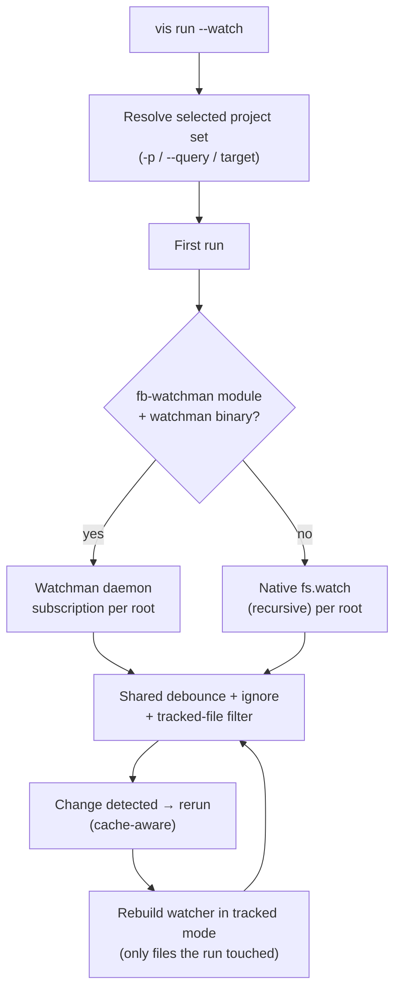

# vis run

Run a target (e.g., `build`, `test`, `lint`) across workspace projects. Tasks are executed in dependency order with caching.

## Usage

```bash
vis run <selector> [options]
```

## Selectors

vis supports moon-style target selectors:

| Syntax                      | Meaning                                                    |
| --------------------------- | ---------------------------------------------------------- |
| `vis run build`             | Run `build` on every project (legacy form)                 |
| `vis run :build`            | Same as above (explicit "all" selector)                    |
| `vis run ~:test`            | Run `test` on the project closest to the current directory |
| `vis run "#frontend:build"` | Run `build` on every project tagged `frontend`             |
| `vis run @myorg/app:build`  | Run `build` on a single named project                      |

## Examples

```bash
vis run build                                             # All projects
vis run :build --query "language=typescript && tag=lib"    # Filter by metadata
vis run ~:test                                            # Closest project
vis run "#frontend:build"                                 # Tag filter
vis run test --projects=pkg-a,pkg-b                       # Explicit list
vis run build --parallel=5                                # Concurrency
vis run build --no-cache                                  # Skip cache
vis run test --watch                                      # Rerun on file change
vis run destroy --reverse                                 # Leaves-first (teardown order)
vis run dev --services=persistent --stop-services         # Boot service deps + clean them up on exit
```

## Options

| Option               | Alias | Default        | Description                                                                                                                                                                                                                                                                                                         |
| -------------------- | ----- | -------------- | ------------------------------------------------------------------------------------------------------------------------------------------------------------------------------------------------------------------------------------------------------------------------------------------------------------------- |
| `--projects`         | `-p`  | all            | Comma-separated list of projects to run                                                                                                                                                                                                                                                                             |
| `--parallel`         |       | `3`            | Maximum number of parallel tasks (also reads `VIS_RUN_CONCURRENCY_LIMIT`). The resolved value is exported to every task as `VIS_TASK_SLOTS` — see [Environment variables in child tasks](#environment-variables-in-child-tasks).                                                                                    |
| `--preflight`        |       | enabled        | Detect lockfile / `node_modules` drift before running. Warns in TTY, fails in CI. `--no-preflight` opts out per run; workspace-wide via `preflight.lockfile: false` in `vis.config.ts`.                                                                                                                             |
| `--skip-toolchain`   |       | `false`        | Skip the toolchain pre-flight (no auto-install for any pinned tool: node / pnpm / yarn / npm / bun / deno / go / python / ruby / rust)                                                                                                                                                                              |
| `--cache`            |       | `true`         | Enable caching (`--no-cache` to disable)                                                                                                                                                                                                                                                                            |
| `--skip-cache`       |       |                | Comma-separated selectors of tasks to bypass cache for (`app:test`, `:e2e`, `#flaky:lint`). Other tasks in the run still cache. `--no-cache` wins when both are set.                                                                                                                                                |
| `--cache-dir`        |       |                | Custom cache directory                                                                                                                                                                                                                                                                                              |
| `--cache-mode`       |       |                | Remote cache mode: `read`, `write`, or `readwrite` (overrides `remoteCache.mode` from config)                                                                                                                                                                                                                       |
| `--cache-backend`    |       |                | Remote cache wire backend: `http` (Turborepo-compatible) or `reapi` (Bazel REAPI gRPC)                                                                                                                                                                                                                              |
| `--dry-run`          |       | `false`        | Show what would run without executing                                                                                                                                                                                                                                                                               |
| `--summarize`        |       | `false`        | Generate a JSON run summary at `.vis/runs/<id>.json` (also enables historical diffs for `vis cache why` / `vis replay`)                                                                                                                                                                                             |
| `--fail-fast`        |       | `false`        | Stop all tasks on first failure                                                                                                                                                                                                                                                                                     |
| `--partition`        |       |                | Partition for distributed CI (e.g. `1/4`). Falls back to `VIS_PARTITION`.                                                                                                                                                                                                                                           |
| `--skip-constraints` |       | `false`        | Skip project constraint validation                                                                                                                                                                                                                                                                                  |
| `--query`            |       |                | Filter by query (e.g. `language=typescript && tag=lib`)                                                                                                                                                                                                                                                             |
| `--strict-env`       |       | config (`off`) | Fail a task whose command references an unset env var (no silent empty-string substitution). `--no-strict-env` disables when set in `vis.config.ts`. POSIX specials (`$1`, `$#`) and `${VAR:-fallback}` defaults are skipped.                                                                                       |
| `--watch`            |       | `false`        | Rerun on file change (Ctrl+C to exit)                                                                                                                                                                                                                                                                               |
| `--services`         |       | TTY: `auto`    | Auto-start service deps. `auto` (per-task: `dev` → ephemeral, others → persistent), `ephemeral` (die with the run), `persistent` (registered for future runs), `off` (skip and abort with the diagnostic). Default is `auto` in a TTY, `off` in CI / pipes. Workspace pin via `run.services` in `vis.config.ts`.    |
| `--stop-services`    |       | `false`        | Stop services this run auto-started in registry mode when the run exits (clean finish, `q`, or Ctrl+C). Pre-existing services and ephemeral services are unaffected — ephemeral already die with the run; only services this invocation booted via `--services=persistent` or the `auto` registry path are stopped. |
| `--flaky`            |       | `true`         | Show flaky report on failure (`--no-flaky` to suppress)                                                                                                                                                                                                                                                             |
| `--fail-on-retry`    |       | `false`        | Treat any task that succeeded only after one or more retries as a run failure (exit non-zero). Useful as a periodic CI check to surface flakes that retries would otherwise mask.                                                                                                                                   |
| `--log`              |       |                | Output mode: `interleaved`, `labeled` (`[pkg#task]` prefixes), or `grouped` (buffered block)                                                                                                                                                                                                                        |
| `--output-style`     |       |                | `normal` (default) prints every task; `quiet` skips output for successful and cached tasks (failures still print). Per-target `options.outputStyle` overrides this.                                                                                                                                                 |
| `--pty`              |       | `false`        | Run every task through a PTY so color-aware tools render as if attached to a TTY (disables caching)                                                                                                                                                                                                                 |
| `--retry-budget`     |       |                | Global cap on total retries across the run (per-target `retryCount` is honored up to budget)                                                                                                                                                                                                                        |
| `--profile`          |       |                | Write a Chrome Tracing JSON of the run to this path (open in chrome://tracing or Perfetto)                                                                                                                                                                                                                          |
| `--last-details`     |       | `false`        | Render the most-recent run's saved summary (`.vis/last-summary.json`) and exit without executing any tasks. Use for "what happened in the last build?" without re-running.                                                                                                                                          |
| `--reverse`          |       | `false`        | Run the dependency graph leaves-first (dependents before deps). Use for teardown targets like `destroy`/`undeploy` — see [Reverse order](#reverse-order-teardown).                                                                                                                                                  |
| `--runner-tags`      |       |                | Comma-separated tags this runner advertises (e.g. `gpu,slow`). Tasks declaring `options.runnerTags` only run when at least one tag overlaps; untagged tasks always run. Falls back to `VIS_RUNNER_TAGS`.                                                                                                            |

### Positional args after the target

Extra arguments past the target name are forwarded **only** to the user-invoked target, not to `dependsOn` dependencies:

```bash
vis run test --reporter=verbose    # forwards --reporter=verbose to the test task only
```

`build` deps triggered by `test` do not receive the args.

### Interactive target picker

Running `vis run` with no target in a TTY launches a readline numbered picker:

```
$ vis run
Available targets:
   1. build
   2. lint
   3. test

Select a target (number or name, blank to cancel):
```

The chosen target is appended to your shell history so up-arrow replays it verbatim (bash / zsh / fish; set `VIS_NO_SHELL_HISTORY=1` to disable). Non-TTY sessions keep the list-and-hint behavior.

## Query Language

The `--query` flag accepts clauses joined by `&&` (all match) or `||` (any matches):

```bash
vis run :build --query "language=typescript && tag=lib"
vis run :test --query "tag=frontend || tag=shared"
vis run :lint --query "layer=library"
```

Supported fields: `project`, `id`, `tag`, `tags`, `type`, `projectType`, `language`, `stack`, `layer`.

## Target Options

Targets in `project.json` support vis-specific options:

```json
{
    "$schema": "https://unpkg.com/@visulima/vis/schemas/project.schema.json",
    "targets": {
        "dev": {
            "command": "vite dev",
            "type": "run",
            "preset": "server",
            "options": {
                "persistent": true,
                "interactive": false,
                "envFile": ".env.local"
            }
        },
        "build": {
            "command": "vite build",
            "type": "build",
            "outputs": ["dist/**"],
            "options": {
                "retryCount": 2
            }
        },
        "migrate": {
            "command": "prisma migrate deploy",
            "options": {
                "mutex": "db-migration",
                "runFromWorkspaceRoot": true
            }
        }
    }
}
```

### Available Options

| Option                 | Type                                    | Default         | Description                                                                                                                                                                                             |
| ---------------------- | --------------------------------------- | --------------- | ------------------------------------------------------------------------------------------------------------------------------------------------------------------------------------------------------- |
| `persistent`           | `boolean`                               | `false`         | Long-running process, run last, never cached                                                                                                                                                            |
| `interactive`          | `boolean`                               | `false`         | Claims stdin, serialized execution                                                                                                                                                                      |
| `internal`             | `boolean`                               | `false`         | Hidden from CLI, only invoked as a dependency                                                                                                                                                           |
| `pty`                  | `boolean`                               | `false`         | Run through a pseudo-terminal so colour-aware tools render as if attached to a TTY                                                                                                                      |
| `runInCI`              | `boolean \| "affected" \| "always"`     | `true`          | Whether to run in CI environments                                                                                                                                                                       |
| `runnerTags`           | `string[]`                              |                 | Capability tags required from the runner. Eligible iff at least one tag overlaps with `--runner-tags` / `VIS_RUNNER_TAGS`. Untagged tasks (no field or empty array) are general-purpose and always run. |
| `retryCount`           | `number`                                | `0`             | Auto-retry on failure                                                                                                                                                                                   |
| `retryDelay`           | `number \| "exponential"`               | `"exponential"` | Delay between retries                                                                                                                                                                                   |
| `timeout`              | `number`                                | `0`             | Wall-clock budget in ms. `0` disables the watchdog. Exceeding it sends `SIGTERM` and marks the task as timed out (exit code 124) — see [Timeouts & Signals](#timeouts--signals)                         |
| `killGracePeriodMs`    | `number`                                | `5000`          | Milliseconds between `SIGTERM` and the escalating `SIGKILL` when `timeout` fires. `0` disables escalation                                                                                               |
| `affectedFiles`        | `false \| "args" \| "env" \| "both"`    | `false`         | Forward changed files to task                                                                                                                                                                           |
| `envFile`              | `boolean \| string \| string[]`         |                 | Dotenv file(s) — see [env file layering](#env-file-layering)                                                                                                                                            |
| `mutex`                | `string`                                |                 | Named lock for serializing tasks                                                                                                                                                                        |
| `osType`               | `string \| string[]`                    |                 | Restrict to Linux (`linux`), macOS (`macos`), or Windows (`windows`)                                                                                                                                    |
| `outputStyle`          | `"normal" \| "quiet"`                   |                 | Per-target override for `--output-style`. `quiet` mutes a single noisy task on success/cache hit; `normal` keeps a critical task verbose under a global `--output-style=quiet`. Failures always print.  |
| `runFromWorkspaceRoot` | `boolean`                               | `false`         | Use workspace root as CWD                                                                                                                                                                               |
| `shell`                | `string`                                |                 | Per-target shell override                                                                                                                                                                               |
| `unixShell`            | `string`                                |                 | Shell override for Linux/macOS                                                                                                                                                                          |
| `when`                 | see [Task conditions](#task-conditions) |                 | Declarative gate — skip the task unless the condition matches                                                                                                                                           |
| `windowsShell`         | `string`                                |                 | Shell override for Windows                                                                                                                                                                              |

### Task metadata

Targets support optional metadata fields rendered by `vis list`:

```json
{
    "targets": {
        "test": {
            "command": "vitest run",
            "description": "Run unit + integration tests",
            "aliases": ["t", "spec"]
        }
    }
}
```

- `description` — one-liner shown in `vis list` and future per-task `--help`.
- `aliases` — alternate target names resolved before the selector runs. `vis run t` resolves to `test`. Aliases are workspace-global; the first declaration wins on conflict.

### Quieting noisy tasks

Combine the global `--output-style=quiet` flag with per-target `outputStyle` to silence chatter without losing failure logs:

```bash
vis run :build --output-style=quiet     # only failures print stdout/stderr
```

To mute a single noisy linter regardless of the CLI flag:

```json
{
    "targets": {
        "lint": {
            "command": "eslint .",
            "options": { "outputStyle": "quiet" }
        }
    }
}
```

To keep a critical task verbose even when the rest of the run is quiet:

```json
{
    "targets": {
        "migrate": {
            "command": "prisma migrate deploy",
            "options": { "outputStyle": "normal" }
        }
    }
}
```

Skipped tasks still print their reason — quiet only swallows successful and cached output. Unknown values for `--output-style` (e.g. `--output-style=verbose`) fall back to `normal` so a typo never silently mutes CI.

### Quiet on success

Passing `--output-style=quiet` on every invocation gets old. Set `run.quietOnSuccess` in `vis.config.ts` to make a clean run quiet by default:

```ts
import { defineConfig } from "@visulima/vis/config";

export default defineConfig({
    run: {
        // Default: false. When true, a successful run is quiet and the
        // interactive TUI auto-closes a few seconds after it finishes.
        quietOnSuccess: true,
    },
});
```

When enabled, `quietOnSuccess` does two things:

- **Non-interactive output** behaves as if `--output-style=quiet` were passed — successful and cached tasks are silenced, failures still print in full (expanded as their own log group in CI).
- **The interactive TUI auto-closes after a clean run.** When every task succeeds, a countdown dialog (`Exiting in 3…`) appears and the TUI exits on its own; press any key to cancel the countdown and stay, or `q` to leave immediately. **A run with any failure never auto-closes** — the TUI stays open on the results so you can inspect what broke.

Precedence (most specific wins):

| Setting                        | Scope                         | Overrides                           |
| ------------------------------ | ----------------------------- | ----------------------------------- |
| `options.outputStyle` (target) | A single task                 | Everything below, for that task     |
| `--output-style` (CLI flag)    | The whole run's output        | `run.quietOnSuccess` output side    |
| `tui.autoExit` (config)        | The TUI auto-close countdown  | `run.quietOnSuccess` countdown side |
| `run.quietOnSuccess` (config)  | Output **and** TUI auto-close | The built-in defaults               |

So you can opt the whole repo into quiet, auto-closing runs with `quietOnSuccess: true`, then force a verbose run when debugging with `vis run build --output-style=normal` — the explicit flag wins and the TUI stays put.

### Env file layering

`envFile` accepts three shapes:

```json
{ "envFile": ".env.local" }                       // single file
{ "envFile": [".env", ".env.local"] }              // array — later entries override earlier
{ "envFile": true }                                // auto-cascade
```

Auto-cascade (`true`) loads in Next.js order: `.env` → `.env.{NODE_ENV}` → `.env.local` → `.env.{NODE_ENV}.local`. `.env.local` is skipped when `NODE_ENV=test` to avoid leaking CI secrets into tests.

### Environment variables in child tasks

Beyond your own `env` / `envFile`, vis injects a few variables into every spawned task:

| Variable         | Value                                                                                                                 |
| ---------------- | --------------------------------------------------------------------------------------------------------------------- |
| `INIT_CWD`       | The directory you invoked `vis` from (before workspace discovery changed cwd), matching the pnpm/npm/yarn convention. |
| `VIS_TASK_SLOTS` | The effective parallelism for this run — the resolved `--parallel` value (default `3`).                               |

`VIS_TASK_SLOTS` exists to avoid **nested oversubscription**. `vis run` already executes up to `VIS_TASK_SLOTS` projects at once; if each task then spawns its own worker pool sized to the full CPU count (Vitest's default `maxWorkers`, v8 coverage, jest, etc.), you get `slots × cores` processes fighting for the same cores — fast tasks blow past their timeouts and the whole run slows down. Size the inner pool against the slots vis grants you instead:

```ts
// vitest.config.ts
import os from "node:os";
import { defineConfig } from "vitest/config";

const slots = Number(process.env.VIS_TASK_SLOTS) || 1;
const maxWorkers = Math.max(1, Math.floor(os.availableParallelism() / slots));

export default defineConfig({
    test: { maxWorkers, minWorkers: 1 },
});
```

### Task conditions

The `when` option skips a task unless the condition holds. Kept declarative on purpose — no dynamic code execution.

```json
{
    "targets": {
        "release": {
            "command": "pnpm publish",
            "options": { "when": "$CI" }
        },
        "dev-only": {
            "command": "node scripts/dev.mjs",
            "options": { "when": "!CI" }
        },
        "mac-codesign": {
            "command": "codesign ...",
            "options": { "when": { "platform": "darwin" } }
        },
        "prod-only": {
            "command": "pnpm build",
            "options": { "when": { "env": "NODE_ENV", "equals": "production" } }
        }
    }
}
```

Shapes:

| `when`               | Matches when…                     |
| -------------------- | --------------------------------- |
| `"$VAR"`             | `process.env.VAR` is non-empty    |
| `"!VAR"`             | `process.env.VAR` is empty/unset  |
| `"VAR"`              | same as `"$VAR"`                  |
| `{ env, equals }`    | `process.env[env] === equals`     |
| `{ env, in: [...] }` | `process.env[env]` is in the list |
| `{ env }`            | `process.env[env]` is non-empty   |
| `{ platform }`       | `process.platform` matches        |
| `{ env, platform }`  | both conditions match             |

### Task Types

| Type    | Default Cache | Description                             |
| ------- | ------------- | --------------------------------------- |
| `build` | `true`        | Generates artifacts                     |
| `test`  | `true`        | Validation (lint, typecheck, unit test) |
| `run`   | `false`       | One-off or long-running process         |

### Presets

| Preset    | Sets                                          |
| --------- | --------------------------------------------- |
| `server`  | `persistent=true, cache=false, runInCI=false` |
| `utility` | `cache=false, runInCI=false`                  |

## Watch Mode

With `--watch`, vis runs the target once, then watches the matched project roots for file changes and reruns automatically:

```bash
vis run :test --watch
```

Changes are debounced (150ms). Cache-aware reruns are fast — only tasks whose inputs changed will re-execute.

### Scope: watch never watches the whole workspace

The watch set is **only the selected project set**, never every project in the
config. Selection flows through the same filters as a normal run before the
watcher sees a single path — narrow it with `-p` / `--projects` or `--query`:

```bash
vis run dev --watch -p my-service                    # one project by name
vis run :dev --watch --query "projectType=service"   # by metadata
vis run :dev --watch --query "projectType=library"
vis run :dev --watch --query "projectType=application && stack=backend"
```

Only projects that also declare the running target survive into the watch set.
After the first run the watcher narrows **further**: it switches from "project
roots" mode to **tracked mode**, watching just the directories and files the
last run actually touched (derived from each task's hash inputs) rather than the
whole project root. When a run produces no hash inputs it stays on project-roots
mode. The watcher is rebuilt after every rerun so the set always reflects what
the newest run cares about.

### Backend: Watchman with native fallback

vis picks the file-watching backend automatically:

- **Watchman** — if both the `fb-watchman` module _and_ the `watchman` binary
  are present, vis subscribes through the Watchman daemon. One daemon-side crawl
  is shared across every root, so this scales far past `fs.watch` on large
  trees. `fb-watchman` is an **optional** peer dependency — install it (and the
  `watchman` binary) only if you want this path. See the upstream reference:
  [Watchman](https://facebook.github.io/watchman/) and the
  [`fb-watchman` client](https://www.npmjs.com/package/fb-watchman).
- **Native `fs.watch`** — the default fallback. Uses Node's recursive
  `fs.watch({ recursive: true })` per project root. No extra dependency.

Detection is synchronous and cached, so the backend choice can't lose a race
against the fallback. Both backends feed the **same** debounce / ignore / filter
pipeline and emit paths with identical (`fs.watch`-relative) semantics, so
behaviour is the same regardless of which one is active — Watchman only changes
throughput, not results. Run [`vis doctor`](./doctor#runtime) to see which
backend is active (the `watchman` runtime check).



### Keybinds

While `--watch` is active, vis listens for Vitest-style single-key commands on stdin (TTY only — piped input falls back to file-change reruns):

| Key            | Action                                                                                          |
| -------------- | ----------------------------------------------------------------------------------------------- |
| `r` / `Enter`  | Rerun the active task set immediately                                                           |
| `a`            | Clear any active project filter and rerun the full set                                          |
| `p`            | Prompt for a project-name substring filter; subsequent reruns operate on matching projects only |
| `q` / `Ctrl+C` | Exit watch mode cleanly                                                                         |
| `h` / `?`      | Print the keybind reference                                                                     |

The filter prompt accepts a case-insensitive substring match against `task.target.project`. Submitting an empty line cancels the prompt without changing the active filter.

Keybinds are a no-op in non-TTY environments (CI, piped stdin) so unattended runs aren't blocked.

If watch reruns silently stop firing on Linux you may have exhausted inotify watch slots. Run [`vis doctor`](./doctor#runtime) — its `inotify` runtime check reports the current limit and prints the `sysctl` snippet to raise it.

## Timeouts & Signals

Set `timeout` on a target to enforce a wall-clock budget. When the budget elapses, vis dispatches signals in two phases — modeled after GNU `timeout(1) --kill-after`:

1. Send `SIGTERM` and mark the task as timed out (exit code `124`, prefixed with `[timeout]` in the output).
2. After `killGracePeriodMs` (default `5000` ms), send `SIGKILL` to processes that ignored the term signal.

```jsonc
// project.json
{
    "targets": {
        "test": {
            "command": "vitest run",
            "options": {
                "timeout": 600000,
                "killGracePeriodMs": 10000,
            },
        },
    },
}
```

Set `killGracePeriodMs: 0` to disable the escalation entirely (SIGTERM only). Set `timeout: 0` (the default) to disable the watchdog.

The escalation matters on Windows and for tasks that swallow `SIGTERM` (test runners holding open child processes, deep child trees) — without it, a single hung task can outlive its budget indefinitely.

On Windows the underlying task-runner spawns each child in its own process group (`CREATE_NEW_PROCESS_GROUP`) so SIGINT / `Ctrl+C` is delivered as `CTRL_BREAK_EVENT` first, with a Job Object `TerminateJobObject` as the hard backstop after the grace window. This mirrors the Unix `setsid` + `killpg(SIGTERM)` → `SIGKILL` flow and means well-behaved CLIs (Node, Python, Go) get a chance to clean up before being force-killed. Tools that ignore Ctrl+Break are still terminated by the Job Object.

### Persistent task quit (`q` / Ctrl+C)

Persistent tasks (`dev`, `serve`, `watch`, anything with `persistent: true`) are sent `SIGTERM` when you press `q` in the TUI or `Ctrl+C`. After a 2-second grace window, anything still alive gets `SIGKILL`. This catches dev servers and watchers that ignore `SIGTERM` — without the escalation, `q` would hang and force the user to send a second `Ctrl+C`.

Auto-started ephemeral services follow the same SIGTERM → 1.5s wait → SIGKILL pattern at run-end (whether the run finishes cleanly or is interrupted), so detached service children never outlive the run. Registry-mode services this run started survive by default; pass `--stop-services` to extend the same cleanup to them, or run `vis service stop --all` afterwards.

## Reverse order (teardown)

`--reverse` flips the dependency graph so dependents run before the things they depend on. Use it for teardown-style targets where the build-time order is exactly wrong:

```bash
vis run destroy --reverse           # tear stacks down leaves-first
vis run undeploy --reverse          # mirror of `vis run deploy`
vis affected destroy --reverse      # same, scoped to git-affected projects
```

### Why this matters

If `app` depends on `lib` (so `app` builds _after_ `lib`), then a CDK/Pulumi/CloudFormation `destroy` must run on `app` **before** `lib`, because `lib`'s outputs (an `Fn::ImportValue`, a shared VPC, a network stack) are still being consumed by `app`. Tearing down `lib` first leaves dangling exports and blocks the destroy.

`--reverse` reuses the same `dependsOn` declarations you already have — no duplicate "destroy graph" to maintain. The reversal happens after service auto-attach and project resolution, so `--affected`, `--query`, `--projects`, and persistent services all keep working unchanged.

```bash
vis run destroy --reverse --dry-run    # preview the teardown order
```

The dry-run plan reflects the reversed order, so you can verify the sequence before letting it touch anything.

### When you don't need it

If your `destroy` target already declares `dependsOn` pointing the right way (e.g. `dependsOn: ["^destroy"]` reversed manually as `dependents: ["destroy"]`-style hand-roll), you don't need the flag — but most teams use the same `dependsOn` for both directions and toggle the order with `--reverse` instead.

## How It Works

1. **Parse selector** — Resolves `:target`, `~:target`, `#tag:target`, or `project:target`
2. **Filter** — Applies `--projects`, `--query`, and per-target filters (internal, osType, runInCI)
3. **Split** — Separates persistent tasks (run last) from regular tasks
4. **Graph** — Builds a dependency graph; sorts topologically
5. **Cache** — Checks cache for each task; skips if inputs haven't changed
6. **Execute** — Runs tasks in parallel with mutex serialization, envFile loading, retry, and shell overrides
7. **Persistent** — After the graph completes, runs persistent tasks concurrently until interrupted

## Configuration

Set target defaults in `vis.config.ts`:

```typescript
import { defineConfig } from "@visulima/vis/config";

export default defineConfig({
    tasks: {
        build: {
            dependsOn: ["^build"],
            outputs: ["{projectRoot}/dist/**"],
            cache: true,
        },
        test: {
            dependsOn: ["build"],
            cache: true,
        },
    },
});
```

### Execution model: vis runs the configured command

`vis run <project>:<target>` executes the **command configured for that target** — the `command` in `vis.config.ts` / `vis.task.ts`, or the matching `package.json` script discovered for the project. There is no separate built-in ESLint/lint "inference" layer: `vis run :lint:eslint` runs whatever `lint:eslint` is wired to, so editing that script _does_ change what runs. Prerequisites (codegen, type generation, building a dependency) belong in `dependsOn`, not in vis-specific magic.

A corollary: if a target's `dependsOn` names a target that has **no command** anywhere (e.g. `dependsOn: ["codegen"]` but the project has no `codegen` script), the dependency is a no-op — it can't run something that doesn't exist. vis now warns when this happens:

```
codegen required via dependsOn but no command is configured for @acme/app — skipping (no-op).
```

instead of silently succeeding, so a missing prerequisite surfaces locally rather than only in CI once a downstream task fails.

## Flakiness Report

When historical run summaries exist (from prior `--summarize` runs), vis automatically prints a flakiness table at the end of every run — successful or failed — so a clean run that masked a flake via retries doesn't hide history that would help you investigate. Suppress with `--no-flaky`.

A retried-but-passed task counts as half a flake observation: the pipeline didn't actually break, but the restart still happened. The `Retried` column shows how many times each task needed at least one restart to finish.

```bash
vis run :test --summarize
```

```
Flaky tasks (based on historical runs):

  Task              Runs  Failures  Retried  Rate   Last Failure
  ────────────────  ────  ────────  ───────  ─────  ─────────────────────
  @myorg/api:test   12    3         2        33.3%  2026-04-10T14:23:00Z
  @myorg/web:build  8     1         0        12.5%  2026-04-08T09:15:00Z
```

Inline run output also flags retried tasks so you spot them as they finish:

```
✓  @myorg/api:test [retried 2x] (4.2s)
```

To fix flaky tasks, add `retryCount` to their target options in `project.json`:

```json
{
    "targets": {
        "test": {
            "options": { "retryCount": 2, "retryDelay": "exponential" }
        }
    }
}
```

### `--fail-on-retry`

By default, a task that succeeds after one or more retries still marks the run as a success — that's the point of the safety net. Set `--fail-on-retry` (or wire it into a periodic CI job) to flip this: any non-zero retry count fails the run, even when every task ultimately passed. Useful for nightly "health check" pipelines that want to surface masked flakes the day-to-day workflow tolerates.

```bash
vis run :test --fail-on-retry
```

## CI Log Grouping

`vis run` automatically wraps each task's stdout in a collapsible group when it detects a supported CI runner — GitHub Actions (`GITHUB_ACTIONS=true`), GitLab CI (`GITLAB_CI=true`), Buildkite (`BUILDKITE=true`), or Azure Pipelines (`TF_BUILD=True`). Failed tasks render expanded so the failure is visible without an extra click. CircleCI is intentionally not auto-detected: its 2.0+ format has no inline grouping directive (steps auto-group in the web UI).

Override the default detection in `vis.config.ts → run.ciGrouping`:

```ts
export default defineConfig({
    run: {
        // "auto" (default) — detect via env. "off" disables grouping.
        // "azure" / "buildkite" / "github" / "gitlab" force the format
        // on self-hosted runners that don't set the standard env vars.
        ciGrouping: "auto",
    },
});
```

See the [CI/CD guide](/docs/guides/ci-cd) for the full env-var → format mapping.
