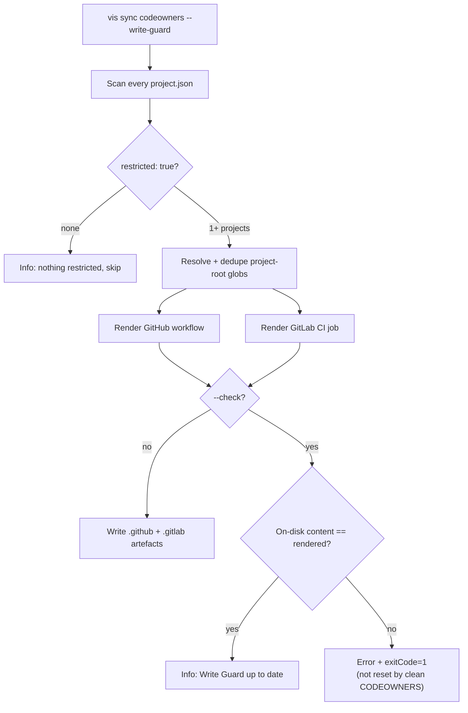

# vis sync

Generates workspace-wide artefacts that are derived from per-project configuration.

## Usage

```bash
vis sync <kind> [options]
```

## Kinds

### codeowners

Aggregates `owners` entries from every project's `project.json` into a single `CODEOWNERS` file.

```bash
vis sync codeowners                           # Write to <workspace>/CODEOWNERS
vis sync codeowners --out=.github/CODEOWNERS  # Custom output path
vis sync codeowners --check                   # Verify file is up to date (CI guard)
vis sync codeowners --write-guard             # Also emit Write Guard CI (GitHub + GitLab)
vis sync codeowners --write-guard --check     # CI: fail if Write Guard files drift
```

#### project.json owners

Each project declares its code owners:

```json
{
    "$schema": "https://unpkg.com/@visulima/vis/schemas/project.schema.json",
    "owners": [
        { "path": "src/**", "owners": ["@myorg/core-team"] },
        { "path": "docs/**", "owners": ["@myorg/docs-team"], "channel": "#docs-reviews" }
    ]
}
```

#### vis.config.ts codeowners block

```typescript
export default defineConfig({
    codeowners: {
        orderBy: "project-id", // or "file-source" (default)
        provider: "github", // "github" | "gitlab" | "bitbucket" | "other"
        globalPaths: {
            "/.github/**": ["@myorg/platform"],
            "/pnpm-workspace.yaml": ["@myorg/infra"],
        },
    },
});
```

#### Write Guard (`--write-guard`)

`--write-guard` is opt-in. On top of generating `CODEOWNERS`, it emits CI that
**fails a pull / merge request when a project flagged `restricted: true` in its
`project.json` is touched without going through its CODEOWNERS approval.**

Two artefacts are written so the guard works on both forges, scoped to the
restricted project roots only — unrelated changes are never blocked:

| Forge  | Output path                         | Mechanism                                                                                        |
| ------ | ----------------------------------- | ------------------------------------------------------------------------------------------------ |
| GitHub | `.github/workflows/write-guard.yml` | `pull_request` workflow gated on restricted paths, delegates to the `geritol/write-guard` action |
| GitLab | `.gitlab/write-guard.gitlab-ci.yml` | Includable MR-gated job; verifies CODEOWNERS is in sync and prints the approval requirement      |

Opt a project in via its `project.json`:

```json
{
    "$schema": "https://unpkg.com/@visulima/vis/schemas/project.schema.json",
    "restricted": true,
    "owners": [{ "path": "src/**", "owners": ["@myorg/security"] }]
}
```

`include` the GitLab file from your root `.gitlab-ci.yml` and pair it with a
protected-branch CODEOWNERS approval rule for full enforcement. With
`--write-guard --check`, CI exits non-zero if either generated file drifts from
what the current `restricted` set would produce — a clean `CODEOWNERS` does
**not** reset that failure. When no project is flagged `restricted: true`, the
flag no-ops with an informational message.

Upstream references: the GitHub workflow delegates to the
[`geritol/write-guard`](https://github.com/marketplace/actions/write-guard)
action; both forges build on native CODEOWNERS approval —
[GitHub CODEOWNERS](https://docs.github.com/en/repositories/managing-your-repositorys-settings-and-features/customizing-your-repository/about-code-owners)
and [GitLab Code Owners](https://docs.gitlab.com/ee/user/project/codeowners/).



### package-json-fields

Mirrors a small set of metadata fields from the **root** `package.json` to every workspace package, so each package keeps a consistent `license`, `author`, `bugs`, `homepage`, `engines`, and `repository`. `repository.directory` is preserved per package — only `type` and `url` are copied from root.

```bash
vis sync package-json-fields                            # Mirror defaults from root → every package
vis sync package-json-fields --check                    # CI: exit 1 if any package is out of sync
vis sync package-json-fields --fields license,engines   # Override the field list for this run
vis sync package-json-fields --ignore-package-name '@scope/internal-*'
vis sync package-json-fields --format=json              # Machine-readable diff
vis sync package-json-fields --quiet                    # Only print the summary line
```

#### Default fields

`author`, `bugs`, `homepage`, `license`, `repository`, `engines`.

For `repository`, root's `type` and `url` overwrite the package's, but the package's `directory` (its subpath inside the monorepo) is kept. For every other field the root value is copied verbatim.

Fields missing from root are skipped — sync never deletes from a package. Fields already deep-equal to root are skipped — no mtime churn.

## Options

| Option                  | Default                  | Description                                                                                |
| ----------------------- | ------------------------ | ------------------------------------------------------------------------------------------ |
| `--out`                 | `<workspace>/CODEOWNERS` | Output file path (codeowners only)                                                         |
| `--check`               | `false`                  | Exit non-zero if drift is found (no writes)                                                |
| `--write-guard`         | `false`                  | Also emit GitHub + GitLab Write Guard CI for `restricted: true` projects (codeowners only) |
| `--fields`              |                          | Comma-separated field list to mirror (package-json-fields only). Repeatable.               |
| `--ignore-package-name` |                          | Glob of package names to skip (package-json-fields only). Repeatable.                      |
| `--format`              | `human`                  | Output format for package-json-fields: `human` or `json`.                                  |
| `--quiet`               | `false`                  | Suppress per-package log lines; print only the summary (package-json-fields only).         |
