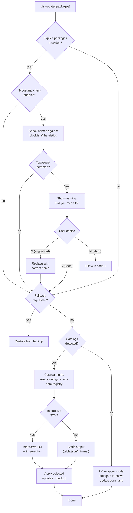

# vis update

Update packages to their latest versions. Automatically uses **catalog mode** for pnpm/bun workspaces with catalogs, or wraps the native package manager otherwise.

**Alias:** `vis up`

## Usage

```bash
vis update [packages] [options]
```

## Examples

```bash
vis update react                    # Update react within semver range
vis up react -L                     # Update react to latest
vis update -i                       # Interactive mode
vis update --filter app             # Update in specific workspace
vis update -r                       # Update in all workspaces
vis update --target minor           # Only apply minor/patch updates (catalog)
vis update --dry-run                # Preview changes without applying
vis update --exclude '@types/*'     # Exclude packages by pattern
vis update --changelog              # Show changelog links after updating
vis update --rollback               # Restore catalog from last backup
```

## Options

| Option                         | Alias | Default  | Description                                                                                                                                                                                                                    |
| ------------------------------ | ----- | -------- | ------------------------------------------------------------------------------------------------------------------------------------------------------------------------------------------------------------------------------ |
| `--latest`                     | `-L`  | `false`  | Update to latest version (ignore semver range)                                                                                                                                                                                 |
| `--target`                     | `-t`  | `latest` | Update target: `latest`, `minor`, or `patch` (catalog)                                                                                                                                                                         |
| `--dry-run`                    | `-d`  | `false`  | Preview changes without applying                                                                                                                                                                                               |
| `--global`                     | `-g`  | `false`  | Update global packages                                                                                                                                                                                                         |
| `--recursive`                  | `-r`  | `false`  | Update recursively in all workspace packages                                                                                                                                                                                   |
| `--filter`                     |       |          | Filter packages in monorepo                                                                                                                                                                                                    |
| `--workspace-root`             | `-w`  | `false`  | Include workspace root                                                                                                                                                                                                         |
| `--dev`                        | `-D`  | `false`  | Update only devDependencies                                                                                                                                                                                                    |
| `--prod`                       | `-P`  | `false`  | Update only dependencies                                                                                                                                                                                                       |
| `--interactive`                | `-i`  | `false`  | Interactive mode                                                                                                                                                                                                               |
| `--no-optional`                |       | `false`  | Don't update optionalDependencies                                                                                                                                                                                              |
| `--include-locked`             | `-l`  | `false`  | Include packages with pinned/exact versions (no `^` or `~` prefix)                                                                                                                                                             |
| `--no-save`                    |       | `false`  | Update lockfile only                                                                                                                                                                                                           |
| `--include`                    |       |          | Glob pattern to include packages (repeatable, catalog)                                                                                                                                                                         |
| `--exclude`                    |       |          | Glob pattern to exclude packages (repeatable, catalog)                                                                                                                                                                         |
| `--prerelease`                 |       | `false`  | Include prerelease versions (catalog)                                                                                                                                                                                          |
| `--security` / `--no-security` |       | `true`   | Check for known security vulnerabilities (OSV.dev); `--no-security` to skip                                                                                                                                                    |
| `--no-catalog`                 |       | `false`  | Skip catalog mode, use package manager directly                                                                                                                                                                                |
| `--format`                     |       | `table`  | Output format: `table`, `json`, or `minimal`                                                                                                                                                                                   |
| `--changelog`                  |       | `false`  | Show changelog URLs for updated packages                                                                                                                                                                                       |
| `--install`                    |       | `true`   | Run install after catalog update (`--no-install` to skip)                                                                                                                                                                      |
| `--rollback`                   |       | `false`  | Restore catalog file from the last backup                                                                                                                                                                                      |
| `--no-typosquat-check`         |       | `false`  | Skip typosquat name check for package arguments                                                                                                                                                                                |
| `--no-marshall-check`          |       | `false`  | Skip the offline marshall pipeline when explicit package arguments are supplied (author, provenance, s1ngularity, metadata, downloads, expired-domains, new-bin, archived-repo). Blanket `vis update` never runs the pipeline. |
| `--max-concurrent-requests`    |       | `8`      | Cap concurrent registry requests during outdated checks (catalog)                                                                                                                                                              |
| `--release-channel`            |       | `stable` | Channel filter: `stable`, `same` (match current's prerelease channel), or `any`                                                                                                                                                |
| `--no-actions`                 |       | `false`  | Skip the GitHub Actions ecosystem scan                                                                                                                                                                                         |
| `--no-docker`                  |       | `false`  | Skip the Docker ecosystem scan (Dockerfile + docker-compose)                                                                                                                                                                   |
| `--no-gitlab`                  |       | `false`  | Skip the GitLab CI ecosystem scan (.gitlab-ci.yml + .gitlab/ci/\*\*)                                                                                                                                                           |
| `--include-branches`           |       | `false`  | Include branch references (e.g. `actions/checkout@main`) when scanning workflows                                                                                                                                               |
| `--style`                      |       | `sha`    | Reference style for GitHub Actions: `sha` pins to commit SHA + version comment, `preserve` keeps the existing style                                                                                                            |
| `--actions-token`              |       |          | GitHub token override (falls back to `GITHUB_TOKEN` / `GH_TOKEN`)                                                                                                                                                              |
| `--gitlab-token`               |       |          | GitLab token override (falls back to `GITLAB_TOKEN` / `CI_JOB_TOKEN`)                                                                                                                                                          |

## How It Works



## Catalog Mode vs Package Manager Mode

### Catalog Mode (pnpm/bun)

When catalogs are detected in `pnpm-workspace.yaml` or `package.json`, vis directly updates the catalog entries. This mode:

- Reads catalog definitions from the workspace config
- Checks the npm registry for newer versions
- Updates the catalog file in place
- Creates a backup before modifying
- Optionally runs `pnpm install` or `bun install` after updating

### Package Manager Mode

When catalogs are not available (or `--no-catalog` is used), vis wraps the native package manager's update command. Supported package managers:

- **pnpm** — Full feature support
- **npm** — Basic support
- **yarn v1** — Limited support
- **yarn berry** — Full support
- **bun** — Partial support
- **deno** — Maps to `deno outdated --update`. `--latest` and `--interactive` flow through; `--filter`, `--dev` / `--prod`, `--no-optional`, and `--no-save` are not supported and emit warnings (deno's update model is governed by `deno.json`)

## Backup and Rollback

Every catalog update automatically creates a backup. To restore:

```bash
vis update --rollback
```

The backup is stored alongside the catalog file (e.g., `pnpm-workspace.yaml.backup`).

## Configuration

These settings can be defined in `vis.config.ts` under the `update` key:

```typescript
import { defineConfig } from "@visulima/vis/config";

export default defineConfig({
    update: {
        target: "minor",
        exclude: ["@types/*"],
        includeLocked: false,
        packageMode: {
            typescript: "minor",
            "/^@vue/": "patch",
        },
        depFields: ["dependencies", "devDependencies", "optionalDependencies", "peerDependencies", "overrides"],
    },
});
```

### `includeLocked`

By default, packages with pinned/exact versions (no `^` or `~` prefix, e.g., `"react": "18.2.0"`) are skipped during update checks. Set `includeLocked: true` or pass `--include-locked` to opt them in.

### `packageMode`

Per-package or per-pattern update target overrides. Keys can be:

- **Exact names**: `"typescript"` — matches only that package
- **Glob patterns**: `"@types/*"` — matches any `@types/` package
- **Regex patterns**: `"/^@vue/"` — wrapped in `/`, uses regex matching

## Non-npm ecosystem updates

In addition to npm/pnpm/bun catalogs, `vis update` auto-detects and updates references in:

### GitHub Actions

Scans `.github/workflows/*.yml`, `.github/actions/*/action.yml`, and root `action.yml`. For every `uses:` reference it:

- Lists tags via the GitHub REST API (`/repos/{owner}/{repo}/tags`)
- Default-pins to the commit SHA with a `# vN.M.P` version-hint comment for readability
- Supports `--style preserve` to keep the existing tag-style reference
- Skips branch refs (`@main`, `@master`) unless `--include-branches` is passed
- Honours inline ignore directives: `# actions-up-ignore`, `# actions-up-ignore-next-line`, and block `# actions-up-ignore-start` / `# actions-up-ignore-end`
- Dedupes per `owner/repo` so a workflow with N references to the same action costs one API round-trip

Set `GITHUB_TOKEN` (or pass `--actions-token`) to raise the rate limit from 60 to 5000 requests/hour.

### Docker

Scans every Dockerfile (any name matching `Dockerfile*` / `*.dockerfile`) and compose file (`docker-compose*.yml`, `compose*.yml`). For each `FROM` line and `image:` field it:

- Resolves tags from Docker Hub (`docker.io`), GHCR (`ghcr.io`), and any v2-compatible registry
- Handles registry bearer-token challenges automatically
- Skips `latest`, `nightly`, and other non-semver tags unless `--include-branches` is passed
- Honours `# vis-update-ignore` and `# vis-update-ignore-next-line` directives
- Supports digest-pinned images (`image:tag@sha256:…`) — the new tag is written without the stale digest

### GitLab CI

Scans `.gitlab-ci.yml` and any `*.yml` / `*.yaml` under `.gitlab/ci/`. Updates:

- `image:` and `services:` entries (resolved via Docker registries, same path as Docker scanning)
- `include: { project, ref }` blocks (resolved via the GitLab v4 REST API on `gitlab.com` or the host extracted from the project path for self-hosted instances)
- `include: { component: <host>/<group>/<project>@<ref> }` blocks

Set `GITLAB_TOKEN` or `CI_JOB_TOKEN` (or pass `--gitlab-token`) for private GitLab instances.

### Dependabot / Renovate integration

The ecosystem scan respects ignore lists declared in `.github/dependabot.yml` and `renovate.json` so you don't have to duplicate them. Specifically:

- Dependabot `ignore.dependency-name` entries (per `package-ecosystem`)
- Renovate top-level `ignoreDeps`
- Renovate per-manager `ignoreDeps` (`github-actions`, `dockerfile`, `docker-compose`, `gitlabci`, `gitlabci-include`)
- Renovate `packageRules` entries with `enabled: false`

The npm/catalog path is unchanged — Dependabot/Renovate npm ignore rules continue to be governed by your catalog config.

### Disabling ecosystem updates

Pass `--no-actions`, `--no-docker`, or `--no-gitlab` to opt out of a single ecosystem. Passing explicit package arguments (`vis update lodash`) targets the npm path only and skips the ecosystem scan entirely.

Values are `"latest"`, `"minor"`, or `"patch"`. Unmatched packages use the global `target`.

### `depFields`

Controls which dependency fields are scanned for outdated packages. Beyond the standard fields (`dependencies`, `devDependencies`, `optionalDependencies`, `peerDependencies`), you can include:

- `"overrides"` — npm overrides
- `"resolutions"` — yarn resolutions
- `"pnpm.overrides"` — pnpm overrides (nested field)

Values that reference other dependencies (e.g., `"$react"` in npm overrides) are automatically skipped.

### Maturity Period

The `update.minimumReleaseAge` setting (in minutes) filters out versions published too recently, so you don't adopt packages that might be yanked or found malicious shortly after publishing.

This is separate from `security.policies.firstSeen.minutes` (which applies at install time). The update setting is **not enabled by default** — all published versions are eligible for updates unless you opt in.

```typescript
export default defineConfig({
    update: {
        minimumReleaseAge: 1440, // 24 hours
        minimumReleaseAgeExclude: ["webpack", "@myorg/*"],
    },
});
```

If `minimumReleaseAge` is also configured in your package manager's native config (`pnpm-workspace.yaml` or `package.json`), vis will warn when the values are out of sync.
