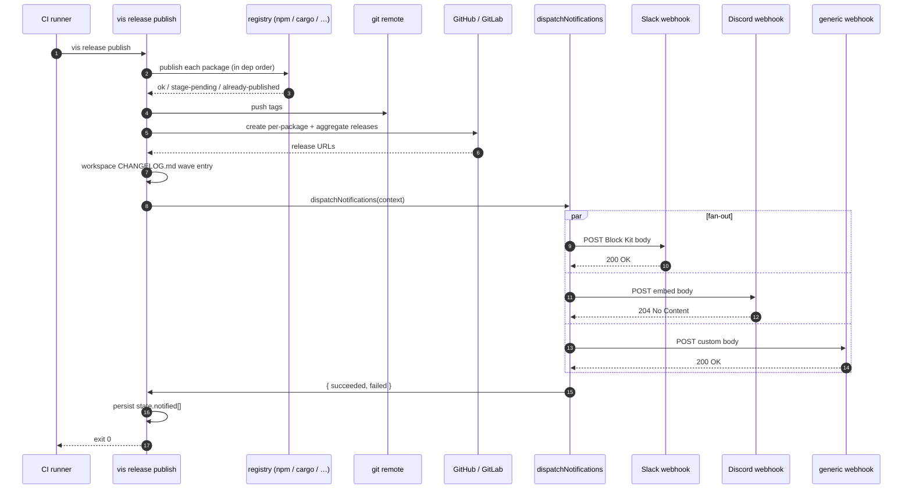

# Release notifications

Once a release wave finishes — tags pushed, GitHub releases created, workspace `CHANGELOG.md` committed — most teams want to tell **somebody** about it. A Slack channel, a Discord server, a Teams room, an internal dashboard. Historically that has meant either curl in `postPublishCommand` (ugly, error-prone, no token redaction, no idempotency) or a userland semantic-release plugin (correct, but every team writes the same 90% of the code).

`release.notifications` is vis's bundled answer: three first-class channels (Slack, Discord, generic webhook), a typed `NotificationChannel` plugin surface for the rest, parallel dispatch, per-channel soft-fail, and `--resume` dedup so a retry after a partial publish does not re-fire the same Slack ping.

> The notifications subsystem is modelled on the semantic-release plugin ecosystem (`semantic-release-slack-bot`, `semantic-release-discord-notifier`, …) — but first-party so the most common cases require zero userland code.

## When notifications fire

Notifications are dispatched **after** every other post-publish step finishes. Specifically: after tags are pushed, after the per-package and aggregate GitHub / GitLab releases land, and after the workspace-level `CHANGELOG.md` wave entry is committed. Chat pings reflect the **final** state of the release, not an in-progress snapshot.



Three things matter about this ordering:

- **Every channel runs in parallel.** A slow webhook does not stall the others.
- **Per-channel failure is isolated.** A Slack webhook outage logs a warning; it never fails the publish. The release already shipped — chat tooling outages should not cascade into "the package is on npm but CI is red".
- **State is persisted after dispatch.** The `state.notified[]` array in `.vis/release/.state.json` records every `name@version` for which at least one channel succeeded, so `--resume` after a partial publish does not re-send duplicates.

## The configuration shape

Add a `notifications` block under `release` in `vis.config.ts`:

```typescript
// vis.config.ts
export default {
    release: {
        notifications: {
            // Built-in channels — single object or an array. See sections below.
            slack: { webhook: "${SLACK_WEBHOOK_URL}" },
            discord: { webhook: "${DISCORD_WEBHOOK_URL}" },
            webhook: {
                url: "https://hooks.example.com/release",
                headers: { "X-Auth": "Bearer ${WEBHOOK_TOKEN}" },
            },

            // Custom channels — paths to your own NotificationChannel modules.
            plugins: ["./.vis/release/teams-channel.ts"],

            // Default: true (no chat noise from alpha / beta / canary waves).
            skipPrerelease: true,
        },
    },
};
```

Three workspace-wide knobs and three (or four) channel slots. The full picture:

- `slack` / `discord` / `webhook` — each accepts **either** a single config object **or** an array of them. The array form fans out to multiple instances of the same channel kind (e.g. one Slack webhook for `#engineering`, another for `#releases`).
- `plugins` — array of paths (or `[path, options]` tuples) to custom `NotificationChannel` implementations. See [Plugin authoring → custom NotificationChannel](./release-plugin-authoring.mdx#custom-notificationchannel) for the full contract.
- `skipPrerelease` — default `true`. When every published version in the wave has a `-…` suffix (e.g. `1.2.0-alpha.0`), the dispatcher returns immediately without firing any channel. Most teams want Slack noise only on stable releases.

Env-var substitution (`${SLACK_WEBHOOK_URL}`) is resolved by the standard visulima config loader, so webhook URLs never need to live inline in your repo.

## The Slack channel

Slack uses **incoming webhooks** — workspace+channel-scoped URLs you create once and paste. No OAuth, no bot token, no rotating credentials. To wire one up:

1. Visit [api.slack.com/apps](https://api.slack.com/apps) → **Create New App** → **From scratch**.
2. Pick a workspace, give the app a name (`vis release notifier` works).
3. Sidebar → **Incoming Webhooks** → toggle on.
4. **Add New Webhook to Workspace** → pick the destination channel.
5. Copy the URL (looks like `https://hooks.slack.com/services/T.../B.../...`). Treat it as a bearer secret.

Then in `vis.config.ts`:

```typescript
release: {
    notifications: {
        slack: { webhook: "${SLACK_WEBHOOK_URL}" },
    },
},
```

Set `SLACK_WEBHOOK_URL` in your CI runner's secret store and you are done. The default message is a Block Kit payload with three sections:

```
┌───────────────────────────────────────────────┐
│ 🚀 Released 2 packages                        │  ← header block
├───────────────────────────────────────────────┤
│ • @scope/cerebro@1.5.0   (links to GH release)│  ← section block
│ • @scope/cli@2.1.0       (links to GH release)│
├───────────────────────────────────────────────┤
│ channel: `latest`  •  foo/bar  •  May 22, 2:00│  ← context block
└───────────────────────────────────────────────┘
```

If the wave skipped any packages (stage-rejected, stage-timeout, already-published), a divider + `Skipped (N):` section is appended automatically.

Want to override the look?

```typescript
slack: {
    webhook: "${SLACK_WEBHOOK_URL}",
    title: "📦 {repo} shipped {count} packages on {channel}",
    username: "Release Bot",
    iconEmoji: ":rocket:",
    includeSkipped: false, // suppress the Skipped block
}
```

The `title` field accepts every [template token](#template-tokens) listed below. Heavier customisation (different block layouts, attachments, threading) is what the [custom channel plugin surface](./release-plugin-authoring.mdx#custom-notificationchannel) is for — the built-in is intentionally opinionated.

## The Discord channel

Discord uses **server+channel webhooks** — paste the URL the same way you would for Slack. To create one: in your Discord server, **Server Settings → Integrations → Webhooks → New Webhook**. Pick a channel, name the bot, copy the URL.

```typescript
release: {
    notifications: {
        discord: { webhook: "${DISCORD_WEBHOOK_URL}" },
    },
},
```

The default message is a single embed with a title, a bulleted description of every released package (linked to its GH release where available), and two inline fields for `Channel` and `Repository`. Skipped packages are listed in an additional field when present.

The embed colour is configurable as an integer RGB value:

```typescript
discord: {
    webhook: "${DISCORD_WEBHOOK_URL}",
    color: 0x10B981, // emerald-500
    username: "Release Bot",
    avatarUrl: "https://example.com/bot-avatar.png",
}
```

For very large waves (more than ~25 packages), the description is truncated with a `… +N more` footer to stay under Discord's hard 4096-character embed-description limit. If you regularly ship more than that in one wave, point a [custom channel](./release-plugin-authoring.mdx#custom-notificationchannel) at Discord's API and paginate yourself.

## The generic webhook channel

For everything that isn't Slack or Discord — Microsoft Teams, Mattermost, Alertmanager, internal dashboards, Zapier — the `webhook` channel POSTs a JSON body of your choosing to a URL of your choosing.

The simplest form:

```typescript
release: {
    notifications: {
        webhook: { url: "https://hooks.example.com/release" },
    },
},
```

With no `body` template configured, vis sends the **full `NotificationContext` verbatim** as the request body. That gives your receiver every field — package list, URLs, channel, repo, skipped reasons — without you having to author a schema. Great for prototyping.

When you want to control the shape (typical for Teams or Mattermost's "MessageCard" / "block" formats), provide a `body` template:

```typescript
webhook: {
    url: "https://outlook.office.com/webhook/...",
    headers: { "X-Auth": "Bearer ${WEBHOOK_TOKEN}" },
    body: {
        "@type": "MessageCard",
        "@context": "https://schema.org/extensions",
        themeColor: "0078D7",
        summary: "Released {count} packages",
        sections: [
            {
                activityTitle: "🚀 {repo} — {count} packages shipped",
                activitySubtitle: "{date} on {channel}",
                text: "Packages: {packages}",
            },
        ],
    },
},
```

The body is **deeply interpolated**: every string leaf flows through the template engine; arrays and nested objects preserve their structure; numbers and booleans pass through untouched. Header values are also interpolated, so `"X-Release-Pkg": "{firstName}@{firstVersion}"` works.

> If your endpoint is a Slack-style or Discord-style webhook (e.g. Mattermost has Slack-compatible incoming webhooks), use the dedicated `slack` / `discord` channel — they already produce the right body shape. The generic webhook is for everything else.

### Microsoft Teams

Teams accepts both the legacy **Office 365 Connector** card format and the newer **Adaptive Cards** format via incoming webhooks. The example above uses the connector format; for adaptive cards, swap the body:

```typescript
webhook: {
    url: "${TEAMS_WEBHOOK_URL}",
    body: {
        type: "message",
        attachments: [{
            contentType: "application/vnd.microsoft.card.adaptive",
            content: {
                type: "AdaptiveCard",
                version: "1.4",
                body: [
                    { type: "TextBlock", size: "Large", weight: "Bolder", text: "Released {count} packages" },
                    { type: "TextBlock", text: "{packages}", wrap: true },
                ],
            },
        }],
    },
},
```

### Mattermost

Mattermost's incoming webhook is Slack-compatible — use the `slack` channel:

```typescript
slack: { webhook: "${MATTERMOST_WEBHOOK_URL}" },
```

## Template tokens

Every string field that runs through the template engine (`title`, header values, every string leaf in a webhook `body`) supports these tokens.

| Token            | Expands to                                        | Example                          |
| ---------------- | ------------------------------------------------- | -------------------------------- |
| `{count}`        | Number of published packages                      | `2`                              |
| `{packages}`     | Comma-separated `name@version` list               | `@scope/a@1.0.0, @scope/b@2.1.0` |
| `{firstName}`    | First package's name (handy for single-pkg waves) | `@scope/a`                       |
| `{firstVersion}` | First package's version                           | `1.0.0`                          |
| `{channel}`      | Active channel name (`latest`, `alpha`, …)        | `latest`                         |
| `{repo}`         | Repo slug (`owner/name`)                          | `foo/bar`                        |
| `{date}`         | ISO date (`YYYY-MM-DD`) of the wave completion    | `2026-05-22`                     |

Unset optional fields (`{channel}` / `{repo}` when not detected) expand to the empty string. Non-string values passed by misconfiguration (a number, a boolean) are coerced via `String()` rather than throwing.

So a template like:

```
"Released {count} ({packages}) on {channel} via {repo} on {date} — first {firstName}@{firstVersion}"
```

…against a two-package wave on `latest` from `foo/bar`, produces:

```
Released 2 (@scope/a@1.0.0, @scope/b@2.1.0) on latest via foo/bar on 2026-05-22 — first @scope/a@1.0.0
```

## Skipping prereleases (the default)

By default, **alpha / beta / canary waves never notify**. The dispatcher checks every published version in the wave for a prerelease component (the `-` segment in semver — `1.2.0-alpha.0`, `2.0.0-next.1`, etc.); when **all** of them have one, the wave is treated as a prerelease and the dispatcher returns early.

This is almost always the right default — most teams broadcast stables to chat and let prereleases ship silently to the registry. To turn it off (notify on every wave):

```typescript
notifications: {
    skipPrerelease: false,
    slack: { webhook: "${SLACK_WEBHOOK_URL}" },
}
```

> **Mixed waves still notify.** A wave that contains one alpha + four stables is **not** considered a prerelease wave (the rule is `every`, not `some`). Those are rare and almost always deliberate — the chat ping is the right behaviour.

## Multi-channel fan-out

The array form lets you fire the same channel kind multiple times — different webhooks, different audiences:

```typescript
notifications: {
    slack: [
        {
            id: "engineering",
            webhook: "${SLACK_ENG_WEBHOOK_URL}",
            title: "🚀 {count} packages shipped on {channel}",
        },
        {
            id: "releases",
            webhook: "${SLACK_RELEASES_WEBHOOK_URL}",
            title: "[release] {repo} → {packages}",
            includeSkipped: false,
        },
    ],
    discord: [
        { id: "community", webhook: "${DISCORD_COMMUNITY_WEBHOOK_URL}" },
        { id: "internal", webhook: "${DISCORD_INTERNAL_WEBHOOK_URL}", color: 0xEF4444 },
    ],
},
```

The `id` field is an operator-supplied disambiguator that surfaces in log lines (`[notifications:slack:engineering]`), in `result.failed[].id`, and in the `state.notified` ledger. Without an `id`, both Slack channels would log as `[notifications:slack]` and you would not know which one rejected.

All entries across all channel kinds run in **parallel**. There is no ordering guarantee — and your channel implementations should not depend on one.

## `--resume` and the `state.notified` ledger

Notifications are the only post-publish step with **no server-side idempotency** — chat webhooks happily accept the same payload twice and render two messages. Tags are idempotent (`git push --tags` skips ones that already exist). GitHub release creation is idempotent (the per-package release walks check before creating). But `POST https://hooks.slack.com/services/...` will gladly duplicate.

To prevent a `vis release publish --resume` after a partial failure from re-pinging Slack for releases that already shipped, the orchestrator maintains a `state.notified` array in `.vis/release/.state.json`. Pseudocode of the contract:

```typescript
// Build the dedup set from the persisted ledger.
const alreadyNotified = new Set(state.notified ?? []);

// Filter this wave's published[] down to only the entries that have not
// been notified yet (keyed by `name@version`).
const notifiable = result.published.filter((p) => !alreadyNotified.has(`${p.name}@${p.version}`));

if (notifiable.length === 0) {
    // Everything in this wave was notified on a prior run. Skip dispatch entirely.
    return;
}

const dispatchResult = await dispatchNotifications(config, { ...context, published: notifiable });

// Persist ONLY when at least one channel succeeded. A total dispatch failure
// (all channels down) can retry next wave instead of being silently skipped.
if (dispatchResult.succeeded.length > 0) {
    state.notified = [...(state.notified ?? []), ...notifiable.map((p) => `${p.name}@${p.version}`)];
    await writeState(cwd, changesDir, state);
}
```

Three rules fall out of this:

- **Dedup is per `name@version`.** A re-run on the same wave never re-fires. A new release of the same package re-fires (new version → new key).
- **Persist only on at least one success.** A total dispatch failure (Slack + Discord both 502) leaves the ledger untouched so the next wave retries the same pings. This is intentional — silent permanent skip would be worse than an occasional retry.
- **No partial dedup across channels.** If Slack succeeded but Discord failed in run 1, the version is marked notified, and run 2 will **not** retry Discord. The trade-off is "no Slack duplicates" vs "no Discord-only retries"; we picked the former because chat duplicates are highly visible and annoying. Custom retry logic belongs in the channel implementation (see plugin authoring).

If you need to force a re-notification (e.g. you fixed a typo in the Slack template and want to re-send), edit `.vis/release/.state.json` and drop the relevant `name@version` entries.

## Custom channels (plugin pointer)

Anything more bespoke than the three built-ins — PagerDuty incidents, Linear status updates, an internal bot with custom routing — wires up via `notifications.plugins`. A plugin module exports either a `NotificationChannel` object directly or a factory function returning one:

```typescript
// .vis/release/teams-channel.ts
import { defineNotificationChannel, type NotificationContext } from "@visulima/vis/release/plugin-sdk";

export default defineNotificationChannel({
    id: "teams",
    async send(context: NotificationContext) {
        // Your HTTP / SDK call here.
    },
});
```

Reference it from config:

```typescript
notifications: {
    plugins: [
        "./.vis/release/teams-channel.ts",
        // Or with options:
        ["./.vis/release/incident-channel.ts", { severity: "info" }],
    ],
},
```

The full authoring guide — soft-fail contract, factory shape, error redaction, doctor preflight — lives in [Plugin authoring → custom NotificationChannel](./release-plugin-authoring.mdx#custom-notificationchannel).

## Testing your configuration

Before relying on a channel for a real release, dry-run it with `vis release notifications test`. The command builds a synthetic single-package release context and dispatches to every configured channel:

```bash
vis release notifications test                              # All channels
vis release notifications test --channel=slack              # Only Slack
vis release notifications test --channel=slack:engineering  # One id'd Slack hook
vis release notifications test --custom-context=./fake.json # Use your own context
vis release notifications test --json                       # Machine-readable
```

Exits 0 only when every dispatched channel succeeds. Use this in a one-off CI job after wiring a new webhook, or locally after editing a `body` template.

## Doctor checks

`vis release doctor` runs a preflight on your notification config: webhook URLs are syntactically valid, env-var references resolve, plugin paths load. The full notification dispatch path itself runs at the end of `vis release publish` — failures there surface as plan warnings, not preflight errors, because they happen **after** the release is immutable.

## When NOT to use notifications

- **You want to gate the release on chat approval.** Notifications fire _after_ publish. They cannot block. For human-in-the-loop approval, see [staged publishing](./release-staged-publishing.mdx).
- **You need delivery guarantees.** Webhooks are best-effort. A 502 from Slack is logged and dropped (after the per-channel try/catch). If your audit requirements demand a durable record, write a custom channel that persists to your own datastore before returning success.
- **You want PR-time previews of what would ship.** Use the `vis release plan` command and the [PR sticky-comment workflow](./release-ci.mdx#workflow-c-pr-sticky-comment) — those fire **before** publish, not after.
