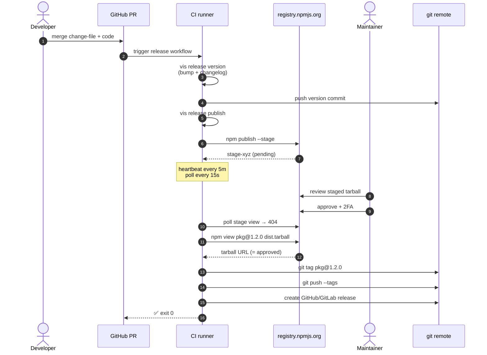
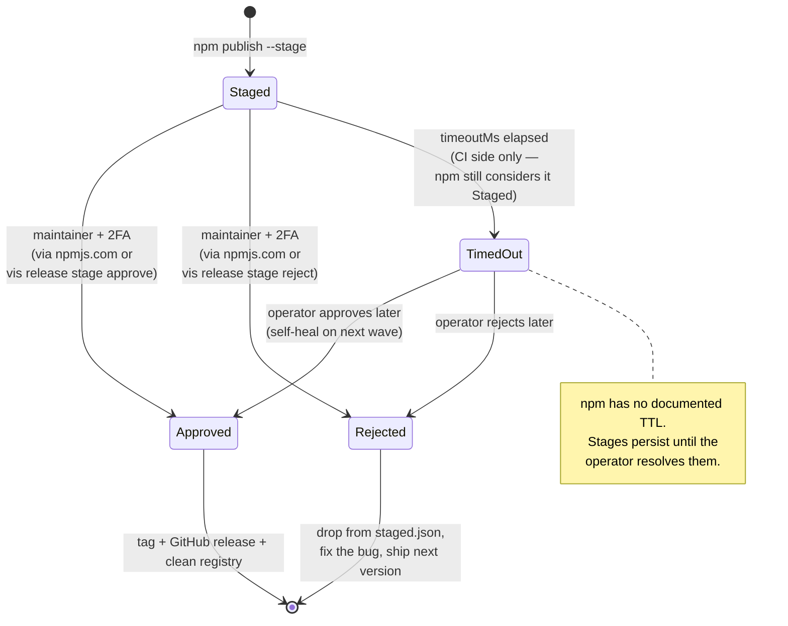
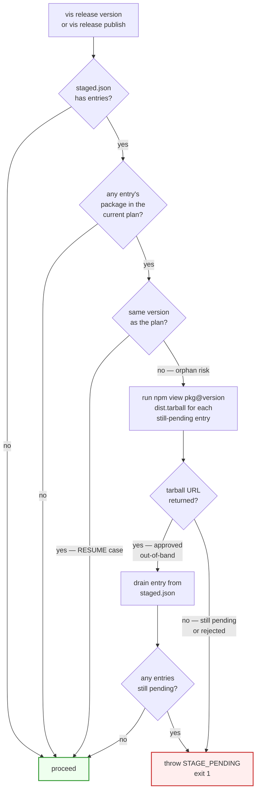
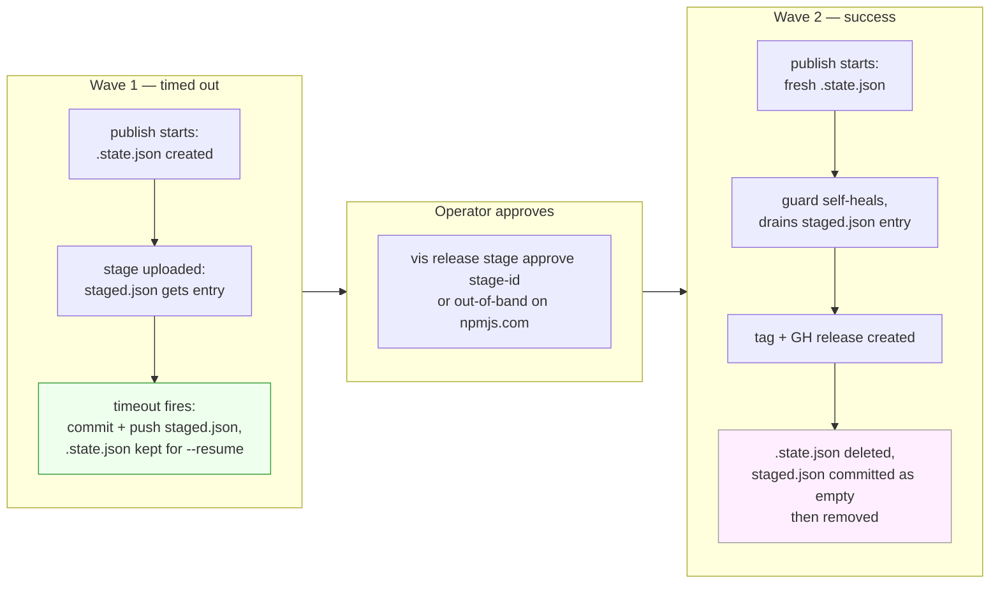
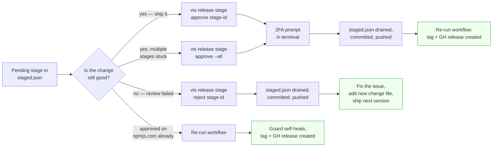

# Staged publishing

Use this when a maintainer must approve every npm publish with 2FA before the version becomes installable — typically for high-trust packages, SOX-style separation-of-duties, or OIDC-without-2FA pipelines.

npm 11.15.0 introduced **staged publishing**: instead of `npm publish` landing a version directly on the registry, it uploads a tarball into a holding area and waits for a maintainer to approve it with 2FA. Until approval, the version is **not installable**; it just exists as a stage record.

vis turns this into a release-manager feature. Opt into staging, and every publish wave blocks until a maintainer approves. CI stays green on rejection or timeout. The workflow self-heals when approvals happen out-of-band. A tracked file in your repo (`.vis/release/staged.json`) is the single source of truth for what's still pending.

> ⚠ **Requirements:** npm CLI **≥ 11.15.0**, registry **registry.npmjs.org** (staging is an npm Inc. feature — Verdaccio, GitHub Packages, Artifactory don't implement it). `vis release doctor` surfaces both prereqs.

## Why use staging

A typical release pipeline gives reviewers exactly **one** synchronous gate: "did this PR pass CI?". Everything else — version bump, changelog, tag push, npm publish — is automated. That works until you ship a version that shouldn't have shipped: a leaked credential, a missed `.npmignore`, a typo in the entry point. By then the tarball is on the registry, immutable, indexed by every mirror.

Staging adds a **second** gate, scoped to the moment the tarball is uploaded but **before** anyone can `npm install` it. A maintainer reviews the staged tarball on npmjs.com (or via `npm stage view <id>`), confirms identity with 2FA, and only then is the version promoted to "installable". Rejection costs nothing — the staged tarball gets garbage-collected.

## Enable it

In `vis.config.ts`:

```typescript
export default {
    release: {
        publish: {
            stage: true,
        },
    },
};
```

That's it for the defaults: 30-minute approval timeout, 15-second poll interval. The full shape:

```typescript
release: {
    publish: {
        stage: {
            // Hard deadline for the approval wait. Past this, the publish
            // gives up with a `::warning::` and CI exits 0. Default: 30m.
            timeoutMs: 30 * 60 * 1000,
            // How often vis polls `npm stage view <id>` to detect a
            // decision. Lower → faster pickup; higher → gentler on npm's
            // API. Default: 15s.
            pollIntervalMs: 15 * 1000,
        },
    },
},
```

> 💡 **Per-package opt-in?** Not currently — `publish.stage` is workspace-wide. Either every managed package stages or none do.

## The happy path



That's the whole story when approvals happen within the timeout. The maintainer sees "this release is waiting for me" on npmjs.com, clicks approve with 2FA, and the pipeline finishes itself.

## What happens when things don't go smoothly

This is the part that matters. Every failure mode is recoverable, none of them fail CI.

### The stage lifecycle

A stage record on npm transitions between four states. The CI side of vis tracks the **decision** vis observed (which may lag the registry state) and routes per-package outcomes accordingly.



The boundary between **Staged** and **TimedOut** is vis's invention — npm itself just keeps the record sitting in the holding area. vis introduces the timeout so CI doesn't pin a runner indefinitely; the actual stage outlives the timeout and can still be approved.

### Failure mode 1: approval takes longer than `timeoutMs`

Past the deadline (30 minutes by default), `waitForStageDecision` returns `"timeout"`. The publish step writes:

```
::warning::Stage stage-xyz timed out waiting for approval (30m).
            Approve via npm 2FA or `vis release stage approve stage-xyz`.

  [stage]   @scope/pkg  (stage-timeout — re-run `vis release publish` once approved)
```

- **CI exits 0** (not failure)
- **No git tag** is created
- **No GitHub/GitLab release** is created
- The stage **stays pending on npm's side** — npm has no documented TTL on staged versions (verified empirically: a stage sat for 4h30m without npm touching it)
- **`stage-xyz` is appended to `.vis/release/staged.json`** with `reason: "timeout"`
- The publish flow then **commits `staged.json`** with message `chore(release): record 1 pending stage [skip ci]` and pushes it, so the next CI run (and any local clone) sees the pending state

Three ways back to a successful publish:

```bash
# A — operator approves locally with 2FA
vis release stage approve stage-xyz
# This calls `npm stage approve`, then drains stage-xyz from staged.json,
# commits the registry, and pushes. The next CI run picks up where we left off.

# B — drain everything pending from a single command
vis release stage approve --all

# C — approve via the npmjs.com UI directly
# Then re-run the workflow. The publish step's preflight self-heals:
# it calls `npm view pkg@1.2.0 dist.tarball`, sees the version is live,
# silently drains the entry from staged.json, and proceeds. No manual edit
# needed.
```

If 30 minutes is too tight for your review schedule, bump it workspace-wide:

```typescript
release: {
    publish: { stage: { timeoutMs: 4 * 60 * 60 * 1000 } },   // 4 hours
},
```

The poll interval (`pollIntervalMs`) is also tunable if you want to be gentler on npm's API for very long waits.

### Failure mode 2: a maintainer rejects the stage

`npm stage view <id>` returns 404 (stage record gone), but `npm view <pkg>@<version> dist.tarball` returns empty — meaning the version was **rejected**, not promoted. The publish step writes:

```
::warning::Stage rejected for @scope/pkg@1.2.0 (id stage-xyz).
            Re-stage by re-running the release once the review feedback is addressed.

  [stage]   @scope/pkg  (stage-rejected — re-run `vis release publish` once approved)
```

Same outcome as timeout: CI exits 0, no tag, no GH release, registry entry recorded with `reason: "rejected"`, `staged.json` committed + pushed.

Recovery is different though — a rejection means the version **shouldn't ship** as-is. The standard path is:

```bash
# 1. Address the feedback (new commit fixes the issue)
git commit -am "fix(pkg): address review feedback"

# 2. Add a new change file describing the fix
vis release add --packages '@scope/pkg:patch' --message 'Address staging review feedback'

# 3. Drop the rejected entry from staged.json (the published 1.2.0 will never exist)
vis release stage reject stage-xyz   # if not already auto-cleaned by npm
# or just edit .vis/release/staged.json directly and commit

# 4. Push — CI bumps to 1.2.1 (skipping 1.2.0) and stages again
```

> 💡 **The orphan CHANGELOG section (per-package).** Per-package `CHANGELOG.md` sections are written during the **version** phase — they reflect INTENT, not what actually shipped. If wave N wrote a `## 1.2.0` section to `packages/pkg/CHANGELOG.md` and that version then got rejected at the stage gate, the section references a version that never installed. The `vis release stage reject <id>` command prints an edit hint pointing at the affected files — open each one and remove (or merge into the next release section) the orphan `## 1.2.0` block before the next wave ships.
>
> 💡 **Workspace `CHANGELOG.md` is safe.** The root `CHANGELOG.md` wave entry is written from the **publish** phase using `result.published[]`, so rejected stages never produce a workspace-level orphan. The wave entry is appended by `vis release publish` after tag-push and committed with `chore(release): record wave [skip ci]`. No manual cleanup needed for the workspace aggregate.
>
> _Why not auto-edit per-package CHANGELOGs on reject?_ It's too risky: the operator may have already amended the section with extra context (review feedback, security advisory), and clobbering that work to "fix" the orphan would lose information. The CLI prints the path and leaves the file alone — operator drives the cleanup.

### Failure mode 3: a new commit triggers a release while a stage is pending

This is the case the **guardrail** is designed for. Imagine:

```
T+0min   pkg@1.2.0 staged. Stage-xyz pending. CI timed out.
T+10min  Someone merges a small fix. CI fires `vis release version`.
```

**Without the guardrail** — vis would happily bump `package.json` to `1.2.1`, write a new changelog entry, publish a fresh `pkg@1.2.1` stage, and now you have **two parallel pending tarballs** for the same package. Maintainers see two "approve" buttons. If both get approved, npm publishes them out of order (1.2.0 lands after 1.2.1 if your maintainer clicks them that way). If only 1.2.1 gets approved, 1.2.0 is orphaned with a changelog section referencing it.

**With the guardrail**, `vis release version` and `vis release publish` both refuse:

```
Refusing to version — 1 package(s) have a pending stage from a prior wave:
  • @scope/pkg@1.2.0 — stage stage-xyz (timeout, recorded 2026-05-22T14:00:00.000Z)

Next steps: Resolve via `vis release stage approve <id>` / `--all` or
            `vis release stage reject <id>`, commit the updated staged.json,
            then retry.

Exit code 1.
```

The guard reads `.vis/release/staged.json` (the same file the publish step writes) and refuses any operation on a package with a pending entry. Self-healing kicks in **before** the throw: it runs `npm view <pkg>@<version> dist.tarball` for each conflicting entry; if the version is live (operator approved out-of-band), the entry is silently drained and the operation proceeds.

So the actual decision tree at the start of every wave is:



> 🔧 **Why does the guard refine by version?**
>
> - **Same `(name, version)` is the resume case** — `vis release publish --resume` after a timed-out wave needs to re-attempt the SAME version. Blocking would break resume entirely.
> - **Different version is the orphan-risk case** — a re-version to `1.2.1` while `1.2.0` is still staged would either leave 1.2.0 orphaned (changelog references it but it never installs) or land both out of order if both eventually get approved.

### Failure mode 4: mixed waves (some approved, some rejected/timed-out)

A release wave of 5 packages where 3 get approved and 2 hit the timeout works **as intended**:

```
Published:  3   (got tags + GH releases + workspace changelog wave entry)
Skipped:    2   (stage-timeout / stage-rejected, recorded in staged.json)
Failed:     0

Tags created: 3 (pushed)
```

Exit code: **0** — a partial publish with no failures isn't a failure. The 3 approved packages are live and tagged; the 2 pending sit in `staged.json` waiting for the operator.

The next release wave will refuse to touch those 2 packages until they're resolved — but the other 47 packages in your workspace can release independently. Granularity is per-package.

### Failure mode 5: registry / network hiccup mid-poll

`waitForStageDecision` polls `npm stage view <id>` every `pollIntervalMs`. A transient network blip returns a non-zero exit code that looks identical to "stage no longer exists" (decision made). The disambiguation step (`npm view <pkg>@<version> dist.tarball`) catches this:

- Tarball URL on stdout → version is live → **approved**
- 404 / empty output → version isn't live → **rejected** (or never staged at all, which we treat as rejection)
- npm itself isn't on PATH (e.g. CI runner stripped it mid-job) → **timeout** path eventually trips after `timeoutMs`

A _truly_ unrecoverable polling error (e.g. npm CLI segfaults) would bubble up as a hard publish failure → `result.failed[]` → CI exits non-zero. That's the right behaviour — something is broken with the runtime, not with the release.

## The state files

vis maintains two files in `.vis/release/`. They serve different purposes:

| File          | Tracked in git?     | Lifecycle                                      | Purpose                                           |
| ------------- | ------------------- | ---------------------------------------------- | ------------------------------------------------- |
| `.state.json` | **No** (gitignored) | Per-wave; deleted on full success              | Resume-from-failure within a single release wave  |
| `staged.json` | **Yes** (committed) | Long-lived; only entries for unresolved stages | Pending-stage registry — survives CI runner churn |

The two files have distinct timelines — `.state.json` lives only as long as one wave is in flight; `staged.json` is the long-lived record:



### `.vis/release/staged.json`

The committed source of truth. Schema:

```json
{
    "version": 1,
    "updatedAt": "2026-05-22T14:30:00.000Z",
    "pending": [
        {
            "id": "stage-xyz",
            "name": "@scope/pkg",
            "version": "1.2.0",
            "tag": "latest",
            "reason": "timeout",
            "stagedAt": "2026-05-22T14:00:00.000Z"
        }
    ]
}
```

vis writes it after every publish wave. If the wave produced new pending entries, the file is created/updated with a commit:

```
chore(release): record 1 pending stage [skip ci]
```

If the wave drained the last pending entry (everything approved), the file is **deleted** with a commit:

```
chore(release): clear pending stage registry [skip ci]
```

The `[skip ci]` tag is recognised by GitHub Actions and GitLab CI — it prevents the chore commit from triggering another release cycle, which would otherwise create a noise loop.

> 💡 **Don't edit `staged.json` by hand** unless you really mean it. Stale entries cause confusing guard failures; bogus entries can block a release for a package that doesn't have a real pending stage. Use the `vis release stage` commands.

### `.vis/release/.state.json`

Per-wave resume state — exits with the wave. Holds `published`, `applied`, `tagged`, `pushed` arrays so a partial-failure wave can resume via `vis release publish --resume`. **Not** related to staging — the staged-publish registry is intentionally separated so the long-lived pending state isn't tied to the short-lived per-wave state.

## Operator workflow

### Recovery overview

When you find yourself with a pending stage that needs attention, the three recovery paths are:



### Day-to-day: nothing changes

If approvals happen within the timeout, every operator interaction is on npmjs.com (or via `vis release stage approve <id>`). The CI workflow is unchanged from non-staged publishing.

### Workflow for a timed-out stage

```bash
# 1. See what's pending
vis release stage list
#   stage-xyz  @scope/pkg@1.2.0  → latest

# 2. Approve (2FA prompt opens in terminal)
vis release stage approve stage-xyz
#   ✓ Approved stage-xyz
#   Updated .vis/release/staged.json and committed + pushed.

# 3. Re-run the workflow to create the tag + GH release
#    (or wait for the next CI run — `--resume` picks up automatically)
```

### Workflow for an out-of-band approval

If you approved on npmjs.com directly (maybe you were already there reviewing) and didn't run `vis release stage approve`:

```bash
# Re-run the workflow. The publish preflight detects the version is live,
# drains the registry entry, and proceeds. CI exits 0 with the tag + GH
# release in place.
```

No manual `staged.json` edit needed. Just retry.

### Workflow for a rejected stage

```bash
# 1. Drain the registry entry locally (npm has already auto-removed the stage)
vis release stage reject stage-xyz

# 2. Address the review feedback
#    (fix the issue, write a new change file, push)

# 3. CI runs again — fresh stage for the next version (e.g. 1.2.1)
```

### Workflow when the timeout fires repeatedly

If your team's review cadence is longer than 30 minutes, the timeout fires every CI run, the workflow exits 0, and the operator approves later. Working as designed — but if it's persistent noise, just bump `timeoutMs`:

```typescript
release: {
    publish: { stage: { timeoutMs: 8 * 60 * 60 * 1000 } },   // 8 hours
},
```

## CLI reference

### `vis release stage list`

Lists pending stages from both sources — npm's `stage list` and the local `staged.json`. Entries get a tag indicating where they came from:

```
$ vis release stage list

  stage-xyz  @scope/pkg@1.2.0  → latest
  stage-abc  @scope/other@2.0.1  → next  [registry-only, timeout]
  stage-def  @other/dep@0.5.0  → latest  [npm-only]
```

- **No tag** → both sources agree (the common case)
- **`[npm-only]`** → npm sees the stage but vis didn't record it (manual `npm stage publish` outside vis)
- **`[registry-only, <reason>]`** → vis recorded it but npm's view doesn't return it (different auth scope, OIDC token without stage:read permission, or stale registry entry)

### `vis release stage approve <stage-id>...`

Calls `npm stage approve` (2FA-interactive), then drains successful ids from `staged.json`, commits the registry with `chore(release): approve <n> stage(s) [skip ci]`, and pushes.

Flags:

- `--all` — approve every entry in `staged.json` sequentially (one 2FA prompt per stage; terminal-friendly)
- `--no-commit` — update the registry on disk but skip the commit (useful for local triage)
- `--no-push` — commit but don't push (useful for batched ops)

### `vis release stage reject <stage-id>...`

Same flow as approve, but calls `npm stage reject` and uses commit message `chore(release): reject <n> stage(s) [skip ci]`.

### `vis release doctor`

Surfaces pending stages as a warning:

```
[warn]  publish-stage.pending — 1 pending stage(s) recorded in .vis/release/staged.json:
        @scope/pkg@1.2.0 (timeout). Approve / reject before the next release:
        vis release stage approve --all
```

Also checks npm version (≥ 11.15.0) and registry (must be npmjs.com).

## Concurrency model

The release flow needs to be serialised — two parallel `vis release publish` invocations on the same branch could both stage tarballs for the same versions, both append to `staged.json`, and one's push would fail non-fast-forward. vis enforces serialisation at two layers:

- **Per-machine** — a `.vis/release/.lock` file (1h staleness check) prevents two `vis release publish` invocations on the same machine. `vis release stage approve|reject` acquires the same lock so a local approval doesn't race with an in-progress CI publish.
- **Per-CI-branch** — the generated workflows ship with native concurrency primitives:
    - GitHub Actions: `concurrency: { group: vis-release-${{ github.ref }}, cancel-in-progress: false }` — queues a second push behind the first.
    - GitLab CI: `resource_group: vis-release-$CI_COMMIT_BRANCH` — only one job per resource group runs at a time.

> ⚠ **Cross-machine local races aren't guarded.** Two developers running `vis release publish` on different machines against the same branch can't see each other's lockfile. The remote-side guard is the git push: only one branch update succeeds, the other gets `non-fast-forward` and re-runs.

## Limitations

Some are inherent to npm's stage API; others are vis's current scope.

- **Per-package opt-in is not supported.** `publish.stage: true` enables staging for every managed package in the workspace.
- **OIDC trusted publishing + `publishConfig.access: "restricted"` is refused at preflight.** OIDC tokens don't have read scope on restricted packages, so the disambiguation step (`npm view <pkg>@<version> dist.tarball`) can't authenticate. Use `NPM_TOKEN` for restricted-access packages.
- **No push notifications.** vis polls `npm stage view <id>` because npm doesn't surface webhooks or any kind of "stage decided" event. The polling overhead is bounded by `pollIntervalMs` (default 15s).
- **No registry-side TTL surfaced.** npm doesn't document how long a stage record lives. Empirically, stages persist indefinitely until approved/rejected. vis's `timeoutMs` is purely a CI-side patience limit — it has no effect on npm.

## Comparison with non-staged publish

|                                      | Without staging                    | With staging                                        |
| ------------------------------------ | ---------------------------------- | --------------------------------------------------- |
| Publish takes                        | Seconds                            | Minutes (wait for human)                            |
| 2FA required at publish time         | Configurable (`npm publish --otp`) | Always (`npm stage approve`)                        |
| Rollback if bad publish              | Mostly impossible (immutable)      | Free — reject the stage                             |
| CI green on rejection                | N/A                                | ✅                                                  |
| Resume after CI runner restart       | Via `.state.json`                  | Via committed `staged.json`                         |
| Webhook on publish                   | npmjs.com webhooks                 | npmjs.com webhooks (after promotion)                |
| Out-of-order risk for parallel waves | Low (no human gate)                | **Mitigated by the guardrail** — see Failure Mode 3 |

## Related

- [Release manager guide](./release.mdx) — overall release subsystem
- [Release CI integration](./release-ci.mdx) — running releases from GitHub Actions / GitLab CI
- [`vis release stage`](../commands/release.mdx#release-stage) — full CLI reference
