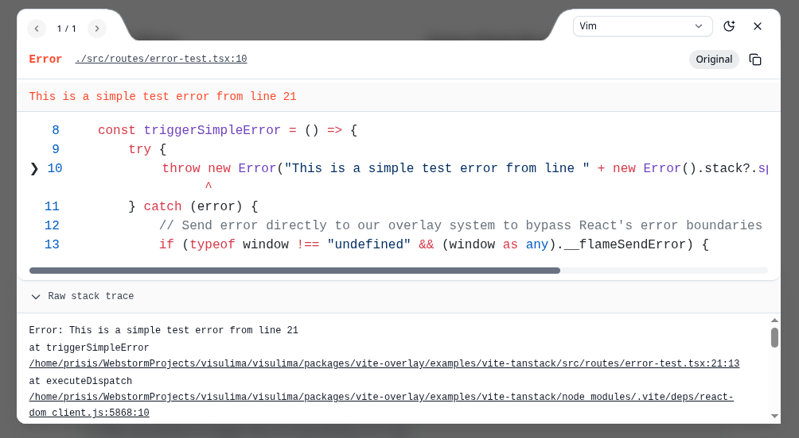
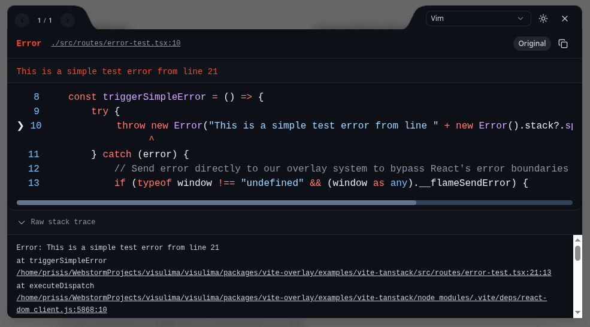
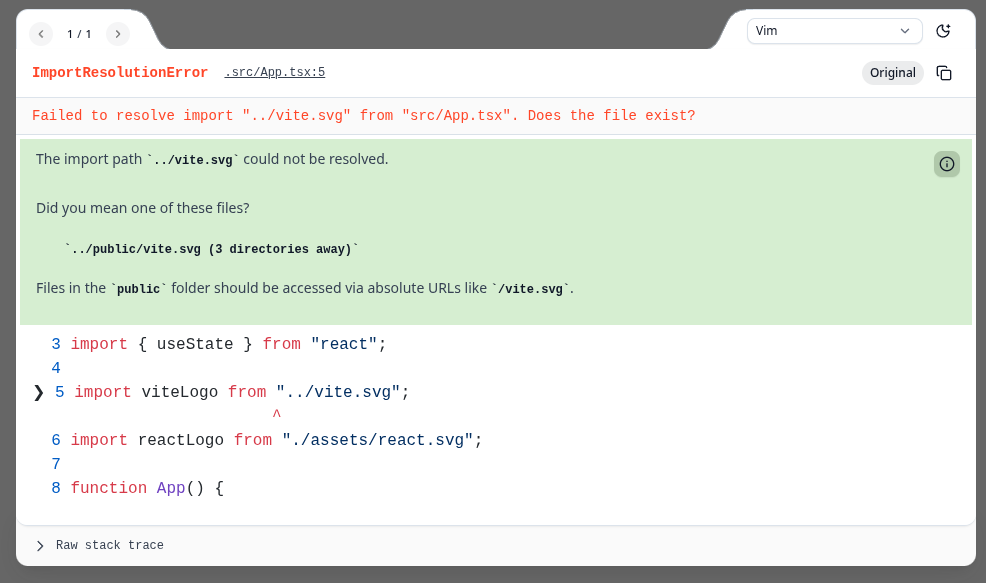

<div align="center">
  <h3>Enhanced Error Overlay for Vite</h3>
  <p>
    A powerful development tool that provides rich error displays with source mapping, cause chain navigation, and intelligent solutions for Vite applications.
  </p>
</div>


<div align="center">

[](https://www.typescriptlang.org/) [](https://www.npmjs.com/package/@visulima/vite-overlay/v/latest) [](https://github.com/visulima/visulima/blob/main/packages/vite-overlay/LICENSE.md)

</div>

---

<div align="center">
    <p>
        <sup>
            Daniel Bannert's open source work is supported by the community on <a href="https://github.com/sponsors/prisis">GitHub Sponsors</a>
        </sup>
    </p>
</div>

---

| Light Mode                       | Dark Mode                      | Solution Mode                         |
| -------------------------------- | ------------------------------ | ------------------------------------- |
|  |  |  |

## Features

- **Enhanced Error Display** - Rich, interactive error overlays with syntax highlighting
- **Source Map Integration** - Shows original `.tsx`/`.ts` files instead of compiled paths
- **Cause Chain Navigation** - Navigate through multi-level error chains with original source locations
- **Console Method Forwarding** - Intercept and display console.error, console.warn, and other console methods
- **Beautiful UI** - Modern, accessible interface with light/dark theme support and floating balloon button
- **Intelligent Solutions** - AI-powered error analysis and suggested fixes
- **Real-time Updates** - Hot Module Replacement (HMR) integration for instant error feedback
- **Comprehensive Testing** - Extensive e2e test coverage for reliability

## Install

```sh
npm install @visulima/vite-overlay
```

```sh
yarn add @visulima/vite-overlay
```

```sh
pnpm add @visulima/vite-overlay
```

## Usage

Add the plugin to your Vite configuration:

```typescript
import { defineConfig } from "vite";
import errorOverlay from "@visulima/vite-overlay";

export default defineConfig({
    plugins: [errorOverlay()],
});
```

### Configuration Options

The plugin accepts an optional configuration object:

```typescript
import { defineConfig } from "vite";
import errorOverlay from "@visulima/vite-overlay";

export default defineConfig({
    plugins: [
        errorOverlay({
            // Whether to log/display client-side runtime errors (default: true)
            forwardConsole: true,

            // Array of console method names to forward (default: ["error"])
            forwardedConsoleMethods: ["error", "warn"],

            // Custom React plugin name for detection (optional)
            reactPluginName: "@vitejs/plugin-react",

            // Custom Vue plugin name for detection (optional)
            vuePluginName: "@vitejs/plugin-vue",

            // Whether to show the balloon button in the overlay (default: true)
            showBallonButton: true,

            // Custom solution finder functions (optional)
            solutionFinders: [],

            // @deprecated Use forwardConsole instead
            logClientRuntimeError: true,
        }),
    ],
});
```

#### Options

| Option                    | Type               | Default     | Description                                                              |
| ------------------------- | ------------------ | ----------- | ------------------------------------------------------------------------ |
| `forwardConsole`          | `boolean`          | `true`      | Enable/disable client-side runtime error logging and overlay display     |
| `forwardedConsoleMethods` | `string[]`         | `["error"]` | Array of console method names to intercept and forward to overlay        |
| `reactPluginName`         | `string`           | `undefined` | Custom React plugin name for detection (useful for custom React plugins) |
| `vuePluginName`           | `string`           | `undefined` | Custom Vue plugin name for detection (useful for custom Vue plugins)     |
| `showBallonButton`        | `boolean`          | `true`      | Whether to show the floating balloon button for error navigation         |
| `solutionFinders`         | `SolutionFinder[]` | `[]`        | Array of custom solution finder functions for enhanced error analysis    |
| `logClientRuntimeError`   | `boolean`          | `undefined` | **@deprecated** Use `forwardConsole` instead                             |

## Error Handling

The plugin automatically handles various types of errors:

### Client-Side Errors

- Runtime JavaScript errors
- Unhandled promise rejections
- Console method interception (configurable via `forwardedConsoleMethods`)
- React component errors (when React plugin is detected)
- Async context errors

### Server-Side Errors (SSR)

- Build-time errors during SSR
- Import resolution failures
- Module loading errors
- Plugin-specific errors

### Special Cases

- **Vue SFC Compilation Errors** - Enhanced parsing for `.vue` files
- **Import Resolution Errors** - Smart suggestions for missing modules
- **TypeScript Errors** - Source map integration for `.tsx`/`.ts` files
- **Framework-Specific Issues** - Detection and handling for React, Vue, Svelte, and Astro

## User Interface

### Floating Balloon Button

When errors occur, a floating balloon button appears in the bottom-right corner of the screen. Click it to:

- View the most recent error details
- Navigate through multiple errors
- Access error overlay controls

The balloon button can be disabled by setting `showBallonButton: false` in the plugin options.

### Keyboard Shortcuts

- `ESC` - Close error overlay (client-side errors only)
- `←` / `→` - Navigate between multiple errors
- `Tab` - Switch between original/compiled code views

## Advanced Configuration

### Custom Solution Finders

You can extend the plugin with custom solution finders:

```typescript
import { defineConfig } from "vite";
import errorOverlay from "@visulima/vite-overlay";
import type { SolutionFinder } from "@visulima/error/solution";

const customSolutionFinder: SolutionFinder = {
    name: "custom-finder",
    priority: 10,
    async handle(error, context) {
        // Your custom error analysis logic
        if (error.message.includes("custom error pattern")) {
            return {
                header: "Custom Error Detected",
                body: "This is a custom error solution...",
            };
        }
        return undefined;
    },
};

export default defineConfig({
    plugins: [
        errorOverlay({
            solutionFinders: [customSolutionFinder],
        }),
    ],
});
```

### React Plugin Detection

The plugin automatically detects React plugins, but you can specify a custom plugin name:

```typescript
export default defineConfig({
    plugins: [
        errorOverlay({
            reactPluginName: "my-custom-react-plugin",
        }),
    ],
});
```

### Vue Plugin Detection

Similar to React detection, you can specify a custom Vue plugin name:

```typescript
export default defineConfig({
    plugins: [
        errorOverlay({
            vuePluginName: "my-custom-vue-plugin",
        }),
    ],
});
```

### Console Method Forwarding

By default, only `console.error` calls are intercepted and displayed in the overlay. You can customize which console methods to forward:

```typescript
export default defineConfig({
    plugins: [
        errorOverlay({
            forwardedConsoleMethods: ["error", "warn", "log"],
        }),
    ],
});
```

## Theming

The error overlay uses a custom design system with CSS custom properties:

```css
/* Light theme (default) */
--ono-v-bg: #f5f5f5;
--ono-v-surface: #ffffff;
--ono-v-text: #111827;
--ono-v-red-orange: #ff4628;

/* Dark theme */
--ono-v-bg: #161b22;
--ono-v-surface: #0d1117;
--ono-v-text: #c9d1d9;
```

## Browser Support

The error overlay is designed to work in all modern browsers with at least 1% global market share. This includes:

| Browser              | Minimum Version | Release Date  |
| -------------------- | --------------- | ------------- |
| **Chrome**           | 91+             | January 2021  |
| **Firefox**          | 91+             | August 2021   |
| **Safari**           | 14.1+           | April 2021    |
| **Edge**             | 91+             | January 2021  |
| **iOS Safari**       | 14.5+           | April 2021    |
| **Opera**            | 77+             | February 2021 |
| **Samsung Internet** | 16+             | October 2021  |

### Browser Features Used

The overlay uses modern JavaScript features that are well-supported in the target browsers:

- **ES2015+ Features**: Classes, arrow functions, template literals, destructuring
- **Shadow DOM API**: For component isolation and styling encapsulation
- **localStorage**: For persisting user preferences and state
- **Modern DOM APIs**: Query selectors, event listeners, CSS custom properties

## Supported Node.js Versions

Libraries in this ecosystem make the best effort to track [Node.js’ release schedule](https://github.com/nodejs/release#release-schedule).
Here’s [a post on why we think this is important](https://medium.com/the-node-js-collection/maintainers-should-consider-following-node-js-release-schedule-ab08ed4de71a).

## Contributing

If you would like to help take a look at the [list of issues](https://github.com/visulima/visulima/issues) and check our [Contributing](.github/CONTRIBUTING.md) guidelines.

> **Note:** please note that this project is released with a Contributor Code of Conduct. By participating in this project you agree to abide by its terms.

### Development Setup

```bash
# Clone the repository
git clone https://github.com/visulima/visulima.git
cd visulima

# Install dependencies
pnpm install
```

## Credits

- [Daniel Bannert](https://github.com/prisis)
- [All Contributors](https://github.com/visulima/visulima/graphs/contributors)

## License

This project is licensed under the MIT License - see the [MIT](https://github.com/visulima/visulima/blob/main/packages/vite-overlay/LICENSE.md) file for details.

