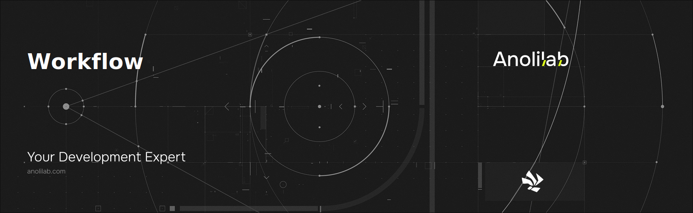

<!-- START_PACKAGE_OG_IMAGE_PLACEHOLDER -->

<a href="https://www.anolilab.com/open-source" align="center">

  

</a>

<h3 align="center">A reusable, ESM-only, edge-ready durable workflow engine: code-first workflows with resumable steps, delays and external-event waits, backed by a pluggable store</h3>

<!-- END_PACKAGE_OG_IMAGE_PLACEHOLDER -->

<br />

<div align="center">

[![typescript-image][typescript-badge]][typescript-url]
[![mit licence][license-badge]][license]
[![npm downloads][npm-downloads-badge]][npm-downloads]
[![Chat][chat-badge]][chat]
[![PRs Welcome][prs-welcome-badge]][prs-welcome]

</div>

---

<div align="center">
    <p>
        <sup>
            Daniel Bannert's open source work is supported by the community on <a href="https://github.com/sponsors/prisis">GitHub Sponsors</a>
        </sup>
    </p>
</div>

---

`@visulima/workflow` is a tiny **durable execution** engine: you write a workflow as a plain async function, and
`ctx.step` / `ctx.sleep` / `ctx.waitForEvent` make it **resumable** — it survives process restarts, hour-long delays and
waits for external events, replaying deterministically from an append-only history. It is **infra-free** (bring any
store you already run), **ESM-only**, **tree-shakeable**, and **edge-ready** — the core is `fetch` + Web Crypto with zero
Node built-ins, so it runs on Cloudflare Workers, Vercel Edge, Deno and Bun.

The lifecycle (running → suspended/waiting → completed/failed) is modelled with [XState](https://stately.ai/docs), whose
persisted snapshot is what your store keeps; durability is delegated to a small [`WorkflowStore`](#bring-your-own-store)
contract (an in-memory and an [unstorage](https://unstorage.unjs.io) store ship in the box).

## Install

```sh
npm install @visulima/workflow
```

```sh
yarn add @visulima/workflow
```

```sh
pnpm add @visulima/workflow
```

## Usage

```typescript
import { createRuntime, defineWorkflow } from "@visulima/workflow";
import { z } from "zod";

const onSignup = defineWorkflow({
    id: "welcome",
    payload: z.object({ userId: z.string(), email: z.string() }),
    run: async (ctx) => {
        // `step` runs a side effect exactly once and records its result.
        await ctx.step("send-welcome", () => sendEmail(ctx.payload.email, "Welcome!"));

        // `sleep` durably pauses the run — the process can exit and resume later.
        await ctx.sleep("wait-a-day", { amount: 1, unit: "days" });

        const activated = await ctx.step("check-activation", () => isActivated(ctx.payload.userId));

        if (!activated) {
            await ctx.step("send-nudge", () => sendEmail(ctx.payload.email, "Need a hand?"));
        }
    },
});

const runtime = createRuntime({ workflows: [onSignup] });

// Start a run. Returns when the workflow first suspends (or completes).
const { runId, status } = await runtime.trigger(onSignup, { userId: "u_1", email: "a@b.com" });
// status === "suspended" — it's sleeping for a day.
```

### Resuming due runs

Sleeps and timeouts are resumed by **sweeping**. Call `sweep()` from a cron job, a Cloudflare alarm, or any timer —
it resumes every run whose wake-at has passed:

```typescript
// e.g. every minute
const results = await runtime.sweep();
```

### External events

`ctx.waitForEvent` suspends the run until you deliver a matching signal (with an optional timeout):

```typescript
const approval = defineWorkflow({
    id: "publish",
    run: async (ctx) => {
        const decision = await ctx.waitForEvent<{ approved: boolean }>("review", "review-decision", {
            timeout: { amount: 2, unit: "days" }, // resolves to `undefined` if nobody decides
        });

        if (decision?.approved) {
            await ctx.step("publish", () => publish());
        }
    },
});

const { runId } = await runtime.trigger(approval, {});
// later, when a reviewer clicks "approve":
await runtime.signal(runId, "review-decision", { approved: true });
```

## The `ctx` contract

| Method                             | What it does                                                                                                 |
| ---------------------------------- | ------------------------------------------------------------------------------------------------------------ |
| `ctx.step(id, fn)`                 | Runs `fn` **exactly once**; records the result. On replay the recorded value is returned without re-running. |
| `ctx.sleep(id, duration)`          | Durably pauses until the duration elapses (number ms, `{ amount, unit }`, or `{ cron }`).                    |
| `ctx.waitForEvent(id, name, opts)` | Durably suspends until `runtime.signal(runId, name, payload)` arrives, or the optional `timeout` elapses.    |
| `ctx.payload`                      | The validated trigger payload (typed via your Standard Schema).                                              |
| `ctx.runId`                        | Run metadata.                                                                                                |

> **Replay safety (the one rule):** anything that must happen exactly once **must** be wrapped in `ctx.step`. Code
> outside `step`/`sleep`/`waitForEvent` re-executes on every replay, by design.

> **Concurrency:** a `ctx.step` runs exactly once **per run, provided activations of that run do not overlap**. The
> runtime always serialises overlapping `resume`/`signal`/`sweep` calls for the same run _within a single process_. To
> extend that exclusion **across** processes/instances (multiple workers / regions on one shared store), implement the
> optional `acquire`/`release` lease on your store — the runtime acquires it before driving and releases it after.
> `MemoryStore` implements it exactly; `UnstorageStore` is best-effort (a non-atomic read-check-write), so for race-free
> cross-process exclusion use a store with atomic primitives (Redis `SET NX`, a SQL row lock, a Durable Object).
>
> A lease gives mutual exclusion, **not** crash-proof exactly-once: a holder that crashes between a side effect and its
> persisted record re-runs that step on the next acquisition. Close that window by making effects idempotent on the
> stable `runId:stepId` key. Tune the hold time with `createRuntime({ leaseTtlMs })` (default 30s).

> **Cron sleeps** resolve to the next occurrence from the moment the run _suspends_ (not from when it was triggered).

## Schema validation (Standard Schema)

`payload` accepts any [Standard Schema](https://standardschema.dev) validator — Zod, Valibot, ArkType, … — and only its
`~standard` contract is used. The payload is validated on `trigger` and typed inside `run`.

## Bring your own store

Durability is a small contract. `MemoryStore` (default) and `UnstorageStore` ship in the box; implement
`WorkflowStore` to back runs with Postgres, Redis, a Durable Object, or anything else.

```typescript
import { createRuntime, UnstorageStore } from "@visulima/workflow";
import { createStorage } from "unstorage";
import cloudflareKVBindingDriver from "unstorage/drivers/cloudflare-kv-binding";

const runtime = createRuntime({
    store: new UnstorageStore(createStorage({ driver: cloudflareKVBindingDriver({ binding: env.RUNS }) })),
    workflows: [onSignup],
});
```

The `WorkflowStore` contract:

```typescript
interface WorkflowStore {
    save(run: StoredRun): Promise<void>;
    load(runId: string): Promise<StoredRun | undefined>;
    delete(runId: string): Promise<void>;
    due(now: number, limit: number): Promise<string[]>; // runs whose wakeAt has passed
    // Optional cross-process lease (omit to rely on in-process locking only):
    acquire?(runId: string, token: string, ttlMs: number): Promise<boolean>;
    release?(runId: string, token: string): Promise<void>;
}
```

It is deliberately poll-based (`due`) so it works on plain KV/SQL, but shaped so a push-based adapter (e.g. Durable
Object alarms) can implement `due` as a no-op and schedule wake-ups inside `save`. Implement `acquire`/`release` for
race-free cross-process exclusion (see the concurrency note above).

## Runtime support

The engine core and the in-memory / unstorage stores are `fetch` + Web Crypto only — no `node:*` — so they run on
**Node.js**, **Cloudflare Workers**, **Vercel Edge**, **Deno** and **Bun**. Node-only durability (Postgres/Redis) lives
behind your own `WorkflowStore` adapter.

## Related

- [`@visulima/notification`](https://visulima.com/packages/notification) — multi-channel notifications; its `workflow`
  subpath builds notification steps (`step.email`, `step.digest`, …) on top of this engine.

## Supported Node.js Versions

Libraries in this ecosystem make the best effort to track [Node.js' release schedule](https://github.com/nodejs/release#release-schedule).
Here's [a post on why we think this is important](https://medium.com/the-node-js-collection/maintainers-should-consider-following-node-js-release-schedule-ab08ed4de71a).

## Contributing

If you would like to help take a look at the [list of issues](https://github.com/visulima/visulima/issues) and check our [Contributing](.github/CONTRIBUTING.md) guidelines.

> **Note:** please note that this project is released with a Contributor Code of Conduct. By participating in this project you agree to abide by its terms.

## Credits

- [Daniel Bannert](https://github.com/prisis)
- [All Contributors](https://github.com/visulima/visulima/graphs/contributors)

## Made with ❤️ at Anolilab

This is an open source project and will always remain free to use. If you think it's cool, please star it 🌟. [Anolilab](https://www.anolilab.com/open-source) is a Development and AI Studio. Contact us at [hello@anolilab.com](mailto:hello@anolilab.com) if you need any help with these technologies or just want to say hi!

## License

The visulima workflow is open-sourced software licensed under the [MIT][license]

<!-- badges -->

[license-badge]: https://img.shields.io/npm/l/@visulima/workflow?style=for-the-badge
[license]: https://github.com/visulima/visulima/blob/main/LICENSE
[npm-downloads-badge]: https://img.shields.io/npm/dm/@visulima/workflow?style=for-the-badge
[npm-downloads]: https://www.npmjs.com/package/@visulima/workflow
[prs-welcome-badge]: https://img.shields.io/badge/PRs-welcome-brightgreen.svg?style=for-the-badge
[prs-welcome]: https://github.com/visulima/visulima/blob/main/.github/CONTRIBUTING.md
[chat-badge]: https://img.shields.io/discord/932323359193186354.svg?style=for-the-badge
[chat]: https://discord.gg/TtFJY8xkFK
[typescript-badge]: https://img.shields.io/badge/Typescript-294E80.svg?style=for-the-badge&logo=typescript
[typescript-url]: https://www.typescriptlang.org/
